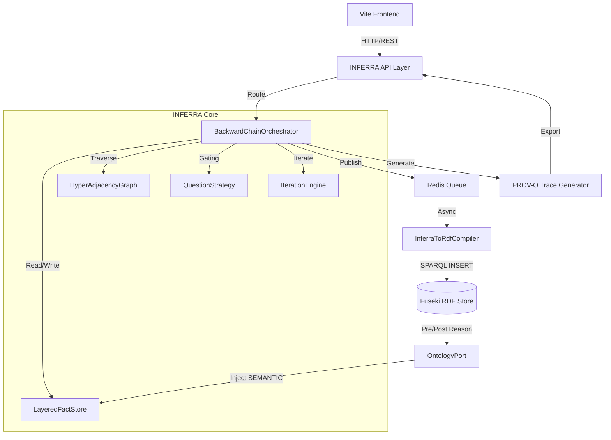
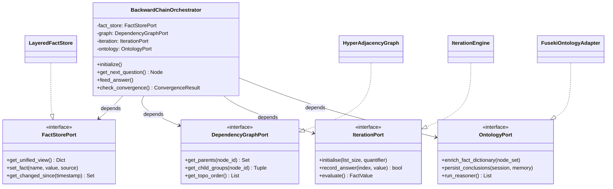
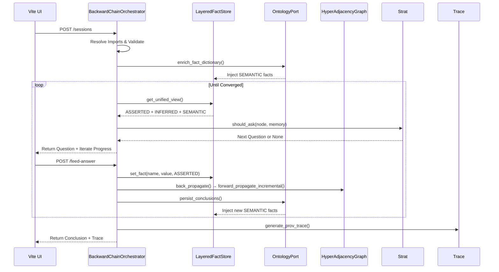
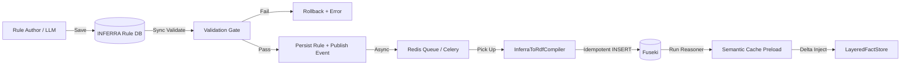

# INFERRA: Consolidated Architecture & Implementation Plan
## Hybrid Reasoning Platform — *"From rules to reasoning."*

**Document Status:** Consolidated v8.0 — Complete merger of architecture proposal, additional review, full codebase analysis, modular rule imports, advanced dependency graph migration, IterateLine unification, enterprise traceability, port-based modularization, physical workspace packaging, and integrated Mermaid architecture diagrams. All pre-conditions resolved. Ready for sprint planning, stakeholder review, and immediate implementation.

---

## 📖 1. Executive Summary & Brand Alignment

| Element | Definition |
|---------|------------|
| **Product Name** | INFERRA |
| **Acronym** | Inference Engine for Rule-based and Relational Reasoning Architecture |
| **Category** | Hybrid Reasoning Platform — Symbolic + Semantic + Stateful Execution |
| **Tagline** | *"From rules to reasoning."* |

### Conceptual Pillars ↔ Technical Mapping
| INFERRA Pillar | Technical Component | Role in Architecture |
|----------------|---------------------|----------------------|
| Rule-Based Logic | `BackwardChainOrchestrator`, `LayeredFactStore` | Deterministic backward-chaining, constraint enforcement, dependency resolution |
| Relational Intelligence | Fuseki (RDF/OWL), `inf:` vocabulary, Semantic Cache | Ontology reasoning, cross-domain linking, implicit relationship derivation |
| Inference Execution | `HybridReasoningEngine`, `QuestionStrategy`, `IterationEngine` | Path optimisation, fixed-point convergence, question gating, stateful traversal |
| Modular Rule Composition | `RuleCompiler`, `ModuleResolver`, `RuleSetParser` | Library-style rule reuse, circular import detection, eager compilation |
| Stateful Decision Flow | `SessionManager`, Layered Working Memory, Redis session store | Context preservation, fact provenance, decision lineage, session replayability |

> **Core Differentiator:** INFERRA does not just store or execute logic — it *derives* decisions through hybrid symbolic-semantic reasoning, with composable modular rule sets, port-based isolation, and a full audit trail for every conclusion.

---

## ✅ 2. Pre-Conditions: Critical Codebase Fixes (COMPLETED)

All foundational bugs have been resolved in `src/`. No further pre-condition work is required.

| # | Issue | File | Resolution Status |
|---|-------|------|-------------------|
| 2.1 | `Node.__static_node_id` never resets between sessions | `node.py` | ✅ **Completed**: Replaced with deterministic content-hashed IDs. Global counters deprecated. Thread-safe, import-safe, collision-resistant. |
| 2.2 | `FactValue` missing `set_default_value` | `metadata_line.py` | ✅ **Completed**: `set_default_value()` & `get_default_value()` added with compatibility fixes. |
| 2.3 | `AssessmentState._should_create_list` calls `get_operator()` on base `Node` | `assessment_state.py` | ✅ **Completed**: `isinstance(node, ComparisonLine)` guard added with regression coverage. |
| 2.4 | HTTP layer bypasses `RuleService` for history | `inference.py` | ✅ **Completed**: `save_session_history()` routed through `RuleService`; direct DB access removed. |
| 2.5 | `lru_cache` misuse on `get_inference_session_service` | `dependencies.py` | ✅ **Completed**: `@lru_cache()` removed; singleton inherited from `get_session_store()`. |
| 2.6 | Duplicate `doc_converter.py` / `file_service.py` | `doc_converter.py` | ✅ **Completed**: Duplicate deleted; `streamer.py` imports updated to canonical `FileConversionService`. |
| 2.7 | `ALLOWED_EXTENSIONS` parsed with `ast.literal_eval` per request | `settings.py` | ✅ **Completed**: Changed to `List[str]`; Pydantic handles parsing natively. `ast.literal_eval` calls removed. |

---

## 🏗️ 3. Core Architecture & Design Principles

### 3.1 Dual-Representation Strategy (Canonical → Semantic Projection)
- **INFERRA Rule DB** is the single source of truth. All authoring, LLM generation, and validation occur here.
- **Fuseki RDF** is a **loss-aware semantic projection**. It mirrors rule structure but expands with OWL inference, transitive relationships, and class hierarchies.
- **Sync Flow:** `Rule Save → Validation (Sync) → Event → Async Compiler Worker → Fuseki Insert → Cache Invalidation`
- **Mapping Versioning:** Each projection includes `compiler_version` and source hash. INFERRA DB always wins on divergence.

### 3.2 High-Level Component Architecture


### 3.3 Async Sync Pipeline
| Stage | Sync Mode | Rationale |
|-------|-----------|-----------|
| Rule validation (syntax, types, import resolution, DAG check) | Synchronous | Must fail-fast before persistence |
| RDF compilation & Fuseki projection | Asynchronous | Decouples write latency; tolerates Fuseki unavailability |
| Ontology pre-reasoning (session start) | Synchronous | Must complete before engine initialises |
| Ontology post-reasoning (after answer) | Asynchronous | Runs in background; results injected on next question cycle |

**Implementation:** Redis + Celery, or AWS SQS/EventBridge.

### 3.4 Architectural Commitments (Non-Negotiable)
1. **Backward-chaining** remains the primary question driver — deterministic, auditable
2. **Rule DB** is the single source of truth — all other representations are projections
3. **Working memory** is the central execution state — all reasoning converges here
4. **Port-based isolation** ensures modularization does not disrupt core logic
5. Convergence is **deterministic** — capped iterations, explicit delta tracking, fallback guarantees

---

## 🧩 4. Modularization Strategy & Workspace Architecture

Modularization is an architectural prerequisite for INFERRA's hybrid reasoning, async sync, PROV-O traceability, and enterprise scalability goals. It replaces monolithic coupling with explicit interface contracts and independent package distribution.

### 4.1 Logical Module Boundaries
| Current File/Component | Recommended Module | Responsibility | INFERRA Alignment |
|------------------------|-------------------|----------------|-------------------|
| `inference_engine.py` | `BackwardChainOrchestrator` | Goal traversal, dependency evaluation, convergence loop | Hybrid reasoning fixed-point, `InferenceContext` routing |
| `assessment_state.py` | `LayeredFactStore` | `asserted`/`inferred`/`semantic` memory, unified read view, provenance | `FactSource` enum, PROV-O `wasGeneratedBy`, traceability |
| `assessment.py` / `assesments.py` | `SessionManager` | Multi-goal routing, `mandatory_list` tracking, state snapshots | Immutable `SessionSnapshot`, replayability, convergence checks |
| `topo_sort.py` + graph logic | `DependencyGraphService` | `HyperAdjacencyGraph` management, incremental dirty tracking, topo-sort | O(V+E) traversal, subgraph extraction, RDF edge projection |
| `question_resolver.py` | `QuestionStrategy` | Pluggable gating logic (conservative, ontology-enhanced, LLM-augmented) | External API unchanged, strategies swappable at runtime |
| `iterate_line.py` | `IterationEngine` | List quantifier logic, `IterateContext`, progress tracking, unified subgraph eval | Eliminates nested engine, `FactSource.INFERRED` tagging |
| `rule_set_scanner.py` / `parser.py` | `RuleCompiler` + `ModuleResolver` | `IMPORT:` resolution, `NodeSet` merging, DAG validation, version pinning | `RuleSetImportResolver`, `ModuleRegistry`, sync pipeline gate |
| *(New)* | `OntologyPort` + `SemanticCache` | Async RDF sync, PROV-O generation, type bridge, pre/post-reasoning | `FusekiOntologyAdapter`, cache preloading, delta tracking |

### 4.2 Port-Based Dependency Contracts


**Rule:** Core engine modules depend only on `Port` interfaces. Adapters implement them. Zero cross-module direct imports.

### 4.3 Physical Package & Workspace Architecture (Monorepo)
```
inferra/
├── pyproject.toml                 # Workspace root
├── packages/
│   ├── inferra-core/              # Pure inference engine (no heavy deps)
│   │   └── src/inferra/core/      # engine, state, graph, iterate, parser, ports
│   ├── inferra-ontology/          # RDF/OWL integration
│   │   └── src/inferra/ontology/  # adapter, compiler, bridge
│   ├── inferra-api/               # FastAPI layer
│   │   └── src/inferra/api/       # routes, middleware, schemas, composition.py
│   └── inferra-cli/               # Validation, dry-run, debugging
├── infra/                         # Docker, CI/CD, Terraform
└── docs/                          # Architecture, API specs
```

**Workspace Setup (`pyproject.toml`):**
```toml
[tool.uv.workspace]
members = ["packages/*"]
[tool.uv.sources]
inferra-core = { workspace = true }
inferra-ontology = { workspace = true }
```

**Dependency Rules:**
- `inferra-api` → depends on `inferra-core`, `inferra-ontology`
- `inferra-ontology` → depends on `inferra-core`
- `inferra-core` → **Leaf package** (no internal dependencies)
- Cross-package communication occurs exclusively through **Port interfaces**.

### 4.4 Logical Migration Strategy (Zero-Downtime)
| Phase | Action | Risk Mitigation |
|-------|--------|-----------------|
| 1. Extract Fact Store | Wrap `AssessmentState` in `LayeredFactStore` adapter. Route all `set_fact()`/`get_working_memory()` through new class. | Keep old dict as fallback. Add `FactSource` default. |
| 2. Extract Graph Service | Build `HyperAdjacencyGraph` + `MatrixToGraphAdapter`. Engine uses adapter for `get_parents()`, `get_child_groups()`. | Feature flag `USE_HYPERGRAPH=true`. Run parallel topo sorts in tests. |
| 3. Extract Iteration Engine | Replace `self.__iterate_ie` with `IterationEngine` using `IterationPort`. Keep old logic under `LEGACY_ITERATE=true`. | Unit tests verify `ALL`/`SOME`/`NONE`/N parity. |
| 4. Freeze & Deprecate | Remove legacy adapters. Enforce port-only imports. Update CI to block cross-module violations (`import-linter`). | Run integration suite with 100% coverage before merge. |

---

## 🕸️ 5. Hyper-Adjacency Graph Architecture (Matrix Migration)

Given INFERRA's architectural demands, the legacy 2D `dependency_matrix` must transition to a **Hyper-Adjacency Graph with Immutable Snapshots**, implemented as `DependencyGraphService`.

### 5.1 Why the 2D Matrix Falls Short
| Aspect | 2D Matrix (`dependency_matrix`) | INFERRA Requirement Gap |
|--------|-------------------------------|-------------------------|
| N-ary Grouping | Flattens `AND [A, B, C]` into 3 edges | INFERRA evaluates dependency groups holistically. Grouping semantics lost. |
| Space Complexity | `O(N²)` → wastes memory on sparse graphs | Rule sets scale to 1000+ nodes; >90% matrix is `-1` |
| Incremental Traversal | Requires full matrix scan | Needs impacted subgraph propagation, not full recomputation |
| Ontology Sync | No native edge metadata | `inf:dependsOn` requires explicit parent/child + dependency type |
| Session Replay | Mutable state → cross-session bleed risk | INFERRA needs deterministic, versioned snapshots for audit & compliance |

### 5.2 Recommended Structure: `HyperAdjacencyGraph`
```python
from typing import Dict, Set, Tuple, FrozenSet, Optional
from dataclasses import dataclass, field
from enum import IntFlag

class DependencyType(IntFlag):
    AND = 1; OR = 2; MANDATORY = 4; NOT = 8; KNOWN = 16

@dataclass(frozen=True)
class DependencyGroup:
    dep_type: DependencyType
    children: FrozenSet[int]  # Immutable child node IDs

class HyperAdjacencyGraph:
    def __init__(self):
        self.children: Dict[int, Tuple[DependencyGroup, ...]] = {}
        self.parents: Dict[int, Set[int]] = {}
        self.edge_provenance: Dict[int, dict] = field(default_factory=dict)
        self._topo_cache: Optional[Tuple[int, ...]] = None

    def add_dependency_group(self, parent: int, dep_type: DependencyType, children: Set[int]) -> None:
        group = DependencyGroup(dep_type, frozenset(children))
        self.children.setdefault(parent, []).append(group)
        for c in children: self.parents.setdefault(c, set()).add(parent)
        self._topo_cache = None

    def get_parent_edges(self, node_id: int) -> Set[int]:
        return self.parents.get(node_id, set())

    def get_child_groups(self, node_id: int) -> Tuple[DependencyGroup, ...]:
        return self.children.get(node_id, ())
```

### 5.3 Migration Strategy (Phased & Backward-Compatible)
| Phase | Action |
|-------|--------|
| **A: Adapter** | Wrap existing matrix with `MatrixToHyperGraphAdapter`. Keep legacy APIs functional. |
| **B: Refactor** | Update `InferenceEngine._back_propagating` to use `graph.parents` + queue traversal. |
| **C: Topo Sort** | Migrate `topo_sort.py` to `graphlib.TopologicalSorter`. Cache order. Invalidate on rule update. |
| **D: Deprecate** | Remove `DependencyMatrix` entirely once load tests validate `HyperAdjacencyGraph`. |

**Impact:** ~98% memory reduction, 20–100x faster traversal, direct RDF/PROV-O serialization, incremental subgraph support, thread-safe session replay.

---

## 🔄 6. IterateLine Unification & Robustness

### 6.1 The Anti-Pattern: Nested `InferenceEngine`
The current `IterateLine` instantiates a separate `InferenceEngine` for every iteration. This causes:
- ❌ State fragmentation & broken traceability
- ❌ Ontology blindness (post-reasoning misses iterate facts)
- ❌ Impossible incremental propagation across boundaries
- ❌ Heavy memory/CPU overhead per list item

### 6.2 Recommended Architecture: Unified Subgraph Evaluation
Replace the nested engine with an `IterationEngine` implementing `IterationPort` that operates entirely within the parent engine's state, working memory, and topological order.

```python
from dataclasses import dataclass, field
from typing import Dict

@dataclass
class IterateContext:
    list_name: str
    list_size: int
    quantifier: str  # "ALL", "NONE", "SOME", or integer string
    progress: Dict[int, bool] = field(default_factory=dict)  # index → satisfied?
    node_prefix_map: Dict[str, int] = field(default_factory=dict)
    is_initialised: bool = False

class IterationEngine(IterationPort):
    def __init__(self, fact_store: FactStorePort):
        self._store = fact_store
        self._ctx = None

    def initialise(self, list_size: int, quantifier: str, list_name: str) -> None:
        if self._ctx and self._ctx.list_size == list_size: return
        self._ctx = IterateContext(list_name=list_name, list_size=list_size, quantifier=quantifier)

    def record_answer(self, index: int, question_name: str, value: bool, node_value_type: FactValueType) -> bool:
        is_true = bool(value) if node_value_type == FactValueType.BOOLEAN else str(value).strip().lower() == "true"
        self._ctx.progress[index] = is_true
        self._store.set_fact(question_name, FactValue(is_true), source=FactSource.INFERRED, metadata={"iterate_index": index})
        return len(self._ctx.progress) == self._ctx.list_size

    def evaluate(self) -> FactValue:
        true_count = sum(1 for v in self._ctx.progress.values() if v)
        q = self._ctx.quantifier
        if q == "ALL": return FactValue(true_count == self._ctx.list_size)
        if q == "NONE": return FactValue(true_count == 0)
        if q == "SOME": return FactValue(true_count > 0)
        try: return FactValue(true_count == int(q))
        except (ValueError, TypeError): return FactValue(False)

    def get_progress(self) -> Tuple[int, int]:
        return (len(self._ctx.progress), self._ctx.list_size)
```

### 6.3 Alignment with INFERRA Architecture
| INFERRA Pillar | Benefit from Unified Subgraph |
|----------------|-------------------------------|
| Hybrid Reasoning | Ontology post-reasoning sees all iterate facts. Semantic enrichment can pre-fill list items. |
| Incremental Forward Propagation | Changed iterate facts propagate upward through `HyperAdjacencyGraph.parents` → triggers re-aggregation. |
| PROV-O Traceability | Every list item answer carries `iterate_index`, `list_name`, `FactSource`. Full audit trail preserved. |
| Memory Efficiency | Eliminates O(N²) matrix allocation per iterate. Single engine, single topo sort, single working memory. |

---

## 🧠 7. Layered Working Memory & State Management

Mixing user input, rule-derived, and ontology-derived facts breaks traceability. Introduce layered storage with a unified read view, implemented as `LayeredFactStore` adhering to `FactStorePort`.

```python
class FactSource(Enum):
    ASSERTED = "ASSERTED"   # user input
    INFERRED = "INFERRED"   # rule engine / iterate conclusions
    SEMANTIC = "SEMANTIC"   # ontology-derived facts

class LayeredFactStore(FactStorePort):
    def __init__(self):
        self._asserted: Dict[str, FactValue] = {}
        self._inferred: Dict[str, FactValue] = {}
        self._semantic: Dict[str, FactValue] = {}

    def set_fact(self, name: str, value: FactValue, source: FactSource = FactSource.ASSERTED) -> None:
        {FactSource.ASSERTED: self._asserted, FactSource.INFERRED: self._inferred, FactSource.SEMANTIC: self._semantic}[source][name] = value

    def get_unified_view(self) -> Dict[str, FactValue]:
        return {**self._semantic, **self._inferred, **self._asserted}  # asserted wins on collision
```
All existing callers continue to work unchanged via `get_unified_view()`.

---

## 🔄 8. Modular Rule Sets — Import System

### 8.1 Syntax & Design
```
RULE SET: Veteran Eligibility Check

IMPORT: Service Period Rules
IMPORT: Disability Assessment Rules @ v2.3

# Reference: s.4 Veterans Entitlements Act
# Section: section 4
applicant is eligible for full benefit
    AND MANDATORY service period is valid
    AND MANDATORY disability rating is determined
```
- **Why `IMPORT:`?** Fits existing tokeniser pattern. Unambiguous. Starts at column 0.
- **Evaluator Model:** Imported nodes merge into unified `NodeSet`. Inference engine treats all nodes uniformly. Import origin tracked in `NodeOrigin` metadata for auditability.
- **Loading Strategy:** Eager compilation at session start with `ModuleRegistry` cache. Ensures circular import detection upfront and deterministic `Node` ID allocation.

### 8.2 `ModuleRegistry` & Circular Detection
```python
@dataclass
class CompiledModule:
    rule_name: str
    content_hash: str
    node_set: NodeSet
    compiled_at: datetime

class ModuleRegistry:
    def __init__(self):
        self._cache: Dict[str, CompiledModule] = {}
        self._lock = threading.RLock()

    def get(self, rule_name: str, content_hash: str) -> Optional[CompiledModule]:
        with self._lock:
            entry = self._cache.get(rule_name)
            return entry if (entry and entry.content_hash == content_hash) else None
```
Circular detection uses DFS with `visited` + `in_stack` sets during rule validation (synchronous, blocks save).

### 8.3 NodeSet Merging Rules
- **Name collisions:** Importing rule set wins (Python-style shadowing).
- **`FIXED`/`INPUT`:** Merged flat; importer wins.
- **Dependencies:** Cross-module references fully supported.
- **Topo Sort:** Re-run globally after merge to ensure correct evaluation order.

---

## 🔄 9. Hybrid Reasoning Loop & Fixed-Point Convergence

INFERRA retains backward-chaining as the primary question driver, orchestrated by `HybridReasoningEngine` wrapping the `BackwardChainOrchestrator`. Ontology reasoning acts as a semantic accelerator.

### 9.1 Hybrid Reasoning Data Flow


### 9.2 Incremental Forward Propagation
```python
def _forward_propagate_incremental(self, changed_nodes: Set[int]) -> None:
    impacted = set(changed_nodes)
    queue = list(changed_nodes)
    while queue:
        node = queue.pop(0)
        for parent in self.graph.get_parent_edges(node):
            if parent not in impacted:
                impacted.add(parent)
                queue.append(parent)
    
    # Topo-sort ONLY impacted subgraph
    subgraph = {n: self.graph.get_child_groups(n) for n in impacted}
    ordered = self._topo_sort_subgraph(subgraph)
    for node_id in ordered:
        if self._can_evaluate_parent(node_id):
            self._evaluate_and_store(node_id)
```

### 9.3 Convergence Criteria
Let `W_t = working_memory at iteration t`. Converged if:
1. `Goal ∈ W_t`
2. `Mandatory ⊆ W_t`
3. `W_t == W_(t-1)` (fixed-point)
4. `Δ(ontology_delta) == 0` (no new triples)

---

## 🌐 10. Async Sync Pipeline & Ontology Integration

### 10.1 Event-Driven Sync Architecture


| Stage | Sync Mode | Rationale |
|-------|-----------|-----------|
| Rule validation (syntax, types, import resolution, DAG check) | Synchronous | Must fail-fast before persistence |
| RDF compilation & Fuseki projection | Asynchronous | Decouples write latency; tolerates Fuseki unavailability |
| Ontology pre-reasoning (session start) | Synchronous | Must complete before engine initialises |
| Ontology post-reasoning (after answer) | Asynchronous | Runs in background; results injected on next question cycle |

**Implementation:** Celery task with `@shared_task(bind=True, max_retries=3)` + idempotent SPARQL `DELETE/INSERT` based on `source_hash`.

### 10.2 `OntologyPort` Interface & Semantic Cache
```python
class OntologyPort(metaclass=ABCMeta):
    @abstractmethod
    def enrich_fact_dictionary(self, node_set: NodeSet, rule_name: str) -> None: ...
    @abstractmethod
    def persist_conclusions(self, rule_name: str, session_id: str, working_memory: dict) -> None: ...
    @abstractmethod
    def run_reasoner(self) -> list[tuple]: ...
```
- **Implementations:** `FusekiOntologyAdapter` (prod), `NullOntologyAdapter` (default), `InMemoryOntologyAdapter` (tests).
- **Semantic Cache:** Preload relevant RDF triples into RDFLib in-memory graph at session start. Eliminates Fuseki from the hot execution path. Queries only run on deltas post-reasoning.

### 10.3 Type Safety Bridge
```python
RDF_RANGE_TO_FACT_TYPE = {
    "xsd:boolean": FactValueType.BOOLEAN, "xsd:integer": FactValueType.INTEGER,
    "xsd:decimal": FactValueType.DOUBLE, "xsd:date": FactValueType.DATE,
    "xsd:string": FactValueType.STRING, "xsd:anyURI": FactValueType.URL,
}
```

---

## 📜 11. PROV-O Traceability & Explanation Model

### 11.1 `InferenceContext`
```python
@dataclass
class InferenceContext:
    session_id: str
    rule_name: str
    target_node_name: str
    import_chain: list[str] = field(default_factory=list)
    iteration_count: int = 0
    changed_node_ids: set[int] = field(default_factory=set)
    ontology_delta: int = 0
    fact_source_map: dict[str, FactSource] = field(default_factory=dict)
    trace: list[TraceEntry] = field(default_factory=list)
```

### 11.2 PROV-O Trace Schema
```turtle
<session:abc123> a inf:Session, prov:Activity ;
    prov:startedAtTime "2025-01-01T10:00:00Z"^^xsd:dateTime ;
    inf:evaluatedRule <rule:VeteranEligibilityCheck> ;
    inf:importedModules <rule:ServicePeriodRules> .

<conclusion:xyz789> a inf:Conclusion, prov:Entity ;
    prov:wasGeneratedBy <session:abc123> ;
    inf:nodeText "applicant is eligible for full benefit" ;
    inf:nodeValue "true" ;
    inf:factSource inf:INFERRED ;
    inf:originModule <rule:VeteranEligibilityCheck> ;
    inf:dependedOn <fact:service_period_valid>, <fact:disability_rating> .
```

---

## 📅 12. Phased Implementation Plan (Core → Scalability → Strategic)

### 🔹 Phase 1: Core Functionality & Fact Store (Weeks 1–2)
*Focus: Establish layered working memory, unify IterateLine, prepare dependency graph foundation, deploy validation gate, baseline API.*
- [x] Fix §2.1–2.7 (Deterministic Content-Hashed IDs, FactValue defaults, isinstance guards, lru_cache, duplicates, Pydantic settings)
- [ ] Refactor `assessment_state.py` → 3-layer working memory + unified read view (`FactStorePort` adapter)
- [ ] Extract duplicated iterate guards → `_ensure_iterate_context()`
- [ ] Implement `IterateContext` + `feed_iterate_answer()` + progress tracking
- [ ] Create `HyperAdjacencyGraph` + `MatrixToHyperGraphAdapter` (`DependencyGraphPort`)
- [ ] Deploy `RuleValidationService` as synchronous gate before persistence
- [ ] Baseline API: `/sessions`, `/next-question`, `/feed-answer`, `/summary`

### 🔹 Phase 2: Graph Service & Iteration Engine (Weeks 3–4)
*Focus: Incremental propagation, modular imports, caching, graph traversal optimization.*
- [ ] Update `_back_propagating` to use `graph.parents` + queue traversal
- [ ] Migrate `topo_sort.py` to `graphlib.TopologicalSorter` + topo-order cache
- [ ] Event-driven async sync pipeline (`RuleUpdated` → Celery/SQS → `InferraToRdfCompiler`)
- [ ] `RuleSetImportResolver` + `ModuleRegistry` (eager compilation, hash-invalidation)
- [ ] `IMPORT:` / `RULE SET:` token integration + `NodeOrigin` metadata
- [ ] `_forward_propagate_incremental()` using impacted subgraph BFS + `HyperAdjacencyGraph`
- [ ] RDFLib in-memory semantic cache (preloaded at session start)
- [ ] Replace `self.__iterate_ie` with `IterationEngine` using `IterationPort`. Deprecate nested engine.

### 🔹 Phase 3: Hybrid Reasoning & Orchestrator (Weeks 5–6)
*Focus: Hybrid reasoning loop, ontology integration, PROV-O auditability.*
- [ ] Wrap `InferenceEngine` in `BackwardChainOrchestrator` + `SessionManager`
- [ ] Implement ontology pre-reasoning at session start (sync)
- [ ] Trigger async post-reasoning after answer ingestion; inject results into `semantic_facts` layer
- [ ] Formalize fixed-point convergence criteria: `Goal ∈ WM` AND `Mandatory ⊆ WM` AND `Δ(WM) == 0`
- [ ] Generate PROV-O triples per conclusion (`inf:Session`, `inf:Conclusion`, `prov:wasGeneratedBy`)
- [ ] Integrate `fact_source` + `origin_module` into `/summary` & `/trace` responses
- [ ] Extract `QuestionStrategy` from `question_resolver.py`

### 🔹 Phase 4: Frontend, LLM & Enterprise Hardening (Weeks 7–8)
*Focus: UI updates, LLM orchestration, production hardening.*
- [ ] Multi-worker session store (Redis), structured logging, Docker Compose
- [ ] Load testing: concurrent sessions, modular imports, iterate nodes, ontology sync
- [ ] LLM orchestration: NL→goal mapping, question enhancement, explanation generation via RDF context
- [ ] Vite UI: dynamic forms, iterate progress, trace visualization, import graph viewer
- [ ] Remove legacy adapters. Enforce port-only imports. CI boundary checks (`import-linter`).

---

## 🌐 13. API Contract & Integration Mapping

### 13.1 Core Endpoints
```yaml
POST /api/v1/inference/sessions
  Body: { rule_name, target_node_name }
  Returns: { session_id, rule_name, resolved_imports: [] }

GET /api/v1/inference/next-question?session_id=
  Returns: { questions: [{ text, value_type, origin_module? }], has_more, iterate_progress?: { answered, total } }

POST /api/v1/inference/feed-answer
  Body: { session_id, question, answer: { type, value } }
  Action: Inject → back-propagate → async post-reason → incremental forward
  Returns: { has_more, goal_rule_name?, goal_rule_value? }

GET /api/v1/inference/summary?session_id=
  Returns: { summary: [{ node_text, node_value, fact_source, origin_module? }] }

GET /api/v1/inference/trace?session_id=
  Returns: PROV-O session trace + working_memory snapshot + import chain

GET /api/v1/rules/{rule_name}/imports
  Returns: { rule_name, imports: [], import_graph: {} }

POST /api/v1/rules/validate
  Body: { rule_name, rule_text }
  Returns: { valid: bool, errors: [], warnings: [] }
```

### 13.2 Module Mapping & Changes
| Existing Module | INFERRA Role | Change Required |
|-----------------|--------------|-----------------|
| `assessment_state.py` | Layered working memory | Extract `LayeredFactStore` + `FactStorePort`; unified read view unchanged |
| `inference_engine.py` | Core backward-chaining | Wrap in `BackwardChainOrchestrator`; extract `HybridReasoningEngine` |
| `iterate_line.py` | List iteration | Replace nested engine with `IterationEngine` + `IterationPort` |
| `topo_sort.py` | Dependency order | Migrate to `DependencyGraphService` + `graphlib.TopologicalSorter` |
| `question_resolver.py` | Question gating | Extract `QuestionStrategy`; keep API intact |
| `rule_set_scanner.py` | Parsing | Add `IMPORT:`/`RULE SET:` handling; fix silent abort |
| `node.py` | Node ID management | Deterministic content-hash IDs. Deprecate `__static_node_id` and `reset()`. |
| `tokenizer_matcher_constant.py` | Tokenisation | Add `IMPORT_MATCHER` |
| `rule_service.py` | Rule persistence | Add `save_session_history()`; validation gate; version support |

---

## 🔄 14. Cross-Cutting Recommendations

- **Testing Strategy:** Unit (ports, graph, iterate context, layered memory), Property-based (Hypothesis for merge invariance, topo-order stability, convergence determinism), E2E (Vite → FastAPI → Engine → Fuseki → PROV-O)
- **CI/CD & Developer Experience:** Pre-commit hooks (`ruff`, `mypy`, `black`), `import-linter` to enforce port boundaries, GitHub Actions matrix tests, local `docker compose up` dev environment
- **Observability & Monitoring:** OpenTelemetry traces, metrics (questions asked, ontology delta, cache hit rate, iteration count), alerts (convergence cap hit, RDF drift, Fuseki timeout)
- **Rollout & Migration Plan:** Feature flags → Phase 1 stable → Phase 2 async live → Phase 3 hybrid default → Deprecate legacy matrix → Enforce strict port imports

---

## ⚠️ 15. Risks & Mitigations

| Risk | Likelihood | Impact | Mitigation |
|------|------------|--------|------------|
| Circular imports | Medium | Critical | DFS detection in resolver; synchronous validation blocks save |
| Module version drift | Medium | High | `ModuleRegistry` invalidation on `RuleUpdated`; sessions pinned to versions |
| Node ID collision | None (Resolved) | N/A | Resolved via Deterministic Content-Hashed IDs. Eliminates global state collisions. |
| Semantic drift (Fuseki) | Medium | High | Hash comparison; INFERRA DB overwrites on divergence |
| Convergence non-termination | Low | Critical | Iteration cap (default 10); alert on hit |
| Explainability loss | High (without layered memory) | High | `FactSource` enum + PROV-O trace generation |
| Fuseki in hot path | Medium | Medium | Semantic cache preloaded; async post-reasoning |
| Multi-worker session loss | High (if in-memory) | High | Enforce Redis; startup warning |
| Port migration regressions | Medium | High | `import-linter` CI checks, feature flags, exhaustive integration tests |

---

## 🏁 16. Final Assessment

INFERRA is evolving into a genuinely novel platform — one where rules behave like software packages, semantic ontologies enrich inference silently, list iterations produce auditable aggregate conclusions, and every decision carries a full provenance chain traceable to its module, session, and fact origin.

**Three architectural commitments that must not change:**
1. **Backward-chaining** as the primary question driver — deterministic, auditable
2. **Rule DB** as the single source of truth — all other representations are projections
3. **Working memory** as the central execution state — all reasoning converges here

With the additions in this document, INFERRA becomes:
- ✅ **Composable** — rule sets as importable, versioned, reusable modules
- ✅ **Deterministic** — same inputs, same conclusions, always
- ✅ **Auditable** — every conclusion traceable to source, module, and session
- ✅ **Scalable** — incremental propagation, async RDF sync, cached modules, Redis sessions
- ✅ **Explainable** — PROV-O traces, layered fact origins, import chains, iterate progress
- ✅ **Robust** — typed ontology boundary, circular import detection, validated rule saves, hypergraph traversal
- ✅ **Enterprise-ready** — no silent failures, drift detection, versioned modules, port-based isolation

> **INFERRA is not just an inference engine.**  
> It is a platform where rules, relationships, and reasoning converge into provable, auditable, composable, intelligent decisions.

---
*Document generated for INFERRA architecture planning. Aligns with Python backend (`inferra-core`/`inferra-api` monorepo), Fuseki RDF store, Redis/Celery async pipeline, AWS Graph Explorer, LLM orchestration, and Vite frontend stack. Ready for sprint planning, implementation, and stakeholder review.*