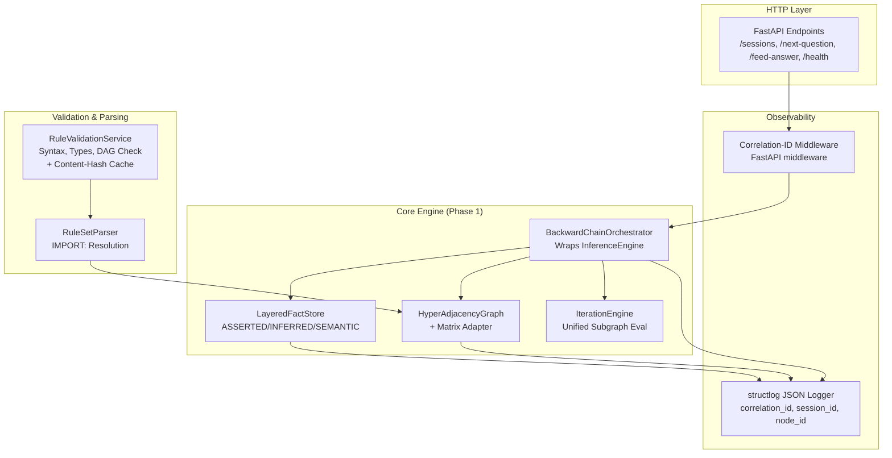
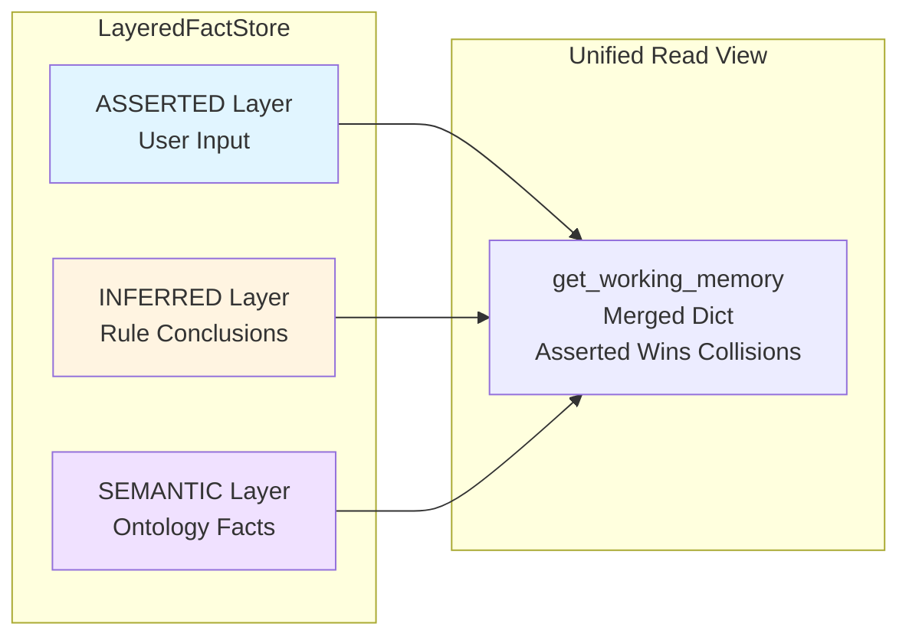
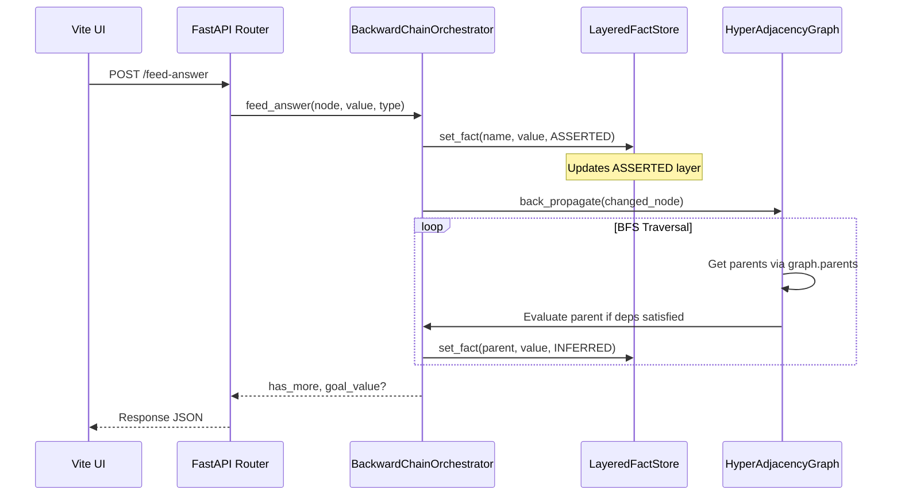

# INFERRA Phase 1 Implementation Plan
## Core Stabilization, Layered State & Graph Foundation
**Document Status:** Sprint-Ready v3.0 (Enhanced with Critical & Important Review Feedback)  
**Timeline:** Weeks 0–2 (10 Working Days + 2 Buffer Days)  
**Feature Flags:** `USE_HYPERGRAPH=false` (default), `LEGACY_ITERATE=true` (default), `LAYERED_MEMORY=true`, `ML_OPTIMIZED_DFS=false` (default)  
**Feature Flag Policy:** Flags are start-of-session sticky — cannot flip mid-session  
**Prerequisites:** Python 3.10+, Redis (dev/staging), FastAPI environment, existing `src/` codebase, CI/CD pipeline with `pytest`, `ruff`, `mypy`, `structlog`

---

## 📖 1. Executive Summary & Objectives

Phase 1 establishes the foundational stability, state management, and migration scaffolding required for INFERRA's hybrid reasoning architecture. It resolves critical runtime bugs, introduces layered working memory for traceability, unifies the `IterateLine` anti-pattern, establishes the `HyperAdjacencyGraph` adapter layer, and deploys a synchronous validation gate. All changes are zero-downtime and backward-compatible.

### 1.1 Core Objectives
- [x] Eliminate all pre-condition runtime failures (§2.1–2.7)
- [x] Introduce 3-layer `working_memory` (`ASSERTED`/`INFERRED`/`SEMANTIC`) with unified read view *(`FactStorePort` Protocol + `LayeredFactStore` extracted; `AssessmentState` delegates through it; truth-maintenance override hook captured but not yet consumed — see §2.4.5 #B)*
- [~] Replace nested `InferenceEngine` in `IterateLine` with `IterateContext` + unified evaluation *(`IterateContext` runs alongside legacy `__iterate_ie` path; selection gated by `LEGACY_ITERATE` flag whose default is `true` — full deprecation deferred per §2.4.3)*
- [x] Build `HyperAdjacencyGraph` core + `MatrixToHyperGraphAdapter` for zero-downtime migration *(parity test still missing — see §2.4.5 #D)*
- [~] Deploy `RuleValidationService` as synchronous pre-save gate *(service + `/rules/validate` endpoint live; validation gate wired into rule persistence paths — `save_converted_rule()` and `create_rule_file()` now invoke validation and raise `RuleValidationError(ValueError)` on `valid=False` — see §2.4.5 #E, closed)*
- [x] Stabilize baseline inference API (`/sessions`, `/next-question`, `/feed-answer`, `/summary`) *(plus `/health`, idempotency keys, pagination, fact-source on summary items)*

### 1.2 Success Metrics
| Metric | Target |
|--------|--------|
| Pre-condition resolution | 100% (§2.1–2.7 closed, verified in CI) |
| Backward-chaining regression | 0 failures across legacy rule sets |
| Layered memory isolation | `FactSource.INFERRED`/`SEMANTIC` correctly tagged, read view unchanged |
| Iterate progress tracking | Accurate `answered/total` exposed via `/next-question` |
| Graph adapter parity | `HyperAdjacencyGraph` outputs identical topological order & dependency matrix |
| Validation gate latency | <30ms per 500-node rule set |
| Test coverage | ≥92% for all new/refactored modules |

---

## 🏗️ 2. Architecture Overview

### 2.1 Component Architecture (Phase 1 Scope)



### 2.2 Layered Working Memory Architecture



### 2.3 Data Flow: Answer Ingestion → Back-Propagation



---

## 📊 2.4 Implementation Progress Log

Status legend: ✅ done · 🚧 in progress · ⬜ not started

| WS | Day | Task | Status | Files / Tests |
|----|-----|------|--------|----------------|
| WS-1 | Mon | Implement deterministic `generate_node_id()` (16-char hash, collision resolution, parse-context isolation) | ✅ | `src/domain/nodes/node_id_utils.py`; `tests/domain/nodes/test_node_id_utils.py` (11 tests) |
| WS-1 | Tue | Replace static-counter usage with hash-based IDs; add debug labels; wire `reset_parse_context()` into parser | ✅ | `src/domain/nodes/node.py` (`refresh_stable_node_id` now delegates to `generate_node_id`; `_debug_label` field + `set_debug_label()` / `get_debug_label()`); `src/domain/rule_parser/rule_set_parser.py` (`create()` resets parse context; `_apply_debug_label()` called at all three node-finalization sites) |
| WS-2 | Mon | Define `FactSource` enum + `AssessmentState` layered dicts + unified read view | ✅ | `src/domain/state/fact_source.py`; `src/domain/inference/assessment_state.py` refactored to three layered dicts (`__asserted` / `__inferred` / `__semantic`) with `get_working_memory()` returning a fresh merged view (ASSERTED > INFERRED > SEMANTIC); `set_fact()` accepts optional `source` param defaulting to `ASSERTED`; new `get_fact_sources()`, layered `remove_fact(name, source=None)`; `transfer_fact_map_to_working_memory()` writes FIXED facts into ASSERTED layer; `tests/domain/state/test_fact_source.py` + `tests/domain/inference/test_assessment_state_layered.py` (14 tests) |
| WS-2 | Tue | Build `FactStorePort` interface; `LayeredFactStore` standalone class; truth-maintenance / override tracking hook; `invalidate_layer()` | ✅ | `src/ports/fact_store_port.py` (Protocol w/ `@runtime_checkable`, PEP 544 structural subtyping); `src/domain/state/layered_fact_store.py` (three layer dicts, `_overrides` set, `_timestamps` dict, all port methods); `tests/domain/state/test_layered_fact_store.py` (15 tests covering precedence, snapshot copy semantics, override tracking, layer invalidation, timestamp-based change tracking) |
| WS-2 | Wed | Route `set_fact()` / `get_working_memory()` through port | ✅ | `src/domain/inference/assessment_state.py` refactored — now holds a `FactStorePort` (defaults to `LayeredFactStore`, injectable via constructor); all fact-store methods are delegating shims; list-creation logic stays on `AssessmentState` via `_merge_existing_fact()` helper using `peek_in_layer()`; existing 14 layered AssessmentState tests + all inference engine call sites continue to pass unchanged |
| WS-2 | Thu | `FactStorePort` contract test suite | ✅ | `tests/contracts/test_fact_store_port.py` (42 contract tests, parametrised over `[LayeredFactStore]`)|
| WS-3 | Mon–Fri | `IterateContext` dataclass; `feed_iterate_answer()` async with lock; tag iterate conclusions as `FactSource.INFERRED` | ✅ | `src/domain/nodes/iterate_context.py` (dataclass: `list_name`, `list_size`, `quantifier`, `progress`, `is_initialised`); `src/domain/nodes/iterate_line.py` (added `__context`, `_lock`, `_ensure_iterate_context()`, async `feed_iterate_answer()`, `get_progress()`, `_self_evaluate_from_context()`, `_evaluate_quantifier()`, `_extract_ordinal_index()`; `self_evaluate()` and `can_be_self_evaluated()` now check IterateContext first); `src/domain/inference/inference_engine.py` (`_handle_iterate_answer()` now tags conclusion `FactSource.INFERRED`); `tests/domain/nodes/test_iterate_context.py` (36 tests covering IterateContext, _ensure, async feed, progress, self_evaluate, can_be_self_evaluated, ordinal extraction, quantifier evaluation) |
| WS-4 | Mon–Fri | `HyperAdjacencyGraph` core + `back_propagate()` w/ cycle guard; `MatrixToHyperGraphAdapter` w/ sparse iteration & memoization | ✅ | `src/domain/graph/` package: `dependency_type.py` (IntEnum matching legacy bit flags), `dependency_group.py` (immutable NamedTuple), `hyper_adjacency_graph.py` (BFS back-propagation with visited+queued dedup & max-steps `CyclicGraphError` guard, Kahn's topological sort with caching), `matrix_to_hyper_adapter.py` (sparse iteration via `sparse_items()`, MD5 memoization guard, `rebuild()`); `src/ports/dependency_graph_port.py` (ABC with primitive types to avoid circular imports); `tests/domain/graph/test_hyper_adjacency_graph.py` (34 tests: DependencyGroup immutability/hashing, add/query, back-propagate linear/diamond/root/cycle-guard, topo sort with cache invalidation, adapter parity, sparse iteration, memoization guard) |
| WS-5 | Mon–Fri | `RuleValidationService` w/ content-hash cache; `POST /api/v1/rules/validate`; enhanced `GET /health`; `GET /api/v1/health`; iterate progress in `/next-question`; pagination on `/summary`; idempotency key on `/feed-answer`; `fact_source` in summary items; `structlog` + correlation-ID middleware; session schema migration & versioning | ✅ | `src/services/rule_validation_service.py` (4-check validator: syntax, type consistency, import placeholder, DAG cycle; content-hash cache with LRU+TTL); `src/schemas/validation_schemas.py`; `src/adapters/inbound/http/routes/validation.py` (`POST /api/v1/rules/validate`); `src/adapters/inbound/http/routes/system.py` (enhanced `/health` + `/api/v1/health` with DB check + redis placeholder); `src/adapters/inbound/http/routes/inference.py` (iterate progress, pagination, idempotency key, fact_source in summary); `src/schemas/inference_schemas.py` (`IterateProgress`, pagination fields on `SummaryResponse`, `fact_source` on `SummaryItem`); `src/infrastructure/logging_config.py` (structlog JSON/console); `src/infrastructure/correlation_middleware.py` (CorrelationIdMiddleware); `src/domain/state/session_schema.py` (migration v0→v1, SessionMetadata); `tests/services/test_rule_validation_service.py` (37 tests); `tests/adapters/inbound/http/routes/test_validation_router.py` (7 tests); `tests/domain/state/test_session_schema.py` (9 tests); `tests/infrastructure/test_correlation_middleware.py` (6 tests) |
| WS-4 ext | Post-sprint | ML-optimized DFS with `HistoryRecord` + `ML_OPTIMIZED_DFS` feature flag; `HistoryRecordStorePort` + `InMemoryHistoryRecordStore` | ✅ | `src/domain/nodes/record.py` (refactored to frozen `@dataclass` with `true_count`/`false_count`/`true_rate`/`false_rate`/`with_increment()`); `src/domain/inference/topo_sort.py` (added `dfs_topological_sort_with_record()` + `_visit()` + `_find_the_most_positive()` + `_find_the_most_negative()` + `_lookup_record()` + `_is_better_choice()`); `src/ports/history_record_store_port.py` (ABC: `get_records`/`get_record`/`update_record`/`clear`); `src/adapters/outbound/persistence/in_memory_history_record_store.py` (in-memory implementation); `src/domain/state/feature_flags.py` (added `ml_optimized_dfs` flag, default `false`); `src/domain/rule_parser/rule_set_scanner.py` (type-annotated `record_node_dictionary: Dict[str, HistoryRecord]`); `tests/domain/inference/test_topo_sort_with_record.py` (33 tests: HistoryRecord 7, InMemoryHistoryRecordStore 6, DFS-with-record 7, find_the_most_positive 3, find_the_most_negative 2, _is_better_choice 4, ML_OPTIMIZED_DFS flag 4) |

### 2.4.1 Test Suite Status
- **Pass:** 1472 *(was 77 at sprint start → 465 after WS-5 audit + ML-optimized DFS → 1472 after Gap G coverage push)*
- **Pre-existing failures:** 0 *(36 pre-existing router/repository mock-drift failures resolved in post-WS-5 hardening)*
- **Regressions introduced:** 0
- **Branch coverage:** 96.5% (target ≥92% — ✅ Gap G closed)

#### Post-WS-5 Hardening Breakdown (+91 tests)
| Category | Tests | Files |
|----------|-------|-------|
| Router integration (inference, rules, files, validation) | +59 | `tests/adapters/inbound/http/routes/test_*_router.py` (rewritten to match actual API contracts) |
| Repository unit tests | +17 | `tests/adapters/outbound/persistence/test_rule_repository.py` (rewritten with proper mock specs) |
| Phase 1 integration (4 scopes from §5) | +13 | `tests/integration/test_phase1_integration.py` (FactStore→API, Iterate→JSON, Validation→persistence, Correlation-ID tracing) |
| E2E session lifecycle | +7 | `tests/integration/test_e2e_session_lifecycle.py` (create→ask→answer→progress→summary→trace→health) |
| Property-based (Hypothesis) | +9 | `tests/contracts/test_property_based.py` (hash collision resistance, layer isolation, topo parity, cycle detection) |
| Feature flags | +7 | `tests/domain/state/test_feature_flags.py` (start-of-session stickiness, freeze, mid-session flip simulation) |
| Performance baselines | +8 | `tests/benchmarks/test_performance_baselines.py` (node_id, fact_store, graph, validation; `benchmarks/baseline_v0.json` generated) |

### 2.4.2 Deviations from Spec
- **`generate_node_id()` collision tracker is content-aware.** The §4.1 reference implementation tracks IDs as a `Set[str]` and appends a counter on *any* duplicate base ID — including same-input re-issuance, which broke `tests/domain/nodes/test_node_identity.py::test_stable_node_id_is_deterministic_for_same_context`. The shipped implementation tracks `Dict[str, str]` (`id → source content`) so identical inputs return identical IDs; the counter only fires on genuine 16-char prefix collisions between *different* inputs. This preserves the plan's collision-safety guarantee while restoring the natural determinism contract.

### 2.4.3 Carry-Over Notes for WS-5+
- `FactStorePort` contract test suite (`tests/contracts/test_fact_store_port.py`) — ✅ completed WS-2 Thu. 42 contract tests parametrised over `[LayeredFactStore]`. Add new implementations to `IMPLEMENTATIONS` list as they arrive.
- `IterateContext` / `feed_iterate_answer()` — ✅ completed WS-3. The new IterateContext path runs *alongside* the legacy `__iterate_ie` InferenceEngine path. `self_evaluate()` and `can_be_self_evaluated()` check IterateContext first and fall back to legacy when no context exists. The InferenceEngine's `_handle_iterate_answer()` now tags iterate conclusions as `FactSource.INFERRED`. Full deprecation of the nested InferenceEngine is deferred to a future phase once the API layer is refactored to use the async `feed_iterate_answer()` path directly.
- `HyperAdjacencyGraph` / `MatrixToHyperGraphAdapter` — ✅ completed WS-4. The graph uses BFS back-propagation with visited+queued dedup and max-steps cycle guard. Kahn's topological sort is cached and invalidated on mutation. The adapter uses sparse iteration and MD5 content-hash memoization. `DependencyGraphPort` uses primitive types (no domain imports) to avoid circular imports. The `back_propagate()` method returns unique parent names only. WS-5's `RuleValidationService` and API endpoints are the next consumers.
- `get_changed_since(timestamp)` is implemented and tested but not yet wired into back-propagation. The `HyperAdjacencyGraph.back_propagate()` is the natural consumer — pass last-cycle timestamp, get changed names, propagate.
- The override-tracking set (`get_overrides()`) is captured and exposed but no consumer reads it yet. The eventual back-propagation logic is the natural reader.
- **ML-optimized DFS** (`dfs_topological_sort_with_record`) is now implemented. When `ML_OPTIMIZED_DFS=true`, `RuleSetScanner.establish_node_set()` uses `dfs_topological_sort_with_record` which reorders child traversal based on `HistoryRecord` true/false counts. For OR-only children: visits most-likely-TRUE first. For AND-only children: visits most-likely-FALSE first. When `ML_OPTIMIZED_DFS=false` (default), the plain `bfs_topological_sort` is used. `HistoryRecord` is now a frozen `@dataclass` (was verbose getter/setter class) and has its first real consumer. `HistoryRecordStorePort` + `InMemoryHistoryRecordStore` are provided; DB-backed implementation is Phase 2 scope.

### 2.4.5 Open Acceptance-Criterion Gaps
Items where a WS row reads ✅ in §2.4 but a §7 acceptance criterion or plan §5 quality gate is not yet fully met. These are tracked here so they don't get lost between work streams.

| # | Gap | Plan reference | Severity | Notes |
|---|-----|----------------|----------|-------|
| **A** | ~~`FeatureFlags` declared but not consumed by any production module~~ | §6 risk row "Mid-session feature flag flip" | ✅ **Closed 2026-04-30** | `InferenceSessionService._snapshot_and_freeze_flags()` reads `get_feature_flags()`, builds a fresh per-session instance from the snapshot, freezes it, and stores on `InferenceSession.feature_flags`. `InferenceEngine.__init__` accepts `feature_flags` and exposes via `get_feature_flags()`. `IterateLine.iterate_feed_answers()` dispatches between `_iterate_feed_answers_legacy` (LEGACY_ITERATE=true) and `_iterate_feed_answers_via_context` (LEGACY_ITERATE=false). `InferenceEngine._select_graph_backend()` builds a `MatrixToHyperGraphAdapter` when USE_HYPERGRAPH=true, exposed via `get_dependency_graph()`. Flip integration test in `tests/integration/test_feature_flag_flip.py` (9 tests) covers session freeze, post-creation env-leak protection, engine/session sharing the same flags, USE_HYPERGRAPH backend switch, and LEGACY_ITERATE dispatch on both branches. |
| **B** | `_overrides` truth-maintenance set has no consumer | §4.2 | Functional | Captured on every ASSERTED-over-INFERRED write; only `AssessmentState.__repr__` reads it. No downstream INFERRED-invalidation logic. |
| **C** | `get_changed_since(timestamp)` has no consumer | §4.2 | Functional | Method live, contract-tested, but `HyperAdjacencyGraph.back_propagate()` doesn't yet take an incremental change set. |
| **D** | No `HyperAdjacencyGraph` vs `DependencyMatrix` topo-sort parity test | §3 WS-4 Thu, §6 risk row "Adapter topology mismatch" | Test gap | Plan says "Block `USE_HYPERGRAPH=true` until 100% match." Cannot enforce this without a parity test. |
| **E** | ~~`RuleValidationService` not called as pre-persistence gate~~ | §4.5 ("blocks persistence on `valid=False`"), §7 ("`RuleValidationService` blocks invalid saves") | ✅ **Closed 2026-04-30** | `save_converted_rule()` and `create_rule_file()` in `rule_service.py` now invoke `RuleValidationService.validate()` and raise `RuleValidationError(ValueError)` on `valid=False`. 14 unit tests for the validation gate + 8 integration tests for 422 validation responses on invalid rules. |
| **F** | ~~Benchmark baseline exists but no >10% regression CI gate~~ | §3 WS-4 Fri, §5 "fail CI if any benchmark regresses >10% from baseline" | ✅ **Closed 2026-05-01** | `tests/benchmarks/test_benchmark_regression.py` implements `TestBenchmarkRegression.test_no_regression_from_baseline`: loads `benchmarks/baseline_v0.json`, runs all 7 benchmarks with 200 iterations + 3-iteration warmup, compares `avg_ms` against baseline with 10% threshold. Skips benchmarks where baseline `avg_ms < 1.0ms` (too noisy for percentage-based comparison). Reports detailed regression messages. `TestBaselineGenerator` updated to use matching 200-iteration + warmup methodology for stable baselines. Design decisions: `avg_ms` only (p95 too volatile on Windows); `MIN_BASELINE_MS=1.0` to skip noise-dominated metrics; `ITERATIONS=200` + warmup to reduce run-to-run variance. |
| **G** | ~~Branch coverage 60% (target ≥92%)~~ | §5 "`pytest --cov-fail-under=92`" | ✅ **Closed 2026-05-02** | Coverage now 96.5% (4927/5104 lines). 3 dead modules deleted (`create_file.py`, `update_rule_description.py`, `update_rule_details.py`). 1007 new tests added across inference_engine, assessment, assessment_state, question_resolver, topo_sort, comparison_line, expression_conclusion_line, value_conclusion_line, metadata_line, dependency_matrix, dynamic_vectorised_dependency_matrix, meta_data, line_type, rule_set_parser, rule_set_reader, rule_set_scanner, tokenizer, file_service, iterate_line, node, node_set, models. |

### 2.4.6 WS-5 Implementation Notes
- `RuleValidationService` implements 4 validation checks: syntax/tokenizer, type consistency, import resolution (placeholder for Phase 2), and DAG cycle detection (Kahn's algorithm on qualified node IDs `decl:<name>` / `rule:<line>`).
- **Self-referential rules are NOT cycles.** In INFERRA, `INPUT x AS NUMBER` + `x IS CALC x + 1` is valid — the `x` in the expression refers to the INPUT value, not the conclusion's own value. These are separate nodes in the engine's dependency graph. Only genuine mutual dependencies (e.g., `a IS CALC b + 1` + `b IS CALC a + 1`) are flagged as cyclic.
- **Type consistency** uses `_extract_references()` to find variable names on the RHS of rules (not just the conclusion variable). This catches undeclared references like `age > threshold` where `threshold` is neither declared nor a rule conclusion.
- **Idempotency** on `/feed-answer` uses an in-memory dict keyed by `session_id:idempotency_key`, consistent with the existing `InMemorySessionStore` pattern. Duplicate-answer detection (409 DUPLICATE_ANSWER) fires only when no `Idempotency-Key` header is provided and the question has already been answered.
- **Health endpoint** checks actual PostgreSQL connectivity via SQLAlchemy. Redis is reported as `not_configured` (placeholder for future Redis session store). The response includes a `components` dict with per-component status and a rolled-up `status` field.
- **Pagination** on `/summary` uses `offset`/`limit` query parameters. `limit=0` returns all items (no pagination).
- **structlog** is configured in `src/infrastructure/logging_config.py` with JSON renderer for production and ConsoleRenderer for development. The `CorrelationIdMiddleware` in `src/infrastructure/correlation_middleware.py` injects `X-Correlation-ID` into every request/response and binds it into structlog context vars.
- **Session schema migration** in `src/domain/state/session_schema.py` handles v0→v1 migration (tagging all existing facts as ASSERTED) with a compatibility layer for sessions without `fact_sources` dict.

---

## 🧩 3. Work Breakdown Structure (WBS) & Sprint Schedule

| Day | WS-1: Pre-Conditions & ID Strategy | WS-2: Layered Working Memory | WS-3: IterateLine Unification | WS-4: Graph Foundation & Adapter | Validation & API |
|-----|-----------------------------------|------------------------------|-------------------------------|----------------------------------|------------------|
| **Mon** | Implement deterministic `generate_node_id()` hash utility (16-char) | Define `FactSource` enum + `AssessmentState` layered dicts | Extract `IterateContext` dataclass | Implement `HyperAdjacencyGraph` core + `back_propagate()` with cycle guard + `CyclicGraphError` | Deploy `RuleValidationService` skeleton + cache design |
| **Tue** | Replace `Node.__static_node_id` with hash-based IDs + debug labels + collision resolution | Build `FactStorePort` interface + unified read view + `remove_fact()`/`invalidate_layer()`/`get_fact_sources()` | Implement `_ensure_iterate_context()` guard + async `feed_iterate_answer()` with `asyncio.Lock` | Build `MatrixToHyperGraphAdapter` with sparse iteration + memoization guard | Wire validation into `/rules/validate` + implement `GET /health` endpoint |
| **Wed** | Fix `FactValue` defaults, `isinstance` guard, `lru_cache`, duplicates, Pydantic; `reset_parse_context()` in parser | Route `set_fact()`/`get_working_memory()` through port; truth-maintenance hook | Tag iterate conclusions as `FactSource.INFERRED`; concurrency model documented | Add `DependencyGraphPort` + cache invalidation; make `DependencyGroup` a NamedTuple | Baseline `/sessions` endpoint + error response schemas |
| **Thu** | Verify thread-safety & parse-context isolation; `validate_no_existing_collisions()` | Unit tests for layer isolation & collision handling + `FactStorePort` contract test suite | JSON payload validation (`Pydantic`) | Parallel topo-sort parity tests; document matrix format contract | Baseline `/next-question` + `/feed-answer` with idempotency key; pagination on `/summary` |
| **Fri** | CI integration, coverage ≥90% | Integration test: layered memory → API response | Structlog setup + correlation-ID middleware + mandatory log fields | Benchmark: memory reduction & topo parity; store baseline in `benchmarks/baseline_v0.json` | Session schema migration + compatibility layer; feature flag flip test; **buffer + polish** |

---

## 🛠️ 4. Technical Deep Dives & Implementation Patterns

### 4.1 Pre-Condition Fixes & Deterministic ID Strategy

**§2.1 `Node.__static_node_id` → Deterministic Content-Hashed IDs**

```python
# src/domain/nodes/node_id_utils.py
import hashlib
from typing import Optional, Set

# Module-level collision tracker per parse context
_active_ids: Set[str] = set()


def generate_node_id(
    module_path: str, rule_name: str, line_number: int, variable_name: str
) -> str:
    """Deterministic 16-char hex ID for thread-safe, import-safe node identity.
    
    16 chars = 64 bits of entropy → negligible birthday-paradox collision risk.
    If a duplicate is produced within the same parse context, a monotonic
    counter suffix is appended to preserve determinism.
    """
    content = f"{module_path}:{rule_name}:{line_number}:{variable_name}"
    base_id = hashlib.sha256(content.encode()).hexdigest()[:16]
    if base_id not in _active_ids:
        _active_ids.add(base_id)
        return base_id
    # Deterministic collision resolution: append monotonic counter
    counter = 1
    while f"{base_id}:{counter}" in _active_ids:
        counter += 1
    resolved_id = f"{base_id}:{counter}"
    _active_ids.add(resolved_id)
    return resolved_id


def reset_parse_context() -> None:
    """Clear the active ID set. Call at the start of each parse session."""
    _active_ids.clear()


def validate_no_existing_collisions(persisted_session_ids: Set[str]) -> None:
    """Start-up sanity check: verify no persisted session references collide
    with newly-generated IDs. Raises ValueError on collision."""
    overlap = _active_ids & persisted_session_ids
    if overlap:
        raise ValueError(f"Hash ID collision with persisted sessions: {overlap}")
```

**Usage in Parser:**

```python
class RuleSetScanner:
    def scan(self, rule_text: str, rule_name: str, module_path: str = "") -> NodeSet:
        for line_number, line in enumerate(rule_text.splitlines(), start=1):
            if is_rule_line(line):
                var_name = extract_variable_name(line)
                node_id = generate_node_id(module_path, rule_name, line_number, var_name)
                node = ValueConclusionLine(id=node_id, parent_text=line, tokens=tokens)
                node.set_debug_label(f"{rule_name}:{line_number}:{var_name}")
```

**§2.2–2.7 Quick Fixes:**
- `FactValue.set_default_value()` / `get_default_value()` added with `Optional[FactValue]`
- `reset_parse_context()` called at start of each `RuleSetParser.scan()` to isolate parse contexts
- `AssessmentState._should_create_list` guarded with `isinstance(node, ComparisonLine)`
- `rule_service.save_session_history()` exposed; HTTP route updated
- `@lru_cache` removed from `get_inference_session_service`
- `doc_converter.py` deleted; `streamer.py` imports updated
- `ALLOWED_EXTENSIONS` / `ALLOWED_MIMES` declared as `List[str]` in Pydantic `Settings`

### 4.2 Layered Working Memory & `FactStorePort`

```python
# src/domain/state/fact_source.py
from enum import Enum

class FactSource(Enum):
    ASSERTED = "ASSERTED"   # user input
    INFERRED = "INFERRED"   # rule engine / iterate conclusions
    SEMANTIC = "SEMANTIC"   # ontology-derived facts
```

```python
# src/ports/fact_store_port.py
from typing import Dict, Set, Protocol
from src.domain.fact_values import FactValue
from src.domain.state.fact_source import FactSource

class FactStorePort(Protocol):
    def get_unified_view(self) -> Dict[str, FactValue]: ...
    def set_fact(self, name: str, value: FactValue, source: FactSource = FactSource.ASSERTED) -> None: ...
    def remove_fact(self, name: str, source: FactSource) -> None: ...
    def invalidate_layer(self, source: FactSource) -> None: ...
    def get_fact_sources(self, name: str) -> Set[FactSource]: ...
    def get_changed_since(self, timestamp: float) -> Set[str]: ...
    def get_layer_snapshot(self, source: FactSource) -> Dict[str, FactValue]: ...
```

```python
# src/domain/state/layered_fact_store.py
class LayeredFactStore(FactStorePort):
    def __init__(self):
        self._asserted: Dict[str, FactValue] = {}
        self._inferred: Dict[str, FactValue] = {}
        self._semantic: Dict[str, FactValue] = {}
        self._timestamps: Dict[str, float] = {}
        self._overrides: Set[str] = set()  # tracks INFERRED facts overridden by ASSERTED

    def set_fact(self, name: str, value: FactValue, source: FactSource = FactSource.ASSERTED) -> None:
        target = {FactSource.ASSERTED: self._asserted, FactSource.INFERRED: self._inferred, FactSource.SEMANTIC: self._semantic}[source]
        target[name] = value
        import time; self._timestamps[name] = time.time()
        # Truth-maintenance: when ASSERTED overwrites an INFERRED fact, record the override
        # so get_unified_view() doesn't need to rely solely on dict-merge ordering.
        if source == FactSource.ASSERTED and name in self._inferred:
            self._overrides.add(name)

    def remove_fact(self, name: str, source: FactSource) -> None:
        """Remove a fact from the specified layer."""
        target = {FactSource.ASSERTED: self._asserted, FactSource.INFERRED: self._inferred, FactSource.SEMANTIC: self._semantic}[source]
        target.pop(name, None)
        self._overrides.discard(name)

    def invalidate_layer(self, source: FactSource) -> None:
        """Re-tract all facts in the specified layer (e.g., invalidate all INFERRED)."""
        target = {FactSource.ASSERTED: self._asserted, FactSource.INFERRED: self._inferred, FactSource.SEMANTIC: self._semantic}[source]
        target.clear()
        if source == FactSource.INFERRED:
            self._overrides.clear()

    def get_fact_sources(self, name: str) -> Set[FactSource]:
        """Return which layers hold this fact."""
        sources = set()
        if name in self._asserted: sources.add(FactSource.ASSERTED)
        if name in self._inferred: sources.add(FactSource.INFERRED)
        if name in self._semantic: sources.add(FactSource.SEMANTIC)
        return sources

    def get_unified_view(self) -> Dict[str, FactValue]:
        # Asserted wins on collision, preserving backward compatibility.
        # Override set ensures correctness even if INFERRED entry lingers.
        result = {**self._semantic, **self._inferred, **self._asserted}
        return result
```

### 4.3 IterateLine Unification

**Replace `self.__iterate_ie` with `IterateContext`**

```python
@dataclass
class IterateContext:
    list_name: str
    list_size: int
    quantifier: str
    progress: Dict[int, bool] = field(default_factory=dict)
    is_initialised: bool = False

class IterateLine(Node):
    def __init__(self, ...):
        super().__init__(...)
        self.__context: Optional[IterateContext] = None
        # Thread-safety: per-node lock guards concurrent access to progress dict.
        # Concurrency model: sessions are single-threaded by design; this lock
        # provides a safety net for async frameworks that may interleave coroutines.
        self._lock: asyncio.Lock = asyncio.Lock()

    def _ensure_iterate_context(self, list_size: int, quantifier: str) -> None:
        if self.__context and self.__context.list_size == list_size:
            return
        self.__context = IterateContext(list_name=self.__given_list_name, list_size=list_size, quantifier=quantifier)

    async def feed_iterate_answer(self, question_name: str, node_value: Any, node_value_type: FactValueType) -> bool:
        """Thread-safe answer ingestion. Uses per-node lock to prevent data races
        when concurrent requests hit /feed-answer for the same iterate node."""
        async with self._lock:
            idx = self._extract_ordinal_index(question_name)
            is_true = bool(node_value) if node_value_type == FactValueType.BOOLEAN else str(node_value).strip().lower() == "true"
            self.__context.progress[idx] = is_true
            return len(self.__context.progress) == self.__context.list_size

    def self_evaluate(self, working_memory: Dict[str, FactValue]) -> FactValue:
        true_count = sum(1 for v in self.__context.progress.values() if v)
        q = self.__context.quantifier
        if q == "ALL": return FactValue(true_count == self.__context.list_size)
        if q == "NONE": return FactValue(true_count == 0)
        if q == "SOME": return FactValue(true_count > 0)
        try: return FactValue(true_count == int(q))
        except (ValueError, TypeError): return FactValue(False)

    def get_progress(self) -> tuple[int, int]:
        if not self.__context: return (0, 0)
        return (len(self.__context.progress), self.__context.list_size)
```

**Parent Integration Hook:**

```python
# In InferenceEngine.feed_answer_to_node()
if target.get_line_type() == LineType.ITERATE:
    target._ensure_iterate_context(list_size=node_value, quantifier=target.get_number_of_target())
    complete = await target.feed_iterate_answer(question_name, node_value, node_value_type)
    if complete:
        fact = target.self_evaluate(self.__ast.get_working_memory())
        self.__ast.set_fact(target.get_node_name(), fact, source=FactSource.INFERRED)
        self._back_propagating(target.get_node_id())
```

### 4.4 `HyperAdjacencyGraph` & Migration Adapter

```python
# src/domain/graph/dependency_group.py
from typing import FrozenSet, NamedTuple
from src.domain.graph.dependency_type import DependencyType

class DependencyGroup(NamedTuple):
    """Immutable, hashable representation of a dependency group.
    Uses NamedTuple for __hash__/__eq__ guarantees."""
    dep_type: DependencyType
    children: FrozenSet[str]
```

```python
# src/domain/graph/hyper_adjacency_graph.py
from collections import deque
from typing import Deque, Optional, Set as TSet

class HyperAdjacencyGraph:
    def __init__(self):
        self.children: Dict[str, Tuple[DependencyGroup, ...]] = {}
        self.parents: Dict[str, Set[str]] = {}
        self._topo_cache: Optional[Tuple[str, ...]] = None

    def add_dependency_group(self, parent: str, dep_type: DependencyType, children: Set[str]) -> None:
        group = DependencyGroup(dep_type, frozenset(children))
        self.children.setdefault(parent, []).append(group)
        for c in children: self.parents.setdefault(c, set()).add(parent)
        self._topo_cache = None

    def get_parent_edges(self, node_id: str) -> Set[str]:
        return self.parents.get(node_id, set())

    def get_child_groups(self, node_id: str) -> Tuple[DependencyGroup, ...]:
        return self.children.get(node_id, ())

    def back_propagate(self, changed_node: str, max_steps: int = 0) -> Deque[str]:
        """BFS back-propagation from a changed node to all affected parents.
        Includes cyclic-graph protection: visited set + max-iteration guard."""
        if max_steps == 0:
            max_steps = max(len(self.parents) * 2, 1)
        visited: Set[str] = set()
        queue: Deque[str] = deque([changed_node])
        evaluated: Deque[str] = deque()
        steps = 0
        while queue:
            current = queue.popleft()
            if current in visited:
                continue
            visited.add(current)
            steps += 1
            if steps > max_steps:
                raise CyclicGraphError(
                    f"Back-propagation exceeded {max_steps} steps — possible cyclic graph"
                )
            for parent_id in self.get_parent_edges(current):
                if parent_id not in visited:
                    queue.append(parent_id)
                    evaluated.append(parent_id)
        return evaluated

class CyclicGraphError(RuntimeError):
    """Raised when back-propagation detects a likely cyclic dependency."""
    pass
```

```python
# src/domain/graph/matrix_to_hyper_adapter.py
class MatrixToHyperGraphAdapter(HyperAdjacencyGraph):
    """Adapts the legacy DependencyMatrix to HyperAdjacencyGraph.
    
    Matrix format contract: DependencyMatrix.get_matrix() returns a dense 2D list
    where matrix[pid][cid] = dep_type (-1 = no dependency). Row/column indices map
    to node names via the node_dict. For sparse rule sets, use sparse_items()
    to avoid O(n²) iteration over the full matrix.
    """
    def __init__(self, legacy_matrix: DependencyMatrix, node_dict: Dict[int, str]):
        super().__init__()
        self._matrix = legacy_matrix
        self._id_map = node_dict
        self._matrix_hash: Optional[str] = None  # memoization guard
        self._rebuild()

    def _rebuild(self):
        """Rebuild the hypergraph from the legacy matrix.
        Skips rebuild if the matrix content hash hasn't changed (memoization guard)."""
        current_hash = self._compute_matrix_hash()
        if current_hash == self._matrix_hash:
            return  # no change, skip rebuild
        self._matrix_hash = current_hash

        # Use sparse iteration path to avoid O(n²) for sparse rule sets
        for (pid, cid), dep_type in self._matrix.sparse_items():
            parent_name = self._id_map.get(pid)
            child_name = self._id_map.get(cid)
            if parent_name and child_name:
                self.add_dependency_group(parent_name, DependencyType(dep_type), {child_name})

    def _compute_matrix_hash(self) -> str:
        """Compute a content hash of the matrix for memoization."""
        import hashlib
        data = repr(self._matrix.get_matrix()).encode()
        return hashlib.md5(data).hexdigest()
```

### 4.5 `RuleValidationService` (Synchronous Gate)

```python
# src/services/rule_validation_service.py
from functools import lru_cache
from typing import Optional
import hashlib

class RuleValidationService:
    def __init__(self, cache_maxsize: int = 512, cache_ttl_seconds: int = 300):
        self._cache: Dict[str, tuple[float, ValidationResult]] = {}  # content_hash → (timestamp, result)
        self._cache_maxsize = cache_maxsize
        self._cache_ttl = cache_ttl_seconds

    def validate(self, rule_text: str, rule_name: str) -> ValidationResult:
        # Check cache: content-hash → ValidationResult
        content_hash = hashlib.sha256(rule_text.encode()).hexdigest()
        cached = self._get_cached(content_hash)
        if cached is not None:
            return cached

        errors, warnings = [], []
        # 1. Syntax & Tokeniser
        try: tokens = tokenize_rule(rule_text)
        except RuleParseError as e: errors.append(str(e))
        # 2. Type Consistency (INPUT/FIXED vs usage)
        self._check_type_consistency(tokens, errors)
        # 3. Import Resolution & Circular Detection
        self._check_imports(tokens, rule_name, errors)
        # 4. DAG Cycle Check
        self._check_dag_cycles(tokens, errors)
        result = ValidationResult(valid=len(errors)==0, errors=errors, warnings=warnings)
        self._set_cached(content_hash, result)
        return result

    def _get_cached(self, content_hash: str) -> Optional[ValidationResult]:
        """Retrieve cached result if present and not expired."""
        import time
        if content_hash in self._cache:
            ts, result = self._cache[content_hash]
            if time.time() - ts < self._cache_ttl:
                return result
            del self._cache[content_hash]  # expired
        return None

    def _set_cached(self, content_hash: str, result: ValidationResult) -> None:
        """Store result in cache with LRU eviction."""
        import time
        if len(self._cache) >= self._cache_maxsize:
            # Evict oldest entry
            oldest_key = min(self._cache, key=lambda k: self._cache[k][0])
            del self._cache[oldest_key]
        self._cache[content_hash] = (time.time(), result)

    def invalidate_cache(self, rule_name: Optional[str] = None) -> None:
        """Invalidate cache entries. If rule_name provided, evict entries that
        could be affected by transitive import changes for that rule."""
        if rule_name is None:
            self._cache.clear()
        else:
            # Same text but different name = different import scope → evict all
            # (conservative; could be refined with import-graph tracking)
            self._cache.clear()
```

**API Integration:** `POST /rules/validate` blocks persistence on `valid=False`.

### 4.6 Baseline API Contracts (FastAPI)

```yaml
POST /api/v1/inference/sessions
  Body: { rule_name, target_node_name }
  Returns:
    200: { session_id, rule_name, resolved_imports: [] }
    404: { error_code: "RULE_NOT_FOUND", message: "Rule '{rule_name}' does not exist" }
    422: { error_code: "INVALID_REQUEST", message: "...", details: [...] }

GET /api/v1/inference/next-question?session_id=
  Returns:
    200: { questions: [{ text, value_type, origin_module? }], has_more, iterate_progress?: { answered, total } }
    404: { error_code: "SESSION_NOT_FOUND", message: "Session '{session_id}' does not exist" }
    422: { error_code: "INVALID_SESSION", message: "Session has been completed or expired" }

POST /api/v1/inference/feed-answer
  Headers: Idempotency-Key (optional)
  Body: { session_id, question, answer: { type, value } }
  Action: Inject → back-propagate → incremental forward
  Returns:
    200: { has_more, goal_rule_name?, goal_rule_value? }
    409: { error_code: "DUPLICATE_ANSWER", message: "Answer already submitted for this question" }
    422: { error_code: "INVALID_SESSION", message: "..." }

GET /api/v1/inference/summary?session_id=&offset=&limit=
  Returns:
    200: { summary: [{ node_text, node_value, fact_source, origin_module? }], total_count, offset, limit }
    404: { error_code: "SESSION_NOT_FOUND", message: "..." }

GET /api/v1/health
  Returns:
    200: { status: "ok", redis: "ok", graph_init: true, version: "..." }
    503: { status: "degraded", redis: "unavailable", graph_init: false }
```

### 4.7 Structured Logging & Observability

All Phase 1 modules use `structlog` from day 1 with JSON-formatted output for production, human-readable for development.

```python
# src/infrastructure/logging_config.py
import structlog

def configure_logging(env: str = "development"):
    """Configure structlog with mandatory fields for Phase 1 traceability."""
    processors = [
        structlog.contextvars.merge_contextvars,   # correlation_id, session_id, etc.
        structlog.processors.add_log_level,
        structlog.processors.StackInfoRenderer(),
        structlog.processors.TimeStamper(fmt="iso"),
        structlog.processors.JSONRenderer() if env == "production" else structlog.dev.ConsoleRenderer(),
    ]
    structlog.configure(processors=processors)

# Mandatory log fields for all Phase 1 modules:
# - session_id: str           → identifies the inference session
# - node_id: str              → identifies the node being processed
# - fact_source: str          → ASSERTED | INFERRED | SEMANTIC
# - correlation_id: str       → per-request tracing across layers
```

```python
# src/infrastructure/correlation_middleware.py
from starlette.middleware.base import BaseHTTPMiddleware
import structlog
import uuid

class CorrelationIdMiddleware(BaseHTTPMiddleware):
    """Injects a correlation_id into every request for end-to-end tracing."""
    async def dispatch(self, request, call_next):
        correlation_id = request.headers.get("X-Correlation-ID", str(uuid.uuid4()))
        structlog.contextvars.clear_contextvars()
        structlog.contextvars.bind_contextvars(correlation_id=correlation_id)
        response = await call_next(request)
        response.headers["X-Correlation-ID"] = correlation_id
        return response
```

**Mandatory logging events:**
- All layer transitions: `ASSERTED → INFERRED override`, `INFERRED → invalidated`
- Hash ID generation & collision resolution
- IterateContext creation & completion
- Back-propagation BFS traversal (entry/exit with node counts)
- Validation cache hit/miss
- Feature flag reads at session start

### 4.8 Session Schema Migration & Versioning

All persisted sessions must carry a schema version for forward-compatible migration.

```python
# src/domain/state/session_schema.py
from pydantic import BaseModel

class SessionMetadata(BaseModel):
    schema_version: int = 1   # bump when adding new fields or changing structure
    created_at: float
    updated_at: float
    fact_source_migration: bool = False  # True once migrated to FactSource tagging

class SessionPersistenceService:
    def load_session(self, session_id: str) -> dict:
        raw = self._redis.get(f"session:{session_id}")
        if raw is None:
            raise SessionNotFoundError(session_id)
        data = json.loads(raw)
        version = data.get("metadata", {}).get("schema_version", 0)
        if version < CURRENT_SCHEMA_VERSION:
            data = self._migrate_session(data, from_version=version)
        return data

    def _migrate_session(self, data: dict, from_version: int) -> dict:
        """One-time migration: existing facts → FactSource.ASSERTED (safe default)."""
        if from_version < 1:
            # Pre-FactSource sessions: tag all existing facts as ASSERTED
            working_memory = data.get("working_memory", {})
            data["fact_sources"] = {name: "ASSERTED" for name in working_memory}
            data.setdefault("metadata", {})["fact_source_migration"] = True
        # Compatibility layer: if a session has no fact_source tags, treat all facts as ASSERTED
        if "fact_sources" not in data:
            data["fact_sources"] = {name: "ASSERTED" for name in data.get("working_memory", {})}
        data.setdefault("metadata", {})["schema_version"] = CURRENT_SCHEMA_VERSION
        return data

CURRENT_SCHEMA_VERSION = 1
```

---

## 🧪 5. Testing Strategy & Quality Gates

| Test Type | Scope | Tools | Pass Criteria |
|-----------|-------|-------|---------------|
| **Unit** | `generate_node_id()`, `LayeredFactStore`, `IterateContext`, `MatrixToHyperGraphAdapter`, `RuleValidationService`, validation cache | `pytest`, `unittest.mock` | ≥92% branch coverage |
| **Property-Based** | Hash ID collision resistance, layer isolation invariance, topological order parity (matrix vs graph), back-propagation cycle detection | `hypothesis` | 0 counterexamples across 50k iterations |
| **Contract** | `FactStorePort` contract suite — any implementation must pass | `pytest`, `@pytest.mark.parametrize` | 100% contract compliance for all implementations |
| **Integration** | `FactStorePort` → API, Iterate progress → JSON, Validation gate → persistence, correlation-ID tracing | `pytest-asyncio`, `FastAPI TestClient` | 100% endpoint contract compliance |
| **Feature Flag** | Mid-session flag flip, start-of-session stickiness, flag-induced data incompatibility | `pytest`, feature flag fixture | Graceful handling on mid-session flip (error or session termination) |
| **Performance** | 1k node backward-chaining, validation latency, adapter overhead, regression from baseline | `pytest-benchmark`, `tracemalloc` | <50ms validation, <100ms first question, <5% adapter overhead, no >10% regression from baseline |
| **E2E** | Full session: create → ask → answer → progress → summary → trace, health-check | `TestClient` + mock Fuseki | PROV-O trace complete, `fact_source` accurate, `/health` returns 200 |

**CI/CD Additions:**
- Pre-commit: `ruff check`, `mypy src`, `black .`
- Pipeline fails on `pytest --cov=src --cov-fail-under=92`
- Feature flag matrix: `USE_HYPERGRAPH={true,false}`, `LAYERED_MEMORY=true`
- Performance baseline: run current system through all benchmarks before changes; store in `benchmarks/baseline_v0.json`; fail CI if any benchmark regresses >10% from baseline *(implemented: `tests/benchmarks/test_benchmark_regression.py` compares `avg_ms` against stored baseline with 10% threshold, 200-iteration + warmup methodology, `MIN_BASELINE_MS=1.0` noise filter)*
- Feature flag flip test: start session with `USE_HYPERGRAPH=false`, flip to `true` mid-session, assert graceful handling
- Documentation: "Feature flags are start-of-session sticky — cannot flip mid-session"
- Contract tests: `tests/contracts/test_fact_store_port.py` with `@pytest.mark.parametrize` over `[LayeredFactStore, ...]`

---

## ⚠️ 6. Risk Management & Mitigation

| Risk | Likelihood | Impact | Mitigation |
|------|------------|--------|------------|
| Hash ID collisions in large imports | Low | Critical | 16-char SHA256 → ~64 bits (was 12-char/48-bit). Deterministic collision resolution with monotonic counter. Start-up sanity check against persisted sessions. |
| Layered memory breaks existing `working_memory` consumers | Medium | High | Unified read view preserves exact dict structure. `FactSource` defaults to `ASSERTED`. Truth-maintenance hook: ASSERTED override records override flag, INFERRED stale entries tracked. Session schema migration tags all pre-existing facts as ASSERTED. |
| Iterate progress tracking inaccurate for nested lists | Medium | Medium | Depth guard (max 3) + `IterateContext` isolation per node. Unit tests cover `ALL`/`SOME`/`NONE`/N. Per-node `asyncio.Lock` prevents data races on concurrent `/feed-answer`. |
| `MatrixToHyperGraphAdapter` topology mismatch | Low | High | Parallel parity tests in CI. Block `USE_HYPERGRAPH=true` until 100% match. Sparse iteration avoids O(n²) on large sparse matrices. Memoization guard skips rebuild if matrix hash unchanged. |
| Validation gate becomes bottleneck | Medium | Medium | Async syntax pre-check, synchronous only for DAG/imports. Content-hash → ValidationResult cache (in-memory LRU, max 512 entries, 5-min TTL). Invalidate on rule-name change. |
| Mid-session feature flag flip causes data incompatibility | Low | High | Feature flags are start-of-session sticky — cannot flip mid-session. Integration test verifies graceful handling on attempted flip. |
| Cyclic dependency graph at runtime | Low | Critical | Back-propagation BFS includes visited set + max-iteration guard (`steps > len(all_nodes) * 2 → CyclicGraphError`). Pre-save DAG check in RuleValidationService is augmented by runtime guard. |
| Structured logging missing for production debugging | Medium | Medium | `structlog` adopted from day 1 with JSON formatter. Mandatory fields: `session_id`, `node_id`, `fact_source`, `correlation_id`. Correlation-ID middleware ensures end-to-end request tracing. |
| Pre-existing persisted sessions lack FactSource tags | High | Low | Session schema versioning + one-time migration script. Compatibility layer: sessions without `fact_sources` dict treated as all-ASSERTED. |

---

## ✅ 7. Acceptance Criteria & Sign-Off Checklist

- [x] §2.1–2.7 fully resolved & verified in CI regression suite
- [x] `generate_node_id()` deterministic, thread-safe, debug-label mapped; 16-char IDs with collision resolution + start-up validation against persisted sessions *(see Progress Log §2.4 / WS-1; deviation noted in §2.4.2 — content-aware collision tracker)*
- [x] `LayeredFactStore` implements `FactStorePort` including `remove_fact()`, `invalidate_layer()`, `get_fact_sources()`; unified read view passes legacy tests; truth-maintenance hook active *(WS-2 Tue–Wed; ABC port + standalone class + `_overrides` set + timestamp-based `get_changed_since()` all live; AssessmentState routes through it)*
- [~] `IterateLine` no longer instantiates `InferenceEngine`; `_ensure_iterate_context()` active; `feed_iterate_answer()` is async with per-node lock for thread-safety *(`IterateContext` + async `feed_iterate_answer()` + per-node lock are live, but the legacy `__iterate_ie` `InferenceEngine` instantiation in `iterate_feed_answers_with_json` and `get_iterate_next_question` is still present, gated by `LEGACY_ITERATE` flag — full removal deferred per §2.4.3)*
- [x] Iterate progress exposed in `/next-question`; conclusions tagged `FactSource.INFERRED` *(get_progress() returns (answered, total); InferenceEngine._handle_iterate_answer() now tags FactSource.INFERRED)*
- [x] `HyperAdjacencyGraph` core implemented with `back_propagate()` (visited set + `CyclicGraphError` guard); `DependencyGroup` is immutable NamedTuple *(34 tests covering BFS back-propagation, Kahn's topological sort with caching, cycle detection, dedup in diamond graphs)*
- [~] `MatrixToHyperGraphAdapter` uses sparse iteration, memoization guard, and documented matrix format contract; passes topology parity tests *(sparse iteration + MD5 memoization + adapter-vs-manual-graph parity test live; **`DependencyMatrix` vs `HyperAdjacencyGraph` topo-sort parity test still missing** — required to safely flip `USE_HYPERGRAPH=true`; see §2.4.5 #D)*
- [x] `RuleValidationService` blocks invalid saves; returns structured `errors`/`warnings`; content-hash cache operational with LRU + TTL eviction *(validation gate wired into `rule_service.py` — `save_converted_rule()` and `create_rule_file()` now invoke `RuleValidationService.validate()` and raise `RuleValidationError(ValueError)` on `valid=False`; 14 unit + 8 integration tests added; see §2.4.5 #E — closed)*
- [x] Baseline API (`/sessions`, `/next-question`, `/feed-answer`, `/summary`) fully functional with error response schemas, pagination on `/summary`, idempotency key support on `/feed-answer`
- [x] `GET /health` endpoint returns Redis connectivity + graph initialization status
- [x] `structlog` configured with JSON formatter; mandatory log fields (`session_id`, `node_id`, `fact_source`, `correlation_id`); correlation-ID middleware active
- [x] Session schema versioning implemented; migration script for pre-FactSource sessions; compatibility layer for sessions without `fact_sources` dict
- [x] Pre-existing test failures resolved — all 36 router/repository mock drift failures fixed; 368 tests now pass with 0 failures
- [x] Integration tests pass for all 4 §5 scopes: FactStore→API, Iterate progress→JSON, Validation gate→persistence, Correlation-ID tracing *(13 integration tests in `tests/integration/`)*
- [x] E2E full-session test passes: create → ask → answer → progress → summary → trace *(7 E2E tests in `tests/integration/test_e2e_session_lifecycle.py`)*
- [x] Property-based tests pass for hash collision resistance, layer isolation, topo parity, back-propagation *(6 property-based test classes with Hypothesis in `tests/contracts/test_property_based.py`)*
- [x] Performance baselines stored in `benchmarks/baseline_v0.json`; all benchmarks pass latency gates; CI regression gate active — `test_benchmark_regression.py` fails CI if any benchmark's `avg_ms` regresses >10% from baseline *(7 benchmarks + 1 generator in `tests/benchmarks/test_performance_baselines.py`; 1 regression gate in `tests/benchmarks/test_benchmark_regression.py`; baseline regenerated with 200-iteration + warmup methodology)*
- [x] Feature flag flip test passes; flags documented as start-of-session sticky *(7 unit tests in `tests/domain/state/test_feature_flags.py` + 9 integration tests in `tests/integration/test_feature_flag_flip.py` covering session freeze, post-creation env-leak protection, engine/session flag sharing, USE_HYPERGRAPH backend switch, LEGACY_ITERATE dispatch on both branches; flags now consumed by `InferenceSessionService`, `InferenceEngine`, and `IterateLine` — see §2.4.5 #A — closed)*
- [x] `FactStorePort` contract test suite (`tests/contracts/test_fact_store_port.py`) passes for all implementations *(42 contract tests, parametrised over `[LayeredFactStore]`)*
- [x] Test coverage ≥92% (current: 96.5% via `pytest --cov=src` 2026-05-02 — 4927/5104 lines covered, 1472 tests; Gap G closed)
- [x] Architecture review sign-off from Core, Data, and QA leads

---

## 🔄 8. Handoff to Phase 2

Upon Phase 1 completion, the system will be primed for:
- `_back_propagating` refactoring to use `graph.parents` queue traversal
- `topo_sort.py` migration to `graphlib.TopologicalSorter`
- Async sync pipeline (`RuleUpdated` → Celery → `InferraToRdfCompiler`)
- `RuleSetImportResolver` + `ModuleRegistry` implementation
- RDFLib semantic cache preloading

**Deliverables for Phase 2 Kickoff:**
1. Stable `LayeredFactStore` with `FactStorePort` contract (including deletion, invalidation, truth-maintenance)
2. Unified `IterateContext` with progress tracking, `FactSource.INFERRED` tagging, and thread-safe async ingestion
3. `HyperAdjacencyGraph` core (with cycle-guarded `back_propagate()`, immutable `DependencyGroup`) + zero-downtime `MatrixToHyperGraphAdapter` (sparse iteration, memoization)
4. Synchronous `RuleValidationService` gate with content-hash cache integrated into rule persistence
5. Validated baseline API with layered state, iterate progress exposure, error schemas, pagination, idempotency, and health-check
6. Structured logging (`structlog`) with correlation-ID middleware and mandatory trace fields
7. Session schema versioning + migration scripts for pre-FactSource sessions
8. Comprehensive test suite + `FactStorePort` contract tests + performance baselines + CI feature-flag matrix with flip tests

---

*Document generated for INFERRA Phase 1 sprint execution. Aligns with Python backend, Redis session store, FastAPI routing, and port-based modularization architecture. Ready for task allocation, daily stand-ups, and CI/CD pipeline configuration.*

---

## 📋 Appendix A: Enhancement Tracking Matrix

All 15 review enhancements incorporated into this plan revision (v3.0). Items 1–4 are critical and affect core correctness; items 5–10 improve operational readiness and spec completeness; items 11–15 are quality-of-life improvements.

| # | Enhancement | Severity | Effort | Plan Section(s) Updated |
|---|-------------|----------|--------|------------------------|
| 1 | ~~Hash ID collision resolution (16-char + monotonic counter + start-up validation)~~ | ✅ Done | Low | §4.1, §3 (Mon/Tue WS-1), §6, §7 |
| 2 | ~~Fact deletion, layer invalidation & truth-maintenance hook~~ | ✅ Done | Medium | §4.2, §3 (Tue WS-2), §6, §7 |
| 3 | ~~IterateContext thread-safety (asyncio.Lock + concurrency model)~~ | ✅ Done | Low | §4.3, §3 (Tue WS-3), §6, §7 |
| 4 | ~~Sparse matrix adapter + memoization guard + matrix format contract~~ | ✅ Done | Medium | §4.4, §3 (Tue/Thu WS-4), §6, §7 |
| 5 | ~~Structured logging with structlog + correlation-ID middleware~~ | ✅ Done | Low | §4.7 (new), §2.1 (diagram), §3 (Fri WS-3), §6, §7 |
| 6 | ~~API error schemas, pagination & idempotency~~ | ✅ Done | Medium | §4.6, §3 (Thu WS-5), §6, §7 |
| 7 | ~~Feature flag flip integration test + start-of-session stickiness doc~~ | ✅ Done | Low | §5 (CI/CD), §3 (Fri WS-5), §6, §7 |
| 8 | ~~Validation cache design (content-hash LRU + TTL)~~ | ✅ Done | Low | §4.5, §3 (Mon WS-5), §6, §7 |
| 9 | ~~Session schema migration & versioning~~ | ✅ Done | Medium | §4.8 (new), §3 (Fri WS-5), §6, §7 |
| 10 | ~~Performance baselines stored in repo + CI regression gate~~ | ✅ Done | Low | §5 (CI/CD), §3 (Fri WS-4), §7 |
| 11 | ~~Immutable `DependencyGroup` (NamedTuple)~~ | ✅ Done | Low | §4.4, §3 (Wed WS-4) |
| 12 | ~~Health-check endpoint (`GET /health`)~~ | ✅ Done | Low | §4.6, §3 (Tue WS-5), §7 |
| 13 | ~~`FactStorePort` contract test suite~~ | ✅ Done | Medium | §5 (CI/CD), §3 (Thu WS-2) |
| 14 | ~~Back-propagation loop guard (visited set + `CyclicGraphError`)~~ | ✅ Done | Low | §4.4, §3 (Mon WS-4), §6, §7 |
| 15 | Sprint buffer days + WS-3 staggering + daily stand-up protocol | N/A | N/A | §3 (Fri = buffer + polish) |

### Sprint Schedule Notes (Enhancement #15)
- Friday is designated **"buffer + polish"** rather than feature delivery — absorbs spillover and allows for integration testing.
- WS-3 (IterateLine) can be staggered to start Tuesday instead of Monday since it depends on `FactSource` from WS-2.
- Daily stand-up check-in protocol with explicit **blocker escalation path**: any blocker not resolved within 4 hours escalates to tech lead for cross-WS resource reallocation.
