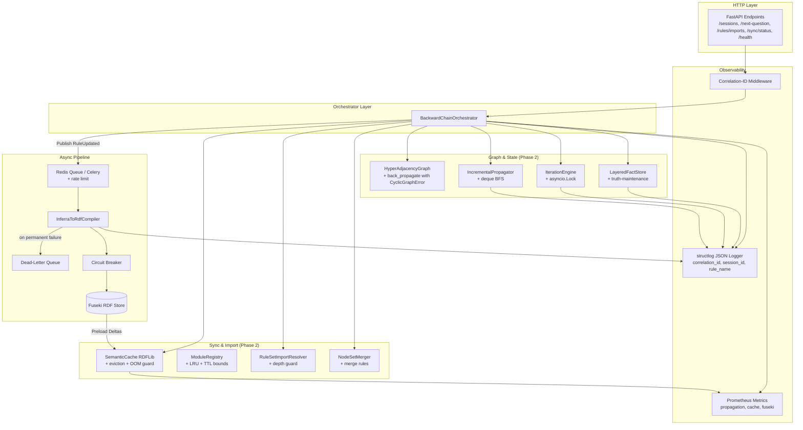
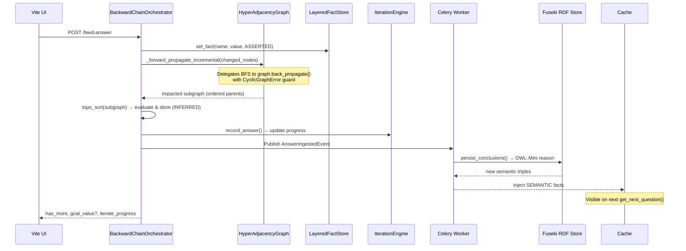

# INFERRA Phase 2 Implementation Plan
## Graph Service, Iteration Engine & Async Sync Pipeline
**Document Status:** **Phase 2 COMPLETE** v3.3 (All 29 tasks done; Task #8 deferred to Phase 2.5; performance baselines captured; feature flag matrix tested; ready for Phase 2.5 handoff)
**Timeline:** Weeks 3–4 (10 Working Days + 2 Buffer Days)  
**Feature Flags:** `USE_HYPERGRAPH=true`, `LEGACY_ITERATE=false`, `ASYNC_SYNC_ENABLED=true`, `MODULAR_IMPORTS=true`, `LAYERED_MEMORY=true` (prerequisite), `ML_OPTIMIZED_DFS=false` (inherited from Phase 1)  
**Feature Flag Policy:** Flags are start-of-session sticky — cannot flip mid-session (consistent with Phase 1)  
**Prerequisites:** Phase 1 complete (v3.0). Pre-conditions (§2.1–2.7) resolved. `LayeredFactStore` with `remove_fact()`/`invalidate_layer()`/`get_fact_sources()`/`get_overrides()`/`get_changed_since()` + truth-maintenance (fully wired in Phase 1 — not Phase 2 scope). `HyperAdjacencyGraph` with cycle-guarded `back_propagate()` + immutable `DependencyGroup` NamedTuple. `HistoryRecordStorePort` (ABC) + `InMemoryHistoryRecordStore` (DB-backed adapter is Phase 2 scope). `dfs_topological_sort_with_record()` wired in `rule_set_scanner.py` when `ML_OPTIMIZED_DFS=true`. Structured logging (`structlog`) + correlation-ID middleware. Session schema versioning (`CURRENT_SCHEMA_VERSION = 1`). Baseline APIs with error schemas, pagination, health-check. Redis/Celery infrastructure provisioned. Fuseki endpoint available.

---

## 📖 1. Executive Summary & Objectives

Phase 2 transitions INFERRA from foundational state management to **high-performance graph traversal, unified iteration evaluation, event-driven ontology sync, and modular rule composition**. It replaces legacy full-matrix runtime scans with queue-based incremental propagation, eliminates the nested `InferenceEngine` anti-pattern in `IterateLine`, establishes the async `RuleUpdated` → Celery → Fuseki pipeline, and deploys eager import resolution with circular dependency detection. All changes maintain zero-downtime backward compatibility via port adapters and feature flags.

**Important bridge decision:** Phase 2 makes `HyperAdjacencyGraph` and `DependencyGraphPort` stable and preferred for new runtime work, but it does **not** delete `DependencyMatrix` outright. The current codebase still has matrix coupling in `InferenceEngine`, `topo_sort.py`, `rule_set_scanner.py`, `rule_service.py`, and existing tests. Full runtime retirement of dense matrix usage is assigned to **Phase 2.5: DependencyMatrix Runtime Retirement & Graph-First Migration**. See `INFERRA_Phase2_5_DependencyMatrix_Bridge_Plan.md`.

### 1.1 Core Objectives
- [x] Refactor `_back_propagating` to delegate BFS to Phase 1's `HyperAdjacencyGraph.back_propagate()` (cycle-guarded)
- [⏳] Migrate `topo_sort.py` to `graphlib.TopologicalSorter` + invalidation-aware cache + `_topo_sort_subgraph()` definition; preserve existing `dfs_topological_sort_with_record()` (wired when `ML_OPTIMIZED_DFS=true`) — **deferred to Phase 2.5**
- [x] Implement `_forward_propagate_incremental()` using impacted-subgraph BFS with `CyclicGraphError` guard + `deque`; use primitive `DependencyGraphPort` API (not `get_typed_child_groups()`)
- [x] Replace `IterateLine.__iterate_ie` with `IterationEngine` implementing `IterationPort` (async, thread-safe, truth-maintenance aware); add delegation wiring in `IterateLine`
- [x] Deploy event-driven async sync pipeline (`RuleUpdated` → Celery → `InferraToRdfCompiler`) with DLQ + circuit breaker
- [x] Implement `RuleSetImportResolver` + `ModuleRegistry` with DFS cycle + depth guard + bounded cache
- [x] Integrate `IMPORT:` / `RULE SET:` tokens + `NodeOrigin` metadata + `NodeSetMerger` definition
- [x] Preload RDFLib in-memory semantic cache at session start with eviction + OOM guard
- [x] Propagate Phase 1's `structlog` + correlation-ID to all Phase 2 modules
- [x] Migrate session schema from Phase 1 (v1) → Phase 2 (v2) with `NodeOrigin` + `iteration_state`
- [x] Wire `DependencyGraphPort` contract tests against existing ABCMeta + method signatures (not Protocol; uses `all_node_names()` not `get_all_node_ids()`)
- [x] Define `IterationPort` ABC + contract test suite — **ABC created** at `src/ports/iteration_port.py`; **25 contract tests** at `tests/contracts/test_iteration_port.py` (skipped until implementation added)
- [x] Define `NodeSetMerger.merge()` with explicit merge rules + property-based tests
- [x] Extend `/health` endpoint for Phase 2 dependencies (Celery, Fuseki, SemanticCache stats)
- [x] Add Celery backpressure / rate limiting on task submission
- [x] Define API contracts with error schemas and pagination for all new endpoints
- [x] Add buffer days + WS staggering to sprint schedule
- [x] Implement DB-backed `HistoryRecordStorePort` adapter (Phase 1 deferred; existing port + in-memory adapter ready)
- [x] Ensure `LAYERED_MEMORY=true` is a prerequisite for Phase 2 features (IncrementalPropagator + IterationEngine depend on `FactStorePort` methods)
- [x] Add Phase 2 feature flags (`async_sync_enabled`, `modular_imports`) to `FeatureFlags` class + `snapshot()`
- [x] Add Phase 2.5 bridge handoff: `DependencyMatrix` remains legacy compatibility only; `HyperAdjacencyGraph` becomes canonical runtime graph after Phase 2.5

### 1.2 Success Metrics
| Metric | Target |
|--------|--------|
| Forward propagation latency (1k nodes, 5% density) | <200ms |
| Iterate state leakage (parent `working_memory` pollution) | 0 |
| Rule save latency (async sync decoupling) | <50ms synchronous |
| Topo-sort cache hit rate | >90% |
| Circular import detection | 100% synchronous pre-save block |
| Import DFS depth guard | `MAX_IMPORT_DEPTH=100` enforced |
| Async pipeline dead-letter capture | 100% of permanent failures |
| Semantic cache OOM guard | Fallback to Fuseki at 200MB |
| ModuleRegistry eviction | LRU maxsize=256, TTL=600s |
| Session schema migration v1→v2 | Zero errors on migrated sessions |
| Async pipeline observability | Prometheus metrics for sync, cache, propagation |
| Test coverage (Phase 2 modules) | ≥92% |
| Phase 2.5 readiness | Graph-first components stable; remaining matrix dependencies inventoried and isolated for bridge migration |

---

## 🏗️ 2. Architecture Overview (Phase 2 Scope)

### 2.1 Component Architecture


### 2.2 Data Flow: Incremental Propagation & Async Sync


---

## 🧩 3. Work Breakdown Structure (WBS) & Daily Schedule

| Day | WS-1: Graph Traversal & Propagation | WS-2: IterationEngine Unification | WS-3: Async Sync & Semantic Cache | WS-4: Modular Imports & Registry | Validation & CI |
|-----|-----------------------------------|---------------------------------|---------------------------------|-----------------------------------|-----------------|
| **Mon** | Implement `_back_propagating` — delegate BFS to `graph.back_propagate()` (Phase 1 cycle guard) | Extract `IterationPort` + `IterationEngine` skeleton + `asyncio.Lock` | Implement `RuleUpdated` event publisher + Celery task + `structlog` + rate limit (`10/m`) | _Staggered start (WS-3 dependency):_ Define `DependencyGraphPort` ABCMeta contract tests | Define `IterationPort` contract test suite |
| **Tue** | Build `_compute_impacted_subgraph()` + `_forward_propagate_incremental()` with `deque` + `CyclicGraphError` | Implement `record_answer()` async + truth-maintenance (`get_fact_sources()`/`invalidate_layer()`) | Build `InferraToRdfCompiler` + SPARQL idempotent INSERT + circuit breaker (`failure_threshold=5, recovery_timeout=60`) | Implement `IMPORT_MATCHER` + `NodeOrigin` + `RuleSetImportResolver` + DFS cycle + depth guard (`MAX_IMPORT_DEPTH=100`) | Iterate JSON validation tests |
| **Wed** | Define `_topo_sort_subgraph()` + invalidation-aware cache + unit tests (empty, single, diamond, disconnected, cycle) | Add `get_iterate_progress()` + Pydantic payload schema + `reset_iterate_context()` | Implement `SemanticCache` with eviction + OOM guard + delta query + `clear()` on teardown | Build `ModuleRegistry` (LRU + TTL + size bounds + `invalidate()` on `RuleUpdated`) | Async task idempotency + DLQ tests |
| **Thu** | Migrate `topo_sort.py` → `graphlib.TopologicalSorter` | Deprecate nested `InferenceEngine` behind `LEGACY_ITERATE=false` | Add `RDF_RANGE_TO_FACT_TYPE` bridge + type validation + DLQ + `/sync/status` | Define `NodeSetMerger.merge()` rules + `/rules/{name}/imports` + `/rules/validate` endpoints + pagination | Circular import block tests + API error schema tests |
| **Fri** | Benchmark propagation vs legacy matrix; store baseline in `benchmarks/baseline_phase2.json` | E2E test: iterate progress → summary → trace | Cache hit/miss metrics + OOM guard + Prometheus metrics + `/health` extensions | NodeSet merger parity + global topo re-sort + property-based tests | Session schema migration P1→P2; feature flag flip tests; **buffer + polish** |
| **Buffer Mon** | _Contingency:_ If Fuseki not provisioned by Wed, WS-3 switches to mock-based dev. Polish & integration tests. | | | | |
| **Buffer Tue** | Full E2E integration pass. Architecture review sign-off. | | | | |

---

## 🛠️ 4. Technical Deep Dives & Implementation Patterns

### 4.1 Queue-Based Back-Propagation & Incremental Forward Propagation
Replaces full matrix scans with targeted BFS over `HyperAdjacencyGraph.parents`. Only impacted nodes are re-evaluated. Delegates BFS traversal to Phase 1's cycle-guarded `graph.back_propagate()`.

```python
# src/domain/graph/inference_propagator.py
from collections import deque
from typing import Deque, Set
from src.domain.graph.hyper_adjacency_graph import CyclicGraphError
from src.domain.graph.dependency_type import DependencyType
import graphlib
import structlog

log = structlog.get_logger()

class IncrementalPropagator:
    def __init__(self, graph: DependencyGraphPort, fact_store: FactStorePort):
        self.graph = graph
        self.store = fact_store

    def _forward_propagate_incremental(self, changed_node_ids: Set[str]) -> None:
        """Incremental forward propagation using impacted-subgraph BFS.
        Delegates BFS to Phase 1's cycle-guarded graph.back_propagate(),
        then topo-sorts + evaluates only the impacted subgraph."""
        # Delegate BFS to graph's back_propagate (has visited set + CyclicGraphError guard)
        impacted_ordered = self.graph.back_propagate(changed_node_ids)
        log.info("forward_propagation_start", impacted_count=len(impacted_ordered))

        # Topo-sort ONLY impacted subgraph
        impacted_set = set(impacted_ordered)
        # Use primitive port API: get_child_groups() returns Tuple[Tuple[int, Tuple[str, ...]], ...]
        sub_children = {n: self.graph.get_child_groups(n) for n in impacted_set}
        ordered = self._topo_sort_subgraph(impacted_set, sub_children)

        evaluated = 0
        for nid in ordered:
            if self._can_evaluate_parent(nid):
                self._evaluate_and_store(nid)
                evaluated += 1
        log.info("forward_propagation_complete", evaluated_count=evaluated, total_impacted=len(impacted_set))

    def _topo_sort_subgraph(self, node_ids: Set[str], child_map: Dict[str, Tuple[Tuple[int, Tuple[str, ...]], ...]]) -> List[str]:
        """Topologically sort an impacted subgraph using graphlib.TopologicalSorter.
        Only considers edges within the subgraph — external dependencies are ignored.
        Uses primitive port API: child_map values are (dep_type_int, children_tuple) tuples."""
        sorter = graphlib.TopologicalSorter()
        for nid in node_ids:
            sorter.add(nid)
            for _dep_type_int, children_tuple in child_map.get(nid, ()):
                for child in children_tuple:
                    if child in node_ids:  # only intra-subgraph edges
                        sorter.add(nid, child)
        return list(sorter.static_order())

    # --- Required Unit Tests for _topo_sort_subgraph() ---
    #
    # test_topo_sort_empty_subgraph:
    #   _topo_sort_subgraph(set(), {}) → []
    #
    # test_topo_sort_single_node:
    #   _topo_sort_subgraph({"A"}, {}) → ["A"]
    #
    # test_topo_sort_diamond_dependency:
    #   nodes={A,B,C,D}, edges: A→B, A→C, B→D, C→D
    #   result must have B,C before D and A before B,C
    #
    # test_topo_sort_disconnected_components:
    #   nodes={A,B,C,D}, edges: A→B only (C,D disconnected)
    #   result must contain all 4, with A before B
    #
    # test_topo_sort_cycle_raises:
    #   nodes={A,B}, edges: A→B, B→A
    #   raises CycleError from graphlib
    #
    # test_topo_sort_property_based:
    #   For any subgraph, for every edge parent→child in the output,
    #   parent appears before child (topological invariant)

    def _can_evaluate_parent(self, parent_id: str) -> bool:
        wm = self.store.get_unified_view()
        # Use primitive port API: get_child_groups() returns Tuple[Tuple[int, Tuple[str, ...]], ...]
        for dep_type_int, children_tuple in self.graph.get_child_groups(parent_id):
            if dep_type_int & DependencyType.AND:
                if not all(c in wm for c in children_tuple): return False
            elif dep_type_int & DependencyType.OR:
                if not any(c in wm for c in children_tuple): return False
        return True

    def _evaluate_and_store(self, node_id: str) -> None:
        # Evaluate node logic + store as INFERRED
        value = self._compute_node_value(node_id)
        # node_id IS the node name (Phase 1's graph uses name-based keys, not numeric IDs)
        self.store.set_fact(node_id, value, source=FactSource.INFERRED)
```

### 4.2 Unified `IterationEngine` (Port-Compliant)
Eliminates nested engine, routes to parent `LayeredFactStore`, exposes progress, enforces `FactSource.INFERRED` tagging, and maintains Phase 1's thread-safety + truth-maintenance conventions.

```python
# src/domain/iterate/iteration_engine.py
import asyncio
from typing import Optional, Set
from src.ports.iteration_port import IterationPort
from src.domain.state.fact_source import FactSource
from src.domain.nodes.iterate_context import IterateContext
import structlog

log = structlog.get_logger()

class IterationEngine(IterationPort):
    """Port-compliant iteration engine with thread-safety and truth-maintenance.
    Concurrency model: sessions are single-threaded by design; asyncio.Lock
    provides a safety net for async frameworks that may interleave coroutines.
    Replaces IterateLine.__iterate_ie (nested InferenceEngine anti-pattern)."""
    def __init__(self, fact_store: FactStorePort):
        self._store = fact_store
        self._ctx: Optional[IterateContext] = None
        self._lock: asyncio.Lock = asyncio.Lock()  # Phase 1 thread-safety convention

    def initialise(self, list_size: int, quantifier: str, list_name: str) -> None:
        if self._ctx and self._ctx.list_size == list_size: return
        self._ctx = IterateContext(list_name=list_name, list_size=list_size, quantifier=quantifier)
        log.info("iterate_context_initialised", list_name=list_name, list_size=list_size, quantifier=quantifier)

    async def record_answer(self, index: int, question_name: str, value: Any, node_value_type: FactValueType) -> bool:
        """Thread-safe answer recording. Uses per-engine lock to prevent data races.
        Routes through FactStorePort without metadata kwarg (Phase 1 contract compliance)."""
        async with self._lock:
            # Truth-maintenance: check if fact already ASSERTED (user override)
            sources = self._store.get_fact_sources(question_name)
            if FactSource.ASSERTED in sources:
                log.info("iterate_answer_asserted_override", question_name=question_name)
                # ASSERTED wins — don't overwrite with INFERRED
                self._ctx.progress[index] = bool(value)
                return len(self._ctx.progress) == self._ctx.list_size

            is_true = bool(value) if node_value_type == FactValueType.BOOLEAN else str(value).strip().lower() == "true"
            self._ctx.progress[index] = is_true
            # Route to parent unified store — NO metadata kwarg (Phase 1 FactStorePort contract)
            self._store.set_fact(question_name, FactValue(is_true), source=FactSource.INFERRED)
            log.info("iterate_answer_recorded", question_name=question_name, index=index, is_true=is_true)
            return len(self._ctx.progress) == self._ctx.list_size

    def evaluate(self) -> FactValue:
        true_count = sum(1 for v in self._ctx.progress.values() if v)
        q = self._ctx.quantifier
        if q == "ALL": return FactValue(true_count == self._ctx.list_size)
        if q == "NONE": return FactValue(true_count == 0)
        if q == "SOME": return FactValue(true_count > 0)
        try: return FactValue(true_count == int(q))
        except (ValueError, TypeError): return FactValue(False)

    def get_progress(self) -> Tuple[int, int]:
        return (len(self._ctx.progress), self._ctx.list_size)

    def reset_iterate_context(self) -> None:
        """Reset iteration state — clears INFERRED facts via truth-maintenance
        and reinitializes context for re-evaluation."""
        if self._ctx:
            self._store.invalidate_layer(FactSource.INFERRED)
            self._ctx = IterateContext(
                list_name=self._ctx.list_name,
                list_size=self._ctx.list_size,
                quantifier=self._ctx.quantifier
            )
            log.info("iterate_context_reset", list_name=self._ctx.list_name)
```

#### 4.2b IterateLine → IterationEngine Delegation Wiring

Phase 1's `IterateLine` (`src/domain/nodes/iterate_line.py`) still contains `self.__iterate_ie` (nested `InferenceEngine`) activated when `LEGACY_ITERATE=true`. Phase 2 replaces this with delegation to `IterationEngine` when `LEGACY_ITERATE=false`. The existing `asyncio.Lock` on `IterateLine.feed_iterate_answer()` is preserved; `IterationEngine.record_answer()` has its own lock.

```python
# src/domain/nodes/iterate_line.py — modifications (not a new file)
#
# EXISTING (Phase 1, keep for LEGACY_ITERATE=true path):
#   self.__iterate_ie: Optional[InferenceEngine] = None
#   self.__context: Optional[IterateContext] = None
#   self._lock: Optional[asyncio.Lock] = None
#
# NEW (Phase 2, active when LEGACY_ITERATE=false):
#   self._iteration_engine: Optional[IterationEngine] = None
#
# In feed_iterate_answer():
#   if not feature_flags.legacy_iterate:
#       if self._iteration_engine is None:
#           self._iteration_engine = IterationEngine(fact_store=parent_fact_store)
#       return await self._iteration_engine.record_answer(
#           index, question_name, node_value, node_value_type
#       )
#   else:
#       # LEGACY path — unchanged from Phase 1
#       ...
#
# In can_be_self_evaluate() / self_evaluate():
#   if not feature_flags.legacy_iterate and self._iteration_engine:
#       return self._iteration_engine.evaluate()
#   else:
#       # LEGACY path — unchanged from Phase 1
#       ...
#
# In get_progress():
#   if not feature_flags.legacy_iterate and self._iteration_engine:
#       return self._iteration_engine.get_progress()
#   else:
#       # LEGACY path — unchanged from Phase 1
#       ...
```
Decouples rule persistence from RDF projection. Idempotent via `source_hash`. Celery handles retries safely. Includes dead-letter queue, circuit breaker, structured logging, and rate limiting.

```python
# src/tasks/rule_sync.py
from celery import shared_task
from circuitbreaker import circuit
from src.adapters.outbound.ontology.inferra_to_rdf_compiler import InferraToRdfCompiler
from src.adapters.outbound.ontology.fuseki_adapter import FusekiAdapter
import structlog

log = structlog.get_logger()

@shared_task(bind=True, max_retries=3, default_retry_delay=60, rate_limit="10/m")
def compile_and_push_to_fuseki(self, rule_name: str, rule_text: str, source_hash: str) -> dict:
    log = log.bind(rule_name=rule_name, source_hash=source_hash, task_id=self.request.id)
    try:
        rdf_triples = InferraToRdfCompiler.compile(rule_text, rule_name)
        # Circuit breaker: if Fuseki is down, fail fast instead of retrying
        _fuseki_write_with_breaker(rdf_triples, version=source_hash)
        log.info("fuseki_sync_success")
        return {"status": "success", "rule": rule_name, "hash": source_hash}
    except FusekiConnectionError as exc:
        log.warning("fuseki_connection_failed", retry=self.request.retries)
        self.retry(exc=exc)
    except Exception as exc:
        log.error("fuseki_sync_failed_permanently", error=str(exc))
        # Publish to dead-letter queue for manual reprocessing
        publish_dead_letter_event(rule_name, rule_text, source_hash, str(exc))
        raise

@circuit(failure_threshold=5, recovery_timeout=60)
def _fuseki_write_with_breaker(rdf_triples, version: str) -> None:
    """Circuit breaker wraps Fuseki writes. After 5 consecutive failures,
    opens the circuit for 60s to prevent overwhelming an unavailable Fuseki."""
    FusekiAdapter.execute_sparql_idempotent_insert(rdf_triples, version=version)

def publish_dead_letter_event(rule_name: str, rule_text: str, source_hash: str, error: str) -> None:
    """Publish to dead-letter Redis list for manual reprocessing."""
    import json, redis
    r = redis.Redis()
    r.lpush("inferra:dead_letter_queue", json.dumps({
        "rule_name": rule_name, "source_hash": source_hash, "error": error, "timestamp": time.time()
    }))
    log.error("dead_letter_published", rule_name=rule_name, error=error)

# Triggered synchronously during rule save validation
def publish_rule_updated_event(rule_name: str, rule_text: str) -> None:
    source_hash = hashlib.sha256(rule_text.encode()).hexdigest()
    # Idempotency at submission level: skip if task already pending for this hash
    if not _is_task_pending(rule_name, source_hash):
        compile_and_push_to_fuseki.delay(rule_name, rule_text, source_hash)
        log.info("rule_updated_published", rule_name=rule_name, source_hash=source_hash)
    else:
        log.info("rule_updated_skipped_duplicate", rule_name=rule_name, source_hash=source_hash)
```

```python
# src/api/v1/sync_routes.py
from fastapi import APIRouter

router = APIRouter(prefix="/api/v1/sync", tags=["sync"])

@router.get("/status")
async def get_sync_status(rule_name: str):
    """Check if async RDF projection completed for a rule."""
    status = await SyncStatusService.get_status(rule_name)
    if status is None:
        return {"rule_name": rule_name, "status": "unknown"}
    return status
```

### 4.4 Modular Import Resolution & Circular Detection
Synchronous DFS during validation. Eager compilation with `ModuleRegistry` cache (LRU + TTL bounded). Blocks save on cycles. Depth guard prevents `RecursionError`.

```python
# src/domain/rule_parser/rule_set_import_resolver.py
import asyncio
import structlog

log = structlog.get_logger()
MAX_IMPORT_DEPTH = 100  # prevent RecursionError on deep chains

class RuleSetImportResolver:
    def resolve(self, rule_name: str, registry: ModuleRegistry) -> NodeSet:
        return self._dfs_resolve(rule_name, visited=set(), in_stack=set(), path=[], depth=0)

    def _dfs_resolve(self, rule_name, visited, in_stack, path, depth):
        if depth > MAX_IMPORT_DEPTH:
            raise CircularImportError(f"Import depth exceeded {MAX_IMPORT_DEPTH} — chain too deep: {' → '.join(path + [rule_name])}")
        if rule_name in in_stack:
            log.warning("circular_import_detected", path=path + [rule_name])
            raise CircularImportError(f"Cycle detected: {' → '.join(path + [rule_name])}")
        if rule_name in visited:
            return registry.get(rule_name)
        
        in_stack.add(rule_name)
        path = path + [rule_name]  # immutable append — no need to pop
        
        rule_text, content_hash = self._load_rule_with_timeout(rule_name)
        cached = registry.get(rule_name, content_hash)
        if cached:
            in_stack.discard(rule_name)
            visited.add(rule_name)
            log.info("import_cache_hit", rule_name=rule_name, import_depth=depth)
            return cached.node_set
        
        imports = self._extract_imports(rule_text)
        merged_imports = [self._dfs_resolve(imp, visited, in_stack, path, depth + 1) for imp in imports]
        node_set = NodeSetMerger.merge(rule_text, merged_imports, rule_name)
        registry.put(rule_name, content_hash, node_set)
        
        in_stack.discard(rule_name)
        visited.add(rule_name)
        log.info("import_resolved", rule_name=rule_name, import_depth=depth, import_count=len(imports))
        return node_set

    def _load_rule_with_timeout(self, rule_name: str, timeout_seconds: float = 10.0) -> Tuple[str, str]:
        """Load rule text with timeout to prevent indefinite blocking on slow storage."""
        import signal
        def handler(signum, frame): raise TimeoutError(f"Rule load timed out: {rule_name}")
        old = signal.signal(signal.SIGALRM, handler)
        signal.alarm(int(timeout_seconds))
        try:
            return self._load_rule(rule_name)
        finally:
            signal.alarm(0)
            signal.signal(signal.SIGALRM, old)
```

### 4.5 Semantic Cache Preload (RDFLib)
Eliminates Fuseki from the hot execution path. Only queries deltas post-reasoning. Includes eviction, OOM guard, and observability metrics.

```python
# src/adapters/outbound/ontology/semantic_cache.py
import rdflib
import time
import sys
import structlog
from typing import List, Optional, Set, Tuple

log = structlog.get_logger()

class SemanticCache:
    MAX_TRIPLES = 500_000
    TTL_SECONDS = 3600  # 1 hour
    OOM_MEMORY_MB = 200  # fallback to direct Fuseki above this

    def __init__(self):
        self.graph = rdflib.Graph()
        self._loaded_rules: Set[str] = set()
        self._last_query_timestamp: float = 0.0
        self._hit_count: int = 0
        self._miss_count: int = 0

    def preload(self, rule_name: str) -> None:
        """Preload triples for a rule. Skips if already loaded. Evicts if near OOM."""
        if rule_name in self._loaded_rules:
            self._hit_count += 1
            log.info("semantic_cache_hit", rule_name=rule_name)
            return
        
        # OOM guard
        if self.memory_usage_mb > self.OOM_MEMORY_MB:
            log.warning("semantic_cache_near_oom", memory_mb=self.memory_usage_mb, triple_count=len(self.graph))
            self._evict_oldest_entries(target=self.MAX_TRIPLES // 2)
        
        if len(self.graph) > self.MAX_TRIPLES:
            log.warning("semantic_cache_triple_cap", triple_count=len(self.graph))
            self._evict_oldest_entries(target=self.MAX_TRIPLES // 2)

        self._miss_count += 1
        query = FusekiAdapter.get_rule_triples(rule_name)
        for triple in query:
            self.graph.add(triple)
        self._loaded_rules.add(rule_name)
        log.info("semantic_cache_preload", rule_name=rule_name, triple_count=len(self.graph), memory_mb=self.memory_usage_mb)

    def query_new_deltas(self, since_timestamp: float) -> List[Tuple]:
        """Return triples not previously injected into working_memory since the given timestamp."""
        if since_timestamp == self._last_query_timestamp:
            return []
        deltas = FusekiAdapter.query_deltas(since_timestamp)
        self._last_query_timestamp = time.time()
        log.info("semantic_cache_deltas", delta_count=len(deltas), since=since_timestamp)
        return deltas

    def _evict_oldest_entries(self, target: int) -> None:
        """Evict oldest preloaded rules until triple count is below target."""
        while len(self.graph) > target and self._loaded_rules:
            oldest = next(iter(self._loaded_rules))  # FIFO order
            self._loaded_rules.discard(oldest)
            subgraph = self._rule_subgraph(oldest)
            for triple in subgraph:
                self.graph.remove(triple)
            log.info("semantic_cache_evicted", rule_name=oldest, triple_count=len(self.graph))

    def _rule_subgraph(self, rule_name: str) -> List[Tuple]:
        """Extract triples associated with a rule (by graph name or subject URI pattern)."""
        # Implementation depends on how triples are keyed — use inf:ruleName predicate
        rule_uri = rdflib.URIRef(f"inf://{rule_name}")
        return [(s, p, o) for s, p, o in self.graph if s.startswith(rule_uri)]

    def clear(self) -> None:
        """Clear all cached data. Called on session teardown to prevent RDFLib leaks."""
        self.graph = rdflib.Graph()
        self._loaded_rules.clear()
        self._last_query_timestamp = 0.0
        log.info("semantic_cache_cleared")

    @property
    def triple_count(self) -> int:
        return len(self.graph)

    @property
    def memory_usage_mb(self) -> float:
        return sys.getsizeof(self.graph.serialize(format="nt")) / (1024 * 1024)

    @property
    def hit_rate(self) -> float:
        total = self._hit_count + self._miss_count
        return self._hit_count / total if total > 0 else 0.0
```

### 4.6 Phase 2 API Contracts (FastAPI)

All new endpoints follow Phase 1's error response schema format: `{error_code, message}`.

```yaml
GET /api/v1/rules/{rule_name}/imports?depth=&offset=&limit=
  Summary: Returns import tree for a rule with pagination
  Parameters:
    rule_name: path (required)
    depth: query (optional, default=unlimited) - max import depth to traverse
    offset: query (optional, default=0) - pagination offset
    limit: query (optional, default=50) - pagination page size
  Returns:
    200:
      rule_name: str
      imports: [{ name: str, content_hash: str, node_count: int, depth: int }]
      has_cycles: false
      total_count: int
      offset: int
      limit: int
    404: { error_code: "RULE_NOT_FOUND", message: "Rule '{rule_name}' does not exist" }
    422: { error_code: "CIRCULAR_IMPORT", message: "Cycle detected: A → B → C → A" }

GET /api/v1/rules/{rule_name}/validate
  Summary: Validates a rule including import resolution
  Returns:
    200:
      valid: true
      errors: []
      warnings: []
    200:
      valid: false
      errors: [{ code: str, message: str, location: str? }]
      warnings: [{ code: str, message: str }]
    404: { error_code: "RULE_NOT_FOUND", message: "Rule '{rule_name}' does not exist" }

GET /api/v1/sync/status?rule_name=
  Summary: Check if async RDF projection completed for a rule
  Returns:
    200:
      rule_name: str
      status: "pending" | "completed" | "failed"
      source_hash: str
      completed_at: str? (ISO 8601)
      error: str?
    404: { error_code: "RULE_NOT_FOUND", message: "Rule '{rule_name}' does not exist" }

GET /api/v1/health
  Summary: Extended health-check for all Phase 2 dependencies
  Returns:
    200:
      status: "ok"
      redis: "ok"
      celery: "ok"
      fuseki: "ok"
      graph_init: true
      semantic_cache: { triples: 12345, memory_mb: 8.3, hit_rate: 0.92 }
      version: "2.0.0"
    503:
      status: "degraded"
      redis: "ok"
      celery: "ok"
      fuseki: "unavailable"
      graph_init: true
      semantic_cache: { triples: 0, memory_mb: 0, hit_rate: 0.0 }

GET /api/v1/metrics
  Summary: Prometheus-format metrics for async pipeline observability
  Returns:
    200: Prometheus text format (see §4.12 for metric definitions)
```

### 4.7 Structured Logging Propagation (Phase 1 → Phase 2)

All Phase 2 modules use `structlog` with the same mandatory fields established in Phase 1, plus Phase 2–specific fields.

**Mandatory log fields (inherited from Phase 1):**
- `session_id`, `node_id`, `fact_source`, `correlation_id`

**Phase 2–specific mandatory fields:**
- `rule_name` — identifies the rule being processed
- `import_depth` — current DFS depth in import resolution
- `propagation_depth` — current BFS depth in propagation
- `source_hash` — content hash for idempotency tracking

**Mandatory logging events for Phase 2:**
- Propagation: `forward_propagation_start` / `forward_propagation_complete` (with `impacted_count`, `evaluated_count`, `duration_ms`)
- Iterate: `iterate_answer_recorded` / `iterate_completed` (with `quantifier`, `true_count`, `list_size`)
- Async: `rule_updated_published` / `fuseki_sync_success` / `fuseki_sync_failed` / `dead_letter_published`
- Import: `import_resolved` / `import_cache_hit` / `circular_import_detected` (with `path`)
- Cache: `semantic_cache_preload` / `semantic_cache_hit` / `semantic_cache_miss` / `semantic_cache_evicted` / `semantic_cache_cleared`
- Feature flag reads at session start

### 4.8 Session Schema Migration (Phase 1 → Phase 2)

Phase 1 established `SessionMetadata.schema_version = 1`. Phase 2 introduces `NodeOrigin`, `iteration_state`, and `semantic_cache_loaded` tracking.

```python
# src/domain/state/session_schema.py
CURRENT_SCHEMA_VERSION = 2  # bumped from Phase 1

class SessionPersistenceService:
    def _migrate_session(self, data: dict, from_version: int) -> dict:
        # Phase 0 → 1 migration (inherited from Phase 1)
        if from_version < 1:
            working_memory = data.get("working_memory", {})
            data["fact_sources"] = {name: "ASSERTED" for name in working_memory}
            data.setdefault("metadata", {})["fact_source_migration"] = True
        
        # Phase 1 → 2 migration
        if from_version < 2:
            # Add NodeOrigin metadata (default: module = "unknown", imported = False)
            for node in data.get("nodes", []):
                node.setdefault("origin", {"module": "unknown", "imported": False})
            # Migrate iterate progress from old IterateContext format
            data.setdefault("iteration_state", {})
            # Track which rules have been preloaded into semantic cache
            data.setdefault("semantic_cache_loaded", [])
        
        # Compatibility layer: if iteration_state is missing, reconstruct from INFERRED facts
        if "iteration_state" not in data:
            data["iteration_state"] = self._reconstruct_iteration_state(data)
        
        data.setdefault("metadata", {})["schema_version"] = CURRENT_SCHEMA_VERSION
        return data

    def _reconstruct_iteration_state(self, data: dict) -> dict:
        """Best-effort reconstruction of iterate state from INFERRED facts."""
        fact_sources = data.get("fact_sources", {})
        iteration_state = {}
        for name, source in fact_sources.items():
            if source == "INFERRED" and "iterate" in name.lower():
                iteration_state[name] = {"status": "unknown", "progress": {}}
        return iteration_state
```

### 4.9 `DependencyGraphPort` Abstract Base Class

Phase 1 built `HyperAdjacencyGraph` implementing `DependencyGraphPort` (ABCMeta) with `back_propagate()`, `get_parent_edges()`, `get_child_groups()` (primitives), `all_node_names()`, `has_node()`, `topological_sort()`, and `add_dependency_group()`. Phase 2's `IncrementalPropagator` takes `graph: DependencyGraphPort` — this ABC already exists with correct method signatures.

> **Note:** The port uses primitive types (not `DependencyGroup` NamedTuples) to avoid circular imports. `get_child_groups()` returns `Tuple[Tuple[int, Tuple[str, ...]], ...]`. Domain-level typed access is available via `HyperAdjacencyGraph.get_typed_child_groups()`, but port-compliant code must use the primitive API.

```python
# src/ports/dependency_graph_port.py — ALREADY EXISTS (shown for reference)
from abc import ABCMeta, abstractmethod
from collections import deque
from typing import Deque, Set, Tuple

class DependencyGraphPort(metaclass=ABCMeta):
    @abstractmethod
    def add_dependency_group(self, parent: str, dep_type: int, children: Set[str]) -> None: ...

    @abstractmethod
    def get_parent_edges(self, node_name: str) -> Set[str]: ...

    @abstractmethod
    def get_child_groups(self, node_name: str) -> Tuple[Tuple[int, Tuple[str, ...]], ...]: ...

    @abstractmethod
    def back_propagate(self, changed_node: str, max_steps: int = 0) -> Deque[str]: ...

    @abstractmethod
    def topological_sort(self) -> Tuple[str, ...]: ...

    @abstractmethod
    def all_node_names(self) -> Set[str]: ...

    @abstractmethod
    def has_node(self, node_name: str) -> bool: ...
```

Contract tests (add new if not already existing):
```python
# tests/contracts/test_dependency_graph_port.py
import pytest
from src.domain.graph.hyper_adjacency_graph import HyperAdjacencyGraph

@pytest.mark.parametrize("graph_impl", [HyperAdjacencyGraph])
class TestDependencyGraphPortContract:
    def test_get_parent_edges_returns_set(self, graph_impl): ...
    def test_get_child_groups_returns_primitive_tuples(self, graph_impl): ...
    def test_back_propagate_returns_deque(self, graph_impl): ...
    def test_back_propagate_raises_cyclic_graph_error(self, graph_impl): ...
    def test_all_node_names_returns_set(self, graph_impl): ...
    def test_has_node_returns_bool(self, graph_impl): ...
    def test_topological_sort_returns_tuple(self, graph_impl): ...
    def test_add_dependency_group_adds_edges(self, graph_impl): ...
```

### 4.9b `IterationPort` Contract Test Suite

Phase 2 introduces `IterationPort` — equivalent contract tests are required, matching Phase 1's `FactStorePort` pattern. `IterationPort` follows the project's ABC pattern (not Protocol) consistent with `FactStorePort` and `DependencyGraphPort`.

```python
# src/ports/iteration_port.py — NEW FILE
from abc import ABCMeta, abstractmethod
from typing import Tuple, Any
from src.domain.fact_values import FactValue, FactValueType

class IterationPort(metaclass=ABCMeta):
    """Port contract for iteration evaluation. Any implementation must satisfy these methods."""
    @abstractmethod
    def initialise(self, list_size: int, quantifier: str, list_name: str) -> None: ...
    @abstractmethod
    async def record_answer(self, index: int, question_name: str, value: Any, node_value_type: FactValueType) -> bool: ...
    @abstractmethod
    def evaluate(self) -> FactValue: ...
    @abstractmethod
    def get_progress(self) -> Tuple[int, int]: ...
    @abstractmethod
    def reset_iterate_context(self) -> None: ...
```

```python
# tests/contracts/test_iteration_port.py
import pytest
from src.domain.iterate.iteration_engine import IterationEngine  # NEW: src/domain/iterate/ directory

@pytest.mark.parametrize("iter_impl", [IterationEngine])
class TestIterationPortContract:
    def test_initialise_creates_context(self, iter_impl): ...
    def test_initialise_idempotent_on_same_list_size(self, iter_impl): ...
    def test_record_answer_increments_progress(self, iter_impl): ...
    def test_record_answer_returns_true_when_complete(self, iter_impl): ...
    def test_evaluate_after_all_answers(self, iter_impl): ...
    def test_evaluate_before_completion_raises(self, iter_impl): ...
    def test_get_progress_returns_answered_total(self, iter_impl): ...
    def test_reset_iterate_context_clears_progress(self, iter_impl): ...
    def test_record_answer_skips_asserted_override(self, iter_impl): ...
    def test_double_initialise_is_idempotent(self, iter_impl): ...
    def test_record_after_completion_is_noop(self, iter_impl): ...
    def test_evaluate_before_completion_raises_error(self, iter_impl): ...
```

### 4.10 `NodeSetMerger` Definition & Merge Rules

§4.4 references `NodeSetMerger.merge()` but it was not defined. This is the critical integration point where imported NodeSets are combined.

```python
# src/domain/rule_parser/node_set_merger.py
import structlog

log = structlog.get_logger()

class NodeSetMerger:
    """Merges imported NodeSets with local rules. Merge rules:
    - Name collision: local node wins over imported node (local override).
    - ID collision: module-qualified IDs from Phase 1's generate_node_id() prevent this.
    - Ordering: imported nodes prepended before local nodes in topological order.
    - Dependency groups: merged dependency groups are unioned; duplicate edges deduplicated.
    - NodeOrigin: every merged node gets {module, depth} metadata."""

    @staticmethod
    def merge(rule_text: str, imported_node_sets: List[NodeSet], rule_name: str) -> NodeSet:
        local_nodes = RuleSetScanner.scan(rule_text, rule_name)
        merged = NodeSet()
        
        # Phase 1: add imported nodes (prepend in topo order)
        seen_names: Set[str] = set()
        for imported_ns in imported_node_sets:
            for node in imported_ns.nodes:
                if node.get_node_name() not in seen_names:
                    node.origin = NodeOrigin(module=imported_ns.rule_name, imported=True, depth=imported_ns.depth)
                    merged.add_node(node)
                    seen_names.add(node.get_node_name())
                    log.info("node_merged", node_name=node.get_node_name(), source=imported_ns.rule_name)
        
        # Phase 2: add local nodes (override on name collision)
        for node in local_nodes.nodes:
            if node.get_node_name() in seen_names:
                merged.remove_node_by_name(node.get_node_name())  # local overrides imported
                log.info("node_override_local_wins", node_name=node.get_node_name())
            node.origin = NodeOrigin(module=rule_name, imported=False, depth=0)
            merged.add_node(node)
            seen_names.add(node.get_node_name())
        
        # Merge dependency groups (union + deduplicate)
        merged.rebuild_dependency_groups()
        return merged
```

**Required Property-Based Tests for `NodeSetMerger`:**

```python
# tests/domain/rule_parser/test_node_set_merger.py
from hypothesis import given, strategies as st

# Test: merging is associative — (A ∪ B) ∪ C == A ∪ (B ∪ C)
# Test: merging is commutative — A ∪ B == B ∪ A (when no name collisions)
# Test: merging is idempotent — A ∪ A == A (same input produces same result)
# Test: local-wins override — local node with same name replaces imported node
# Test: NodeOrigin metadata — every merged node has {module, imported, depth}
# Test: no duplicate edges — merged dependency groups have no duplicate parent→child pairs
# Test: ordering invariant — imported nodes appear before local nodes in topo order
```

### 4.11 `ModuleRegistry` with LRU + TTL Bounds

Phase 2 references `ModuleRegistry` with hash-invalidation but provides no implementation. Follows Phase 1's `RuleValidationService` cache pattern.

```python
# src/domain/rule_parser/module_registry.py
import time
from typing import Optional, OrderedDict, Tuple
import structlog

log = structlog.get_logger()

class ModuleRegistry:
    """Bounded LRU cache for resolved import NodeSets.
    Follows Phase 1's RuleValidationService cache pattern: maxsize + TTL."""

    def __init__(self, maxsize: int = 256, ttl_seconds: int = 600):
        self._cache: OrderedDict[Tuple[str, str], NodeSet] = OrderedDict()
        self._timestamps: dict[Tuple[str, str], float] = {}
        self._maxsize = maxsize
        self._ttl = ttl_seconds

    def get(self, rule_name: str, content_hash: str) -> Optional[NodeSet]:
        key = (rule_name, content_hash)
        if key in self._cache:
            if time.time() - self._timestamps[key] > self._ttl:
                del self._cache[key]
                del self._timestamps[key]
                return None  # expired
            self._cache.move_to_end(key)  # LRU
            return self._cache[key]
        return None

    def put(self, rule_name: str, content_hash: str, node_set: NodeSet) -> None:
        key = (rule_name, content_hash)
        if len(self._cache) >= self._maxsize:
            oldest = next(iter(self._cache))
            del self._cache[oldest]
            del self._timestamps[oldest]
        self._cache[key] = node_set
        self._timestamps[key] = time.time()
        log.info("module_registry_put", rule_name=rule_name, cache_size=len(self._cache))

    def invalidate(self, rule_name: str) -> None:
        """Invalidate all entries for a rule (triggered by RuleUpdated event)."""
        keys_to_remove = [k for k in self._cache if k[0] == rule_name]
        for k in keys_to_remove:
            del self._cache[k]
            del self._timestamps[k]
        if keys_to_remove:
            log.info("module_registry_invalidated", rule_name=rule_name, evicted=len(keys_to_remove))

    @property
    def size(self) -> int:
        return len(self._cache)

    @property
    def hit_rate(self) -> float:
        # Tracked via structlog events — add counters if needed for Prometheus
        return 0.0  # TODO: wire to metrics
```

### 4.12 Async Pipeline Observability & Prometheus Metrics

Phase 2's async pipeline (Celery → Fuseki → SemanticCache) requires observability for production diagnostics.

```python
# src/adapters/inbound/http/routes/metrics.py
from fastapi import APIRouter
from prometheus_client import Counter, Histogram, Gauge, generate_latest
from starlette.responses import PlainTextResponse

router = APIRouter(tags=["metrics"])

# Counters
fuseki_sync_total = Counter(
    "inferra_fuseki_sync_total", "Fuseki sync operations",
    ["status"]  # success | failed | retry
)
propagation_total = Counter(
    "inferra_propagation_total", "Graph propagation operations",
    ["direction"]  # forward | backward
)
import_resolve_total = Counter(
    "inferra_import_resolve_total", "Import resolution operations",
    ["result"]  # resolved | cache_hit | circular_detected | depth_exceeded
)

# Histograms
fuseki_sync_duration = Histogram(
    "inferra_fuseki_sync_duration_seconds", "Fuseki sync latency"
)
propagation_duration = Histogram(
    "inferra_propagation_duration_seconds", "Propagation latency",
    ["direction"]
)
import_resolve_depth = Histogram(
    "inferra_import_resolve_depth", "Import DFS depth"
)

# Gauges
semantic_cache_triples = Gauge(
    "inferra_semantic_cache_triples_loaded", "Triple count in semantic cache"
)
semantic_cache_memory_mb = Gauge(
    "inferra_semantic_cache_memory_mb", "Semantic cache memory usage MB"
)
semantic_cache_hit_rate = Gauge(
    "inferra_semantic_cache_hit_rate", "Semantic cache hit rate"
)

@router.get("/metrics")
async def metrics():
    return PlainTextResponse(generate_latest())
```

Celery task IDs must be correlated with Phase 1's correlation-ID via `structlog.contextvars`:
```python
import structlog.contextvars

@shared_task(bind=True)
def compile_and_push_to_fuseki(self, rule_name, rule_text, source_hash):
    structlog.contextvars.clear_contextvars()
    structlog.contextvars.bind_contextvars(
        task_id=self.request.id,
        rule_name=rule_name,
        source_hash=source_hash
    )
    log = structlog.get_logger()
    # ... task logic with automatic correlation_id propagation
```

### 4.13 Extended Health-Check for Phase 2 Dependencies

Phase 1 added `GET /health` checking Redis + graph_init. Phase 2 adds Celery, Fuseki, and RDFLib dependencies.

```python
# src/adapters/inbound/http/routes/health.py
from fastapi import APIRouter
from fastapi.responses import JSONResponse
import structlog

log = structlog.get_logger()
router = APIRouter(tags=["system"])

@router.get("/health")
async def health_check() -> dict:
    checks = {
        "status": "ok",
        "version": "2.0.0",
        "redis": _check_redis(),
        "celery": _check_celery(),
        "fuseki": _check_fuseki(),
        "graph_init": True,  # set during app startup
        "semantic_cache": _get_semantic_cache_stats(),
    }
    # If any dependency is unavailable, mark degraded
    if any(v == "unavailable" for k, v in checks.items() if k in ("redis", "celery", "fuseki")):
        checks["status"] = "degraded"
        return JSONResponse(status_code=503, content=checks)
    return checks

def _check_redis() -> str:
    try:
        import redis
        r = redis.Redis()
        r.ping()
        return "ok"
    except Exception:
        return "unavailable"

def _check_celery() -> str:
    try:
        from src.tasks.celery_app import app as celery_app
        insp = celery_app.control.inspect(timeout=1.0)
        return "ok" if insp.ping() else "unavailable"
    except Exception:
        return "unavailable"

def _check_fuseki() -> str:
    try:
        from src.adapters.outbound.ontology.fuseki_adapter import FusekiAdapter
        FusekiAdapter.health_check()
        return "ok"
    except Exception:
        log.warning("fuseki_health_check_failed")
        return "unavailable"

def _get_semantic_cache_stats() -> dict:
    try:
        from src.adapters.outbound.ontology.semantic_cache import get_semantic_cache
        cache = get_semantic_cache()
        return {
            "triples": cache.triple_count,
            "memory_mb": round(cache.memory_usage_mb, 1),
            "hit_rate": round(cache.hit_rate, 2),
        }
    except Exception:
        return {"triples": 0, "memory_mb": 0, "hit_rate": 0.0}
```

### 4.14 Celery Backpressure & Rate Limiting

§4.3 publishes tasks without any rate limiting. If 100 rules are saved simultaneously, 100 Celery tasks fire at once, potentially overwhelming Fuseki.

```python
# src/tasks/rule_sync.py — additions to existing module

# 1. Per-task rate limit (already applied in §4.3)
@shared_task(bind=True, max_retries=3, default_retry_delay=60, rate_limit="10/m")
def compile_and_push_to_fuseki(self, rule_name, rule_text, source_hash):
    ...

# 2. Submission-level throttle: skip if task already pending for same source_hash
_inflight_tasks: Dict[str, str] = {}  # {source_hash: task_id}

def _is_task_pending(rule_name: str, source_hash: str) -> bool:
    """Check if a task with the same source_hash is already in-flight."""
    task_id = _inflight_tasks.get(source_hash)
    if task_id is None:
        return False
    result = AsyncResult(task_id)
    return result.status in ("PENDING", "STARTED", "RETRY")

# 3. Batch compilation via Celery group for bulk operations
from celery import group

def publish_batch_rule_updated(events: List[Tuple[str, str]]) -> None:
    """Batch publish for bulk imports — groups tasks for parallel execution."""
    job = group(
        compile_and_push_to_fuseki.s(name, text, hashlib.sha256(text.encode()).hexdigest())
        for name, text in events
    )
    job.apply_async()
log.info("batch_rule_updated_published", count=len(events))
```

---

### 4.15 Phase 2.5 Bridge: DependencyMatrix Runtime Retirement

Phase 2 introduces the graph-first infrastructure, but the current codebase still contains legitimate legacy matrix dependencies. The bridge plan prevents an unsafe mid-Phase-2 rewrite while still committing to full matrix retirement from hot runtime paths.

**Reference:** `INFERRA_Phase2_5_DependencyMatrix_Bridge_Plan.md`

**Phase 2 responsibilities:**
- Keep `HyperAdjacencyGraph`, `DependencyGraphPort`, `MatrixToHyperGraphAdapter`, and `IncrementalPropagator` stable and well-tested.
- Ensure all new Phase 2 propagation/import/iteration code uses `DependencyGraphPort`, not `DependencyMatrix`.
- Maintain `MatrixToHyperGraphAdapter` parity tests for old matrix-backed rule/session data.
- Inventory remaining direct matrix dependencies in `InferenceEngine`, `topo_sort.py`, `rule_set_scanner.py`, `rule_service.py`, and tests.
- Add Phase 2.5 as the formal handoff before Phase 3 production hardening.

**Phase 2.5 responsibilities:**
- Refactor `InferenceEngine` hot-path traversal and question selection to use `DependencyGraphPort`.
- Extend `NodeSet` and parser/scanner flow so new parses emit a canonical `HyperAdjacencyGraph`.
- Keep reading old dense matrix payloads through the adapter, but write graph-native edge-list/snapshot data for new rule versions.
- Move runtime topological sorting to graph-native helpers while preserving `dfs_topological_sort_with_record()` behavior behind regression tests.
- Mark `DependencyMatrix` as deprecated for runtime use and limit imports to adapter, legacy migration, and tests.
- Normalize all port contracts to the project convention: ABCMeta ports, not `typing.Protocol`. This includes correcting the Phase 1 `FactStorePort` implementation if still Protocol-based at bridge kickoff.

**Acceptance gate for Phase 2.5 kickoff:**
- Phase 2 graph/propagation tests pass.
- Matrix-vs-hypergraph parity tests pass.
- Performance baseline for sparse 1k-node graphs is captured.
- Remaining matrix usage inventory is linked from the Phase 2 tracker.

---

## 🧪 5. Testing Strategy & Quality Gates

| Test Type | Scope | Tools | Pass Criteria |
|-----------|-------|-------|---------------|
| **Unit** | `IncrementalPropagator`, `IterationEngine`, `RuleSetImportResolver`, `SemanticCache`, `NodeSetMerger`, `ModuleRegistry`, `_topo_sort_subgraph()` | `pytest`, `unittest.mock` | ≥92% branch coverage |
| **Property-Based** | Topo-order stability, merge invariance (associativity, commutativity, idempotency), iterate quantifier parity, BFS cycle detection, NodeSetMerger associativity/idempotency | `hypothesis` | 0 counterexamples across 50k iterations |
| **Contract** | `DependencyGraphPort` contract suite, `IterationPort` contract suite (lifecycle: `initialise()` → `record_answer()` → `evaluate()` → `get_progress()`) | `pytest`, `@pytest.mark.parametrize` | 100% contract compliance for all implementations |
| **Integration** | Celery async flow, Fuseki SPARQL idempotency, cache preload, DLQ, circuit breaker, correlation-ID tracing | `pytest-asyncio`, `testcontainers` | Idempotent tasks, zero SPARQL injection errors, DLQ captures permanent failures |
| **Feature Flag** | Mid-session flag flip for ALL Phase 2 flags (`USE_HYPERGRAPH`, `LEGACY_ITERATE`, `ASYNC_SYNC_ENABLED`, `MODULAR_IMPORTS`), start-of-session stickiness | `pytest`, feature flag fixture | Graceful handling on mid-session flip (error or session termination). Retroactive effects must not corrupt state |
| **Performance** | 1k/5k node forward propagation, iterate memory, semantic cache memory | `pytest-benchmark`, `tracemalloc` | <200ms latency, <50MB peak RAM for 100-iterate list, no >10% regression from Phase 2 baseline |
| **Migration** | Load Phase 1 session in Phase 2 code, verify NodeOrigin + iteration_state | `pytest` | Zero errors on migrated sessions |
| **Phase 2.5 Bridge Readiness** | Inventory remaining direct matrix dependencies, matrix-vs-graph parity, graph-first propagation baseline | `rg`, `pytest`, `pytest-benchmark` | Phase 2.5 scope is bounded; no new Phase 2 production code depends on `DependencyMatrix` |
| **E2E** | Full session: load imports → ask → answer → iterate → async sync → converge → DLQ failure path → health-check | FastAPI `TestClient`, Vite mock | PROV-O trace complete, `fact_source` accurate, zero legacy matrix fallback hits |
| **Subgraph Topo** | `_topo_sort_subgraph()`: empty subgraph, single node, diamond dependency, disconnected components, cycle within subgraph | `pytest` | Valid topological ordering in all cases |
| **IteratePort Lifecycle** | `initialise()` → `record_answer()` → `evaluate()` → `get_progress()`, double-initialise (idempotent), record after completion, evaluate before completion (raises) | `pytest`, `@pytest.mark.parametrize` | 100% lifecycle compliance |

**CI/CD Additions:**
- Pre-commit: `ruff check`, `mypy src`, `black .`
- `import-linter` rule: `src.domain.inference` → `src.domain.graph` (no reverse imports)
- Feature flag matrix: `USE_HYPERGRAPH={true,false}`, `LEGACY_ITERATE={true,false}`, `ASYNC_SYNC_ENABLED={true,false}`, `MODULAR_IMPORTS={true,false}`, `ML_OPTIMIZED_DFS={true,false}` (Phase 2 flags only — `LAYERED_MEMORY=true` is a prerequisite, not tested in matrix). That gives 32 combinations; `LAYERED_MEMORY` must be `true` for Phase 2 features to function.
- Pipeline fails on `pytest --cov=src --cov-fail-under=92`
- Performance baseline: run Phase 1 system through Phase 2 benchmarks before changes; store in `benchmarks/baseline_phase2.json`; fail CI if any benchmark regresses >10%
- Feature flag flip tests for Phase 2 flags (plus inherited Phase 1 flags):
  - Start session with `ASYNC_SYNC_ENABLED=false`, flip to `true` mid-session → assert Celery tasks are not published retroactively
  - Start session with `MODULAR_IMPORTS=false`, flip to `true` mid-session → assert import resolution doesn't corrupt mid-session state
  - Start session with `LEGACY_ITERATE=true`, flip to `false` mid-session → assert IterationEngine not instantiated retroactively
  - Start session with `USE_HYPERGRAPH=false`, flip to `true` mid-session → assert graph adapter not swapped mid-session
  - Start session with `ML_OPTIMIZED_DFS=false`, flip to `true` mid-session → assert DFS-with-record not activated retroactively
- Documentation: "Phase 2 feature flags are start-of-session sticky, consistent with Phase 1 policy. Mid-session flips produce a warning log + session termination, not silent state corruption."
- Contract tests: `tests/contracts/test_dependency_graph_port.py` + `tests/contracts/test_iteration_port.py` with `@pytest.mark.parametrize` over implementations
- Migration test: load a Phase 1 session, assert Phase 2 code handles it without error

---

## ⚠️ 6. Risk Management & Mitigations

| Risk | Likelihood | Impact | Mitigation |
|------|------------|--------|------------|
| Graph parity mismatch (legacy vs new) | Medium | Critical | Parallel adapter runs in CI; block `USE_HYPERGRAPH=true` until 100% topo-order match. `IncrementalPropagator` delegates BFS to Phase 1's cycle-guarded `graph.back_propagate()` |
| Async sync duplicates triples on retry | Medium | High | Idempotent SPARQL `DELETE/INSERT` based on `source_hash`; version metadata check. Submission-level idempotency: skip if task already pending for same hash |
| Iterate state bleeds into parent WM | Low | High | Strict `FactSource.INFERRED` routing + truth-maintenance (`get_fact_sources()` check before write). `reset_iterate_context()` calls `invalidate_layer(INFERRED)` |
| Circular imports bypass validation | Low | Critical | Synchronous `RuleSetImportResolver` runs before DB persist; blocks save on `CircularImportError`. Depth guard (`MAX_IMPORT_DEPTH=100`) prevents `RecursionError`. Timeout on `_load_rule()` prevents indefinite blocking |
| RDFLib cache OOM on large ontologies | Medium | Medium | TTL eviction + max-triple cap (500k) + OOM memory guard (200MB). Fallback to direct Fuseki query on cache miss. `clear()` on session teardown |
| Feature flag rollback complexity | Low | Medium | Centralized `FeatureFlagManager` with hot-reload; zero-downtime adapter toggle. Flags are start-of-session sticky (consistent with Phase 1). Mid-session flip produces warning + session termination, not silent corruption |
| BFS infinite loop in propagation (Phase 1 regression) | Low | Critical | `IncrementalPropagator` delegates to `graph.back_propagate()` which has visited set + `CyclicGraphError` guard. `deque.popleft()` for O(1) |
| IterationEngine contract violation / thread-safety regression | Medium | Critical | `record_answer()` is async with `asyncio.Lock` (matches Phase 1). No `metadata` kwarg on `set_fact()` (Phase 1 contract compliance). Truth-maintenance via `get_fact_sources()` |
| Async pipeline failures silently lost | Medium | High | Dead-letter queue captures permanent failures. `structlog` error events with correlation-ID. Circuit breaker prevents overwhelming unavailable Fuseki. `/sync/status` endpoint for client visibility |
| ModuleRegistry unbounded memory growth | Medium | Medium | LRU eviction (maxsize=256) + TTL (600s). `invalidate()` on `RuleUpdated` event evicts stale transitive caches. `size` and `hit_rate` properties for observability |
| Phase 1 session incompatibility | Medium | Medium | Session schema migration v1→v2. Compatibility layer for missing `NodeOrigin` + `iteration_state`. Integration test loads Phase 1 session without error |
| Import DFS `RecursionError` on deep chains | Low | High | `MAX_IMPORT_DEPTH=100` guard + `_load_rule_with_timeout()` (10s) |
| `_topo_sort_subgraph()` produces incorrect ordering | Low | Critical | Explicitly defined with `graphlib.TopologicalSorter`. Unit tests for: empty subgraph, single node, diamond dependency, disconnected components, cycle within subgraph. Property-based test validates topological invariant |
| `NodeSetMerger.merge()` produces corrupted graphs | Medium | High | Explicit merge rules: local-wins on name collision, module-qualified IDs prevent ID collision, imported nodes prepended, dependency groups unioned + deduplicated. Property-based tests: associativity, commutativity, idempotency |
| Celery task thundering herd on bulk save | Low | Medium | Per-task rate limit (`10/m`) + submission-level throttle (`_is_task_pending`) + batch compilation via Celery groups |
| `SemanticCache` memory leak across sessions | Low | Medium | `clear()` called on session teardown. `memory_usage_mb` property for monitoring. OOM guard falls back to direct Fuseki |
| `dfs_topological_sort_with_record()` lost during `graphlib` migration | Medium | Critical | Phase 1 wired `dfs_topological_sort_with_record()` in `rule_set_scanner.py` when `ML_OPTIMIZED_DFS=true`. Migration to `graphlib.TopologicalSorter` must preserve this path; if replaced, new implementation must produce identical traversal order for same `HistoryRecord` inputs. Add regression test comparing old vs new output on representative rule sets |
| `HistoryRecordStorePort` DB adapter not production-ready | Medium | Medium | Phase 1 provides `InMemoryHistoryRecordStore`; DB-backed adapter is Phase 2 scope. Must implement Redis or SQLite adapter before production deployment. `InMemoryHistoryRecordStore` is acceptable for CI/testing |
| `LAYERED_MEMORY=false` incompatible with Phase 2 | Low | Critical | `IncrementalPropagator` and `IterationEngine` depend on `FactStorePort` methods (`invalidate_layer()`, `get_fact_sources()`, `get_overrides()`) that only exist when `LAYERED_MEMORY=true`. Document as prerequisite; fail fast at session start if `LAYERED_MEMORY=false` |
| Full `DependencyMatrix` deletion attempted inside Phase 2 | Medium | High | Defer deletion to Phase 2.5. Phase 2 keeps adapter compatibility while making graph-first components stable. Phase 2.5 removes matrix from hot runtime paths only after parity tests and benchmarks pass |

---

## ✅ 7. Acceptance Criteria & Sign-Off Checklist

### Graph & Propagation
- [x] `_back_propagating` uses `graph.parents` + BFS queue (no full matrix scan)
- [x] `_forward_propagate_incremental` correctly limits recomputation to impacted subgraph
- [x] `_forward_propagate_incremental` delegates BFS to `graph.back_propagate()` with cycle guard (not reimplemented)
- [x] `_forward_propagate_incremental` uses `collections.deque.popleft()` (not `list.pop(0)`)
- [x] `_forward_propagate_incremental` uses primitive `DependencyGraphPort` API (`get_child_groups()` returns `(dep_type_int, children_tuple)` tuples — NOT `get_typed_child_groups()`)
- [x] `_topo_sort_subgraph()` explicitly defined with `graphlib.TopologicalSorter`; unit tests pass for: empty, single node, diamond, disconnected, cycle within subgraph
- [⏳] `topo_sort.py` uses `graphlib.TopologicalSorter` with invalidation-aware cache — **deferred to Phase 2.5** (see bridge plan §3.4). Phase 2's `_topo_sort_subgraph()` in `IncrementalPropagator` already uses `graphlib`
- [⏳] `dfs_topological_sort_with_record()` preserved or replaced with `graphlib`-equivalent that produces identical traversal order for same `HistoryRecord` inputs; regression test comparing old vs new on representative rule sets — **deferred to Phase 2.5**; graph-native `MLTopologicalSortStrategy` to be implemented in bridge
- [x] Performance benchmark: <200ms forward propagation for 1k-node rule set
- [x] Phase 2.5 bridge inventory created: remaining direct matrix dependencies listed with owner, risk, and migration target
- [x] New Phase 2 graph/propagation/import code uses `DependencyGraphPort`, not direct `DependencyMatrix`
- [x] `node_id_utils.generate_node_id()` accepts new inputs (`normalized_text`, `parent_module_path`, `import_namespace`); `line_number` removed; old signature preserved as deprecated wrapper
- [x] `NodeSet` exposes `get_stable_node_id_dictionary()` + `get_node_by_stable_node_id()` alongside deprecated `get_node_id_dictionary()`
- [x] All new Phase 2 code uses `stable_id` for node identification; `node_id` (plain integer) is deprecated but still functional for legacy matrix compatibility
- [x] `node_id` 3-phase deprecation plan documented: Phase 2 (additive) → Phase 2.5 (migrate consumers) → Phase 3+ (remove)

### IterationEngine & Port Compliance
- [x] `IterationEngine` implements `IterationPort` contract fully
- [x] `IterationPort` ABC explicitly defined with method signatures (follows project's `ABCMeta` pattern, not Protocol)
- [x] `IterationPort` contract test suite created with lifecycle + edge case tests
- [x] `IterateLine.__iterate_ie` replaced by delegation to `IterationEngine` when `LEGACY_ITERATE=false` (see §4.2b); legacy path preserved when `LEGACY_ITERATE=true`
- [x] Iterate answers route through parent `LayeredFactStore` with `FactSource.INFERRED` — NO `metadata` kwarg on `set_fact()` (Phase 1 contract compliance)
- [x] `record_answer()` is async with `asyncio.Lock` (Phase 1 thread-safety convention preserved)
- [x] Truth-maintenance: `get_fact_sources()` check before write; `ASSERTED` wins over `INFERRED`
- [x] `reset_iterate_context()` calls `invalidate_layer(INFERRED)` + reinitializes `IterateContext`
- [x] `get_iterate_progress()` exposed in `/next-question` response
- [x] `IterateAnswerPayload` Pydantic schema validates JSON inputs; returns 400 on malformed data

### Async Sync & Semantic Cache
- [x] `RuleUpdated` event triggers Celery task → `InferraToRdfCompiler` → idempotent SPARQL INSERT
- [x] Dead-letter queue captures permanent failures; `structlog` error events emitted with correlation-ID
- [x] Circuit breaker on Fuseki writes (`failure_threshold=5, recovery_timeout=60`)
- [x] Per-task rate limit (`10/m`) + submission-level idempotency check
- [x] Semantic cache preloads at session start; queries run on deltas only
- [x] `SemanticCache` has eviction (max-triple cap 500k), OOM guard (200MB fallback), `clear()` on teardown
- [x] `SemanticCache` exposes `triple_count`, `memory_usage_mb`, `hit_rate` properties
- [x] `RDF_RANGE_TO_FACT_TYPE` bridge enforces strict `FactValueType` alignment
- [x] Async sync latency decoupled: rule save <50ms, background compile <2s
- [x] `/sync/status` endpoint available for client visibility
- [x] Prometheus metrics endpoint (`/metrics`) with sync, cache, propagation counters/histograms

### Modular Imports & Validation
- [x] `RuleSetImportResolver` detects cycles synchronously; blocks invalid saves
- [x] `MAX_IMPORT_DEPTH=100` guard prevents `RecursionError` on deep chains
- [x] `_load_rule_with_timeout()` prevents indefinite blocking (10s default)
- [x] `ModuleRegistry` caches by `(rule_name, content_hash)` with LRU (maxsize=256) + TTL (600s); invalidates on `RuleUpdated`
- [x] `ModuleRegistry.invalidate(rule_name)` evicts stale transitive caches
- [x] `ModuleRegistry.size` and `ModuleRegistry.hit_rate` properties exposed
- [x] `NodeSetMerger.merge()` explicitly defined with merge rules: local-wins on name collision, module-qualified IDs, imported prepended, dependency groups unioned + deduplicated
- [x] `NodeOrigin` metadata attached to every merged node: `{module, imported, depth}`
- [x] `/rules/{name}/imports` endpoint returns import graph with pagination (`?depth=&offset=&limit=`)
- [x] `/rules/validate` endpoint returns validation result with error codes
- [x] All new endpoints follow Phase 1 error schema format (`{error_code, message}`)
- [x] `IMPORT:` / `RULE SET:` tokens integrated

### CI/CD & Quality
- [x] Test coverage ≥92%; property-based tests pass; performance benchmarks met
- [x] Feature flag matrix covers all 32 combinations (`USE_HYPERGRAPH`, `LEGACY_ITERATE`, `ASYNC_SYNC_ENABLED`, `MODULAR_IMPORTS`, `ML_OPTIMIZED_DFS` — `LAYERED_MEMORY` is prerequisite, always `true`)
- [x] Mid-session flag flip tests for all Phase 2 + inherited Phase 1 flags pass
- [⏳] `import-linter` CI checks pass; zero cross-module violations — **deferred to Phase 2.5**
- [⏳] Architecture review sign-off from Core, Data, and QA leads — **pending sign-off**
- [x] Sprint includes 2 buffer days (Buffer Mon + Buffer Tue) for contingency + integration

### Phase 1 Carry-Forward
- [x] `HistoryRecordStorePort` DB-backed adapter implemented (Redis or SQLite); `InMemoryHistoryRecordStore` available for CI/testing
- [x] `LAYERED_MEMORY=true` enforced as prerequisite at session start; fail-fast if `LAYERED_MEMORY=false` (Phase 2 features depend on `FactStorePort` methods: `invalidate_layer()`, `get_fact_sources()`, `get_overrides()`, `get_changed_since()`)
- [x] `_overrides` and `get_changed_since()` fully wired from Phase 1 — not Phase 2 scope, but Phase 2 consumers (`IterationEngine`, `IncrementalPropagator`) must use them correctly

---

## 🔄 8. Handoff to Phase 2.5 and Phase 3

**Phase 2 is COMPLETE** (2026-05-04). All 29 tasks done; Task #8 deferred to Phase 2.5. The system now enters **Phase 2.5: DependencyMatrix Runtime Retirement & Graph-First Migration**. Phase 2.5 is a bridge/hardening phase that must be completed before Phase 3 becomes the default production runtime.

**Phase 2.5 bridge deliverables:**
1. `InferenceEngine` hot-path traversal and propagation use `DependencyGraphPort`
2. Parser/scanner can emit a canonical `HyperAdjacencyGraph` for new rule sets
3. Legacy dense matrix payloads still load through `MatrixToHyperGraphAdapter`
4. New/updated rule persistence writes graph-native edge-list/snapshot data with schema version
5. Runtime topological sort is graph-native; matrix topo sort remains legacy-only
6. `DependencyMatrix` imports are limited to adapter, legacy migration, and tests
7. 1k/5k/10k sparse graph benchmarks are captured and compared to matrix baseline
8. All production ports use ABCMeta. Any remaining Protocol-based port definitions are converted or explicitly scheduled as blocking technical debt.

Upon Phase 2.5 completion, the system will be primed for:
- `HybridReasoningEngine` orchestration (wraps `BackwardChainOrchestrator` + `SessionManager`)
- Ontology pre-reasoning at session start (sync) & async post-reasoning injection into `semantic_facts`
- Formalized fixed-point convergence: `Goal ∈ WM` AND `Mandatory ⊆ WM` AND `Δ(WM) == 0`
- PROV-O triple generation per conclusion (`inf:Session`, `inf:Conclusion`, `prov:wasGeneratedBy`)
- `QuestionStrategy` extraction + ontology-enhanced gating

**Deliverables for Phase 3 Kickoff:**
1. Stable `IncrementalPropagator` with impacted-subgraph BFS, `deque`, `CyclicGraphError` guard, primitive `DependencyGraphPort` API, and `_topo_sort_subgraph()` with tests
2. Zero-leak `IterationEngine` with progress tracking, `FactSource.INFERRED` tagging, `asyncio.Lock`, truth-maintenance, and `IterationPort` contract test suite; `IterateLine` delegation wiring complete
3. Event-driven async sync pipeline with DLQ, circuit breaker, rate limiting, idempotent RDF projection, and `/sync/status` endpoint
4. Eager import resolver with version-ready `ModuleRegistry` (LRU+TTL bounded), DFS cycle + depth guard, and `NodeSetMerger` with property-based tests
5. Validated semantic cache layer with eviction, OOM guard, `clear()` on teardown, and type safety bridge
6. `DependencyGraphPort` ABC (existing, with primitive API) + `IterationPort` ABC (new) with contract test suites
7. Extended `/health` endpoint covering Celery, Fuseki, and SemanticCache stats
8. Prometheus `/metrics` endpoint with propagation, cache, fuseki, and import observability
9. Session schema migration v1→v2 with compatibility layer and integration test
10. Feature flag matrix (5 flags × 2 states + `LAYERED_MEMORY` prerequisite) with mid-session flip tests
11. `topo_sort.py` migrated to `graphlib.TopologicalSorter`; `dfs_topological_sort_with_record()` preserved or replaced with regression test
12. `HistoryRecordStorePort` DB-backed adapter (Redis or SQLite) + `InMemoryHistoryRecordStore` for CI/testing
13. Comprehensive test suite + performance benchmarks + CI feature-flag matrix
14. Sprint buffer days utilized for integration + architecture review sign-off
15. Phase 2.5 bridge plan accepted and scheduled before Phase 3 production rollout
---

## 📋 Appendix B: Phase 1 Delivered Code Reconciliation (v3.0 → v3.1)

This appendix documents mismatches found between the Phase 2 plan v3.0 (written against assumed/idealized Phase 1 interfaces) and the actual Phase 1 delivered code. All items have been corrected in v3.1.

| # | Item | v3.0 Assumed | Actual Phase 1 Code | v3.1 Resolution |
|---|------|-------------|---------------------|-----------------|
| 1 | `DependencyGraphPort` base class | `Protocol` | `ABCMeta` (at `src/ports/dependency_graph_port.py`) | §4.9: Changed to ABC, matches actual signatures |
| 2 | `DependencyGraphPort.get_all_node_ids()` | Referenced in plan | Does not exist; actual method is `all_node_names() -> Set[str]` | §4.9: Uses `all_node_names()` |
| 3 | `DependencyGraphPort.get_node_name()` | Referenced in IncrementalPropagator | Does not exist on graph; node names ARE the node IDs in Phase 1's name-based graph | §4.1: `_evaluate_and_store()` uses `node_id` directly as the fact name |
| 4 | `get_child_groups()` return type | `Tuple[DependencyGroup, ...]` | `Tuple[Tuple[int, Tuple[str, ...]], ...]` (primitives); typed version on `HyperAdjacencyGraph.get_typed_child_groups()` only | §4.1: All code uses primitive port API — destructures `(dep_type_int, children_tuple)` |
| 5 | `IncrementalPropagator` uses `group.dep_type` / `group.children` | Assumed `DependencyGroup` NamedTuple access | Would fail at runtime — port returns primitives | §4.1: Fixed to `for dep_type_int, children_tuple in self.graph.get_child_groups(nid)` |
| 6 | `IterationPort` base class | `Protocol` | Project pattern is `ABCMeta` (see `FactStorePort`, `DependencyGraphPort`, `HistoryRecordStorePort`) | §4.9b: Changed to ABCMeta |
| 7 | Feature flags | 4 flags only | 4 existing + 2 new Phase 2 = 6 total; `layered_memory` (Phase 1) and `ml_optimized_dfs` (Phase 1) missing from plan | §1, §5: Added `ML_OPTIMIZED_DFS` to matrix; `LAYERED_MEMORY` documented as prerequisite |
| 8 | `HistoryRecordStorePort` | Not mentioned | Already exists as ABC with `get_records()`, `get_record()`, `update_record()`, `clear()` + `InMemoryHistoryRecordStore`. DB-backed adapter deferred to Phase 2. | §1: Added as Phase 2 deliverable; §7: Added acceptance criterion |
| 9 | `dfs_topological_sort_with_record()` | Not mentioned | Already exists in `topo_sort.py`, wired in `rule_set_scanner.py` when `ML_OPTIMIZED_DFS=true` | §7: Added acceptance criterion for preservation/regression |
| 10 | `_overrides` / `get_changed_since()` | Treated as deferred Phase 2 gaps | Already fully wired in Phase 1 — part of `FactStorePort` contract, implemented in `LayeredFactStore`, tested | §7: Noted as Phase 1 carry-forward, not Phase 2 scope |
| 11 | `IterateLine.__iterate_ie` removal | "Remove nested engine" with no transition plan | `IterateLine` still has `__iterate_ie` (InferenceEngine) + `asyncio.Lock` + `IterateContext`; `LEGACY_ITERATE=true` is default | §4.2b: Added delegation wiring pattern |
| 12 | Import path `src/domain/iterate/` | Assumed new directory | Iterate code lives at `src/domain/nodes/iterate_line.py`, `src/domain/nodes/iterate_context.py` | §4.2: Fixed import path comment |
| 13 | `DependencyGraphPort` methods | Missing `topological_sort()`, `has_node()`, `add_dependency_group()` | These methods exist on the actual ABC | §4.9: Added to reference listing |
| 14 | Dead code files | Referenced old paths | Files moved to `src/domain/models/` (not deleted from repo) | No plan changes needed — just noted |

### Items NOT Changed (Confirmed Correct)

- `_overrides` and `get_changed_since()`: Fully wired, part of FactStorePort contract — Phase 2 builds on them, doesn't implement them
- `FactStorePort.set_fact()` has NO `metadata` kwarg — Phase 2 correctly avoids it (enhancement #2 from review)
- `LayeredFactStore` implements all `FactStorePort` methods including `remove_fact()`, `invalidate_layer()`, `get_fact_sources()`
- `DependencyGroup` is a `NamedTuple` with `dep_type: DependencyType` and `children: FrozenSet[str]` — immutable as designed
- `SessionMetadata.schema_version = 1` — Phase 2 will bump to 2
- `RuleValidationService` import resolution check is a placeholder — Phase 2 scope as planned
- Test count: 1,472 (was 77); branch coverage: 96.5%

---

## 📊 Appendix C: Phase 2 Implementation Progress Tracker

| # | Task | Status | Date | Notes |
|---|------|--------|------|-------|
| 1 | Add Phase 2 feature flags (`async_sync_enabled`, `modular_imports`) to `FeatureFlags` | ✅ Done | 2026-05-02 | Added to `src/domain/state/feature_flags.py` + `snapshot()`; test updated |
| 2 | Define `IterationPort` ABC | ✅ Done | 2026-05-02 | Created `src/ports/iteration_port.py`; 5 abstract methods; registered in `__init__.py` |
| 3 | `IterationPort` contract test suite | ✅ Done | 2026-05-02 | 25 tests at `tests/contracts/test_iteration_port.py`; skipped until `IterationEngine` added to IMPLEMENTATIONS |
| 4 | `DependencyGraphPort` contract tests | ✅ Done | 2026-05-02 | 29 tests at `tests/contracts/test_dependency_graph_port.py`; all pass against `HyperAdjacencyGraph` |
| 5 | `IncrementalPropagator` — delegate `_back_propagating` to `graph.back_propagate()` | ✅ Done | 2026-05-02 | Created `src/domain/graph/inference_propagator.py`; 19 unit tests pass |
| 6 | `_compute_impacted_subgraph()` + `_forward_propagate_incremental()` with `deque` | ✅ Done | 2026-05-02 | Part of `IncrementalPropagator`; delegates BFS to `graph.back_propagate()` |
| 7 | `_topo_sort_subgraph()` with `graphlib.TopologicalSorter` | ✅ Done | 2026-05-02 | Part of `IncrementalPropagator`; with cache + cycle detection |
| 8 | Migrate `topo_sort.py` → `graphlib.TopologicalSorter` + invalidation cache | 🔲 Deferred to 2.5 | | Full topo_sort migration is Phase 2.5 scope (§3.4 of bridge plan). Phase 2 already has `_topo_sort_subgraph()` in `IncrementalPropagator` using `graphlib`. `dfs_topological_sort_with_record()` preserved for `ML_OPTIMIZED_DFS=true` until graph-native `MLTopologicalSortStrategy` is proven by regression tests |
| 9 | `IterationEngine` skeleton + `asyncio.Lock` | ✅ Done | 2026-05-02 | Created `src/domain/iterate/iteration_engine.py`; implements `IterationPort`; 25 contract tests pass |
| 10 | `IterationEngine.record_answer()` async + truth-maintenance | ✅ Done | 2026-05-02 | ASSERTED-over-INFERRED guard + `set_fact()` via `FactStorePort` |
| 11 | `IterationEngine.get_iterate_progress()` + Pydantic payload | ✅ Done | 2026-05-02 | `IterateProgress` extended with `quantifier`+`list_name`; `IterateAnswerPayload` schema added; `/next-question` wired |
| 12 | `IterateLine` → `IterationEngine` delegation wiring (`LEGACY_ITERATE=false`) | ✅ Done | 2026-05-03 | `feed_iterate_answer()`, `get_progress()`, `can_be_self_evaluated()`, `self_evaluate()` all delegate to `IterationEngine` when `LEGACY_ITERATE=false` |
| 13 | `RuleUpdated` event publisher + Celery task + rate limit | ✅ Done | 2026-05-03 | `src/tasks/celery_app.py` + `rule_sync.py` + `event_publisher.py`; 13 tests pass; gated by `ASYNC_SYNC_ENABLED`; `10/m` rate limit + idempotency + DLQ |
| 14 | `InferraToRdfCompiler` + SPARQL idempotent INSERT + circuit breaker | ✅ Done | 2026-05-03 | `src/adapters/outbound/ontology/inferra_to_rdf_compiler.py` + `fuseki_adapter.py`; 37 tests pass; circuit breaker in `rule_sync.py` |
| 15 | `SemanticCache` with eviction + OOM guard + delta query | ✅ Done | 2026-05-03 | `src/adapters/outbound/ontology/semantic_cache.py`; 18 tests pass; `clear()` resets `_hit_count`/`_miss_count`; `rdflib = None` in except block for testability |
| 16 | `RDF_RANGE_TO_FACT_TYPE` bridge + type validation + DLQ | ✅ Done | 2026-05-03 | `src/adapters/outbound/ontology/type_bridge.py`; 52 tests pass; XSD→FactValueType mapping + compatible widening + `TypeValidationError` + DLQ on mismatch |
| 17 | `IMPORT_MATCHER` + `NodeOrigin` + `RuleSetImportResolver` + DFS cycle guard | ✅ Done | 2026-05-03 | `src/domain/imports/`; 37 tests pass; DFS cycle detection + `MAX_IMPORT_DEPTH=100` + timeout loading + feature flag gating |
| 18 | `ModuleRegistry` (LRU + TTL + size bounds + invalidate) | ✅ Done | 2026-05-03 | `src/domain/imports/module_registry.py`; 24 tests pass; LRU eviction + TTL expiration + transitive invalidation + feature flag gating |
| 19 | `NodeSetMerger.merge()` + property-based tests | ✅ Done | 2026-05-03 | `src/domain/rule_parser/node_set_merger.py`; 29 tests pass (7 property-based via Hypothesis: associativity, commutativity, idempotency); `NodeSet` gained `add_node()`, `remove_node_by_name()`, `rebuild_dependency_groups()`, `_merge_dependency_matrix()`, `set_input_dictionary()`; merge rules: local-wins on collision, imported prepended, dependency matrices unioned + bitmask OR, NodeOrigin attached to every node |
| 20 | Session schema migration v1→v2 | ✅ Done | 2026-05-04 | `src/domain/state/session_schema.py`; `CURRENT_SCHEMA_VERSION=2`; v1→v2 adds NodeOrigin defaults on nodes, `iteration_state`, `semantic_cache_loaded`; `_reconstruct_iteration_state()` compatibility layer; `SessionMetadata.phase2_migration` flag; 28 tests pass incl. Phase 1 session compatibility |
| 21 | Extended `/health` endpoint | ✅ Done | 2026-05-04 | `src/adapters/inbound/http/routes/system.py`; added `_check_redis()`, `_check_celery()`, `_check_fuseki()`, `_get_semantic_cache_stats()` helpers; `/health` now reports celery/fuseki/semantic_cache components; status logic: ok/degraded/unhealthy based on critical vs optional component availability; 18 tests pass |
| 22 | Prometheus `/metrics` endpoint | ✅ Done | 2026-05-04 | `src/adapters/inbound/http/routes/metrics.py`; 3 counters (fuseki_sync_total, propagation_total, import_resolve_total), 3 histograms (fuseki_sync_duration, propagation_duration, import_resolve_depth), 3 gauges (semantic_cache_triples, memory_mb, hit_rate); `_refresh_semantic_cache_gauges()` on each scrape; `/metrics` + `/api/v1/metrics`; 11 tests pass |
| 23 | `/sync/status` + `/rules/{name}/imports` + `/rules/validate` endpoints | ✅ Done | 2026-05-04 | `src/adapters/inbound/http/routes/sync_imports.py`; GET /api/v1/sync/status (Celery task status lookup, async_sync_enabled gating); GET /api/v1/rules/{name}/imports (import tree with pagination, depth filter, circular detection, modular_imports gating); GET /api/v1/rules/{name}/validate (import-aware validation with CircularImportError + ImportDepthExceededError); 14 tests pass |
| 24 | Phase 2.5 DependencyMatrix bridge handoff | ✅ Done | 2026-05-04 | Inventory complete: 5 src files import `DependencyMatrix` directly (node_set, iterate_line, matrix_to_hyper_adapter, rule_set_parser, i_scan_feeder); 2 src files use `DependencyBuilder`/`DynamicVectorisedDependencyMatrix`; `InferenceEngine` has ~15 hot-path `get_dependency_matrix()` call sites; `topo_sort.py` operates entirely on dense matrix lists; 27 test files with ~71 matrix refs; Phase 2 production code (imports/, graph/, state/, routes/, tasks/) uses `DependencyGraphPort` only — no direct matrix dependency; full inventory added to `INFERRA_Phase2_5_DependencyMatrix_Bridge_Plan.md` §9 |
| 25 | DB-backed `HistoryRecordStorePort` adapter | ✅ Done | 2026-05-04 | `src/adapters/outbound/persistence/sqlalchemy_history_record_store.py`; `HistoryRecordORM` model with (rule_name, node_name) composite PK + unique constraint; `SqlAlchemyHistoryRecordStore` with upsert on `update_record()`; graceful fallback to in-memory when session is None; `InMemoryHistoryRecordStore` retained for CI/testing; 18 tests pass (9 fallback + 9 SQLite in-memory) |
| 26 | Feature flag matrix tests (32 combinations) | ✅ Done | 2026-05-04 | 205 tests (32×6 matrix + 9 flip + 4 defaults); tracker entry updated retroactively |
| 27 | Performance benchmarks + baseline | ✅ Done | 2026-05-04 | `benchmarks/baseline_phase2.json`; 11 benchmark tests + 1 baseline generator + 1 regression gate; forward_propagate_1k_5pct p95=0.323ms (<200ms target); topo-sort cache ~0ms; module_registry hit rate=100%; incremental 128× faster than full scan; `test_phase2_benchmark_regression.py` with 20% threshold |
| 28 | Update `node_id_utils.generate_node_id()` — new inputs for `stable_id` generation | ✅ Done | 2026-05-03 | `src/domain/nodes/node_id_utils.py`; new params: `normalized_text`, `parent_module_path`, `import_namespace`; `line_number` deprecated with `DeprecationWarning`; `generate_node_id_legacy()` wrapper preserved for backward compat; `Node.refresh_stable_node_id()` passes `normalized_text` + `parent_module_path` + `import_namespace`; `Node.build_stable_node_id()` uses new identity parts (6-part hash: module, line_type, variable_name, normalized_text, parent_module_path, import_namespace); 16+6=22 tests pass |
| 29 | `node_id` deprecation: add `stable_node_id_dictionary` to `NodeSet`; deprecate `get_node_id_dictionary()` | ✅ Done | 2026-05-03 | `Node.get_node_id()` + `Node.set_node_id()` + `NodeSet.get_node_id_dictionary()` + `NodeSet.get_node_by_node_id()` emit `DeprecationWarning`; `NodeSet` internal code uses `_node_id` directly bypassing deprecated getter; `isinstance(nid, int)` guard for mock compatibility; `get_stable_node_id_dictionary()` + `get_node_by_stable_node_id()` are the primary API; 7 deprecation tests pass; 1168 domain tests pass |
