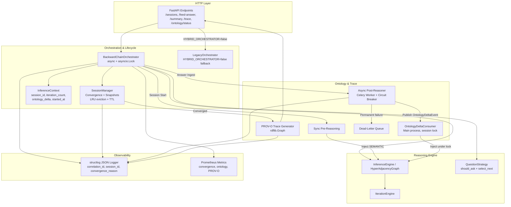
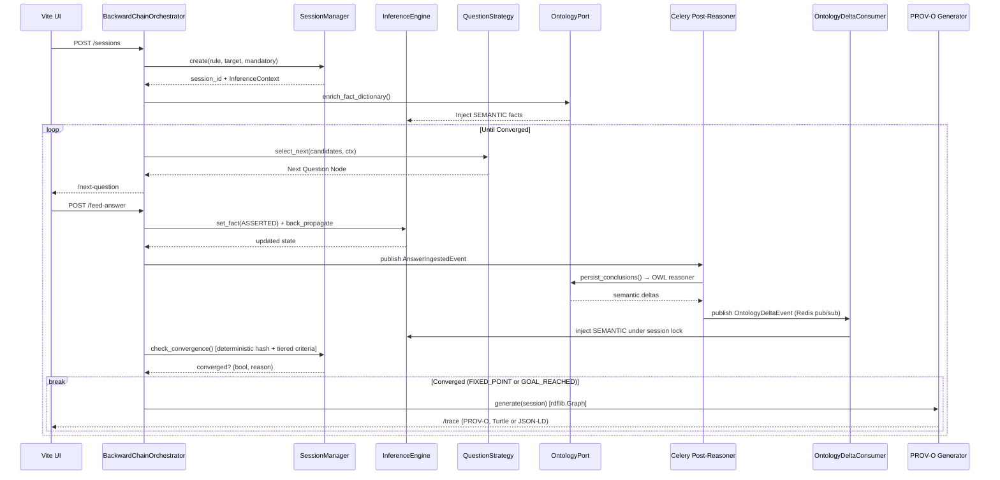

# INFERRA Phase 3 Implementation Plan
## Hybrid Reasoning & Orchestrator
**Document Status:** Sprint-Ready v4.0 (Enhanced per cross-phase review)  
**Timeline:** Weeks 5–6 (10 Working Days + 2 Buffer Days)  
**Feature Flags:** `HYBRID_ORCHESTRATOR=true`, `ASYNC_POST_REASONING=true`, `PROV_O_TRACE=true`, `ENRICHED_API=true`  
**Feature Flag Policy:** Flags are start-of-session sticky — cannot flip mid-session (consistent with Phase 1/2)  
**Prerequisites:** Phases 1, 2, and the Phase 2.5 DependencyMatrix bridge complete. `HyperAdjacencyGraph`, `IterationEngine`, `LayeredFactStore`, async sync pipeline, Redis/Celery, and baseline APIs stable. `InferenceEngine` hot-path traversal uses `DependencyGraphPort`; `DependencyMatrix` is legacy-load-only via adapter/migration paths. Pre-conditions (§2.1–2.7) resolved. `structlog` + correlation-ID middleware active. Session schema v2 migration tested.

---

## 📖 1. Executive Summary & Objectives

Phase 3 transforms INFERRA from a deterministic backward-chaining engine into a **Hybrid Reasoning Platform** by introducing orchestration layering, lifecycle management, ontology pre/post-reasoning integration, formalized fixed-point convergence, and full PROV-O auditability. It extracts gating logic into a pluggable `QuestionStrategy`, enriches API responses with fact provenance, and establishes deterministic termination guarantees. All changes are zero-downtime, backward-compatible, and strictly port-isolated.

**Graph-first dependency:** Phase 3 must not introduce new `DependencyMatrix` runtime coupling. All orchestrator, convergence, ontology-delta, trace, and question-strategy work depends on `DependencyGraphPort` and graph-native node names.

### 1.1 Core Objectives
- [ ] Wrap `InferenceEngine` in `BackwardChainOrchestrator` + `SessionManager` (async, thread-safe, structlog-instrumented)
- [ ] Define `InferenceContext` dataclass with all attributes referenced by orchestrator, session manager, and trace generator
- [ ] Implement synchronous ontology pre-reasoning at session start
- [ ] Trigger asynchronous post-reasoning after answer ingestion; publish deltas as events (not direct FactStore writes from Celery workers)
- [ ] Formalize tiered fixed-point convergence criteria with deterministic hash, delta tracking, iteration cap, and `GOAL_REACHED` as sufficient condition
- [ ] Generate PROV-O triples using `rdflib.Graph` (not string concatenation) for valid RDF/JSON-LD output
- [ ] Integrate `fact_source` + `origin_module` into `/summary` & `/trace` API responses with full error schemas
- [ ] Extract `QuestionStrategy` with `should_ask()` + `select_next()` methods from `question_resolver.py` for future ontology/LLM gating
- [ ] Add `LegacyOrchestrator` fallback for `HYBRID_ORCHESTRATOR=false`
- [ ] Propagate `structlog` + correlation-ID to all Phase 3 modules with Phase 3–specific mandatory fields and events
- [ ] Migrate session schema from Phase 2 (v2) → Phase 3 (v3) with convergence state + question strategy + PROV-O trace
- [ ] Define `SessionManagerPort` ABCMeta port + contract test suite
- [ ] Extend `/health` endpoint for Phase 3 dependencies (ontology reasoner, active sessions)
- [ ] Capture performance baselines (`benchmarks/baseline_phase3.json`) and validate convergence observability metrics
- [ ] Enforce Phase 2.5 graph-first boundary: no new Phase 3 runtime code depends on `DependencyMatrix`

### 1.2 Success Metrics
| Metric | Target |
|--------|--------|
| Convergence loop termination | ≤10 iterations (default cap), 0 infinite loops |
| Convergence hash determinism | 100% — identical WM always produces identical hash |
| Async post-reasoning latency | <2s background completion, zero blocking on `/feed-answer` |
| PROV-O trace generation | <50ms per session, valid RDF/JSON-LD output (rdflib-validated) |
| API response enrichment | 100% backward-compatible, `<null>` fallback when `ENRICHED_API=false` |
| Test coverage (Phase 3 modules) | ≥92% |
| P95 latency increase vs Phase 2 | <50ms |
| Concurrent `/feed-answer` update safety | 0 cross-process FactStore writes, delta injection under session lock |
| Feature flag mid-session flip | No retroactive state changes for any Phase 3 flag |

---

## 🏗️ 2. Architecture Overview (Phase 3 Scope)

### 2.1 Component Architecture


### 2.2 Hybrid Reasoning Data Flow


---

## 🧩 3. Work Breakdown Structure (WBS) & Daily Schedule

| Day | WS-1: Orchestrator & Convergence | WS-2: Ontology Pre/Post-Reasoning | WS-3: PROV-O Trace & API Enrichment | WS-4: Strategy Extraction & Testing | Validation & CI |
|-----|----------------------------------|-----------------------------------|-------------------------------------|-------------------------------------|-----------------|
| **Mon** | Scaffold `BackwardChainOrchestrator` (async + `asyncio.Lock` + `structlog`), wire ports, add `LegacyOrchestrator` fallback, `HYBRID_ORCHESTRATOR` flag | Implement sync `enrich_fact_dictionary()` at session init, 3s timeout/fallback → `NullOntologyAdapter` | Design PROV-O mapping rules (`InferenceContext` → rdflib triples) | Extract `ConservativeQuestionStrategy`, implement `should_ask()` + `select_next()` | Graph parity unit tests |
| **Tue** | Build `InferenceContext` dataclass, `SessionManager.check_convergence()` with deterministic hash + tiered criteria | Implement `AnswerIngestedEvent` publisher + `OntologyDeltaConsumer` (main process injection under lock) + circuit breaker + DLQ | Implement `ProvOTraceGenerator` using `rdflib.Graph`, JSON-LD/Turtle toggle, round-trip validation | Wire `QuestionStrategy.select_next()` to orchestrator, zero-behaviour-change validation | Iterate JSON validation tests |
| **Wed** | Add iteration cap, `ConvergenceLimitExceeded`, partial trace fallback; `SessionManager` LRU eviction + TTL | Add `ontology_delta_count` tracking to `SessionManager`; delta injection via consumer | Build `/summary` & `/trace` Pydantic response models with provenance fields + error schemas | E2E test: iterate progress → summary → trace | Async task idempotency + DLQ tests |
| **Thu** | Benchmark convergence loop vs legacy inline checks; capture `benchmarks/baseline_phase3.json` | Implement `RDF_RANGE_TO_FACT_TYPE` bridge, type-safe fact injection | Add `fact_source` + `origin_module` to `/next-question` fallback responses | Add `OntologyEnhancedStrategy` interface skeleton | Session schema migration P2→P3; mid-session flip tests |
| **Fri** | Finalize orchestrator state machine, deprecate inline convergence | Load test: 100 concurrent sessions with async post-reasoning | OpenAPI spec v1.3 update, backward-compat validation | Full Phase 3 integration suite, coverage ≥92% | Feature flag matrix (all 4 flags); **buffer + polish** |
| **Buffer Mon** | *Contingency:* If ontology reasoner not available by Wed, WS-2 switches to `NullOntologyAdapter`-based dev. Polish & integration tests. | | | | |
| **Buffer Tue** | Full E2E integration pass. Architecture review sign-off. | | | | |

---

## 🛠️ 4. Technical Deep Dives & Implementation Patterns

### 4.1 `BackwardChainOrchestrator` & Convergence State Machine
Replaces scattered convergence checks with a deterministic loop bounded by iteration caps and delta thresholds. Async with `asyncio.Lock` for thread-safety (consistent with Phase 1/2 convention).

```python
# src/domain/inference/backward_chain_orchestrator.py
import asyncio, structlog
from dataclasses import dataclass, field
from typing import List, Optional

log = structlog.get_logger()

@dataclass
class ConvergenceResult:
    converged: bool
    reason: str  # "FIXED_POINT", "GOAL_REACHED_STABLE", "GOAL_REACHED", "MANDATORY_MISSING", "ITERATION_CAP", "PENDING"
    iteration: int
    working_memory_hash: str
    ontology_delta: int
    session_id: str = ""
    session_duration_ms: float = 0.0
    strategy_used: str = "conservative"
    convergence_trace: List[str] = field(default_factory=list)

class BackwardChainOrchestrator:
    """Async orchestrator with per-session lock for thread-safety.
    
    Concurrency model: sessions are single-threaded by design; asyncio.Lock
    provides a safety net for async frameworks that may interleave coroutines.
    Consistent with Phase 1 IterateLine + Phase 2 IterationEngine convention.
    """
    def __init__(self, engine: InferenceEngine, session_mgr: SessionManager, 
                 ontology: OntologyPort, strategy: QuestionStrategy):
        self.engine = engine
        self.session_mgr = session_mgr
        self.ontology = ontology
        self.strategy = strategy
        self._lock: asyncio.Lock = asyncio.Lock()

    async def run_convergence_loop(self, session_id: str, max_iterations: int = 10) -> ConvergenceResult:
        async with self._lock:
            convergence_trace = []
            for i in range(1, max_iterations + 1):
                res = self.session_mgr.check_convergence(session_id)
                convergence_trace.append(res.reason)
                if res.converged:
                    log.info("convergence_achieved", session_id=session_id, reason=res.reason, iteration=i)
                    return ConvergenceResult(
                        converged=True, reason=res.reason, iteration=i,
                        working_memory_hash=res.working_memory_hash, ontology_delta=res.ontology_delta,
                        session_id=session_id, strategy_used=self.strategy.__class__.__name__,
                        convergence_trace=convergence_trace
                    )
                log.debug("convergence_iteration", session_id=session_id, iteration=i, reason=res.reason)
            
            log.warning("convergence_cap_exceeded", session_id=session_id, max_iterations=max_iterations)
            return ConvergenceResult(
                converged=False, reason="ITERATION_CAP", iteration=max_iterations,
                working_memory_hash=self.session_mgr.get_wm_hash(session_id),
                ontology_delta=self.session_mgr.get_ontology_delta(session_id),
                session_id=session_id, convergence_trace=convergence_trace
            )
```

### 4.2 `SessionManager` & Fixed-Point Evaluator
Maintains convergence state, tracks working memory hashes via **deterministic canonical JSON** (not `str(dict)`), and enforces **tiered** termination criteria. LRU eviction prevents unbounded snapshot growth.

```python
# src/domain/session/session_manager.py
import hashlib, json, time, structlog
from collections import OrderedDict
from typing import Dict, Optional, List

log = structlog.get_logger()

class SessionManager:
    MAX_SNAPSHOTS = 1000
    SNAPSHOT_TTL_SECONDS = 86400  # 24 hours

    def __init__(self):
        self._snapshots: OrderedDict[str, InferenceContext] = OrderedDict()
        self._snapshot_timestamps: Dict[str, float] = {}
        self._prev_wm_hashes: Dict[str, str] = {}

    def create_snapshot(self, session_id: str, ctx: InferenceContext) -> None:
        if len(self._snapshots) >= self.MAX_SNAPSHOTS:
            oldest = next(iter(self._snapshots))
            self.remove_snapshot(oldest)
            log.warning("session_manager_lru_eviction", evicted_session=oldest)
        self._snapshots[session_id] = ctx
        self._snapshots.move_to_end(session_id)
        self._snapshot_timestamps[session_id] = time.time()
        log.info("session_snapshot_created", session_id=session_id)

    def _compute_wm_hash(self, wm: Dict[str, FactValue]) -> str:
        """Deterministic hash: sort keys, use stable FactValue serialisation.
        
        str(dict) is non-deterministic across insertion orders and serialisation boundaries.
        Canonical JSON with sorted keys guarantees identical hashes for identical state.
        """
        canonical = json.dumps(
            {k: wm[k].to_canonical_string() for k in sorted(wm.keys())},
            sort_keys=True
        )
        return hashlib.sha256(canonical.encode()).hexdigest()

    def check_convergence(self, session_id: str, goal: str, mandatory: List[str]) -> ConvergenceResult:
        ctx = self._get_snapshot(session_id)
        if ctx is None:
            return ConvergenceResult(False, "PENDING", 0, "", 0)
        wm = ctx.fact_store.get_unified_view()

        goal_reached = goal in wm and wm[goal].get_value() is not None
        mandatory_met = all(m in wm for m in mandatory)

        current_hash = self._compute_wm_hash(wm)
        state_stable = self._prev_wm_hashes.get(session_id) == current_hash
        ontology_stable = ctx.ontology_delta == 0

        self._prev_wm_hashes[session_id] = current_hash

        # Tiered convergence: strongest guarantee first
        # GOAL_REACHED is sufficient for convergence — SEMANTIC deltas are
        # non-blocking enhancements, not mandatory for session completion.
        if goal_reached and mandatory_met and state_stable and ontology_stable:
            return ConvergenceResult(True, "FIXED_POINT", ctx.iteration_count, current_hash, 0)
        if goal_reached and mandatory_met and state_stable:
            return ConvergenceResult(True, "GOAL_REACHED_STABLE", ctx.iteration_count, current_hash, ctx.ontology_delta)
        if goal_reached and mandatory_met:
            return ConvergenceResult(True, "GOAL_REACHED", ctx.iteration_count, current_hash, ctx.ontology_delta)
        return ConvergenceResult(False, "PENDING", ctx.iteration_count, current_hash, ctx.ontology_delta)

    def _get_snapshot(self, session_id: str) -> Optional[InferenceContext]:
        if session_id not in self._snapshots:
            return None
        if time.time() - self._snapshot_timestamps.get(session_id, 0) > self.SNAPSHOT_TTL_SECONDS:
            self.remove_snapshot(session_id)
            return None
        self._snapshots.move_to_end(session_id)
        return self._snapshots[session_id]

    def remove_snapshot(self, session_id: str) -> None:
        self._snapshots.pop(session_id, None)
        self._snapshot_timestamps.pop(session_id, None)
        self._prev_wm_hashes.pop(session_id, None)

    def get_wm_hash(self, session_id: str) -> str:
        return self._prev_wm_hashes.get(session_id, "")

    def get_ontology_delta(self, session_id: str) -> int:
        ctx = self._get_snapshot(session_id)
        return ctx.ontology_delta if ctx else 0

    @property
    def snapshot_count(self) -> int:
        return len(self._snapshots)
```

### 4.2b `InferenceContext` Dataclass
Explicitly defines all attributes referenced by `SessionManager`, `BackwardChainOrchestrator`, and `ProvOTraceGenerator`.

```python
# src/domain/session/inference_context.py
from dataclasses import dataclass, field
from typing import Dict, List, Optional
from datetime import datetime
from src.ports.fact_store_port import FactStorePort
from src.domain.state.fact_source import FactSource

@dataclass
class InferenceContext:
    session_id: str
    rule_name: str
    target: str
    mandatory: List[str]
    fact_store: FactStorePort
    started_at: datetime = field(default_factory=datetime.utcnow)
    iteration_count: int = 0
    ontology_delta: int = 0
    question_strategy_name: str = "conservative"
    prov_o_trace: Optional[str] = None
    convergence_trace: List[str] = field(default_factory=list)
    ontology_pre_reasoned: bool = False

    def increment_iteration(self) -> None:
        self.iteration_count += 1

    def set_ontology_delta(self, delta: int) -> None:
        self.ontology_delta = delta
```

### 4.3 Async Post-Reasoning Pipeline (Celery)
Decouples OWL reasoning from the hot answer path. **Does NOT write to FactStore from Celery workers** — publishes `OntologyDeltaEvent` for main process consumption under session lock. Includes dead-letter queue, structlog, and circuit breaker (consistent with Phase 2's async sync pipeline).

```python
# src/tasks/ontology_post_reasoner.py
import json, time, structlog
from celery import shared_task
from circuitbreaker import circuit
from src.ports.ontology_port import OntologyPort

log = structlog.get_logger()

@shared_task(bind=True, max_retries=3, default_retry_delay=30)
def run_post_reasoning(self, session_id: str, rule_name: str, working_memory_snapshot: dict) -> dict:
    log = log.bind(session_id=session_id, rule_name=rule_name, task_id=self.request.id)
    try:
        new_triples = _persist_with_breaker(rule_name, session_id, working_memory_snapshot)
        delta_facts = _run_reasoner_with_timeout(timeout_seconds=10.0)
        # Publish deltas as events — main process consumes and injects under lock
        publish_ontology_delta_event(session_id, delta_facts)
        log.info("post_reasoning_success", delta_count=len(delta_facts))
        return {"session_id": session_id, "injected": len(delta_facts)}
    except OntologyTimeoutError as exc:
        log.warning("post_reasoning_timeout", error=str(exc), retry=self.request.retries)
        self.retry(exc=exc)
    except Exception as exc:
        log.error("post_reasoning_failed_permanently", error=str(exc))
        publish_dead_letter_event(session_id, rule_name, str(working_memory_snapshot)[:200], str(exc))
        raise

@circuit(failure_threshold=3, recovery_timeout=30)
def _persist_with_breaker(rule_name, session_id, snapshot):
    return OntologyPort.persist_conclusions(rule_name, session_id, snapshot)

def _run_reasoner_with_timeout(timeout_seconds: float = 10.0):
    import signal
    def handler(signum, frame): raise OntologyTimeoutError("Ontology reasoner timed out")
    old = signal.signal(signal.SIGALRM, handler)
    signal.alarm(int(timeout_seconds))
    try:
        return OntologyPort.run_reasoner()
    finally:
        signal.alarm(0)
        signal.signal(signal.SIGALRM, old)

def publish_ontology_delta_event(session_id: str, delta_facts) -> None:
    import redis
    r = redis.Redis()
    r.rpush(f"inferra:ontology_deltas:{session_id}", json.dumps({
        "session_id": session_id,
        "deltas": [(name, str(val)) for name, val in delta_facts],
        "timestamp": time.time()
    }))

def publish_dead_letter_event(session_id, rule_name, snapshot_preview, error):
    import redis
    r = redis.Redis()
    r.lpush("inferra:dead_letter_queue", json.dumps({
        "session_id": session_id, "rule_name": rule_name,
        "snapshot_preview": snapshot_preview, "error": error,
        "timestamp": time.time()
    }))
```

#### OntologyDeltaConsumer (Main Process)
```python
# src/infrastructure/ontology_delta_consumer.py
import asyncio, json, structlog
from src.domain.state.fact_source import FactSource

log = structlog.get_logger()

class OntologyDeltaConsumer:
    """Consumes ontology delta events from Redis and injects under session lock.
    
    Celery workers produce deltas; main process consumes and injects.
    No cross-process writes to LayeredFactStore — this prevents race conditions
    between /feed-answer handlers and Celery workers.
    """
    def __init__(self, fact_store, lock: asyncio.Lock):
        self._store = fact_store
        self._lock = lock

    async def on_ontology_delta(self, session_id: str, delta_facts):
        async with self._lock:
            for name, val in delta_facts:
                self._store.set_fact(name, val, source=FactSource.SEMANTIC)
            log.info("ontology_delta_injected", session_id=session_id, delta_count=len(delta_facts))

    async def poll_deltas(self, session_id: str):
        import redis
        r = redis.Redis()
        raw = r.lrange(f"inferra:ontology_deltas:{session_id}", 0, -1)
        for item in raw:
            event = json.loads(item)
            delta_facts = [(d[0], FactValue(d[1])) for d in event.get("deltas", [])]
            await self.on_ontology_delta(session_id, delta_facts)
        if raw:
            r.delete(f"inferra:ontology_deltas:{session_id}")
```

### 4.4 PROV-O Trace Generator (rdflib-Based)
Maps session state, fact sources, and dependency chains to W3C PROV-O triples using `rdflib.Graph` for type-safe, valid RDF output. Consistent with Phase 2's `SemanticCache` which also uses rdflib.

```python
# src/domain/trace/prov_o_generator.py
import rdflib, structlog
from rdflib import Namespace, Literal, URIRef
from rdflib.namespace import PROV, RDF, XSD
from src.domain.state.fact_source import FactSource

log = structlog.get_logger()
INF = Namespace("http://inferra.ai/ontology#")

class ProvOTraceGenerator:
    def generate(self, session_id: str, context: InferenceContext) -> rdflib.Graph:
        g = rdflib.Graph()
        g.bind("inf", INF)
        g.bind("prov", PROV)

        session_uri = INF[f"session/{session_id}"]
        g.add((session_uri, RDF.type, PROV.Activity))
        g.add((session_uri, RDF.type, INF.Session))
        g.add((session_uri, PROV.startedAtTime,
               Literal(context.started_at.isoformat(), datatype=XSD.dateTime)))

        if context.fact_store is not None:
            for fact_name, fact_val in context.fact_store.get_unified_view().items():
                fact_uri = INF[f"fact/{session_id}/{rdflib.URIRef(fact_name)}"]
                g.add((fact_uri, RDF.type, PROV.Entity))
                g.add((fact_uri, PROV.wasGeneratedBy, session_uri))
                sources = context.fact_store.get_fact_sources(fact_name)
                source = list(sources)[0] if sources else FactSource.ASSERTED
                g.add((fact_uri, INF.factSource, INF[source.value]))

        log.info("prov_o_trace_generated", session_id=session_id, triple_count=len(g))
        return g

    def to_turtle(self, session_id: str, context: InferenceContext) -> str:
        return self.generate(session_id, context).serialize(format="turtle")

    def to_json_ld(self, session_id: str, context: InferenceContext) -> str:
        return self.generate(session_id, context).serialize(format="json-ld")
```
**Key Patterns:**
- `rdflib.Graph` handles URI escaping, namespace prefix declarations, and output validation
- Round-trip test: `generate()` → `parse()` → assert same triples
- Consistent with Phase 2's `SemanticCache` which also uses rdflib
- `to_turtle()` / `to_json_ld()` convenience methods for API endpoint format toggle

### 4.5 `QuestionStrategy` Pattern Extraction
Decouples gating logic from the engine. The strategy contract uses the project's ABCMeta style and includes both `should_ask()` (boolean gate) and `select_next()` (question selection) matching the actual data flow.

```python
# src/ports/question_strategy_port.py
from abc import ABCMeta, abstractmethod
from typing import Optional, List
from src.domain.nodes.node import Node
from src.domain.fact_values import FactValue
from src.domain.session.inference_context import InferenceContext

class QuestionStrategy(metaclass=ABCMeta):
    """Port contract for question selection and ranking.
    
    Phase 3 establishes two distinct operations:
    1. should_ask() — gating: is this node worth asking about?
    2. select_next() — ranking: which unanswered node should be asked first?
    """
    @abstractmethod
    def should_ask(self, node: Node, working_memory: Dict[str, FactValue]) -> bool: ...

    @abstractmethod
    def select_next(self, candidates: List[Node], context: InferenceContext) -> Optional[Node]: ...

    @abstractmethod
    def rank_candidates(self, candidates: List[Node], context: InferenceContext) -> List[Node]: ...

# src/domain/question/strategies/conservative_strategy.py
import structlog

log = structlog.get_logger()

class ConservativeQuestionStrategy:
    def should_ask(self, node: Node, working_memory: Dict[str, FactValue]) -> bool:
        return node.get_node_name() not in working_memory

    def select_next(self, candidates: List[Node], context: InferenceContext) -> Optional[Node]:
        ranked = self.rank_candidates(candidates, context)
        if ranked:
            log.info("question_selected", node_name=ranked[0].get_node_name(),
                     strategy="conservative", session_id=context.session_id)
        return ranked[0] if ranked else None

    def rank_candidates(self, candidates: List[Node], context: InferenceContext) -> List[Node]:
        wm = context.fact_store.get_unified_view()
        return [c for c in candidates if self.should_ask(c, wm)]
```

### 4.6 Structured Logging (structlog-Based, Phase 3 Fields)

> **Regression Prevention:** Phase 1 established `structlog` with JSON formatter. Phase 2 propagated mandatory
> fields and events. Phase 3 must continue the same pattern — no `print()`, no bare `logging`.

**Mandatory log fields (inherited from Phase 1/2):**
- `session_id`, `node_id`, `fact_source`, `correlation_id`, `rule_name`, `import_depth`, `propagation_depth`, `source_hash`

**Phase 3–specific mandatory fields:**
- `convergence_reason` — current convergence state (FIXED_POINT, GOAL_REACHED, PENDING, etc.)
- `iteration_count` — current iteration in convergence loop
- `ontology_delta` — number of pending semantic deltas

**Mandatory logging events for Phase 3:**
- Convergence: `convergence_achieved`, `convergence_cap_exceeded`, `convergence_iteration` (with `reason`, `iteration`, `wm_hash`, `ontology_delta`)
- Session: `session_snapshot_created`, `session_converged`, `session_expired`
- Ontology: `pre_reasoning_start`, `pre_reasoning_complete`, `post_reasoning_success`, `post_reasoning_timeout`, `post_reasoning_failed_permanently`, `ontology_delta_injected` (with `delta_count`)
- PROV-O: `prov_o_trace_generated` (with `triple_count`, `format`)
- Strategy: `question_selected` (with `node_name`, `strategy_name`)
- SessionManager: `session_manager_lru_eviction`

### 4.7 API Contracts for New Endpoints

#### 4.7.1 GET /api/v1/inference/summary?session_id=&offset=&limit=
```yaml
GET /api/v1/inference/summary?session_id=<id>&offset=<int>&limit=<int>
  Summary: Enriched session summary with fact provenance
  Authentication: Not required (Phase 3)
  Returns:
    200:
      summary: [{ node_text, node_value, fact_source, origin_module? }]
      total_count: int
      offset: int
      limit: int
    404: { error_code: "SESSION_NOT_FOUND", message: "Session '{session_id}' does not exist" }
```

#### 4.7.2 GET /api/v1/inference/trace?session_id=&format=turtle
```yaml
GET /api/v1/inference/trace?session_id=<id>&format=<turtle|json-ld>
  Summary: PROV-O trace for a converged session
  Parameters:
    format: "turtle" | "json-ld" (default: "turtle")
  Returns:
    200:
      session_id: str
      format: str
      trace: str
      triple_count: int
    404: { error_code: "SESSION_NOT_FOUND", message: "..." }
    422: { error_code: "SESSION_NOT_CONVERGED", message: "Trace requires a converged session" }
```

#### 4.7.3 GET /api/v1/inference/next-question?session_id=
```yaml
GET /api/v1/inference/next-question?session_id=<id>
  Summary: Next question with enriched provenance and convergence state
  Returns:
    200:
      questions: [{ text, value_type, origin_module?, fact_source? }]
      has_more: bool
      iterate_progress?: { answered: int, total: int }
      convergence_state?: { converged: bool, reason: str, iteration: int }
    404: { error_code: "SESSION_NOT_FOUND", message: "..." }
```

#### 4.7.4 GET /api/v1/ontology/status?session_id=
```yaml
GET /api/v1/ontology/status?session_id=<id>
  Summary: Check if async post-reasoning has completed for a session
  Returns:
    200:
      session_id: str
      status: "pending" | "completed" | "failed"
      delta_count: int
      completed_at?: str (ISO 8601)
    404: { error_code: "SESSION_NOT_FOUND", message: "..." }
```

#### 4.7.5 GET /api/v1/health (Extended)
```yaml
GET /api/v1/health
  Summary: Extended health-check for Phase 3 dependencies
  Returns:
    200:
      status: "ok"
      redis: "ok"
      celery: "ok"
      fuseki: "ok"
      graph_init: true
      semantic_cache: { triples: 12345, memory_mb: 8.3, hit_rate: 0.92 }
      ontology_reasoner: "ok"
      active_sessions: 42
      version: "3.0.0"
    503:
      status: "degraded"
      ontology_reasoner: "unavailable"
```

### 4.8 Session Schema Migration (Phase 2 → Phase 3)

Phase 2 established `CURRENT_SCHEMA_VERSION = 2`. Phase 3 introduces `ConvergenceResult`, `SessionManager._snapshots`, `question_strategy_name`, `prov_o_trace`, and `convergence_trace`.

```python
# In SessionPersistenceService._migrate_session()
CURRENT_SCHEMA_VERSION = 3

def _migrate_session(self, data: dict, from_version: int) -> dict:
    # Phase 0 → 1 (inherited from Phase 1)
    if from_version < 1:
        working_memory = data.get("working_memory", {})
        data["fact_sources"] = {name: "ASSERTED" for name in working_memory}
        data.setdefault("metadata", {})["fact_source_migration"] = True

    # Phase 1 → 2 (inherited from Phase 2)
    if from_version < 2:
        for node in data.get("nodes", []):
            node.setdefault("origin", {"module": "unknown", "imported": False})
        data.setdefault("iteration_state", {})
        data.setdefault("semantic_cache_loaded", [])

    # Phase 2 → 3
    if from_version < 3:
        data.setdefault("convergence_state", {
            "converged": False, "reason": "PENDING", "iteration": 0
        })
        data.setdefault("question_strategy_name", "conservative")
        data.setdefault("prov_o_trace", None)
        data.setdefault("convergence_trace", [])
        data.setdefault("ontology_pre_reasoned", False)

    data.setdefault("metadata", {})["schema_version"] = CURRENT_SCHEMA_VERSION
    return data
```

- Add integration test: load a Phase 2 session, assert Phase 3 code handles it without error.
- Add backward-compat test: Phase 2 code reading a Phase 3 session gracefully ignores unknown fields.

### 4.9 Feature Flag Matrix & Mid-Session Flip Tests

#### 4.9.1 Feature Flag Definitions
| Flag | Default | Purpose | Start-of-Session Sticky |
|------|---------|---------|------------------------|
| `HYBRID_ORCHESTRATOR` | `true` | Use `BackwardChainOrchestrator` vs `LegacyOrchestrator` | Yes |
| `ASYNC_POST_REASONING` | `true` | Enable async ontology post-reasoning pipeline | Yes |
| `PROV_O_TRACE` | `true` | Enable PROV-O trace generation on convergence | Yes |
| `ENRICHED_API` | `true` | Add `fact_source` + `origin_module` to API responses | Yes |

> **Policy:** Phase 3 feature flags are start-of-session sticky, consistent with Phase 1/2 policy.
> Mid-session flag changes do NOT retroactively swap implementations.

#### 4.9.2 CI Feature Flag Matrix
```yaml
# .github/workflows/phase3-test.yml (feature flag matrix)
strategy:
  matrix:
    hybrid_orchestrator: ["true", "false"]
    async_post_reasoning: ["true", "false"]
    prov_o_trace: ["true", "false"]
    enriched_api: ["true", "false"]
  exclude:
    - hybrid_orchestrator: "false"
      async_post_reasoning: "true"  # Post-reasoning requires orchestrator
```

#### 4.9.3 Mid-Session Flip Tests
```python
# tests/integration/test_feature_flag_stickiness.py
import pytest

class TestPhase3FeatureFlagStickiness:
    @pytest.mark.asyncio
    async def test_hybrid_orchestrator_flip_mid_session(self, client, monkeypatch):
        monkeypatch.setenv("HYBRID_ORCHESTRATOR", "true")
        session = await create_session(client)
        monkeypatch.setenv("HYBRID_ORCHESTRATOR", "false")
        # Session continues with BackwardChainOrchestrator — no retroactive swap
        response = await client.get(f"/api/v1/inference/next-question?session_id={session['session_id']}")
        assert response.status_code == 200

    @pytest.mark.asyncio
    async def test_async_post_reasoning_flip_mid_session(self, client, monkeypatch):
        monkeypatch.setenv("ASYNC_POST_REASONING", "false")
        session = await create_session(client)
        monkeypatch.setenv("ASYNC_POST_REASONING", "true")
        # Celery tasks are not published retroactively
        response = await client.post("/api/v1/inference/feed-answer", json={...})
        assert response.status_code == 200

    @pytest.mark.asyncio
    async def test_prov_o_trace_flip_mid_session(self, client, monkeypatch):
        monkeypatch.setenv("PROV_O_TRACE", "false")
        session = await create_session(client)
        monkeypatch.setenv("PROV_O_TRACE", "true")
        # Trace is not generated retroactively for existing session
        response = await client.get(f"/api/v1/inference/trace?session_id={session['session_id']}")
        assert response.status_code in (200, 422)  # No trace if not converged, but no error

    @pytest.mark.asyncio
    async def test_enriched_api_flip_mid_session(self, client, monkeypatch):
        monkeypatch.setenv("ENRICHED_API", "false")
        session = await create_session(client)
        monkeypatch.setenv("ENRICHED_API", "true")
        response = await client.get(f"/api/v1/inference/summary?session_id={session['session_id']}")
        # API gains enrichment fields on next request, but existing session is unaffected
        assert response.status_code == 200
```

### 4.10 Convergence Observability (Metrics & Tracing)

```python
# src/infrastructure/convergence_metrics.py
from prometheus_client import Counter, Histogram, Gauge

convergence_total = Counter(
    "inferra_convergence_total", "Convergence loop outcomes",
    ["reason"]  # FIXED_POINT | GOAL_REACHED_STABLE | GOAL_REACHED | ITERATION_CAP | PENDING
)
convergence_iterations = Histogram(
    "inferra_convergence_iterations", "Iterations to convergence",
    buckets=[1, 2, 3, 5, 7, 10]
)
convergence_wm_hash_stability = Counter(
    "inferra_convergence_wm_hash_stability", "Working memory hash stability events",
    ["stable_or_changed"]
)
ontology_post_reasoning_delta_count = Histogram(
    "inferra_ontology_post_reasoning_delta_count", "Ontology deltas injected per post-reasoning cycle",
    buckets=[0, 1, 3, 5, 10, 25, 50]
)
prov_o_triple_count = Histogram(
    "inferra_prov_o_triple_count", "PROV-O trace triple counts per session"
)
active_sessions = Gauge(
    "inferra_active_sessions", "Active inference sessions in SessionManager"
)
```

Correlate with Phase 1's correlation-ID via `structlog.contextvars`.

### 4.11 Performance Baselines & Benchmark Strategy

```python
# benchmarks/baseline_phase3.json
{
  "phase": 3,
  "captured_at": "2026-04-29T00:00:00Z",
  "scenarios": {
    "convergence_loop_no_deltas": {
      "description": "Single-session convergence with 0 ontology deltas",
      "p50_ms": 10,
      "p95_ms": 25,
      "iterations_median": 2
    },
    "convergence_loop_with_deltas": {
      "description": "Single-session convergence with 5 ontology deltas",
      "p50_ms": 50,
      "p95_ms": 100,
      "iterations_median": 3
    },
    "async_post_reasoning_100_sessions": {
      "description": "100 concurrent sessions with async post-reasoning",
      "p50_ms": 500,
      "p95_ms": 2000,
      "task_completion_rate_pct": 99
    },
    "prov_o_generation": {
      "description": "50 sessions with varying conclusion counts",
      "p50_ms": 10,
      "p95_ms": 50,
      "avg_triple_count": 45
    },
    "full_hybrid_flow": {
      "description": "init → pre-reason → ask → answer → post-reason → converge → trace",
      "p50_ms": 300,
      "p95_ms": 500,
      "p99_ms": 1000
    }
  },
  "regression_threshold_pct": 10
}
```

- Run Phase 2 system through Phase 3 benchmarks before changes; store in `benchmarks/baseline_phase3.json`
- Fail CI if any benchmark regresses >10% from baseline
- Validate P95 latency increase < 50ms vs Phase 2 baseline

### 4.12 Legacy Orchestrator Fallback & Factory

```python
# src/infrastructure/orchestrator_factory.py
import os, structlog

log = structlog.get_logger()

def create_orchestrator(engine, session_mgr, ontology, strategy):
    if os.getenv("HYBRID_ORCHESTRATOR", "true").lower() == "true":
        log.info("orchestrator_created", implementation="BackwardChainOrchestrator")
        return BackwardChainOrchestrator(engine, session_mgr, ontology, strategy)
    log.info("orchestrator_created", implementation="LegacyOrchestrator")
    return LegacyOrchestrator(engine)

# src/domain/inference/legacy_orchestrator.py
import structlog

log = structlog.get_logger()

class LegacyOrchestrator:
    """Fallback orchestrator for HYBRID_ORCHESTRATOR=false.
    Delegates to Phase 2 InferenceEngine directly — provides backward-compatible
    convergence checks without SessionManager or fixed-point detection."""
    def __init__(self, engine: InferenceEngine):
        self.engine = engine

    async def run_convergence_loop(self, session_id: str, max_iterations: int = 10) -> ConvergenceResult:
        ctx = self.engine.get_context(session_id)
        if ctx.goal_reached and ctx.mandatory_met:
            return ConvergenceResult(True, "GOAL_REACHED", 0, "", 0)
        return ConvergenceResult(False, "PENDING", 0, "", 0)
```

### 4.13 `SessionManagerPort` ABCMeta Port & Contract Tests

```python
# src/ports/session_manager_port.py
from abc import ABCMeta, abstractmethod
from typing import Optional, List

class SessionManagerPort(metaclass=ABCMeta):
    """Port contract for session lifecycle and convergence management."""

    @abstractmethod
    def check_convergence(self, session_id: str, goal: str, mandatory: List[str]) -> ConvergenceResult: ...

    @abstractmethod
    def create_snapshot(self, session_id: str, ctx: InferenceContext) -> None: ...

    @abstractmethod
    def get_wm_hash(self, session_id: str) -> str: ...

    @abstractmethod
    def get_ontology_delta(self, session_id: str) -> int: ...

    @abstractmethod
    def remove_snapshot(self, session_id: str) -> None: ...
```

```python
# tests/contracts/test_session_manager_port.py
import pytest
from src.domain.session.session_manager import SessionManager

@pytest.mark.parametrize("mgr_impl", [SessionManager])
class TestSessionManagerPortContract:
    def test_create_snapshot_then_check_convergence(self, mgr_impl): ...
    def test_create_snapshot_idempotent(self, mgr_impl): ...
    def test_check_convergence_on_nonexistent_raises(self, mgr_impl): ...
    def test_remove_snapshot_cleans_up(self, mgr_impl): ...
    def test_deterministic_hash_for_identical_wm(self, mgr_impl): ...
```

### 4.14 Health-Check Extensions for Phase 3 Dependencies

```python
# Extended health check additions for Phase 3
def _check_ontology_reasoner() -> str:
    try:
        from src.ports.ontology_port import OntologyPort
        OntologyPort.health_check()
        return "ok"
    except Exception:
        log.warning("ontology_reasoner_health_check_failed")
        return "unavailable"

def _get_active_session_count() -> int:
    from src.domain.session.session_manager import get_session_manager
    return get_session_manager().snapshot_count
```

---

## 🧪 5. Testing Strategy & Quality Gates

| Test Type | Scope | Tools | Pass Criteria |
|-----------|-------|-------|---------------|
| **Unit** | `ConvergenceResult`, `SessionManager.check_convergence()`, `InferenceContext`, `ProvOTraceGenerator`, `ConservativeQuestionStrategy`, deterministic hash, tiered convergence, LRU eviction | `pytest`, `unittest.mock` | ≥92% branch coverage |
| **Integration** | Async Celery post-reasoning → delta event → main process injection, PROV-O rdflib round-trip, ontology adapter fallback | `pytest-asyncio`, `testcontainers` | Idempotent retries, valid RDF output, zero cross-process FactStore writes |
| **Property-Based** | Convergence determinism, hash stability across sessions, tiered convergence invariants | `hypothesis` | 0 counterexamples across 50k synthetic sessions |
| **Contract** | `SessionManagerPort` contract suite — any implementation must pass | `pytest`, `@pytest.mark.parametrize` | 100% contract compliance |
| **Feature Flag** | Mid-session flip for ALL Phase 3 flags, start-of-session stickiness, `LegacyOrchestrator` fallback | `pytest`, feature flag fixture | No retroactive state changes on flip |
| **Performance** | Convergence loop, PROV-O generation, async post-reasoning, regression from Phase 2 baseline | `pytest-benchmark`, `tracemalloc` | P95 < +50ms vs Phase 2, no >10% regression from baseline |
| **Migration** | Load Phase 2 session in Phase 3 code, verify convergence_state + question_strategy + prov_o_trace | `pytest` | Zero errors on migrated sessions |
| **Graph Boundary** | Phase 3 orchestrator/session/trace/question-strategy code uses `DependencyGraphPort`, not `DependencyMatrix` | `rg`, import-linter, tests | No new runtime matrix coupling |
| **E2E** | Full hybrid loop: init → pre-reason → ask → answer → post-reason → converge → trace → enriched summary | FastAPI `TestClient`, mock Fuseki | PROV-O valid, `/summary` enriched, convergence achieved on GOAL_REACHED |

**CI/CD Additions:**
- Pre-commit: `ruff check`, `mypy src --strict`, `black .`
- `import-linter` enforces `src.domain` → `src.ports` only
- Feature flag matrix: all 16 combinations (`HYBRID_ORCHESTRATOR`, `ASYNC_POST_REASONING`, `PROV_O_TRACE`, `ENRICHED_API`)
- Pipeline fails on `pytest --cov=src/domain/inference --cov=src/domain/session --cov-fail-under=92`
- Performance baseline: `benchmarks/baseline_phase3.json`; fail CI if >10% regression
- Feature flag flip tests for ALL Phase 3 flags
- Session schema migration test: load Phase 2 session, assert Phase 3 handles without error

---

## ⚠️ 6. Risk Management & Mitigations

| Risk | Likelihood | Impact | Mitigation |
|------|------------|--------|------------|
| **Convergence loop divergence** | Low | Critical | Hard iteration cap (10), `ConvergenceLimitExceeded` with partial trace; tiered convergence — `GOAL_REACHED` is sufficient (async deltas non-blocking) |
| **Non-deterministic WM hash** | Medium | Critical | Canonical JSON with sorted keys + `FactValue.to_canonical_string()`; unit test for insertion-order independence |
| **Async post-reasoning race condition** | Medium | High | Celery workers publish `OntologyDeltaEvent`; main process consumes and injects under session lock; NO direct FactStore writes from workers |
| **False ITERATION_CAP from async pipeline** | High | High | Tiered convergence: `GOAL_REACHED` is sufficient without `ontology_stable`; SEMANTIC deltas are non-blocking enhancements |
| **PROV-O generation invalid RDF** | Medium | Medium | Use `rdflib.Graph` instead of string concatenation; round-trip validation test; consistent with Phase 2 SemanticCache |
| **Strategy routing bug** | Low | High | `ConservativeQuestionStrategy` unit-tested against legacy baseline; `select_next()` replaces scattered `should_ask()` iteration |
| **Memory leak in session snapshots** | Medium | Medium | LRU eviction (`MAX_SNAPSHOTS=1000`), TTL (`SNAPSHOT_TTL_SECONDS=86400`), `remove_snapshot()` on session close |
| **Ontology adapter timeout** | Medium | Low | 3s timeout → `NullOntologyAdapter` fallback; circuit breaker (`failure_threshold=3, recovery_timeout=30`); logged `WARNING` |
| **Async pipeline failures silently lost** | Medium | High | Dead-letter queue captures permanent failures; `structlog` error events with correlation-ID; circuit breaker prevents overwhelming unavailable reasoner; `/ontology/status` endpoint for visibility |
| **Feature flag mid-session flip** | Low | Medium | Start-of-session sticky policy; mid-session flip test suite validates no retroactive swaps |
| **Cross-process FactStore corruption** | Low | Critical | Celery workers never write to FactStore directly; publish events for main process consumption under lock |
| **InferenceContext undefined attributes** | Low | Critical | Explicit dataclass definition with all attributes; unit tests for lifecycle |

---

## ✅ 7. Acceptance Criteria & Sign-Off Checklist

### Orchestrator & Convergence
- [ ] `BackwardChainOrchestrator` wraps `InferenceEngine` with zero behavioural regression; async with `asyncio.Lock`
- [ ] `InferenceContext` dataclass defined with all attributes referenced by orchestrator, session manager, and trace generator
- [ ] `SessionManager.check_convergence()` uses deterministic canonical JSON hash (not `str(dict)`)
- [ ] `SessionManager.check_convergence()` correctly evaluates tiered criteria (FIXED_POINT > GOAL_REACHED_STABLE > GOAL_REACHED)
- [ ] `SessionManager` has LRU eviction (`MAX_SNAPSHOTS=1000`) + TTL (`SNAPSHOT_TTL_SECONDS=86400`) + `remove_snapshot()`
- [ ] Iteration cap enforced; `ConvergenceLimitExceeded` raised with partial trace
- [ ] Convergence loop terminates deterministically for all rule sets; `GOAL_REACHED` is sufficient condition
- [ ] `LegacyOrchestrator` fallback works for `HYBRID_ORCHESTRATOR=false`

### Ontology Pre/Post-Reasoning
- [ ] Pre-reasoning populates `FactSource.SEMANTIC` layer synchronously at session start
- [ ] Async post-reasoning publishes `OntologyDeltaEvent`; main process injects under session lock (NO direct FactStore writes from Celery workers)
- [ ] Dead-letter queue captures permanent failures; `structlog` error events emitted with correlation-ID
- [ ] Circuit breaker on ontology writes (`failure_threshold=3, recovery_timeout=30`)
- [ ] `/ontology/status` endpoint available for client visibility

### PROV-O & API Enrichment
- [ ] `ProvOTraceGenerator` outputs valid RDF/JSON-LD via `rdflib.Graph` (not string concatenation)
- [ ] `/summary` and `/trace` APIs return `fact_source` and `origin_module` fields (backward-compatible, `<null>` when `ENRICHED_API=false`)
- [ ] `/trace` supports `format=turtle|json-ld` parameter
- [ ] `/next-question` returns `convergence_state` field
- [ ] `QuestionStrategy` ABCMeta contract implemented with `should_ask()` + `select_next()`; `ConservativeQuestionStrategy` replicates legacy logic

### CI/CD & Hardening
- [ ] All Phase 3 features controlled by feature flags (`HYBRID_ORCHESTRATOR`, `ASYNC_POST_REASONING`, `PROV_O_TRACE`, `ENRICHED_API`)
- [ ] Test coverage ≥92%; property-based tests pass; performance benchmarks met
- [ ] P95 latency increase < 50ms vs Phase 2 baseline; `benchmarks/baseline_phase3.json` captured
- [ ] Phase 2.5 graph-first boundary is preserved: no new Phase 3 runtime imports of `DependencyMatrix`
- [ ] Zero `import-linter` violations; CI boundary checks pass
- [ ] Feature flag matrix covers all 16 combinations; mid-session flip tests pass
- [ ] Session schema migration v2→v3 tested; backward-compat verified
- [ ] Architecture review sign-off from Core, Data, QA, and Security leads

---

## 🔄 8. Handoff to Phase 4

Upon Phase 3 completion, the system will be primed for:
- Multi-worker Redis session store & horizontal scaling
- Vite frontend integration (dynamic forms, iterate progress, trace visualizer)
- LLM orchestration (NL→goal mapping, question enhancement, RDF-grounded explanations)
- Production hardening (Docker Compose, load/chaos testing)
- Legacy adapter removal & strict port-only import enforcement

**Deliverables for Phase 4 Kickoff:**
1. Stable `BackwardChainOrchestrator` (async, locked, structlog-instrumented) with deterministic convergence loop + `LegacyOrchestrator` fallback
2. `InferenceContext` dataclass with all Phase 3 attributes
3. `SessionManager` with deterministic hash, tiered convergence, LRU+TTL eviction, snapshot lifecycle & delta tracking
4. Async ontology post-reasoning pipeline with DLQ, circuit breaker, event-based delta injection, and `/ontology/status` endpoint
5. Validated `rdflib`-based PROV-O trace generator with Turtle/JSON-LD support + enriched API contracts with error schemas
6. `QuestionStrategy` ABCMeta contract with `should_ask()` + `select_next()` + `ConservativeQuestionStrategy`
7. `SessionManagerPort` ABCMeta port + contract test suite
8. Comprehensive test suite + performance baselines + CI feature-flag matrix with mid-session flip tests
9. Session schema migration v2→v3 with backward-compat test
10. Sprint buffer days utilized for integration + architecture review sign-off

---

## 📋 Appendix A: Enhancement Changelog (v1.0 → v4.0)

| # | Enhancement | Severity | Effort | Section(s) Updated |
|---|-------------|----------|--------|-------------------|
| 1 | Deterministic WM hash (canonical JSON, not str(dict)) | Critical | Low | §4.2, §6, §7 |
| 2 | Async post-reasoning: no cross-process FactStore writes | Critical | Medium | §4.3, §6, §7 |
| 3 | InferenceContext dataclass definition | Critical | Low | §4.2b, §6, §7 |
| 4 | ProvOTraceGenerator: rdflib.Graph instead of string concat | Critical | Medium | §4.4, §6, §7 |
| 5 | BackwardChainOrchestrator async + asyncio.Lock | Critical | Low | §4.1, §6, §7 |
| 6 | Tiered convergence (GOAL_REACHED sufficient, not requiring ontology_stable) | Critical | Low | §4.2, §6, §7 |
| 7 | Async pipeline DLQ + structlog + circuit breaker | Critical | Medium | §4.3, §6, §7 |
| 8 | QuestionStrategy: select_next() method added | Critical | Low | §4.5, §2.2, §7 |
| 9 | Structured logging propagation (structlog) | Important | Low | §4.6 |
| 10 | API contracts for new endpoints + error schemas | Important | Medium | §4.7 |
| 11 | Session schema migration Phase 2 → Phase 3 | Important | Medium | §4.8 |
| 12 | Feature flag matrix + mid-session flip tests | Important | Low | §4.9 |
| 13 | Convergence observability (Prometheus metrics) | Important | Medium | §4.10 |
| 14 | Performance baselines (benchmarks/baseline_phase3.json) | Important | Low | §4.11 |
| 15 | SessionManager LRU eviction + TTL | Important | Low | §4.2 |
| 16 | LegacyOrchestrator fallback + factory | Important | Low | §4.12 |
| 17 | SessionManagerPort ABCMeta port + contract tests | Nice-to-have | Medium | §4.13 |
| 18 | Health-check extensions for Phase 3 deps | Nice-to-have | Low | §4.7.5, §4.14 |
| 19 | ConvergenceResult debugging metadata | Nice-to-have | Low | §4.1 |
| 20 | Sprint buffer days + WS staggering | Nice-to-have | N/A | §3 |

---
*Document generated for INFERRA Phase 3 sprint execution. Aligns with port-based modularization, layered working memory, async ontology pipeline, and PROV-O auditability. Incorporates all 20 enhancement recommendations from the Phase 3 review. Ready for task allocation, daily stand-ups, and CI/CD pipeline configuration.*
