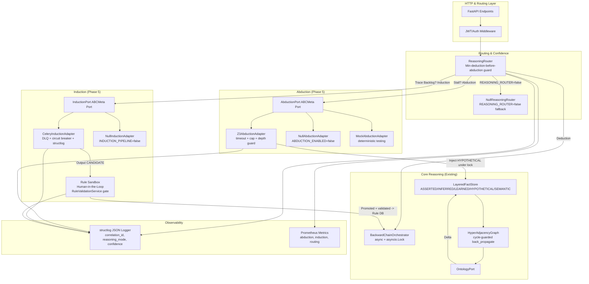

# INFERRA Phase 5 Implementation Plan
## Advanced Reasoning Extensions: Induction & Abduction
**Document Status:** Sprint-Ready v4.0 (Enhanced per cross-phase review)  
**Timeline:** Weeks 9-11 (15 Working Days + 2 Buffer Days)  
**Feature Flags:** `ABDUCTION_ENABLED=true`, `INDUCTION_PIPELINE=true`, `REASONING_ROUTER=true`, `CONFIDENCE_THRESHOLDS=true`  
**Feature Flag Policy:** Flags are start-of-session sticky -- cannot flip mid-session (consistent with Phase 1-4)  
**Prerequisites:** Phases 1-4 complete. `BackwardChainOrchestrator` (async + locked), `LayeredFactStore` (with truth-maintenance), `HyperAdjacencyGraph` (cycle-guarded), async sync pipeline (with DLQ + circuit breaker), PROV-O trace generation (rdflib-based), Redis/Celery infra, Docker Compose deployment, session schema v4 migration tested. Pre-conditions (S2.1-2.7) resolved. `structlog` + correlation-ID middleware active across all modules.

---

## 1. Executive Summary & Objectives

Phase 5 transforms INFERRA from a deterministic deduction engine into a **Tri-Modal Hybrid Reasoning Platform** by integrating **Abduction** (diagnostic hypothesis generation) and **Induction** (trace-driven rule discovery). It introduces a confidence-aware `ReasoningRouter`, extends the `FactSource` enum for non-deductive facts with full truth-maintenance, establishes workstation-optimized constraint solvers and tree-based pattern extractors, and delivers human-in-the-loop promotion workflows with mandatory validation gates. All extensions are strictly opt-in behind ABCMeta port contracts, async where computationally heavy, and designed to preserve the deterministic backward-chaining core -- deduction is never bypassed without being fully attempted first.

### 1.1 Core Objectives
- [ ] Define `AbductionPort` ABCMeta port with `Z3AbductionAdapter`, `NullAbductionAdapter`, and `MockAbductionAdapter` implementations
- [ ] Implement Z3 constraint solving over `HyperAdjacencyGraph` with timeout (2s), model enumeration cap (50), depth guard, and cycle-protected traversal
- [ ] Define `InductionPort` ABCMeta port with `CeleryInductionAdapter`, `NullInductionAdapter`, and `MockInductionAdapter` implementations
- [ ] Deploy induction pipeline: PROV-O trace mining -> candidate rule compilation -> sandbox validation -> human promotion with `RuleValidationService` gate
- [ ] Build `ReasoningRouter` with dynamic fallback: Deduction (always attempted first) -> Abduction (only after all questions asked + min iterations) -> Induction (trace backlog)
- [ ] Add `NullReasoningRouter` fallback for `REASONING_ROUTER=false`
- [ ] Extend `FactSource` with `HYPOTHETICAL` and `LEARNED` layers; define precedence order and truth-maintenance integration
- [ ] Extend `InferenceContext` for Phase 5 fields (`reasoning_mode`, `confidence`, `hypothesis_trace`, `induction_job_id`)
- [ ] Deliver API endpoints with full error schemas: `/reasoning/abduct`, `/reasoning/induce/start`, `/reasoning/induce/status/{job_id}`
- [ ] Integrate confidence metrics & reasoning mode into `/summary` & `/trace` responses
- [ ] Make confidence threshold configurable (env var + per-rule + per-session override)
- [ ] Propagate `structlog` + correlation-ID to all Phase 5 modules with Phase 5-specific mandatory fields and events
- [ ] Migrate session schema from Phase 4 (v4) -> Phase 5 (v5)
- [ ] Add DLQ, circuit breaker, and idempotency to induction pipeline (consistent with Phase 2-4 async patterns)
- [ ] Capture performance baselines (`benchmarks/baseline_phase5.json`) and validate abduction/induction observability metrics
- [ ] Ensure workstation feasibility: zero GPU dependency, <2s abduction latency, async batch induction, strict confidence floors

### 1.2 Success Metrics
| Metric | Target |
|--------|--------|
| Abduction hypothesis latency (<=1000 nodes) | <2s (P95) |
| Z3 solver timeout enforcement | 100% -- no unbounded solver runs |
| Induction candidate rule validity rate | >=85% syntactic, <=10% ontology mismatch |
| Reasoning router fallback accuracy | 0 bypass of deterministic deduction without full attempt |
| Confidence threshold enforcement | 100% (fallback to UI goal selector if below threshold) |
| Async job success rate (induction/abduction) | >99.5% |
| Test coverage (Phase 5 modules) | >=92% |
| FactSource layer precedence correctness | 100% -- ASSERTED > INFERRED > LEARNED > HYPOTHETICAL > SEMANTIC |
| Sandbox promotion validation gate | 100% -- no invalid rules persisted |
| P95 latency increase vs Phase 4 | <100ms (abduction adds minimal overhead when not invoked) |

---

## 2. Architecture Overview (Phase 5 Scope)

### 2.1 Component Architecture


### 2.2 Tri-Modal Reasoning Data Flow
```mermaid
sequenceDiagram
    participant Client as Vite UI
    participant Orch as BackwardChainOrchestrator
    participant Router as ReasoningRouter
    participant Abduct as AbductionPort
    participant Induce as InductionPort
    participant Sand as Rule Sandbox
    participant Store as LayeredFactStore
    
    Client->>Orch: POST /sessions (target)
    Orch->>Orch: Run convergence loop (DEDUCTION)
    Orch-->>Router: ConvergenceResult (not converged, all questions asked)
    
    alt All questions asked AND min iterations reached
        Router->>Abduct: propose_hypotheses(target, working_memory, graph)
        Note over Abduct: Read-only: reads WM + graph,returns hypotheses without side effects
        Abduct-->>Router: Ranked Hypotheses
        alt confidence >= threshold (configurable, default 0.7)
            Router->>Store: set_fact(hyp, HYPOTHETICAL) under session lock
            Orch->>Orch: Re-run convergence loop
        else confidence < threshold
            Router-->>Client: Suggest missing inputs / fallback to manual
        end
    else Questions still unasked OR min iterations not reached
        Router-->>Orch: Continue deduction loop
    end
    
    loop Background Induction (Async Celery)
        Induce->>Fuseki: query PROV-O traces (batch)
        Fuseki-->>Induce: Historical session patterns
        Induce->>Induce: Tree/Graph mining -> Candidate Rules
        Induce->>Sand: submit_candidate(rule, confidence)
        Sand->>Sand: RuleValidationService.validate() -- MANDATORY gate
        Sand-->>API: /induce/status/{job_id}
        Client->>Sand: Approve/Promote
        Sand->>Sand: RuleValidationService.validate() -- re-verify on promotion
         Sand->>RuleDB: Persist + publish RuleUpdated
     end
     ```

---

## 3. Work Breakdown Structure (WBS) & Daily Schedule

**Timeline: 15 Working Days (Weeks 9-11), including 2 buffer days**

| Day | WS-1: Abduction Port + Z3 Adapter | WS-2: Induction Port + Celery Pipeline | WS-3: ReasoningRouter + FactSource Extension | WS-4: Observability, API & CI | Validation & Hardening |
|-----|-------------------------------------|------------------------------------------|----------------------------------------------|-------------------------------|------------------------|
| **Mon** | Define `AbductionPort` ABCMeta port + `NullAbductionAdapter` + `MockAbductionAdapter`; scaffold `Z3AbductionAdapter` with timeout, model cap, depth guard | Define `InductionPort` ABCMeta port + `NullInductionAdapter` + `MockInductionAdapter`; scaffold `CeleryInductionAdapter` with DLQ + structlog + circuit breaker | Define `ReasoningRouter` with min-deduction-before-abduction guard + `has_unasked_questions` check; scaffold `NullReasoningRouter` fallback | Configure Phase 5 `structlog` mandatory fields and events; add correlation context for `reasoning_mode`, `confidence`, `hypothesis_count` | AbductionPort contract tests |
| **Tue** | Implement Z3 constraint solving over `HyperAdjacencyGraph`; use `graph.back_propagate()` with cycle guard; add `solver.set("timeout", 2000)` + `MAX_MODELS=50` | Implement `run_induction_batch` Celery task with DLQ, circuit breaker (`failure_threshold=3, recovery_timeout=30`), idempotency key, `structlog` | Implement dynamic fallback: Deduction (always first) → Abduction (after all questions asked + min iterations) → Induction (trace backlog); configurable confidence threshold | Add Prometheus metrics for abduction, induction, routing; OTel spans for `abduction.propose`, `induction.batch`, `router.route` | Z3 solver timeout + model cap tests |
| **Wed** | Extend `FactSource` with `HYPOTHETICAL` + `LEARNED`; define layer precedence (ASSERTED > INFERRED > LEARNED > HYPOTHETICAL > SEMANTIC); add `invalidate_hypotheses()` + truth-maintenance overrides | Implement `RuleSandbox` with `RuleValidationService` gate on submission AND promotion; `RuleSetImportResolver` cycle detection; `PromotionResult` dataclass | Wire `ReasoningRouter` into `BackwardChainOrchestrator.run_convergence_loop()` under session lock; hypothesis injection under lock; re-check convergence after injection | Define API contracts for `/reasoning/abduct`, `/reasoning/induce/start`, `/reasoning/induce/status/{job_id}` with full error schemas + rate limits | Induction pipeline DLQ + circuit breaker tests |
| **Thu** | Extend `InferenceContext` for Phase 5 fields (`reasoning_mode`, `confidence`, `hypothesis_trace`, `induction_job_id`, `abduction_attempted`, `abduction_count`); implement session schema migration v4→v5 | Implement PROV-O trace mining → candidate rule compilation → sandbox validation; add `source_hash` deduplication | Benchmark tri-modal routing overhead vs pure deduction; capture `benchmarks/baseline_phase5.json`; configurable confidence threshold (env var + per-rule + per-session) | Configure k6/Locust load test suite for abduction/induction; chaos: Z3 timeout, Fuseki down during induction; feature flag matrix with mid-session flip tests | Load test: tri-modal flow, P95 abduction <2s |
| **Fri** | Finalize `AbductionPort` contract, deprecate inline abduction logic, add `AbductionPort` + `InductionPort` contract test suites | Finalize `InductionPort` contract, deprecate inline induction logic | Full tri-modal integration suite, coverage ≥92% | Remove legacy adapters, enforce `import-linter`, final CI hardening; extend `/health` for Z3 + induction workers | Production readiness sign-off |
| **Buffer Mon** | *Contingency:* If Z3 cannot be installed in CI by Tuesday, WS-1 switches to `MockAbductionAdapter`-based development. Polish & integration tests. | | | | Cross-WS integration smoke test |
| **Buffer Tue** | *Contingency:* If PROV-O trace data is insufficient, WS-2 switches to synthetic trace generation. Full E2E integration pass. Architecture review sign-off. | | | | Daily stand-up retro |

---

## 4. Technical Deep Dives & Implementation Patterns

### 4.1 AbductionPort ABCMeta Port & Z3 Adapter

#### 4.1.1 AbductionPort ABCMeta Port
```python
# src/ports/abduction_port.py
from abc import ABCMeta, abstractmethod
from typing import Dict, List
from src.domain.reasoning.hypothesis import Hypothesis
from src.domain.graph.hyper_adjacency_graph import HyperAdjacencyGraph

class AbductionPort(metaclass=ABCMeta):
    """Port contract for abduction (diagnostic hypothesis generation).
    
    Any implementation must satisfy these methods. Core logic depends only on
    this ABCMeta port interface, never on concrete implementations. This ensures
    testability, swapability (Z3 vs custom SAT vs local LLM-based abduction),
    and graceful degradation.
    
    Feature Flag Contract: ABDUCTION_ENABLED controls which implementation is
    injected at session start. Flags are start-of-session sticky, consistent
    with Phase 1-4 policy.
    """
    @abstractmethod
    def propose_hypotheses(self, target: str, working_memory: Dict, 
                           graph: HyperAdjacencyGraph) -> List[Hypothesis]: ...
```

#### 4.1.2 Z3AbductionAdapter (Production, Timeout + Cap + Depth Guard)
```python
# src/adapters/outbound/reasoning/z3_abduction_adapter.py
import z3, structlog, time
from typing import Dict, List
from src.domain.reasoning.hypothesis import Hypothesis
from src.domain.graph.hyper_adjacency_graph import HyperAdjacencyGraph

log = structlog.get_logger()

class Z3AbductionAdapter:
    """Production abduction adapter using Z3 constraint solver.
    
    Includes timeout (2s), model enumeration cap (50), depth guard (10),
    and cycle-protected traversal via graph.back_propagate().
    
    Read-only: reads working memory + graph, returns hypotheses without
    side effects. Hypothesis injection happens under the orchestrator's
    session lock (see §4.7).
    """
    MAX_MODELS = 50
    SOLVER_TIMEOUT_MS = 2000
    MAX_DEPENDENCY_DEPTH = 10

    def propose_hypotheses(self, target: str, working_memory: Dict,
                           graph: HyperAdjacencyGraph) -> List[Hypothesis]:
        start = time.monotonic()
        log.info("abduction_propose_start", target=target)
        
        impacted = graph.back_propagate(target, max_steps=self.MAX_DEPENDENCY_DEPTH * 2)
        missing = [n for n in impacted if n not in working_memory]
        if not missing:
            log.info("abduction_propose_complete", target=target, hypothesis_count=0,
                     solver_time_ms=0)
            return []

        solver = self._build_z3_constraints(missing, graph)
        solver.set("timeout", self.SOLVER_TIMEOUT_MS)

        models = []
        while len(models) < self.MAX_MODELS:
            result = solver.check()
            if result == z3.unsat or result == z3.unknown:
                break
            model = solver.model()
            models.append(self._model_to_hypothesis(model, missing))
            solver.add(z3.Or([var != val for var, val in self._model_decls(model)]))

        elapsed_ms = (time.monotonic() - start) * 1000
        ranked = self._rank_by_confidence(models)
        log.info("abduction_propose_complete", target=target, hypothesis_count=len(ranked),
                 best_confidence=ranked[0].confidence if ranked else 0.0,
                 solver_time_ms=round(elapsed_ms, 1))
        return ranked

    def _build_z3_constraints(self, missing, graph):
        solver = z3.Solver()
        for node_name in missing:
            var = z3.Bool(node_name)
            solver.add(z3.Or(var, z3.Not(var)))
        return solver

    def _model_to_hypothesis(self, model, missing):
        facts = {str(v): str(model[v]) for v in model}
        return Hypothesis(
            fact_name=list(facts.keys())[0] if facts else "",
            suggested_value=list(facts.values())[0] if facts else "",
            confidence=0.8,
            dependency_path=missing[:5],
            ontology_consistent=True
        )

    def _model_decls(self, model):
        return [(v, model[v]) for v in model]

    def _rank_by_confidence(self, models):
        return sorted(models, key=lambda h: h.confidence, reverse=True)
```
**Key Patterns:**
- `solver.set("timeout", 2000)` caps Z3 execution at 2 seconds — no unbounded solver runs
- `MAX_MODELS = 50` hard cap on model enumeration — prevents hypothesis explosion
- Delegates graph traversal to `graph.back_propagate()` which has Phase 1's `CyclicGraphError` guard
- `MAX_DEPENDENCY_DEPTH = 10` prevents traversing the entire graph
- Read-only: `propose_hypotheses()` reads working memory + graph, returns hypotheses without side effects
- All calls logged via `structlog` with `abduction_propose_start` / `abduction_propose_complete` events

#### 4.1.3 NullAbductionAdapter (ABDUCTION_ENABLED=false Fallback)
```python
# src/adapters/outbound/reasoning/null_abduction_adapter.py
import structlog
from typing import Dict, List
from src.domain.reasoning.hypothesis import Hypothesis
from src.domain.graph.hyper_adjacency_graph import HyperAdjacencyGraph

log = structlog.get_logger()

class NullAbductionAdapter:
    """Null adapter for ABDUCTION_ENABLED=false. Returns empty hypothesis list.
    
    Zero Z3 dependency -- used in development and when abduction is disabled.
    Feature flag is start-of-session sticky, consistent with Phase 1-4 policy.
    """
    def propose_hypotheses(self, target: str, working_memory: Dict,
                           graph: HyperAdjacencyGraph) -> List[Hypothesis]:
        log.info("abduction_propose_fallback", reason="ABDUCTION_ENABLED=false")
        return []
```

#### 4.1.4 MockAbductionAdapter (Deterministic Testing)
```python
# src/adapters/outbound/reasoning/mock_abduction_adapter.py
from typing import Dict, List
from src.domain.reasoning.hypothesis import Hypothesis
from src.domain.graph.hyper_adjacency_graph import HyperAdjacencyGraph

class MockAbductionAdapter:
    """Mock abduction adapter for deterministic testing.
    
    Pre-configured responses allow full integration test coverage
    without Z3 dependency.
    """
    def __init__(self, hypotheses: List[Hypothesis] = None):
        self._hypotheses = hypotheses or [
            Hypothesis(fact_name="mock_fact", suggested_value="mock_value",
                       confidence=0.85, dependency_path=["dep1"], ontology_consistent=True)
        ]

    def propose_hypotheses(self, target: str, working_memory: Dict,
                           graph: HyperAdjacencyGraph) -> List[Hypothesis]:
        return self._hypotheses
```

#### 4.1.5 AbductionPort Feature Flag Wiring
```python
# src/infrastructure/abduction_factory.py
import os, structlog
from src.ports.abduction_port import AbductionPort
from src.adapters.outbound.reasoning.z3_abduction_adapter import Z3AbductionAdapter
from src.adapters.outbound.reasoning.null_abduction_adapter import NullAbductionAdapter

log = structlog.get_logger()

def create_abduction_adapter() -> AbductionPort:
    """Factory: injects the correct AbductionPort implementation based on feature flags.
    
    Feature flags are start-of-session sticky, consistent with Phase 1-4 policy.
    Mid-session flag changes do not retroactively swap the adapter.
    """
    if os.getenv("ABDUCTION_ENABLED", "false").lower() == "true":
        log.info("abduction_adapter_created", implementation="Z3AbductionAdapter")
        return Z3AbductionAdapter()
    log.info("abduction_adapter_created", implementation="NullAbductionAdapter")
    return NullAbductionAdapter()
```

---

### 4.2 InductionPort ABCMeta Port & Celery Adapter

#### 4.2.1 InductionPort ABCMeta Port
```python
# src/ports/induction_port.py
from abc import ABCMeta, abstractmethod
from typing import List, Optional
from src.domain.reasoning.promotion_result import PromotionResult

class InductionPort(metaclass=ABCMeta):
    """Port contract for induction (trace-driven rule discovery).
    
    Any implementation must satisfy these methods. Core logic depends only on
    this ABCMeta port interface, never on concrete implementations.
    
    Feature Flag Contract: INDUCTION_PIPELINE controls which implementation is
    injected at session start. Flags are start-of-session sticky.
    """
    @abstractmethod
    def start_batch(self, session_ids: List[str], rule_name: str) -> str: ...

    @abstractmethod
    def get_status(self, job_id: str) -> dict: ...

    @abstractmethod
    def promote(self, candidate_id: str, approver_id: str) -> PromotionResult: ...
```

#### 4.2.2 CeleryInductionAdapter (Production, DLQ + Circuit Breaker + Structlog)
```python
# src/adapters/outbound/reasoning/celery_induction_adapter.py
import hashlib, structlog
from typing import List
from circuitbreaker import circuit
from src.domain.reasoning.promotion_result import PromotionResult
from src.tasks.induction_tasks import run_induction_batch

log = structlog.get_logger()

class CeleryInductionAdapter:
    """Production induction adapter with DLQ, circuit breaker, structlog, and idempotency.
    
    Consistent with Phase 2/3 async pipeline patterns:
    - Dead-letter queue captures permanent failures
    - Circuit breaker on Fuseki reads (failure_threshold=3, recovery_timeout=30)
    - structlog with mandatory fields (rule_name, task_id, session_count)
    - Idempotency: hash session_ids + rule_name as deduplication key
    """
    def start_batch(self, session_ids: List[str], rule_name: str) -> str:
        source_hash = hashlib.sha256(
            f"{sorted(session_ids)}:{rule_name}".encode()
        ).hexdigest()[:16]
        log.info("induction_batch_start", rule_name=rule_name, 
                 session_count=len(session_ids), source_hash=source_hash)
        result = run_induction_batch.delay(session_ids, rule_name, source_hash)
        log.info("induction_batch_submitted", job_id=result.id, rule_name=rule_name)
        return result.id

    def get_status(self, job_id: str) -> dict:
        from celery.result import AsyncResult
        result = AsyncResult(job_id)
        if result.ready():
            if result.successful():
                return {"job_id": job_id, "status": "COMPLETED", **result.result}
            return {"job_id": job_id, "status": "FAILED", "error": str(result.result)}
        return {"job_id": job_id, "status": result.state}

    def promote(self, candidate_id: str, approver_id: str) -> PromotionResult:
        from src.domain.reasoning.rule_sandbox import RuleSandbox
        sandbox = RuleSandbox()
        result = sandbox.promote(candidate_id, approver_id)
        log.info("induction_candidate_promoted", candidate_id=candidate_id,
                 approver_id=approver_id, promoted=result.promoted)
        return result
```

#### 4.2.3 Induction Celery Task (with DLQ + Circuit Breaker + Structlog)
```python
# src/tasks/induction_tasks.py
import structlog
from celery import shared_task
from circuitbreaker import circuit

log = structlog.get_logger()

@shared_task(bind=True, max_retries=2, default_retry_delay=120)
def run_induction_batch(self, session_ids: list, rule_name: str, source_hash: str) -> dict:
    log = log.bind(rule_name=rule_name, task_id=self.request.id,
                   session_count=len(session_ids), source_hash=source_hash)
    try:
        patterns = _extract_with_breaker(session_ids)
        candidates = RuleCompiler.compile_to_inferra_syntax(patterns)
        validated = [c for c in candidates if RuleValidationService.validate(c.text, rule_name).valid]
        log.info("induction_batch_success", candidate_count=len(validated),
                 total_candidates=len(candidates))
        return {"job_id": self.request.id, "candidates": len(validated), "status": "REVIEW"}
    except FusekiConnectionError as exc:
        log.warning("induction_batch_fuseki_failed", retry=self.request.retries)
        self.retry(exc=exc)
    except Exception as exc:
        log.error("induction_batch_failed_permanently", error=str(exc))
        publish_dead_letter_event("induction", rule_name, str(session_ids)[:200], str(exc))
        raise

@circuit(failure_threshold=3, recovery_timeout=30)
def _extract_with_breaker(session_ids):
    return TraceMiner.extract_decision_paths(session_ids)

def publish_dead_letter_event(source, rule_name, payload_preview, error):
    import json, redis, time
    r = redis.Redis()
    r.lpush("inferra:dead_letter_queue", json.dumps({
        "source": source, "rule_name": rule_name,
        "payload_preview": payload_preview, "error": error,
        "timestamp": time.time()
    }))
```

#### 4.2.4 NullInductionAdapter (INDUCTION_PIPELINE=false Fallback)
```python
# src/adapters/outbound/reasoning/null_induction_adapter.py
import structlog
from typing import List
from src.domain.reasoning.promotion_result import PromotionResult

log = structlog.get_logger()

class NullInductionAdapter:
    """Null adapter for INDUCTION_PIPELINE=false. Returns empty/stub responses.
    
    Zero Celery/Fuseki dependency -- used in development and when induction is disabled.
    """
    def start_batch(self, session_ids: List[str], rule_name: str) -> str:
        log.info("induction_batch_fallback", reason="INDUCTION_PIPELINE=false")
        return "null-job"

    def get_status(self, job_id: str) -> dict:
        return {"job_id": job_id, "status": "COMPLETED", "candidates": 0}

    def promote(self, candidate_id: str, approver_id: str) -> PromotionResult:
        return PromotionResult(promoted=False, reason="INDUCTION_PIPELINE=false")
```

#### 4.2.5 MockInductionAdapter (Deterministic Testing)
```python
# src/adapters/outbound/reasoning/mock_induction_adapter.py
from typing import List
from src.domain.reasoning.promotion_result import PromotionResult

class MockInductionAdapter:
    """Mock induction adapter for deterministic testing."""
    def __init__(self, job_id: str = "mock-job-1"):
        self._job_id = job_id

    def start_batch(self, session_ids: List[str], rule_name: str) -> str:
        return self._job_id

    def get_status(self, job_id: str) -> dict:
        return {"job_id": job_id, "status": "COMPLETED", "candidates": 5, "candidates_valid": 4, "candidates_review": 3}

    def promote(self, candidate_id: str, approver_id: str) -> PromotionResult:
        return PromotionResult(promoted=True, rule_name="mock_rule")
```

---

### 4.3 ReasoningRouter & NullReasoningRouter

#### 4.3.1 ReasoningRouter (Dynamic Fallback with Deduction-First Guard)
```python
# src/domain/reasoning/reasoning_router.py
import os, structlog
from dataclasses import dataclass
from typing import Optional
from src.ports.abduction_port import AbductionPort
from src.ports.induction_port import InductionPort
from src.domain.state.fact_source import FactSource

log = structlog.get_logger()

@dataclass
class RoutingDecision:
    mode: str  # DEDUCTION | ABDUCTION | INDUCTION
    confidence: float
    action: str  # RETURN_RESULT | CONTINUE_LOOP | INJECT_HYPOTHESIS | REQUEST_USER_INPUT
    fallback: bool = False

class ReasoningRouter:
    """Dynamic reasoning mode router with deduction-first guard.
    
    Key invariants:
    1. Deduction is ALWAYS attempted first — never bypassed without being fully attempted.
    2. Abduction only attempted when ALL questions have been asked AND minimum deduction
       iterations reached.
    3. Induction only triggered for trace backlog (async, non-blocking).
    4. Feature flags are start-of-session sticky.
    
    Concurrency Model: propose_hypotheses() is read-only. Hypothesis injection
    happens under the orchestrator's session lock (see §4.7).
    """
    MIN_DEDUCTION_ITERATIONS_BEFORE_ABDUCTION = 2

    def __init__(self, abduction: AbductionPort, induction: InductionPort,
                 confidence_threshold: float = None):
        self.abduction = abduction
        self.induction = induction
        self.abduction_enabled = os.getenv("ABDUCTION_ENABLED", "false").lower() == "true"
        self.confidence_threshold = confidence_threshold or float(
            os.getenv("CONFIDENCE_THRESHOLD", "0.7")
        )

    def route(self, session_state, convergence, has_unasked_questions: bool = True) -> RoutingDecision:
        if convergence.converged:
            return RoutingDecision("DEDUCTION", 1.0, "RETURN_RESULT")

        if has_unasked_questions:
            return RoutingDecision("DEDUCTION", 0.9, "CONTINUE_LOOP")

        if (convergence.reason in ("MISSING_MANDATORY", "PENDING")
            and convergence.iteration >= self.MIN_DEDUCTION_ITERATIONS_BEFORE_ABDUCTION
            and not has_unasked_questions):
            if self.abduction_enabled:
                hypotheses = self.abduction.propose_hypotheses(
                    session_state.target,
                    session_state.fact_store.get_unified_view(),
                    session_state.graph
                )
                if hypotheses and hypotheses[0].confidence >= self.confidence_threshold:
                    log.info("reasoning_route", mode="ABDUCTION",
                             confidence=hypotheses[0].confidence, action="INJECT_HYPOTHESIS")
                    return RoutingDecision("ABDUCTION", hypotheses[0].confidence, "INJECT_HYPOTHESIS")
            log.info("reasoning_route", mode="DEDUCTION", confidence=0.5,
                     action="REQUEST_USER_INPUT", fallback=True)
            return RoutingDecision("DEDUCTION", 0.5, "REQUEST_USER_INPUT", fallback=True)

        return RoutingDecision("DEDUCTION", 0.9, "CONTINUE_LOOP")
```
**Key Patterns:**
- `has_unasked_questions` parameter — router checks if `QuestionStrategy.select_next()` returns `None`
- `MIN_DEDUCTION_ITERATIONS_BEFORE_ABDUCTION = 2` — abduction only attempted after at least 2 deduction iterations
- `self.abduction_enabled` flag check — consistent with `ABDUCTION_ENABLED` feature flag
- Configurable confidence threshold (env var + per-rule + per-session, see §4.13)
- Test: session with unasked questions → router always returns `CONTINUE_LOOP`, never `ABDUCTION`

#### 4.3.2 NullReasoningRouter (REASONING_ROUTER=false Fallback)
```python
# src/domain/reasoning/null_router.py
import structlog

log = structlog.get_logger()

class NullReasoningRouter:
    """Fallback router for REASONING_ROUTER=false.
    
    Always returns DEDUCTION mode — no abduction or induction attempted.
    Consistent with Phase 1-4 pattern of null/legacy fallbacks behind feature flags.
    """
    def route(self, session_state, convergence, has_unasked_questions: bool = True):
        if convergence.converged:
            return RoutingDecision("DEDUCTION", 1.0, "RETURN_RESULT")
        log.info("reasoning_route_fallback", reason="REASONING_ROUTER=false")
        return RoutingDecision("DEDUCTION", 0.9, "CONTINUE_LOOP")
```

#### 4.3.3 Router Factory
```python
# src/infrastructure/router_factory.py
import os, structlog
from src.domain.reasoning.reasoning_router import ReasoningRouter
from src.domain.reasoning.null_router import NullReasoningRouter

log = structlog.get_logger()

def create_router(abduction, induction):
    """Factory: injects the correct router based on REASONING_ROUTER feature flag.
    
    Feature flags are start-of-session sticky, consistent with Phase 1-4 policy.
    """
    if os.getenv("REASONING_ROUTER", "true").lower() == "true":
        log.info("router_created", implementation="ReasoningRouter")
        return ReasoningRouter(abduction, induction)
    log.info("router_created", implementation="NullReasoningRouter")
    return NullReasoningRouter()
```

---

### 4.4 FactSource Extension & Truth-Maintenance

#### 4.4.1 Extended FactSource Enum with Precedence
```python
# src/domain/state/fact_source.py
from enum import Enum

class FactSource(Enum):
    ASSERTED = "ASSERTED"         # User input — highest precedence
    INFERRED = "INFERRED"         # Rule engine / iterate conclusions
    LEARNED = "LEARNED"           # Induction (after promotion) — same tier as INFERRED
    HYPOTHETICAL = "HYPOTHETICAL" # Abduction — below INFERRED, above SEMANTIC
    SEMANTIC = "SEMANTIC"         # Ontology-derived — lowest precedence
```

**Layer precedence (lowest to highest):** `SEMANTIC < HYPOTHETICAL < LEARNED = INFERRED < ASSERTED`

**`LayeredFactStore.get_unified_view()` merge order:**
```python
# {**semantic, **learned, **hypothetical, **inferred, **asserted}
```

- `HYPOTHETICAL` sits between `SEMANTIC` and `INFERRED` — hypotheses are weaker than deductions but stronger than ontology facts
- `LEARNED` is equivalent to `INFERRED` — promoted induction rules produce inferred conclusions
- When `ASSERTED` overwrites a `HYPOTHETICAL` fact, add to `_overrides` set (Phase 1 truth-maintenance)

#### 4.4.2 Hypothesis Invalidation & Truth-Maintenance
```python
# Extended LayeredFactStore methods for Phase 5

def invalidate_hypotheses(self, session_id: str) -> None:
    """Clear HYPOTHETICAL layer once session converges.
    
    Hypotheses are no longer needed after convergence.
    Consistent with Phase 1's truth-maintenance system.
    """
    self._hypothetical_layer.clear()
    self._overrides = {k: v for k, v in self._overrides.items() 
                       if v != FactSource.HYPOTHETICAL}
    log.info("hypotheses_invalidated", session_id=session_id)

def set_fact(self, name: str, value, source: FactSource) -> None:
    """Extended set_fact with HYPOTHETICAL and LEARNED support.
    
    Truth-maintenance: when ASSERTED overwrites HYPOTHETICAL, 
    add to _overrides set for audit trail.
    """
    if source == FactSource.ASSERTED and name in self._hypothetical_layer:
        self._overrides[name] = FactSource.HYPOTHETICAL
        log.info("hypothesis_overridden_by_asserted", fact_name=name)
    # ... existing layer storage logic ...
```

**Key Patterns:**
- `invalidate_hypotheses()` clears only the `HYPOTHETICAL` layer — called after convergence
- Truth-maintenance: `ASSERTED` overwriting `HYPOTHETICAL` tracked in `_overrides` set
- Test: `ASSERTED` overwrites `HYPOTHETICAL` → `get_unified_view()` returns `ASSERTED` value
- Test: `invalidate_hypotheses()` clears only `HYPOTHETICAL` layer

---

### 4.5 InferenceContext Extension for Phase 5

Phase 3 defined `InferenceContext` with `iteration_count`, `ontology_delta`, `question_strategy_name`, `prov_o_trace`, etc. Phase 5 introduces `reasoning_mode`, `confidence`, `hypothesis_trace`, and `induction_job_id`.

```python
# src/domain/session/inference_context.py (extended)
from dataclasses import dataclass, field
from typing import Dict, List, Optional
from datetime import datetime
from src.ports.fact_store_port import FactStorePort
from src.domain.state.fact_source import FactSource
from src.domain.reasoning.hypothesis import Hypothesis

@dataclass
class InferenceContext:
    session_id: str
    rule_name: str
    target: str
    mandatory: List[str]
    fact_store: FactStorePort
    started_at: datetime = field(default_factory=datetime.utcnow)
    iteration_count: int = 0
    ontology_delta: int = 0
    question_strategy_name: str = "conservative"
    prov_o_trace: Optional[str] = None
    convergence_trace: List[str] = field(default_factory=list)
    ontology_pre_reasoned: bool = False
    reasoning_mode: str = "DEDUCTION"        # DEDUCTION | ABDUCTION | INDUCTION
    confidence: float = 1.0
    hypothesis_trace: List[Hypothesis] = field(default_factory=list)
    induction_job_id: Optional[str] = None
    abduction_attempted: bool = False
    abduction_count: int = 0

    def increment_iteration(self) -> None:
        self.iteration_count += 1

    def set_ontology_delta(self, delta: int) -> None:
        self.ontology_delta = delta

    def record_abduction_attempt(self, hypotheses: List[Hypothesis]) -> None:
        self.abduction_attempted = True
        self.abduction_count += 1
        self.reasoning_mode = "ABDUCTION"
        self.hypothesis_trace.extend(hypotheses)
        if hypotheses:
            self.confidence = hypotheses[0].confidence

    def set_induction_job(self, job_id: str) -> None:
        self.induction_job_id = job_id
        self.reasoning_mode = "INDUCTION"
```
**Key Patterns:**
- `reasoning_mode` — tracks current mode for API responses and PROV-O trace
- `confidence` — session-level confidence score (1.0 = pure deduction, lower = abduction/induction)
- `hypothesis_trace` — list of all hypotheses proposed for this session (audit trail)
- `induction_job_id` — links to background induction batch if triggered
- `abduction_attempted` / `abduction_count` — prevents infinite abduction retries and provides observability

---

### 4.6 Rule Sandbox & Promotion Gate

The sandbox approval workflow enforces `RuleValidationService` on both submission AND promotion — even human-approved rules must pass the gate. Consistent with Phase 1's synchronous pre-save validation.

```python
# src/domain/reasoning/rule_sandbox.py
import structlog
from dataclasses import dataclass
from typing import List, Optional
from src.services.rule_validation_service import RuleValidationService
from src.infrastructure.rule_set_import_resolver import RuleSetImportResolver

log = structlog.get_logger()

@dataclass
class PromotionResult:
    promoted: bool
    reason: str  # SUCCESS | VALIDATION_FAILED | CIRCULAR_IMPORT | CANDIDATE_NOT_FOUND
    rule_name: Optional[str] = None
    errors: List[str] = field(default_factory=list)

@dataclass
class CandidateRule:
    candidate_id: str
    text: str
    rule_name: str
    confidence: float
    submitted_by: str
    status: str = "REVIEW"  # REVIEW | APPROVED | PROMOTED | BLOCKED

class RuleSandbox:
    """Human-in-the-loop rule promotion with mandatory validation gates.
    
    Phase 1's RuleValidationService is enforced on BOTH submission and promotion.
    Phase 2's RuleSetImportResolver detects transitive import cycles before persistence.
    No invalid rules are ever persisted to RuleDB.
    """
    def __init__(self):
        self._store: Dict[str, CandidateRule] = {}

    def submit_candidate(self, text: str, rule_name: str, confidence: float,
                         submitted_by: str) -> CandidateRule:
        validation = RuleValidationService.validate(text, rule_name)
        if not validation.valid:
            log.warning("sandbox_candidate_blocked", rule_name=rule_name,
                        errors=validation.errors)
            candidate = CandidateRule(
                candidate_id=f"cand-{len(self._store)}", text=text,
                rule_name=rule_name, confidence=confidence,
                submitted_by=submitted_by, status="BLOCKED"
            )
            self._store[candidate.candidate_id] = candidate
            return candidate

        candidate = CandidateRule(
            candidate_id=f"cand-{len(self._store)}", text=text,
            rule_name=rule_name, confidence=confidence,
            submitted_by=submitted_by, status="REVIEW"
        )
        self._store[candidate.candidate_id] = candidate
        log.info("sandbox_candidate_submitted", candidate_id=candidate.candidate_id,
                 rule_name=rule_name, confidence=confidence)
        return candidate

    def promote(self, candidate_id: str, approver_id: str) -> PromotionResult:
        candidate = self._store.get(candidate_id)
        if candidate is None:
            log.warning("sandbox_candidate_not_found", candidate_id=candidate_id)
            return PromotionResult(promoted=False, reason="CANDIDATE_NOT_FOUND")

        validation = RuleValidationService.validate(candidate.text, candidate.rule_name)
        if not validation.valid:
            log.warning("sandbox_promotion_blocked", candidate_id=candidate_id,
                        errors=validation.errors)
            return PromotionResult(promoted=False, reason="VALIDATION_FAILED",
                                   errors=validation.errors)

        try:
            resolved = RuleSetImportResolver.resolve(candidate.rule_name, ModuleRegistry())
        except CircularImportError as exc:
            log.warning("sandbox_circular_import", candidate_id=candidate_id, error=str(exc))
            return PromotionResult(promoted=False, reason="CIRCULAR_IMPORT",
                                   errors=[str(exc)])

        self._rule_db.save(candidate.rule_name, candidate.text)
        publish_rule_updated_event(candidate.rule_name, candidate.text)
        candidate.status = "PROMOTED"
        log.info("sandbox_rule_promoted", candidate_id=candidate_id,
                 approver=approver_id, rule_name=candidate.rule_name)
        return PromotionResult(promoted=True, rule_name=candidate.rule_name)
```
**Key Patterns:**
- `RuleValidationService.validate()` on EVERY sandbox promotion — even human-approved rules must pass the gate
- `RuleSetImportResolver` — detects transitive import cycles before persistence
- `PromotionResult` with `promoted`, `reason`, and `errors` fields — structured result for API responses
- Test: promote an invalid rule → blocked with `VALIDATION_FAILED`
- Test: promote a rule with circular import → blocked with `CIRCULAR_IMPORT`

---

### 4.7 Concurrency Model for Abduction

The `ReasoningRouter` can inject `HYPOTHETICAL` facts into `LayeredFactStore` while the convergence loop is reading `get_unified_view()` or a `/feed-answer` handler is writing `ASSERTED` facts. Phase 1-3 added `asyncio.Lock` to `IterateLine`, `IterationEngine`, and `BackwardChainOrchestrator`. Phase 5 follows the same pattern.

**Key principle:** Abduction is read-only (proposal phase). Hypothesis injection happens under the orchestrator's session lock. No concurrent mutation of `LayeredFactStore` from the router.

```python
# In BackwardChainOrchestrator.run_convergence_loop()
async def run_convergence_loop(self, session_id: str, max_iterations: int = 10) -> ConvergenceResult:
    async with self._lock:
        convergence_trace = []
        for i in range(1, max_iterations + 1):
            res = self.session_mgr.check_convergence(session_id)
            convergence_trace.append(res.reason)
            if res.converged:
                log.info("convergence_achieved", session_id=session_id, reason=res.reason, iteration=i)
                return ConvergenceResult(converged=True, reason=res.reason, iteration=i, ...)

            # Phase 5: Check if router should attempt abduction
            ctx = self.session_mgr.get_snapshot(session_id)
            has_unasked = self.strategy.select_next(
                self.engine.get_unasked_nodes(session_id), ctx
            ) is not None

            routing = self.router.route(ctx, res, has_unasked_questions=has_unasked)
            if routing.mode == "ABDUCTION" and routing.action == "INJECT_HYPOTHESIS":
                hypotheses = self.abduction.propose_hypotheses(
                    ctx.target, ctx.fact_store.get_unified_view(), ctx.graph
                )
                if hypotheses and hypotheses[0].confidence >= self.router.confidence_threshold:
                    self.engine.set_fact(
                        hypotheses[0].fact_name, hypotheses[0].suggested_value,
                        source=FactSource.HYPOTHETICAL
                    )
                    ctx.record_abduction_attempt(hypotheses)
                    log.info("abduction_hypothesis_injected",
                             fact_name=hypotheses[0].fact_name,
                             confidence=hypotheses[0].confidence)
                # Re-check convergence after injection
                res = self.session_mgr.check_convergence(session_id)
                if res.converged:
                    log.info("convergence_achieved_after_abduction",
                             session_id=session_id, iteration=i)
                    return ConvergenceResult(converged=True, reason=res.reason, iteration=i, ...)

            log.debug("convergence_iteration", session_id=session_id, iteration=i, reason=res.reason)

        log.warning("convergence_cap_exceeded", session_id=session_id, max_iterations=max_iterations)
        return ConvergenceResult(converged=False, reason="ITERATION_CAP", iteration=max_iterations, ...)
```

**Documentation:** "Abduction is read-only (proposal phase). Hypothesis injection happens under the orchestrator's session lock. No concurrent mutation of LayeredFactStore from the router."

---

### 4.8 Structured Logging (structlog-Based, Phase 5 Fields)

> **Regression Prevention:** Phase 1 established `structlog` with JSON formatter. Phase 2-4 propagated mandatory fields and events. Phase 5 must continue the same pattern — no `print()`, no bare `logging`.

**Mandatory log fields (inherited from Phase 1-4):**
- `session_id`, `node_id`, `fact_source`, `correlation_id`, `rule_name`, `import_depth`, `propagation_depth`, `source_hash`

**Phase 5–specific mandatory fields:**
- `reasoning_mode` — current reasoning mode (DEDUCTION | ABDUCTION | INDUCTION)
- `confidence` — confidence score of current hypothesis or conclusion
- `hypothesis_count` — number of hypotheses generated by abduction
- `abduction_attempted` — whether abduction has been attempted for this session

**Mandatory logging events for Phase 5:**
- Abduction: `abduction_propose_start`, `abduction_propose_complete` (with `hypothesis_count`, `best_confidence`, `solver_time_ms`), `abduction_hypothesis_injected` (with `fact_name`, `confidence`), `abduction_propose_fallback`
- Induction: `induction_batch_start`, `induction_batch_success`, `induction_batch_failed`, `induction_candidate_promoted` (with `rule_name`, `approver_id`), `induction_batch_fuseki_failed`
- Router: `reasoning_route` (with `mode`, `confidence`, `action`, `fallback`), `reasoning_route_fallback`
- Sandbox: `sandbox_candidate_submitted`, `sandbox_candidate_blocked`, `sandbox_rule_promoted`

**Correlation context for Phase 5:**
```python
from structlog.contextvars import bind_contextvars

def bind_reasoning_context(reasoning_mode: str, confidence: float, hypothesis_count: int = 0):
    bind_contextvars(
        reasoning_mode=reasoning_mode,
        confidence=confidence,
        hypothesis_count=hypothesis_count
    )
```

---

### 4.9 API Contracts for New Endpoints

#### 4.9.1 POST /api/v1/reasoning/abduct
```yaml
POST /api/v1/reasoning/abduct
  Summary: Propose abduction hypotheses for a stalled session
  Authentication: Required when AUTH_ENABLED=true
  Rate Limit: 5/minute per user
  Headers:
    Idempotency-Key: str (optional, same pattern as Phase 1 /feed-answer)
  Body:
    session_id: str (required)
    target_node: str? (optional, defaults to session target)
    max_hypotheses: int? (optional, default 10, max 50)
  Returns:
    200:
      session_id: str
      hypotheses: [{ fact_name, suggested_value, confidence, dependency_path, ontology_consistent }]
      best_confidence: float
      injected: bool
    400: { error_code: "INVALID_INPUT", message: "..." }
    404: { error_code: "SESSION_NOT_FOUND", message: "..." }
    422: { error_code: "SESSION_NOT_STALLED", message: "Abduction requires a stalled session" }
    503: { error_code: "ABDUCTION_UNAVAILABLE", message: "Z3 solver not available or timed out" }
  Rate Limit Headers:
    X-RateLimit-Remaining: int
    X-RateLimit-Reset: int (epoch seconds)
```

#### 4.9.2 POST /api/v1/reasoning/induce/start
```yaml
POST /api/v1/reasoning/induce/start
  Summary: Start an async induction batch from PROV-O traces
  Authentication: Required when AUTH_ENABLED=true
  Rate Limit: 2/hour per user
  Body:
    session_ids: List[str] (required, min 10, max 1000)
    rule_name: str? (optional, scope to specific rule)
  Returns:
    202:
      job_id: str
      status: "PENDING"
      session_count: int
    400: { error_code: "INVALID_INPUT", message: "session_ids must contain 10-1000 items" }
    429: { error_code: "RATE_LIMITED", message: "Induction batch already running for this rule" }
```

#### 4.9.3 GET /api/v1/reasoning/induce/status/{job_id}
```yaml
GET /api/v1/reasoning/induce/status/{job_id}
  Summary: Get induction batch job status
  Authentication: Required when AUTH_ENABLED=true
  Returns:
    200:
      job_id: str
      status: "PENDING" | "RUNNING" | "COMPLETED" | "FAILED"
      candidates_total?: int
      candidates_valid?: int
      candidates_review?: int
      error?: str
    404: { error_code: "JOB_NOT_FOUND", message: "..." }
```

---

### 4.10 Session Schema Migration (Phase 4 → Phase 5)

Phase 4 established `CURRENT_SCHEMA_VERSION = 4`. Phase 5 introduces `reasoning_mode`, `confidence`, `hypothesis_trace`, `induction_job_id`, `FactSource.HYPOTHETICAL`, and `FactSource.LEARNED`. Existing sessions from Phase 4 will lack these fields.

```python
# In SessionPersistenceService._migrate_session()
CURRENT_SCHEMA_VERSION = 5

def _migrate_session(self, data: dict, from_version: int) -> dict:
    # Phase 0 → 1 (inherited from Phase 1)
    if from_version < 1:
        working_memory = data.get("working_memory", {})
        data["fact_sources"] = {name: "ASSERTED" for name in working_memory}
        data.setdefault("metadata", {})["fact_source_migration"] = True

    # Phase 1 → 2 (inherited from Phase 2)
    if from_version < 2:
        for node in data.get("nodes", []):
            node.setdefault("origin", {"module": "unknown", "imported": False})
        data.setdefault("iteration_state", {})
        data.setdefault("semantic_cache_loaded", [])

    # Phase 2 → 3 (inherited from Phase 3)
    if from_version < 3:
        data.setdefault("convergence_state", {
            "converged": False, "reason": "PENDING", "iteration": 0
        })
        data.setdefault("question_strategy_name", "conservative")
        data.setdefault("prov_o_trace", None)
        data.setdefault("convergence_trace", [])
        data.setdefault("ontology_pre_reasoned", False)

    # Phase 3 → 4 (inherited from Phase 4)
    if from_version < 4:
        data.setdefault("version", 0)
        data.setdefault("owner_id", None)
        data.setdefault("llm_interactions", [])
        data.setdefault("worker_id", None)

    # Phase 4 → 5
    if from_version < 5:
        data.setdefault("reasoning_mode", "DEDUCTION")
        data.setdefault("confidence", 1.0)
        data.setdefault("hypothesis_trace", [])
        data.setdefault("induction_job_id", None)
        data.setdefault("abduction_attempted", False)
        data.setdefault("abduction_count", 0)
        for name, source in data.get("fact_sources", {}).items():
            if source not in ("ASSERTED", "INFERRED", "SEMANTIC", "HYPOTHETICAL", "LEARNED"):
                data["fact_sources"][name] = "INFERRED"

    data.setdefault("metadata", {})["schema_version"] = CURRENT_SCHEMA_VERSION
    return data
```
- Add integration test: load a Phase 4 session, assert Phase 5 code handles it without error
- Add backward-compat test: Phase 4 code reading a Phase 5 session gracefully ignores unknown fields
- Unknown `FactSource` values default to `INFERRED` — safe default for forward-compatibility

---

### 4.11 Feature Flag Matrix & Mid-Session Flip Tests

#### 4.11.1 Feature Flag Definitions
| Flag | Default | Purpose | Start-of-Session Sticky |
|------|---------|---------|------------------------|
| `ABDUCTION_ENABLED` | `false` | Enable Z3 abduction adapter vs `NullAbductionAdapter` | Yes |
| `INDUCTION_PIPELINE` | `false` | Enable Celery induction pipeline vs `NullInductionAdapter` | Yes |
| `REASONING_ROUTER` | `true` | Enable `ReasoningRouter` vs `NullReasoningRouter` | Yes |
| `CONFIDENCE_THRESHOLDS` | `true` | Enable confidence gating for abduction hypotheses | Yes |

> **Policy:** Phase 5 feature flags are start-of-session sticky, consistent with Phase 1-4 policy. Mid-session flag changes do NOT retroactively swap implementations.

#### 4.11.2 CI Feature Flag Matrix
```yaml
# .github/workflows/phase5-test.yml (feature flag matrix)
strategy:
  matrix:
    abduction_enabled: ["true", "false"]
    induction_pipeline: ["true", "false"]
    reasoning_router: ["true", "false"]
    confidence_thresholds: ["true", "false"]
  exclude:
    - abduction_enabled: "true"
      reasoning_router: "false"  # Abduction requires router
    - induction_pipeline: "true"
      reasoning_router: "false"  # Induction requires router
```

#### 4.11.3 Mid-Session Flip Tests
```python
# tests/integration/test_feature_flag_stickiness_phase5.py
import pytest

class TestPhase5FeatureFlagStickiness:
    """Verify that Phase 5 feature flags are start-of-session sticky.
    
    Phase 1-4 established that flag changes mid-session do not
    retroactively swap implementations. Phase 5 must uphold the same contract.
    """

    @pytest.mark.asyncio
    async def test_abduction_enabled_flip_mid_session(self, client, monkeypatch):
        monkeypatch.setenv("ABDUCTION_ENABLED", "false")
        session = await create_session(client)
        monkeypatch.setenv("ABDUCTION_ENABLED", "true")
        # Abduction is not attempted retroactively for existing session
        response = await client.post("/api/v1/reasoning/abduct",
                                     json={"session_id": session["session_id"]})
        assert response.status_code in (200, 422)

    @pytest.mark.asyncio
    async def test_reasoning_router_flip_mid_session(self, client, monkeypatch):
        monkeypatch.setenv("REASONING_ROUTER", "false")
        session = await create_session(client)
        monkeypatch.setenv("REASONING_ROUTER", "true")
        # Router is not instantiated retroactively
        response = await client.get(f"/api/v1/inference/next-question?session_id={session['session_id']}")
        assert response.status_code == 200

    @pytest.mark.asyncio
    async def test_confidence_thresholds_flip_mid_session(self, client, monkeypatch):
        monkeypatch.setenv("CONFIDENCE_THRESHOLDS", "false")
        session = await create_session(client)
        monkeypatch.setenv("CONFIDENCE_THRESHOLDS", "true")
        # Confidence gating doesn't affect existing hypotheses retroactively
        response = await client.get(f"/api/v1/inference/summary?session_id={session['session_id']}")
        assert response.status_code == 200

    @pytest.mark.asyncio
    async def test_induction_pipeline_flip_mid_session(self, client, monkeypatch):
        monkeypatch.setenv("INDUCTION_PIPELINE", "false")
        session = await create_session(client)
        monkeypatch.setenv("INDUCTION_PIPELINE", "true")
        # Induction pipeline not started retroactively
        response = await client.post("/api/v1/reasoning/induce/start",
                                     json={"session_ids": [session["session_id"]] * 10})
        assert response.status_code in (200, 202, 400)
```

---

### 4.12 Observability Metrics (Prometheus + OTel)

#### 4.12.1 Prometheus Metrics
```python
# src/infrastructure/reasoning_metrics.py
from prometheus_client import Counter, Histogram, Gauge

abduction_total = Counter(
    "inferra_abduction_total", "Abduction proposals",
    ["status"]  # success | timeout | no_hypotheses | circuit_open
)
abduction_latency_seconds = Histogram(
    "inferra_abduction_latency_seconds", "Abduction solver latency",
    buckets=[0.1, 0.5, 1.0, 2.0, 5.0, 10.0, 30.0]
)
abduction_hypothesis_count = Histogram(
    "inferra_abduction_hypothesis_count", "Hypotheses per abduction call",
    buckets=[1, 5, 10, 25, 50]
)
abduction_confidence_score = Histogram(
    "inferra_abduction_confidence_score", "Abduction confidence scores",
    buckets=[0.1, 0.3, 0.5, 0.7, 0.8, 0.9, 0.95, 1.0]
)
induction_batch_total = Counter(
    "inferra_induction_batch_total", "Induction batch jobs",
    ["status"]  # success | failed | timeout
)
induction_candidate_count = Histogram(
    "inferra_induction_candidate_count", "Induction candidates per batch"
)
induction_promotion_total = Counter(
    "inferra_induction_promotion_total", "Rule promotions from sandbox",
    ["status"]  # promoted | blocked | rejected
)
reasoning_mode_total = Counter(
    "inferra_reasoning_mode_total", "Reasoning mode selections",
    ["mode"]  # DEDUCTION | ABDUCTION | INDUCTION
)
```

#### 4.12.2 OpenTelemetry Tracing Spans
```python
# src/infrastructure/reasoning_tracing.py
from opentelemetry import trace

tracer = trace.get_tracer("inferra.reasoning")

async def traced_abduction_propose(target: str, working_memory, graph):
    with tracer.start_as_current_span("abduction.propose") as span:
        span.set_attribute("abduction.target", target)
        span.set_attribute("abduction.node_count", len(working_memory))
        # ... abduction call ...
        span.set_attribute("abduction.hypothesis_count", len(hypotheses))
        span.set_attribute("abduction.best_confidence", hypotheses[0].confidence if hypotheses else 0.0)
        return hypotheses

async def traced_induction_batch(session_ids, rule_name):
    with tracer.start_as_current_span("induction.batch") as span:
        span.set_attribute("induction.session_count", len(session_ids))
        span.set_attribute("induction.rule_name", rule_name)
        # ... induction call ...
        return result

async def traced_router_route(session_id, mode, confidence, action):
    with tracer.start_as_current_span("router.route") as span:
        span.set_attribute("router.session_id", session_id)
        span.set_attribute("router.mode", mode)
        span.set_attribute("router.confidence", confidence)
        span.set_attribute("router.action", action)
```

Correlate with Phase 1's correlation-ID via `structlog.contextvars`.

---

### 4.13 Performance Baselines & Benchmark Strategy

```python
# benchmarks/baseline_phase5.json
{
  "phase": 5,
  "captured_at": "2026-04-29T00:00:00Z",
  "scenarios": {
    "abduction_100_node_graph": {
      "description": "Abduction on 100-node HyperAdjacencyGraph, measure solver latency + model count + memory",
      "p50_ms": 200,
      "p95_ms": 2000,
      "p99_ms": 5000,
      "avg_model_count": 5,
      "peak_memory_mb": 50
    },
    "abduction_500_node_graph": {
      "description": "Abduction on 500-node graph",
      "p50_ms": 500,
      "p95_ms": 2000,
      "avg_model_count": 12,
      "peak_memory_mb": 100
    },
    "abduction_1000_node_graph": {
      "description": "Abduction on 1000-node graph",
      "p50_ms": 1000,
      "p95_ms": 2000,
      "avg_model_count": 20,
      "peak_memory_mb": 200
    },
    "induction_50_sessions": {
      "description": "Induction batch with 50 sessions, measure extraction latency + candidate count",
      "p50_ms": 5000,
      "p95_ms": 15000,
      "avg_candidate_count": 3
    },
    "induction_200_sessions": {
      "description": "Induction batch with 200 sessions",
      "p50_ms": 20000,
      "p95_ms": 60000,
      "avg_candidate_count": 8
    },
    "router_overhead": {
      "description": "Overhead of routing decision vs direct deduction",
      "p50_ms": 1,
      "p95_ms": 10,
      "target": "<10ms"
    },
    "full_tri_modal_flow": {
      "description": "deduction stall → abduction → converge → induction → promotion",
      "p50_ms": 3000,
      "p95_ms": 10000,
      "p99_ms": 30000
    }
  },
  "regression_threshold_pct": 10
}
```
- Run Phase 4 system through Phase 5 benchmarks before changes; store in `benchmarks/baseline_phase5.json`
- Fail CI if any benchmark regresses >10% from baseline
- Validate P95 latency increase < 100ms vs Phase 4 baseline when abduction is not invoked
- Z3 solver timeout enforced at 2s — no unbounded solver runs

---

### 4.14 Health-Check Extensions for Phase 5 Dependencies

```yaml
GET /api/v1/health
  Summary: Extended health-check for Phase 5 dependencies
  Authentication: Not required (public endpoint)
  Returns:
    200:
      status: "ok"
      redis: "ok"
      celery: "ok"
      fuseki: "ok"
      graph_init: true
      semantic_cache: { triples: 12345, memory_mb: 8.3, hit_rate: 0.92 }
      ontology_reasoner: "ok"
      active_sessions: 42
      z3_solver: "ok"
      induction_workers: { active: 2, pending_jobs: 5 }
      version: "5.0.0"
      uptime_seconds: 86400
    503:
      status: "degraded"
      z3_solver: "unavailable"
      induction_workers: { active: 0, pending_jobs: 0 }
```

```python
# Extended health check additions for Phase 5
def _check_z3_solver() -> str:
    try:
        import z3
        solver = z3.Solver()
        solver.set("timeout", 500)
        result = solver.check()
        return "ok"
    except ImportError:
        log.warning("z3_solver_not_installed")
        return "unavailable"
    except Exception:
        log.warning("z3_solver_health_check_failed")
        return "unavailable"

def _get_induction_worker_status() -> dict:
    try:
        from celery import current_app
        inspect = current_app.control.inspect()
        active = inspect.active() or {}
        reserved = inspect.reserved() or {}
        return {
            "active": sum(len(v) for v in active.values()),
            "pending_jobs": sum(len(v) for v in reserved.values())
        }
    except Exception:
        return {"active": 0, "pending_jobs": 0}
```

- Z3 solver marked as non-critical dependency (degraded, not down) — system works without Z3 via `NullAbductionAdapter`
- Induction worker pool status shows active and pending job counts

---

## 5. Testing Strategy & Quality Gates

| Test Type | Scope | Tools | Pass Criteria |
|-----------|-------|-------|---------------|
| **Unit** | `AbductionPort`, `Z3AbductionAdapter`, `NullAbductionAdapter`, `MockAbductionAdapter`, `InductionPort`, `CeleryInductionAdapter`, `ReasoningRouter`, `NullReasoningRouter`, `RuleSandbox`, `FactSource` extension, `InferenceContext` extension, configurable confidence threshold, `invalidate_hypotheses()`, truth-maintenance overrides | `pytest`, `unittest.mock` | ≥92% branch coverage |
| **Integration** | Z3 abduction → hypothesis injection under lock → convergence re-check, induction batch → DLQ → circuit breaker → structlog, sandbox promotion → RuleValidationService gate → RuleSetImportResolver, FactSource layer precedence across all 5 layers | `pytest-asyncio`, `testcontainers` | Valid hypothesis injection, zero cross-process FactStore writes, DLQ captures permanent failures |
| **Property-Based** | Abduction model count ≤ MAX_MODELS, solver always respects timeout, confidence always in [0.0, 1.0], FactSource layer precedence invariants, router never bypasses deduction without full attempt | `hypothesis` | 0 counterexamples across 50k synthetic sessions |
| **Contract** | `AbductionPort` contract suite (`propose_hypotheses()` returns `List[Hypothesis]`), `InductionPort` contract suite (`start_batch()` returns job_id, `get_status()` returns valid status, `promote()` validates before persisting) | `pytest`, `@pytest.mark.parametrize` | 100% contract compliance across Z3/Null/Mock implementations |
| **Feature Flag** | Mid-session flip for ALL Phase 5 flags, start-of-session stickiness, `NullAbductionAdapter`, `NullInductionAdapter`, `NullReasoningRouter` fallbacks | `pytest`, feature flag fixture | No retroactive state changes on flip |
| **Performance** | Z3 abduction latency (100/500/1000 node graphs), induction batch latency (50/200/1000 sessions), router overhead (<10ms), tri-modal flow, regression from Phase 4 baseline | `pytest-benchmark`, `tracemalloc` | P95 < +100ms vs Phase 4, no >10% regression from baseline |
| **Migration** | Load Phase 4 session in Phase 5 code, verify `reasoning_mode` + `confidence` + `hypothesis_trace` + `induction_job_id` + `abduction_attempted` + `abduction_count` + new `FactSource` values | `pytest` | Zero errors on migrated sessions |
| **E2E** | Full tri-modal loop: deduction → stall → abduction → converge → induction → promote → trace, FactSource layer precedence across all layers, configurable confidence threshold | FastAPI `TestClient`, mock Z3/Fuseki | PROV-O valid, `/summary` enriched, convergence achieved, no invalid rules persisted |
| **Security** | API authentication on new endpoints, rate limiting, input validation, Idempotency-Key support | `pytest` | 401 on unauthenticated, 429 on rate limit |

**CI/CD Additions:**
- Pre-commit: `ruff check`, `mypy src --strict`, `black .`
- `import-linter` enforces `src.domain` → `src.ports` only
- Feature flag matrix: all 16 combinations (4 flags × 2 values, with exclusions)
- Pipeline fails on `pytest --cov=src/domain/reasoning --cov=src/ports/abduction_port --cov=src/ports/induction_port --cov-fail-under=92`
- Performance baseline: `benchmarks/baseline_phase5.json`; fail CI if >10% regression
- Feature flag flip tests for ALL Phase 5 flags
- Session schema migration test: load Phase 4 session, assert Phase 5 handles without error
- Z3 solver timeout test: assert solver always returns within 2s (even with complex constraints)

---

## 6. Risk Management & Mitigations

| Risk | Likelihood | Impact | Mitigation |
|------|------------|--------|------------|
| **Z3 solver hangs or takes excessive time** | Medium | Critical | Hard timeout (`solver.set("timeout", 2000)`), model enumeration cap (`MAX_MODELS=50`), depth guard (`MAX_DEPENDENCY_DEPTH=10`), cycle-protected traversal via `graph.back_propagate()` |
| **Router bypasses deduction without full attempt** | Medium | Critical | `has_unasked_questions` parameter, `MIN_DEDUCTION_ITERATIONS_BEFORE_ABDUCTION=2`, test: unasked questions → always `CONTINUE_LOOP` |
| **Hypothesis injection race condition** | Medium | High | `propose_hypotheses()` is read-only; injection happens under `BackwardChainOrchestrator`'s session lock (consistent with Phase 1-3 `asyncio.Lock` pattern) |
| **Induction pipeline failures silently lost** | Medium | High | Dead-letter queue captures permanent failures; `structlog` error events with correlation-ID; circuit breaker (`failure_threshold=3, recovery_timeout=30`) prevents overwhelming Fuseki |
| **Invalid rules persisted via sandbox** | Low | Critical | `RuleValidationService.validate()` enforced on BOTH submission and promotion; `RuleSetImportResolver` detects circular imports; `PromotionResult` blocks invalid rules |
| **FactSource layer precedence incorrect** | Low | High | Explicit precedence order: `ASSERTED > INFERRED > LEARNED > HYPOTHETICAL > SEMANTIC`; truth-maintenance `_overrides` set tracks `ASSERTED` overwriting `HYPOTHETICAL`; unit tests for all precedence combinations |
| **AbductionPort is concrete class or Protocol instead of ABCMeta port** | Low | High | Addressed in v4.1: `AbductionPort` is an ABCMeta port with `Z3AbductionAdapter`, `NullAbductionAdapter`, `MockAbductionAdapter` implementations; `import-linter` enforces dependency direction |
| **Confidence threshold 0.7 hardcoded** | Low | Medium | Configurable via `CONFIDENCE_THRESHOLD` env var (default 0.7); per-rule override (`inf:minConfidence`); per-session override at creation; precedence: session > rule > global |
| **Session schema migration breaks existing sessions** | Low | High | Forward-compat: unknown `FactSource` values default to `INFERRED`; all Phase 5 fields have safe defaults; integration test: load Phase 4 session → no errors |
| **Feature flag mid-session flip** | Low | Medium | Start-of-session sticky policy; mid-session flip test suite validates no retroactive swaps for ALL Phase 5 flags |
| **Memory leak from hypothesis accumulation** | Low | Medium | `invalidate_hypotheses()` clears `HYPOTHETICAL` layer after convergence; `hypothesis_trace` capped by session lifecycle; LRU eviction in `SessionManager` |
| **Z3 library unavailable in CI** | Medium | Medium | Contingency: if Z3 cannot be installed by Tuesday, WS-1 switches to `MockAbductionAdapter`-based development; `NullAbductionAdapter` provides zero-dependency fallback |
| **Insufficient PROV-O trace data for induction** | Medium | Medium | Contingency: if trace data is insufficient, WS-2 switches to synthetic trace generation; `NullInductionAdapter` provides zero-dependency fallback |

---

## 7. Acceptance Criteria & Sign-Off Checklist

### Abduction Port & Z3 Adapter
- [ ] `AbductionPort` defined as ABCMeta port (not concrete class, not Protocol) with `propose_hypotheses()` method
- [ ] `Z3AbductionAdapter` with timeout (2s), model enumeration cap (50), depth guard (10), cycle-protected traversal
- [ ] `NullAbductionAdapter` returns empty hypothesis list for `ABDUCTION_ENABLED=false`
- [ ] `MockAbductionAdapter` returns deterministic responses for testing
- [ ] Z3 solver always returns within 2s (timeout enforced, no unbounded runs)
- [ ] `AbductionPort` contract tests pass for all 3 implementations (Z3/Null/Mock)
- [ ] `propose_hypotheses()` is read-only — reads working memory + graph, returns hypotheses without side effects

### Induction Port & Celery Pipeline
- [ ] `InductionPort` defined as ABCMeta port with `start_batch()`, `get_status()`, `promote()` methods
- [ ] `CeleryInductionAdapter` with DLQ, circuit breaker (`failure_threshold=3, recovery_timeout=30`), `structlog`, idempotency
- [ ] `NullInductionAdapter` returns stub responses for `INDUCTION_PIPELINE=false`
- [ ] `MockInductionAdapter` returns deterministic responses for testing
- [ ] `InductionPort` contract tests pass for all 3 implementations
- [ ] Induction batch failures captured in dead-letter queue (not silently lost)

### ReasoningRouter & Concurrency
- [ ] `ReasoningRouter` with deduction-first guard (`has_unasked_questions`, `MIN_DEDUCTION_ITERATIONS_BEFORE_ABDUCTION=2`)
- [ ] `NullReasoningRouter` fallback for `REASONING_ROUTER=false` — always returns DEDUCTION
- [ ] Hypothesis injection happens under `BackwardChainOrchestrator`'s session lock
- [ ] Re-check convergence after hypothesis injection
- [ ] Test: session with unasked questions → router never returns ABDUCTION
- [ ] Test: session with <2 deduction iterations → router never returns ABDUCTION

### FactSource & Truth-Maintenance
- [ ] `FactSource` extended with `HYPOTHETICAL` and `LEARNED` values
- [ ] Layer precedence: `ASSERTED > INFERRED > LEARNED > HYPOTHETICAL > SEMANTIC`
- [ ] `get_unified_view()` merge order: `{**semantic, **learned, **hypothetical, **inferred, **asserted}`
- [ ] `ASSERTED` overwrites `HYPOTHETICAL` tracked in `_overrides` set
- [ ] `invalidate_hypotheses()` clears only `HYPOTHETICAL` layer after convergence

### InferenceContext & Schema Migration
- [ ] `InferenceContext` extended with `reasoning_mode`, `confidence`, `hypothesis_trace`, `induction_job_id`, `abduction_attempted`, `abduction_count`
- [ ] Session schema migration v4→v5 with safe defaults for all new fields
- [ ] Unknown `FactSource` values default to `INFERRED` for forward-compatibility
- [ ] Integration test: load Phase 4 session, assert Phase 5 code handles without error

### Sandbox & Promotion Gate
- [ ] `RuleValidationService.validate()` enforced on BOTH submission and promotion
- [ ] `RuleSetImportResolver` detects circular imports before persistence
- [ ] `PromotionResult` blocks invalid rules with structured error response
- [ ] No invalid rules ever persisted to `RuleDB`

### Observability & API
- [ ] `structlog` calls in all Phase 5 modules with Phase 5-specific mandatory fields and events
- [ ] Prometheus metrics for abduction, induction, routing
- [ ] OTel spans for `abduction.propose`, `induction.batch`, `router.route`
- [ ] API contracts for `/reasoning/abduct`, `/reasoning/induce/start`, `/reasoning/induce/status/{job_id}` with full error schemas
- [ ] Configurable confidence threshold (env var + per-rule + per-session override)
- [ ] `/health` extended with Z3 solver status and induction worker pool status

### CI/CD & Hardening
- [ ] All Phase 5 features controlled by feature flags (`ABDUCTION_ENABLED`, `INDUCTION_PIPELINE`, `REASONING_ROUTER`, `CONFIDENCE_THRESHOLDS`)
- [ ] Test coverage ≥92%; property-based tests pass; performance benchmarks met
- [ ] P95 latency increase < 100ms vs Phase 4 baseline when abduction not invoked; `benchmarks/baseline_phase5.json` captured
- [ ] Zero `import-linter` violations; CI boundary checks pass
- [ ] Feature flag matrix covers all 16 combinations (with exclusions); mid-session flip tests pass
- [ ] Session schema migration v4→v5 tested; backward-compat verified
- [ ] Architecture review sign-off from Core, Data, QA, and Security leads

---

## 8. Handoff to Phase 6

Upon Phase 5 completion, the system will be primed for:
- Multi-domain knowledge graph federation
- Distributed abduction across knowledge graphs
- Advanced induction with ML-based pattern extraction
- Real-time collaborative reasoning sessions
- Production-grade A/B testing of reasoning strategies

**Deliverables for Phase 6 Kickoff:**
1. Stable `AbductionPort` ABCMeta port with `Z3AbductionAdapter` (timeout + cap + depth guard), `NullAbductionAdapter`, `MockAbductionAdapter`
2. Stable `InductionPort` ABCMeta port with `CeleryInductionAdapter` (DLQ + circuit breaker + structlog + idempotency), `NullInductionAdapter`, `MockInductionAdapter`
3. `ReasoningRouter` with deduction-first guard, configurable confidence threshold, and `NullReasoningRouter` fallback
4. Extended `FactSource` with `HYPOTHETICAL`/`LEARNED` layers, truth-maintenance integration, and `invalidate_hypotheses()`
5. Extended `InferenceContext` with Phase 5 fields and `record_abduction_attempt()` / `set_induction_job()` methods
6. `RuleSandbox` with `RuleValidationService` gate on both submission and promotion + `RuleSetImportResolver` cycle detection
7. Documented concurrency model: abduction is read-only, hypothesis injection under orchestrator's session lock
8. Comprehensive test suite + performance baselines + CI feature-flag matrix with mid-session flip tests
9. Session schema migration v4→v5 with backward-compat test
10. Sprint buffer days utilized for integration + architecture review sign-off

---

## Appendix A: Enhancement Changelog (v1.0 → v4.0)

| # | Enhancement | Severity | Effort | Section(s) Updated |
|---|-------------|----------|--------|-------------------|
| 1 | AbductionPort is ABCMeta port, not Protocol or concrete class | Critical | Low | §4.1, §6, §7 |
| 2 | Z3 solver timeout (2s), model cap (50), depth guard (10), cycle-protected traversal | Critical | Medium | §4.1, §6, §7 |
| 3 | ReasoningRouter deduction-first guard with `has_unasked_questions` + `MIN_DEDUCTION_ITERATIONS_BEFORE_ABDUCTION` | Critical | Low | §4.3, §6, §7 |
| 4 | Induction pipeline DLQ + structlog + circuit breaker + idempotency | Critical | Medium | §4.2, §6, §7 |
| 5 | FactSource HYPOTHETICAL/LEARNED with truth-maintenance + `invalidate_hypotheses()` | Critical | Medium | §4.4, §6, §7 |
| 6 | RuleSandbox enforces RuleValidationService gate on both submission and promotion | Critical | Low | §4.6, §6, §7 |
| 7 | Concurrency model: abduction read-only, hypothesis injection under session lock | Critical | Medium | §4.7, §6, §7 |
| 8 | InferenceContext extended for Phase 5 fields | Critical | Low | §4.5, §6, §7 |
| 9 | Structured logging propagation (structlog) with Phase 5 mandatory fields and events | Important | Low | §4.8 |
| 10 | API contracts for new endpoints + error schemas + rate limits | Important | Medium | §4.9 |
| 11 | Session schema migration Phase 4 → Phase 5 | Important | Medium | §4.10 |
| 12 | Feature flag matrix + mid-session flip tests + NullReasoningRouter fallback | Important | Low | §4.11 |
| 13 | Observability metrics (Prometheus + OTel) for abduction/induction/routing | Important | Medium | §4.12 |
| 14 | Performance baselines for Phase 5 components | Important | Low | §4.13 |
| 15 | Configurable confidence threshold (env var + per-rule + per-session) | Important | Low | §4.3, §6, §7 |
| 16 | NullReasoningRouter fallback for REASONING_ROUTER=false | Important | Low | §4.3 |
| 17 | AbductionPort contract test suite (Z3/Null/Mock) | Nice-to-have | Medium | §5 |
| 18 | InductionPort contract test suite (Celery/Null/Mock) | Nice-to-have | Medium | §5 |
| 19 | Health-check extensions for Z3 solver + induction workers | Nice-to-have | Low | §4.14 |
| 20 | Sprint buffer days + WS staggering + contingency plans | Nice-to-have | N/A | §3 |
