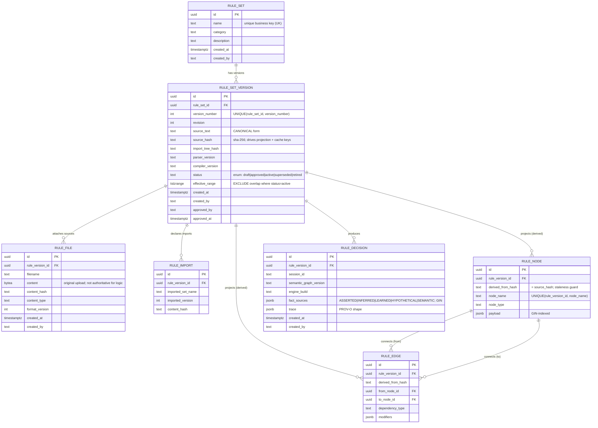
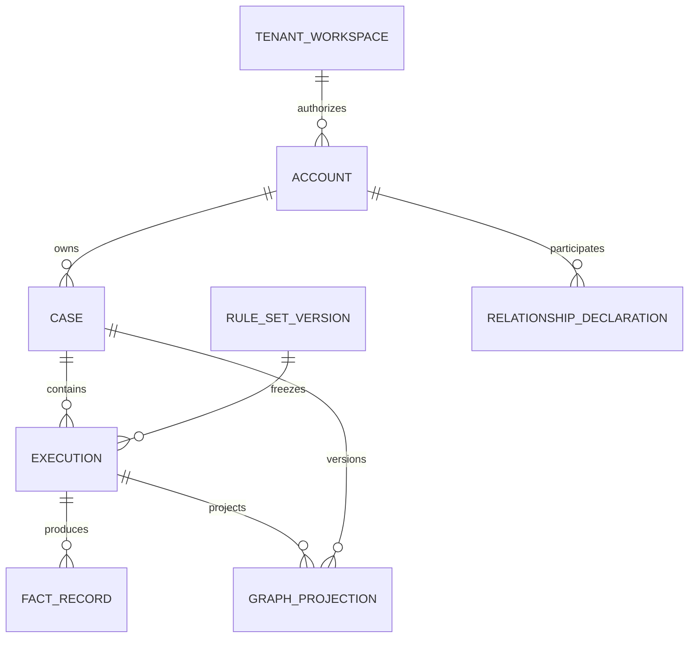

# INFERRA - Assessment & Recommendations

> Prepared during the VERIDA re-platforming effort and revalidated on 2026-07-16

> against the local `feature/enhancement` release-candidate lineage. The reviewed

> source, tests, governed documents, and authorised reference examples were first

> frozen in local candidate `742f591`; clean-checkout reproducibility and locked

> image builds were then corrected through `e37fac3`. R0.5 now adds the committed

> OpenAPI contract and CI release-gate design. The pre-candidate working-tree

> inventory is retained later in this document as audit history, not as the

> current repository state. Inspection covered

> `models.py`, the

> hexagonal domain/port/adapter layout (118 domain files, 14 ports, 73 adapters),

> the 5-phase feature-flag model, the reasoning and ontology modules, the LLM

> configuration, and the AEGIS / provider_verification / snomed_mbs subsystems.

>

> **Confidence note.** High confidence on the domain model, persistence, release

> tooling, feature flags, authentication, Redis sessions, ontology flows, and

> operational artifacts (read directly from code and tests). Medium confidence on

> scope-coherence and production capacity because staging evidence and deployment

> decisions remain external. A targeted release-risk suite passed 162 tests with 2

> skips, and both import-linter contracts passed. A new full-suite run reached 6%

> without failure before the review timebox expired; the repository's retained

> final clean-checkout release evidence reports 3,438 passed, 73 skipped, and

> 97.016% coverage.

>

> **Cross-project revalidation.** On 2026-07-16 this assessment was extended to

> the complete local working trees of `inferra-platform`, `inferra-axiom`, and

> `inferra-aegis`, plus all 71 project-authored Markdown artifacts; `.txt` files,

> vendored dependencies, build output, and cache-generated documents were

> excluded. The controlling product ownership, release-profile, browser/BFF,

> database, ontology-audit, repository action, and cross-project priority

> decisions are recorded in

> [`INFERRA_Cross_Project_Technical_Direction.md`](INFERRA_Cross_Project_Technical_Direction.md).

> On 2026-07-17 the package-plus-service architecture was accepted: establish an

> internal, independently buildable `inferra-core` Python distribution before

> release while retaining `inferra-platform` as the official authoritative

> runtime. The detailed boundary, extraction, versioning, embedded-mode, SDK,

> and CI decisions are recorded in

> [`INFERRA_Core_Package_and_Runtime_Architecture.md`](INFERRA_Core_Package_and_Runtime_Architecture.md).
>
> On 2026-07-20 the account/case ontology direction was accepted: human-approved
> rule source remains authoritative; PostgreSQL owns decisions and audit/outbox;
> Fuseki is a critical versioned projection; every provenance class is audited;
> retention is indefinite by default but configurable; AXIOM rejects
> decision-affecting semantic input; and AEGIS accepts ontology outcomes only
> through typed, rule-governed, fail-closed gates. The detailed contract and
> resolved owner decisions and implementation requirements are in
> [`INFERRA_Account_Case_Ontology_and_Provenance_Architecture.md`](INFERRA_Account_Case_Ontology_and_Provenance_Architecture.md).

> Where this older Platform-focused assessment conflicts with that direction,

> the cross-project document controls.

---

## 1. Executive summary

INFERRA is **a genuinely thoughtful reasoning platform with a reproducible local

backend candidate lineage, but it is not yet an operationally approved production

release.**

The expertise is real: provenance as a first-class type, flag-gated LLM paths

with deterministic fallback, ontology assist modes, frozen runtime profiles, and

reasoning-first routing are all

signs of a team that understands neuro-symbolic AI and has real-world scar tissue.

The immediate weaknesses are release discipline and unresolved production

decisions: GitHub release gates are prepared but not yet enforced, schema migration

is performed at runtime, Redis sessions deserialize pickle, frontend release

inputs are incomplete, ontology needs live end-to-end proof,

and auth/secret/deployment policy is not signed off. The relational schema, broad

product surface, and multi-service footprint remain important post-release

architecture concerns, but attempting those redesigns before launch would add

more risk than it removes.

The separate frontend repositories are now known and were inspected. AXIOM is

not a release candidate: its production build masks 32 type/Svelte errors, two

unit-test failures, and extensive lint/tooling failures. AEGIS has stronger

type/test/build evidence, but its current browser boundary is unauthenticated,

its runtime trusts caller-supplied actor roles for privileged actions, and both

backend and frontend can use synthetic state. These findings make frontend and

AEGIS readiness independent release decisions rather than missing Platform

folders.

The recommendation is therefore two-horizon: **extract and prove the reusable
deterministic kernel, then stabilize and prove a narrow,

deterministic service release**, then improve persistence, provenance, module

boundaries, LLM governance, and infrastructure using production evidence.

---

## 2. What to keep (do not touch)

These are INFERRA's strengths. Preserve them through any refactor.

1. **The centralized feature registry and frozen runtime snapshots.** Defaults are

   not simply "Phase 1 ON, Phases 2-5 OFF": some Phase 1 capabilities are off and

   later-phase contract/router flags are on. The strength is the canonical

   28-entry registry, API/worker snapshot hashing, start-of-session stickiness,

   fail-fast invariants, and worker rejection of publisher/worker profile drift.

   Keep this as the release-safety spine.

2. **FactSource as a first-class type** (`ASSERTED / INFERRED / LEARNED /

   HYPOTHETICAL / SEMANTIC`). Provenance typing is designed, not bolted on.

3. **Flag-gated LLM adapters with deterministic fallback.** LLM use is broader

   than goal-mapping and abduction: it also covers conversion, prompting,

   explanation, ontology query, workflow authoring, and evidence summaries. Keep

   the timeout/retry/circuit-breaker, prompt sanitization, bounded candidate, and

   fallback design. Treat `allowed_operations`, per-product `budget`, and

   `evaluation_gate_status` as configuration metadata until runtime enforcement

   is implemented; do not describe them as a complete governance boundary.

4. **Ontology as five assist modes**, not a single on/off switch. This nuance only

   comes from actually operating such a system.

5. **Adapter-free domain and protected port boundaries.** Import Linter currently

   keeps the domain free of adapters and keeps ports free of adapters,

   infrastructure, services, and entrypoints. Some domain files do import the

   infrastructure logging helper, so the domain is not fully infrastructure-free;

   preserve the enforced boundaries and move logging behind a domain-safe facade

   later if full hexagonal purity is desired.

6. **Reasoning-first routing** (deduction before abduction/induction). Keeps the

   symbolic core authoritative and deterministic.

---

## 3. Longer-term architecture recommendations

These are architecture recommendations. Section 5 identifies delivery order.
Most are post-release themes; A0 is the explicit exception because the accepted
2026-07-17 package boundary is now P0 before Core 1.0.

### A0 - Package the deterministic kernel without removing the service (high impact, P0 boundary)

**Finding.** INFERRA's most reusable value is deterministic Python domain logic.
The new internal distribution now owns its leaf contracts and a private
executable graph/node/token/parser/validation layer, but state, imports,
inference and provenance plus Platform's compatibility parser still install
through the broad `inferra-platform` `src*` namespace together with FastAPI,
SQLAlchemy, persistence, workers, LLM clients, and product extensions. Python
embedders still cannot consume the whole supported kernel, and the existing
Platform import contracts do not yet prove that the complete engine is
independent of runtime and extension concerns.

**Decision.** Create a real internal `inferra-core` Python distribution before
Core 1.0. Keep `inferra-platform` as the official multi-user production runtime
built on that artifact. Do not replace the service with a library and do not
publish the package publicly until its facade and license are stable.

**Progress, 2026-07-17.** P0.1 is complete. The current candidate has a
machine-checked inventory of all 243 production Python modules, an initial
70-module Core extraction set, 29 recorded cross-boundary imports, ten explicit
extraction blockers, a frozen syntax/source identity, and six golden vectors for
parser, diagnostics, inference, imports, iteration, hashes, and provenance. See
[`INFERRA_Core_Extraction_P0_1_Baseline.md`](INFERRA_Core_Extraction_P0_1_Baseline.md).
P0.2a and P0.2b are also complete: `inferra-core==0.1.1` builds its own
wheel/source distribution, has a small supported facade, owns the first leaf
values and all five Core ABC ports, and contains private executable
graph/node/token/parser and deterministic-validation layers. Node-ID collision
state and validation time are explicit inputs, legacy matrix/nested-iterate
behavior stays in Platform, and the parser passes clean external-venv
installed-wheel and forbidden-import checks. The 0.1.1 security correction
removes all Core third-party runtime dependencies, replaces string-to-SymPy
rule evaluation with a bounded INFERRA AST/interpreter, fails internal
declaration validation closed, and makes graph-cycle failure typed. See
[`INFERRA_Core_Extraction_P0_2_Distribution.md`](INFERRA_Core_Extraction_P0_2_Distribution.md).
The immediate blocker is a narrow public compile/validation facade and
Platform integration for the completed slice. Remaining P0.2
fact-store/iteration/import and inference/provenance layers, complete Platform
application-service rewiring, and whole-engine equivalence/reproducibility
follow.

**Required boundary**

1. Core owns pure parsing, validation, graph, fact-store, inference, imports,
   trace/provenance construction, deterministic hashes, domain diagnostics, and
   structured audit-event creation.
2. Platform retains HTTP, transport schemas, identity/scopes, SQLAlchemy,
   migrations, transactions, rule revisions, sessions, idempotency, outbox,
   workers, Fuseki publication, secrets, logging, metrics, and operations.
3. Core must not read environment/global deployment state or import FastAPI,
   SQLAlchemy, Redis, Celery, Fuseki, LLM, AEGIS, AXIOM, provider verification,
   or SNOMED/MBS code.
4. AXIOM and AEGIS use generated TypeScript service clients. A Python SDK calls
   Platform remotely and is distinct from the locally executing Core library.
5. Direct embedded use is supported for offline/single-process contexts only
   under host-owned persistence, identity, audit, concurrency, and recovery.
6. Freeze golden behavior before module movement, build an independent wheel,
   test Platform against the installed artifact, and enforce dependency
   direction in CI.

The complete accepted design and extraction order are in
`INFERRA_Core_Package_and_Runtime_Architecture.md`.

### A1 - Fix the persistence layer (high impact, high effort)

This is the sharpest disconnect in the system: an excellent domain model stored

on a primitive schema. The good model does not survive contact with the tables.

**Findings**

- **Implicit rule versioning.** Versioning is "latest file wins" by timestamp

  (`get_latest_file()`), with no explicit version rows and no status lifecycle in

  the schema. For a governance-critical system, first-class rule versioning is not

  optional.

- **Rules stored as `LargeBinary` blobs**, reparsed on load. Execution is fine,

  but rule *structure* cannot be queried without deserializing everything;

  diffing, impact analysis, and "which rules reference fact X?" are painful.

- **Legacy rule `history` is a single JSON column.** INFERRA also has a normalized

  `history_record` table for per-rule/per-node true/false counters, and AEGIS has

  a richer event ledger. Neither replaces normalized, immutable core decision

  provenance linked to rule and ontology versions. The provenance *thinking* is

  excellent in

  the domain but the *storage* is a JSON dump, undermining queryability and audit.

**Recommendations (PostgreSQL-native)**

INFERRA is Python + **PostgreSQL**, so these use Postgres types and features

directly, `uuid` PKs, `text` + `jsonb`, `timestamptz`, native `CHECK`,

partial/GIN indexes, `EXCLUDE` constraints, and triggers, not a lowest-common-

denominator schema.

1. **Introduce explicit version rows** (`rule_set` + `rule_set_version`) with a

   real status lifecycle as a Postgres `enum` or `CHECK`

   (`draft | approved | active | superseded | retired`), a `source_hash`, and an

   effective-date range. Make `source_text` the canonical form. Use a

   `tstzrange` on `(effective_from, effective_to)` and an **`EXCLUDE` constraint**

   so two `active` versions of the same rule set can never overlap in time, a

   guarantee "latest-file-wins" cannot make.

2. **Add a derived, read-only graph projection** (`rule_node` / `rule_edge`),

   rebuilt from parsed text at approval and keyed by the `source_hash` it was

   derived from. The engine still parses text at load; the projection serves

   query/explorer/impact-analysis APIs. Keep it explicitly non-authoritative to

   avoid dual-source-of-truth drift. Index `node_name` and the edge endpoints so

   "which rules reference fact X?" is a single indexed query.

3. **Normalise history/provenance** so decisions link to rule version, semantic

   version, fact sources, and engine build as columns/FK rows, keeping only the

   genuinely variable payload in `jsonb` (queryable via GIN, unlike a `text` blob).

   Enforce **append-only at the DB level** with a `BEFORE UPDATE OR DELETE`

   trigger raising an exception, not by application convention.

4. **Enforce constraints in the schema**: `NOT NULL`, `CHECK` on status/enum

   columns, `UNIQUE` where the domain requires it, and explicit FK

   `ON DELETE` behaviour, `RESTRICT` for governed artefacts (rules, history),

   `CASCADE` only for truly-owned children (files, imports, projection rows).

*(VERIDA already implements this normalisation on SQLite; the shape below is the

PostgreSQL-native equivalent recommended for INFERRA itself.)*

**Recommended rule-related ER design**

The core correction is visible in one diagram: replace the flat

`rule → file(blob) / history(json)` model with explicit versioning, a derived

graph projection, and normalised decision provenance.

Precise points that make this a *governance-grade* rule schema rather than a

storage dump:

- **`rule_set_version` is the pivot.** Every rule artefact (files, imports,

  projection, decisions) hangs off a *version*, never off a bare rule. This is

  what "latest-file-wins" cannot express.

- **`status` + `effective_range` with an `EXCLUDE` constraint** makes overlapping

  active versions structurally impossible:

  `EXCLUDE USING gist (rule_set_id WITH =, effective_range WITH &&) WHERE (status = 'active')`.

- **`source_hash` is the spine of correctness.** It is the canonical fingerprint,

  the `derived_from_hash` on every projection row, and the natural cache key. If a

  projection's `derived_from_hash` ≠ its version's `source_hash`, it is known-stale

  and must be rebuilt, no silent drift.

- **`rule_node` / `rule_edge` are derived and non-authoritative.** The engine parses

  `source_text`; these tables exist only so structure is *queryable* (impact

  analysis, explorer UIs) without deserialising blobs. `rule_edge` references

  `rule_node` by FK so graph traversal is a real join.

- **`rule_decision` normalises provenance.** Version/semantic/engine identifiers are

  columns/FKs (joinable, indexable); only the genuinely variable trace stays in

  `jsonb` (GIN-queryable), replacing the opaque single-column `history` JSON.

- **Append-only** is enforced by a `BEFORE UPDATE OR DELETE` trigger on

  `rule_decision` (and on any history table), not by convention.

### A1.1 - Add the missing account/case knowledge axis (P0 minimum, P1 expansion)

The three inspected candidates expose a more fundamental persistence gap than
rule normalization alone: the product stories are account/case-centric, while
the implemented authority is rule/session/run-centric. There is no complete
production Account or Case aggregate, no account-owned graph catalogue, and no
general immutable case-graph version path. A session ID is an execution detail;
it is not a durable subject, privacy, retention, or case boundary.

The target relationship is:

Keep Core narrow: its account record should contain opaque identity, ownership,
status, and policy references needed for authorization and audit, not become a
general CRM/customer/robot profile. Platform owns AXIOM's governed case record.
The AEGIS application backend owns AEGIS workflow/case lifecycle and PII, while
each Core decision stores frozen opaque account/case/execution references.

Every fact, including `ASSERTED`, belongs in the immutable audit record. Do not
encode evidentiary authority in `FactSource`: an assertion may be unverified,
while a deterministic inference may legitimately drive downstream rules inside
the same frozen execution. Store source, verification, decision eligibility,
scope, validity, derivation, and supersession as separate dimensions.

Historical non-asserted products are audit/discovery material. A later case must
re-derive `INFERRED`, re-query `SEMANTIC`, governably promote `LEARNED`, and keep
`HYPOTHETICAL` in simulation; it must not copy them into current truth. Prior
assertions are candidates only after current subject/scope/source/validity checks.

Before Core 1.0, implement the minimum ownership identifiers, immutable graph
catalogue, versioned retention-policy identity, transactional audit projection,
read-only account/case authorization, reconciliation, and rebuild. After release,
add automated longitudinal discovery/revalidation, Relationship Declaration
workflows, legal holds/purge automation, semantic diff, and large-scale graph
lifecycle operations. The controlling detail is
`INFERRA_Account_Case_Ontology_and_Provenance_Architecture.md`.

**Accepted owner decision, 2026-07-20.** Tenant/Workspace is the authorization
boundary and KnowledgeSubject/Account is the domain subject. AXIOM uses a durable
`AssessmentCase`; AEGIS uses a durable `WorkflowCase`; they share only a small
`CaseEnvelope`, and both may contain multiple immutable executions/attempts.
AEGIS authoring defaults to `ALL + DENY_OVERRIDES`, requires explicit activation
confirmation, and blocks/escalates unresolved outcomes.

### A2 - Contain scope sprawl (medium impact, ongoing discipline)

**Finding.** AEGIS (workflow autonomy, fraud-replay), provider_verification

(Ahpra/ABN/HPOS/Medicare), and snomed_mbs (clinical→RDF) are effectively three

different products in one repository. 118 domain files across that breadth reads

like accretion from real client demands, honest, but architecture eventually pays

for breadth. The phased flags contain the runtime blast radius; they do not

contain maintenance cost.

**Recommendations**

1. **Draw explicit module boundaries** and treat AEGIS / provider_verification /

   snomed_mbs as **optional, independently versioned modules** behind explicit

   configuration and router-inclusion gates,

   with no import path from the core into them. They can remain in one repository

   until independent ownership, security, scaling, data lifecycle, or release

   cadence justifies extraction.

2. **State the core mission narrowly** (a fenced, explainable, deterministic

   decision engine) and classify everything else as an *extension*. This makes it

   defensible to defer or extract a module without destabilising the core.

3. **Guard the boundary in CI** (a dependency-direction lint) so the core cannot

   accidentally take a dependency on a domain extension.

4. **Publish a launch capability matrix** rather than relying on repository

   location or feature flags as evidence of support. For every module, record

   whether it ships, whether its router appears in production OpenAPI, its gate,

   owner, required scopes, data classification, source of truth, SLO/runbook, and

   acceptance evidence.

### A3 - Reconsider the operational footprint (high impact, high effort)

**Finding.** Celery + Redis + Fuseki (JVM), on top of PostgreSQL, is a real

operational footprint: each component must be run, secured, backed up, observed,

and kept consistent. The repository does not contain enough target workload,

tenancy, incident, or cost evidence to conclude that it is over-provisioned.

**Recommendations (PostgreSQL stays; this is not a SQLite argument)**

1. **Evaluate queue consolidation only from measured evidence.** INFERRA already

   depends on Postgres, so Celery + Redis could be replaced by a **Postgres-backed durable

   job queue** using `SELECT ... FOR UPDATE SKIP LOCKED` for lease-based claiming

   (or `LISTEN/NOTIFY` for wake-ups). This can keep job state transactional with

   the data it operates on and may remove the broker.

   It does **not** remove Redis by itself: current Redis responsibilities include

   sessions, ontology deltas, projection metadata, dead-letter records, and task

   results. Consolidate only if all required responsibilities have a deliberate

   replacement and measured benefits exceed migration risk. Keep Celery/Redis for

   the first release.

2. **Question the Fuseki/JVM dependency on its own merits.** The triple store is a

   real architectural need; the *JVM service* may not be. Evaluate whether an

   embedded or Postgres-hosted RDF option (e.g. an in-process quadstore, or

   RDF-over-Postgres) meets the query/reasoning needs, versus running Fuseki as a

   separate JVM service. Keep Fuseki if SPARQL performance or scale genuinely

   requires it, drop it if it is inherited rather than needed.

3. **If multi-node is genuinely required**, keep the current stack but document

   *why*, so the footprint is a decision rather than an inherited default.

4. **Make cross-store consistency explicit.** PostgreSQL and the triple store do

   not share a transaction; coordinate them via a **transactional-outbox pattern**

   (write the outbox row in the same Postgres transaction as the data, then a

   worker projects to the triple store) and versioned publication, rather than

   best-effort dual writes.

> **Note.** VERIDA's choice of SQLite + an embedded quadstore is a deliberate bet

> for a *different* (single-node, no-JVM) deployment target and is **not** a

> recommendation for INFERRA. For INFERRA, the equivalent win is consolidating

> onto the PostgreSQL it already operates, not swapping databases.

---

## 4. Secondary observations

- **Ontology confidence gating.** The `OntologyReasoner` producing confidence,

  derivation path, and snapshot hash is strong. The enable switch and numeric

  confidence threshold are already separate, and the threshold is configurable.

  Preserve that separation and audit the resolved threshold with each decision.

- **Semantic materialisation.** Idempotent writes keyed by `source_hash`

  and post-write triple-count/content checks are good. The rule projection still

  updates a stable named graph with delete/insert semantics. For any graph used

  as first-release rule/case audit evidence, replace that contract before launch

  with immutable versioned graph creation followed by an atomic current-pointer swap:

  build then swap, never clear then rebuild. A partial or failed replacement must

  never become "current".

- **LLM key storage.** Storing an encrypted provider-key value in the DB

  (`api_key` is the column name) is defensible; keep the **encryption key in the

  environment, not the DB**, and support key rotation (retain previous keys until

  re-encryption completes).

- **Audit as a knowledge graph (opportunity, not a gap).** INFERRA already has a

  PROV-O-shaped trace and a triple store. Projecting decisions into a versioned

  PROV-O audit graph (async via the transactional outbox, **PostgreSQL-

  authoritative**) would yield a SPARQL-queryable, reason-able, legally traceable

  audit trail at moderate cost. Worth considering as a bounded, flag-gated

  capability.

---

## 5. Recommendation assessment

The three local working trees should be treated as intended candidate inputs, not

as releasable artifacts until their repository-specific gates and sign-off close.

Platform remains the strongest candidate: OpenAPI drift, feature-flag contracts,

AEGIS database guards, and both import contracts pass. A fresh full local run

reached 3,436 passes and 70 skips; its nine failures were confined to

observability tests because the local virtual environment lacks two declared

optional OpenTelemetry release packages. AXIOM fails type, unit, lint, and

formatting gates. AEGIS passes type-check, 165 unit tests, main/embed builds, and

the dependency audit, but fails lint/formatting and has production security and

synthetic-state blockers. The remaining suite-wide risk is concentrated in API

surface control, schema/revision safety, verified identity and authority,

ontology audit durability, intentional candidate boundaries, licensing, and

target-like operational proof.

### Cross-project controlling decision

**Accepted amendment, 2026-07-17.** Before freezing the first production API,
establish an internal, independently buildable `inferra-core` Python
distribution for the deterministic kernel. `inferra-platform` imports that
artifact and remains the official transaction, persistence, identity, audit,
and operations authority. AXIOM and AEGIS consume generated service clients;
direct Python embedding is a separate host-owned mode. The package boundary is
P0, while public registry publication is deferred until after internal API and
semantic stability. The detailed decision is in
`INFERRA_Core_Package_and_Runtime_Architecture.md`.

The first production target is a narrow `core` Platform profile containing

deterministic rule/inference APIs plus PostgreSQL-authoritative ontology

audit/provenance publication and read-only inspection. AXIOM is a separately

gated first-party client of that profile. AEGIS is absent from Core and remains a

preview/optional extension until its own P0 gates pass. After the package

boundary passes, the next implementation item is the configuration-driven
Platform API profile and its package-backed, frozen Core OpenAPI

artifact. The complete ordered plan is in

`INFERRA_Cross_Project_Technical_Direction.md`.

### Authoritative priority order

This matrix is the authoritative Platform-focused ordering for the recommendations

in this document. The suite-wide ordering in

`INFERRA_Cross_Project_Technical_Direction.md` controls cross-repository work and

places the production API-profile contract before the Platform sequence below.

Section 3's `A1`-`A3` identifiers name architecture themes; they are not delivery

priority levels.

- **P0:** required for the first production release or for activation of the

  affected capability. Release requires completion or an explicitly named and

  time-bounded risk acceptance where the row permits one.
- **P1:** first hardening release immediately after production, or before enabling

  an optional capability such as live LLM use.
- **P2:** subsequent architecture/governance release after ownership and client

  migration prerequisites are available.
- **P3:** optional, evidence-driven optimization; do not schedule from architectural

  preference alone.

| Order | Recommendation | Priority | Timing | Depends on | Release effect |
| ---: | --- | :---: | --- | --- | --- |
| 0 | S0: Preserve bounded rule-source evaluation, fail-closed validation, typed graph-cycle failures, and adversarial installed-artifact proof (implemented in Core 0.1.1) | P0 invariant | Before every release | None | Any regression blocks every release |
| 1 | A0: Extract and prove the internal `inferra-core` distribution (P0.1, P0.2a-P0.2b and the 0.1.1 security correction complete; public-facade integration is next, then remaining extraction/rewiring/proof) | P0 | Before release | Frozen golden behavior | Blocks the entire release under the accepted architecture |
| 2 | R0: Produce one immutable, reproducible candidate including Core wheel evidence | P0 | Before release | Package boundary identified | Blocks the entire release |
| 3 | R1: Freeze product scope, routes, roles, secrets, and security posture | P0 | Before release | Candidate scope identified | Blocks the entire release |
| 4 | R2: Add migrations, minimum Rule constraints, tenant/account/case/execution ownership, revision and graph identity, fact authority fields, backfill, restore proof, and decision freezing | P0 | Before release | Schema and launch surface frozen | Blocks release; decisions and projections otherwise lack enforceable ownership and reproducibility |
| 5 | R2: Remove pickle session deserialization | P0 or P1 | Before release unless a trusted-Redis exception is signed; otherwise first hardening release | Session schema and deployment trust boundary | Blocks release when Redis is not fully trusted; signed exception must expire |
| 6 | R3: Prove the complete production-profile stack in staging | P0 | Before release | A0 and R0-R2 complete | Blocks the entire release |
| 7 | R4: Complete the PostgreSQL-to-versioned-Fuseki audit path, authorization, observability, reconciliation, rebuild, and retention identity; add stricter materialization gates when ontology can affect decisions | P0 for audit projection; P0 conditional for materialization | Audit path before Core release; materialization before any decision-affecting profile | Account/case schema, outbox, Fuseki and staging stack | Blocks Core audit/provenance scope; decision-affecting ontology stays disabled until the additional gates pass |
| 8 | R5: Close package/API/client, OpenAPI, frontend, legacy-route, and document gaps | P0 | Before release | A0 package and R1 launch contracts | Blocks release contract/sign-off |
| 9 | Normalize core Rule persistence and append-only decision provenance | P1 | First post-release persistence milestone | Migration baseline, revision identifiers, client compatibility plan | Does not block the narrow first release after R2 controls pass |
| 10 | Expand the minimum outbox into durable replay and reconciliation | P1 | First post-release reliability milestone | Minimal pre-release outbox and operational ownership | Does not block release if async projection is disabled; otherwise the minimal outbox is P0 |
| 11 | Stabilize, license, sign, document, and publicly publish `inferra-core` | P1 | After internal API/semantic stability | A0, licensing, SBOM/provenance, registry decision | Public publication is not required for Core 1.0 |
| 12 | Enforce LLM operations, evaluation gates, budgets, model/prompt versions, and durable usage | P1 conditional | Before enabling live LLM capabilities | Provider/model policy and evaluation set | Blocks LLM activation, not deterministic release |
| 13 | Replace any temporarily accepted pickle envelope with a schema-safe session format | P1 | First hardening release | Session schema/migration design | Required by the exception expiry in row 5 |
| 14 | Make AEGIS, provider verification, and SNOMED/MBS deployable module boundaries | P2 | Subsequent architecture release | Capability owners, schema ownership, dependency rules | Does not block narrow release if unapproved modules are absent from production routes |
| 15 | Retire legacy iterate, matrix shims, obsolete flags, and `/service/*` | P2 | After client and stored-payload migration | Parity, compatibility, rollback, and client evidence | Does not block release while compatibility paths are controlled |
| 16 | Build the governance-grade PostgreSQL decision audit and PROV-O audit projection | P2 | Governance/audit release | Normalized decisions and durable outbox | Required when contractual/regulatory audit scope demands it |
| 17 | Consolidate Celery, Redis, or Fuseki | P3 | Only after production measurement | Queue, SPARQL, recovery, incident, and cost evidence | Never a first-release blocker |

Priority conflicts are resolved in favor of the earlier row. A conditional row

becomes P0 as soon as its capability is included in the signed launch capability

matrix. Every P0 exception must identify the risk owner, compensating controls,

expiry date, and the P1 item that removes the exception.

### 5.1 Required before the first production release

#### S0 - Keep rule source non-executable and structural failure fail-closed (P0 invariant)

**Finding.** The extracted expression-conclusion path previously delegated rule
text to SymPy parsing, while an internal declaration-validator exception could
be converted into a successful result and graph cycle detection used an empty
tuple that was indistinguishable from a genuinely empty graph. Those are not
ordinary implementation details: together they create an avoidable rule-source
execution/resource-exhaustion surface, permit unvalidated rules to progress
after an internal failure, and make callers guess whether topology is valid.

**Decision and local implementation, 2026-07-17.** Core 0.1.1 implements the
documented `IS CALC` language with a purpose-built lexer, private AST, parser,
and interpreter. It accepts only numeric literals, explicit variables,
parentheses, unary `+`/`-`, arithmetic `+`/`-`/`*`/`/`, comparisons, ternary
`? :`, and the bounded `ROUND`, `MAX`, and `MIN` functions. It does not pass
rule source to `eval`, `exec`, `compile`, SymPy, Python AST execution, or another
general-purpose expression engine. Unsupported calls/operators and excessive
source length, token count, AST nodes/depth, evaluation work, integer size,
string/collection size, or rounding precision are rejected.
Numeric-looking relational operands use finite decimal coercion rather than
binary-float coercion, preventing large integers and high-precision monetary or
policy thresholds from being silently rounded or compared lexicographically.

Rule validation now parses calculation expressions before save/activation and
returns `INVALID_CALC_EXPRESSION` for unsupported syntax. An unexpected
declaration-parser failure returns a typed validation error and must not permit
save, activation, or promotion. Topological sorting raises `CyclicGraphError`
for a cycle; an empty tuple now means only an actually empty graph. Both Core
and temporary Platform compatibility paths use these semantics.

**Permanent release gate.** Keep package boundary tests that reject
general-purpose evaluator calls, adversarial source tests (including proof that
filesystem side effects do not occur), expression limit tests, fail-closed
validator tests, typed-cycle contract tests, and clean installed-wheel checks.
The Core wheel must declare zero runtime dependencies unless a future dependency
receives an explicit security/license/reproducibility decision. Any relaxation
requires a new decision record and security review; compatibility pressure is
not sufficient justification.

**Current evidence.** Core package tests pass 33/33; the focused Platform
compatibility/security selection passes 221 tests; the clean installed 0.1.1
wheel reports no runtime requirements or forbidden loaded modules and rejects
the adversarial Python-expression probe; `uv lock --check` resolves 99 packages
without SymPy/mpmath; and the complete Platform suite passes 3,471 tests with
70 skipped and 146 warnings in 309.00 seconds. The unchanged 97% Platform
coverage threshold passes at 20,932/21,579 statements (97.0017%).

#### R0 - Produce one immutable, reproducible candidate (release blocker)

The next candidate must include the built internal `inferra-core` wheel and
source distribution, their hashes and dependency manifests, and proof that
Platform tests ran against the installed artifact rather than repository-path
imports. The earlier candidate evidence remains valid historical evidence for
the pre-extraction codebase; it does not close the newly accepted package gate.

1. Commit every intended source file, test, script, reference artefact, and active

   source-of-truth document. **Completed 2026-07-16:** the reviewed source,

   tests, scripts, governed active/archive documents, and approved reference

   examples are included in the immutable local candidate commit. Generated

   coverage databases and release output remain excluded.
2. Keep coverage databases and generated release output out of Git status.

   **Completed:** `.gitignore` now ignores both `artifacts/` and `.coverage.*`;

   the 59 existing coverage databases remain on disk but no longer appear in the

   candidate manifest.
3. Decide whether this assessment is an audit attachment or a maintained project

   document. **Completed using the recommended default:** the file is explicitly

   unignored from `docs/*` and is now treated as governed release documentation.

   It must be reviewed and staged with the candidate.
4. Create the candidate from a clean checkout and attach the commit SHA, dependency

   lock hash, container image digests, feature-flag snapshot hashes, test/coverage

   output, benchmark output, and import-linter report to one evidence bundle.

   **Completed locally for `e37fac3`:** the clean-checkout evidence ZIP and

   checksum manifest were produced; external environment, signing, and registry

   evidence remain explicitly pending.
5. Generate `openapi.json` in CI and fail on drift. Make the dependency audit,

   backend coverage, import contracts, Docker build, OpenAPI drift, and candidate

   evidence jobs required branch-protection checks.

   **Local implementation completed 2026-07-16:** `openapi.json` is generated

   deterministically from the real FastAPI application; CI has independently

   requireable jobs named `Python dependency audit`, `Backend tests and coverage`,

   `Import contracts`, `Docker build`, `OpenAPI drift`, and `Candidate evidence`.

   The OpenAPI and candidate-summary artifacts are retained for 30 days. **Still

   external and release-blocking:** push this branch, observe one successful run,

   and configure all six names as required checks in GitHub branch protection.

**Closed pre-candidate inventory, retained for audit history**

| Classification | Count | Contents | Required disposition |
| --- | ---: | --- | --- |
| Modified tracked candidate content | 69 | Configuration/documentation/release files, production source files, and existing tests | Review as one integrated feature-alignment and release-hardening change set |
| Tracked deletion represented by an archive move | 1 | Root `fuseki_connection.md`, preserved as `docs/archive/operations-notes/fuseki_connection_root_legacy.md` | Stage the deletion and archived destination together |
| Untracked candidate content | 60 | 5 active/governance documents, 8 archive documents, 16 reference examples, 1 feature-snapshot evidence script, 3 production modules, and 27 tests | Approved for the candidate; inclusion and redistribution of the 16 reference examples was explicitly authorised on 2026-07-16 |
| Generated residue | 59 | `.coverage.*` databases | Completed: ignored by `.coverage.*`; never stage these files |
| Generated release evidence outside status | 5 at review time | Coverage JSON and feature-snapshot JSON under `artifacts/release/` | Retain as CI/release-run artifacts, not source files |

The three new production modules are not optional residue:

- `src/infrastructure/environment.py` is imported by the API and Celery worker.
- `src/ports/aegis_repository_ports.py` is imported by AEGIS domain and persistence

  code.
- `src/services/inference_orchestration_service.py` is imported by the inference

  route.

The new `scripts/capture_feature_flag_evidence.py` is called by the release-

candidate script and tested directly. Omitting any of these four files would make

the candidate incomplete.

**Proposed staging boundary**

- Stage the 69 tracked modifications and the root Fuseki-note archive move after
  code review.
- Stage the 5 active/governance documents, 8 governed archive documents,
  evidence script, 3 production modules, and 27 new

  tests.
- Stage the 16 reference examples. Inclusion and redistribution in this
  repository was explicitly authorised on 2026-07-16.
- Do not stage `.coverage.*` or files below `artifacts/`.
- Stage the archived `docs/archive/phase-plans/FEATURE_FLAG_ALIGNMENT_PLAN.md`
  with the documentation-governance change; its disposition is now decided.
- Stage this assessment after documentation review; its governed-document status

  is now decided.

**Local validation refreshed 2026-07-16:**

- The full local release-candidate command was started but reached its ten-minute
  execution ceiling at 6% of the 3,510-test backend suite with no reported test
  failure. This interrupted run is not counted as a new full-suite pass.
- The completed clean-checkout candidate result is 3,438 passed, 73 skipped, and
  97.016% coverage. R0.5 changes only release tooling, CI policy, generated
  OpenAPI evidence, tests for those artifacts, and active documentation.
- Focused feature-flag, environment, evidence, orchestration, and reference-example
  validation passed 338 tests.
- Phase 5 acceptance passed 7 tests; benchmarks passed 22 with 3 skipped;
  infrastructure guardrails passed 39 with 3 skipped.
- Import Linter analysed 243 files and 722 dependencies with both architecture
  contracts kept. `git diff --check` passed.

`git diff --check` reports no whitespace errors for the current candidate.
Documentation archival moves and reference-example approval have been applied.
This historical inventory defined the boundary of the first immutable local
candidate commit. The current candidate lineage includes the subsequent
clean-checkout, locked-image, and R0.5 release-gate corrections described above.

**Exit criterion:** a clean clone of one SHA produces the same images, API schema,

feature snapshot, and release-gate result without using ignored local files.

#### R1 - Freeze the first-release product and security posture (release blocker)

1. Resolve the production decision register: deployment target and resource

   sizing, secret manager, auth model, ontology ownership/retention, staging

   acceptance, and named release sign-off. `[~]` is not a release state.
2. Launch deterministic-first. Keep live LLM enhancements and LLM abduction off

   until provider/model/prompt/evaluation/budget policy is approved and the stored

   `allowed_operations`, `evaluation_gate_status`, and budget are actually enforced

   at the call boundary.
3. Define deployable roles and scopes. The production API-key default is only

   `read,llm:read`, while inference, rule authoring, ontology writes, files, system

   inspection, and AEGIS require other scopes. Publish a least-privilege role

   matrix and run authenticated positive/negative smoke tests for every enabled

   route family.
4. Define the first-release core narrowly: deterministic rule execution, rule

   validation, layered provenance, and only the ontology capabilities required by

   the approved launch use case. Treat AEGIS, provider verification, SNOMED/MBS,

   LLM-assisted authoring, GraphRAG, and experimental reasoning as extensions.
   Implement the deterministic portion in `inferra-core`, but retain the
   service-owned database, identity, transaction, audit, and operational
   responsibilities in Platform.
5. Create a launch capability matrix for every module with these required fields:

   `ships_in_first_release`, `production_router_enabled`, configuration/feature

   gate, owner, required scopes, data classification, source of truth,

   SLO/runbook, acceptance evidence, and rollback/disable procedure. Use this

   matrix as a release input rather than inferring support from code presence.
6. Expose only the products approved for launch. AEGIS, legacy `/service/*`,

   provider verification, ontology authoring, and experimental reasoning surfaces

   should be omitted from the production router/OpenAPI document unless they have

   an owner, threat model, scopes, operational runbook, and acceptance evidence.

   Make router inclusion configuration-driven; a disabled product should be absent

   from production OpenAPI, not merely return a flag or authorization error.
7. Keep extensions in the monorepo for the first release, but enforce dependency

   direction so the core cannot import them. Do not split services merely to make

   the repository look smaller; extract only for independent ownership, security,

   scaling, data lifecycle, or release-cadence requirements.
8. Move real API/JWT/CSRF/Redis/Fuseki/LLM/database secrets to the selected platform

   secret manager. Verify rotation, revocation, log redaction, TLS termination,

   network isolation, and non-default credentials in the target environment.

**Exit criterion:** the enabled API surface, roles, secrets, data ownership, and

optional-feature posture are explicit and tested in the production profile.

#### R2 - Establish safe database and session-state operations (release blocker or signed exception)

1. Introduce versioned PostgreSQL migrations (Alembic or an equivalent migration

   runner) and create a baseline for both core and AEGIS databases. Do not depend

   on request/startup-time `create_all()` and ad-hoc `ALTER TABLE` for production

   evolution. Test upgrade from the last deployed schema and rollback/forward-fix.
2. Apply minimum core Rule constraints through those migrations:

   - `rule.name` must be `NOT NULL` and unique under an explicit normalized or

     case-insensitive naming policy, such as a stored normalized key or `citext`.
   - Rule-file `rule_id`, content, source hash, and creation timestamp must be

     `NOT NULL`, with explicit FK deletion behavior. Use `RESTRICT` for governed

     revisions and `CASCADE` only for genuinely owned, non-audit children.
   - Add an index supporting current lookup order, at minimum

     `(rule_id, created_date DESC, file_id DESC)`, plus indexes for source hash and

     externally queried business keys.
   - Use timezone-aware database timestamps and database-side defaults.
3. Make every new rule-file row an immutable revision. Add a monotonic revision or

   version number, `source_hash`, content/format type and schema version,

   parser/compiler version, `created_by`, `created_at`, and import-tree hash. Never

   update revision content after creation; corrections create another revision.
4. Align the API with the real semantics. Either implement governed versions now

   or temporarily call the current append-only file resources "revisions". Do not

   present timestamp-selected blobs as approved/active versions. Preserve existing

   file IDs and publish compatibility behavior for current clients.
5. Make core rule creation, revision creation, and publication intent one database

   transaction whenever asynchronous ontology projection is enabled. Insert a

   minimal PostgreSQL outbox row with the rule revision; publish it after commit

   and retain retry/reconciliation status. This closes the current commit-then-

   best-effort-publish gap without requiring the full post-release provenance

   redesign.
6. Define and rehearse the migration/backfill from existing `rule`, `file`, and

   `history` rows. Derive deterministic revision numbers and hashes, detect

   duplicate/case-colliding names, quarantine invalid rows, preserve old IDs or a

   durable ID map, verify counts/hashes, and document rollback or forward-fix.
7. Perform and time a restore drill for both PostgreSQL databases, Redis loss, and

   the Fuseki dataset. Record RPO/RTO, retention, encryption, ownership, and the

   rebuild procedure for derived RDF projections.
8. Remove pickle deserialization from Redis sessions before Redis crosses a trust

   boundary. If the first release temporarily retains it, require isolated Redis,

   ACLs and TLS where applicable, no externally writable keys, signed/encrypted

   envelopes, a documented remote-code-execution risk acceptance, and a dated

   replacement milestone. A version number and `isinstance` check do not make

   `pickle.loads()` safe.
9. Freeze each executed decision to immutable identifiers available today: rule

   file/version ID, rule source hash, import-tree hash, ontology snapshot hash,

   feature snapshot hash, and engine build. This is the minimum audit bridge until

   the normalized post-release schema exists.

10. Add durable tenant/workspace scope plus opaque account, case, and execution
    identifiers to every governed decision. Do not use `session_id`, owner name,
    rule category, or graph URI as a substitute for authorization ownership.
11. Add a PostgreSQL-authoritative graph catalogue for immutable rule,
    execution, and case projections: kind, URI, version/content hash, owner,
    predecessor/supersession, status, outbox event, and retention-policy version.
12. Store fact source separately from verification and decision eligibility.
    Persist all source classes, including assertions, and prohibit historical
    non-asserted products from direct future-case promotion.
13. Default graph retention to indefinite, while persisting a versioned policy
    reference now so later legal-hold/purge automation does not require another
    identity redesign.
14. Enforce AXIOM's deterministic profile at the application-service/API
    boundary. Callers must not enable semantic auto-answer or materialization for
    an AXIOM authoritative execution.

**Exit criterion:** schema upgrades, core Rule revision constraints, legacy-data
backfill, outbox publication, and restores are repeatable; session-state risk is
removed or formally accepted; decisions and graph projections have enforced
tenant/account/case ownership, immutable artefact identifiers, independent fact
authority metadata, and a persisted retention-policy version.

#### R3 - Prove the complete stack in staging (release blocker)

1. Run the aggregate release script without `SkipDockerSmoke`, `SkipLoad`, or

   `SkipChaos`, using the production overlay and retained logs/results.
2. Exercise the real ontology loop: rule save -> Celery publish -> RDF compile ->

   Fuseki update -> projection integrity check -> post-reasoning -> Redis delta ->

   semantic-layer injection -> enriched response/PROV-O trace.
3. Repeat the 500-VU gate with production worker counts, connection pools, auth,

   telemetry, and representative rule/ontology sizes. Include soak tests and

   concurrent writes, not only read/health probes.
4. Demonstrate multi-worker session handoff, optimistic-conflict handling, Celery

   retry/DLQ recovery, Redis restart, Fuseki restart, PostgreSQL restart, worker

   loss, and recovery without silent decision or audit loss.
5. Tune alert thresholds and connect notifications to an owned channel. A dashboard

   or Prometheus rule without tested routing and a responder is not an operational

   control.

**Exit criterion:** the same candidate SHA passes functional, load, chaos,

recovery, and ontology-loop gates in the target-like environment.

#### R4 - Complete ontology observability for launch (release blocker when ontology affects decisions)

The accepted Core scope includes ontology audit/provenance publication and

read-only inspection even while ontology advisory, auto-answer, materialized

reasoning, and browser authoring remain disabled. Therefore the minimum

transactional outbox, durable audit-event contract, projection status,

redaction, and reconciliation controls are P0 for Core. The

materialization-specific requirements below become P0 only when ontology-derived

facts can affect decisions.

INFERRA already logs projection, post-reasoning, semantic-cache, type-bridge, and

delta activity and carries materialization traces into PROV-O artefacts. Close the

remaining gaps before enabling ontology reasoning in production:

1. Define one event contract with `event`, `correlation_id`, OTel `trace_id` and

   `span_id`, `session_id`, `task_id`, `rule_name`, `source_hash`,

   `ontology_snapshot_hash`, `graph_uri`, `operation`, `outcome`, and `duration_ms`.
2. Emit an aggregate `ontology_materialization_evaluated` event from the reasoning

   boundary with counts and bounded outcomes such as `materialized`,

   `below_threshold`, `contradiction`, `no_derivation`, and `stale_snapshot`.
3. Propagate trace context through Celery headers and create spans for queue wait,

   RDF compile, Fuseki query/update, projection verification, delta publication,

   and semantic injection.
4. Wire `inferra_fuseki_sync_total{status}` and

   `inferra_fuseki_sync_duration_seconds` into the actual production sync path;

   they are currently declared and tested but not updated by production code. Add

   low-cardinality metrics/alerts for delta lag, DLQ depth, stale projection age,

   rejected materializations, cache failures, and PostgreSQL/Fuseki divergence.
5. Never log raw SPARQL, TTL, prompts, clinical/provider fact values, or full

   derivation paths. Log hashes, bounded counts, approved identifiers, and

   redacted errors; keep high-cardinality identifiers out of Prometheus labels.
6. Add contract tests for required fields, redaction, context propagation, metric

   increments on success/failure/retry, and reconciliation alarms.
7. Replace stable-graph delete/insert as the evidence contract with immutable,
   content-addressed rule and execution/case graph versions plus a separately
   managed latest pointer/catalogue. Verify publish counts and hashes before a
   projection is marked complete.
8. Bind graph read scope server-side to tenant/account/case ownership. Do not let
   a browser, LLM, or raw graph URI expand the authorized dataset.
9. Prove rule approval -> outbox -> versioned rule graph and decision commit ->
   outbox -> immutable case graph -> read-only query -> reconciliation/rebuild in
   staging. The current manual case sync and semantic-pilot-only versioning are
   insufficient.
10. Persist every fact source and its independent authority/validity metadata.
    Operational logs remain redacted; the protected append-only audit record and
    graph projection carry the governed lineage.
11. Persist an indefinite-default versioned retention policy and exercise an
    authorized lifecycle dry run. Full purge/legal-hold automation may follow the
    release, but silent expiry or unowned Fuseki deletion is not acceptable.

**Exit criterion:** an operator can trace one rule approval and one case decision
from the PostgreSQL transaction through an immutable, ownership-scoped Fuseki
projection and read-only query; detect staleness, loss, or policy expiry; rebuild
the projection; and diagnose failure without exposing protected fact content.
If semantic materialization is enabled, the same evidence proves the applicable
AXIOM or AEGIS authority policy and fail-closed behavior.

#### R5 - Close API/client and release-document gaps (release blocker)

1. Build `inferra-core` as an internal distribution with its own metadata,
   dependency boundary, public facade, installed-wheel tests, golden vectors,
   artifact hashes, and compatibility record. Do not claim public package
   availability until the separate publication gate passes.

2. Treat the three repositories as separate release units. The first production

   target is API-only INFERRA Core unless AXIOM completes its own P0 quality,

   security, modern-API, generated-client, packaging, and end-to-end gates. AEGIS

   is explicitly excluded from the Core profile and does not block Core release.
3. Freeze `/api/v1` request/response shapes against the generated OpenAPI artefact.

   Generate profile-specific TypeScript clients, migrate AXIOM away from

   `/service/rule/*`, and publish a migration/deprecation policy for legacy

   `/service/*` endpoints.
4. Reconcile this assessment, `IMPLEMENTATION_STATUS.md`, `ROADMAP.md`,

   `OPERATIONS.md`, production readiness, and the decision/retirement registers.

   Status numbers and launch claims should be generated from the evidence bundle

   where possible, rather than copied into several documents.
5. Replace both frontend proxies' sibling-repository secret reads with deployment

   environment/secret-manager injection. Require authenticated BFF sessions,

   exact route/method allowlists, CSRF on mutations, and verified identity

   propagation before either UI is called production-ready.
6. Make Platform the canonical owner of the rule syntax dictionary and OpenAPI.

   Remove or generate the divergent AXIOM/AEGIS copies and fail CI on contract

   drift.

### 5.2 Recommended after the first production release

1. **Normalize core rule persistence and provenance.** Implement `rule_set` and

   explicit immutable `rule_set_version` rows, lifecycle/effective-range

   constraints, canonical source text and hash, derived node/edge projections,

   and append-only decision provenance. AEGIS workflow versioning is a useful

   internal pattern, but core rules still use latest-file-wins semantics.
2. **Expand the minimum transactional outbox into durable reconciliation.** Keep

   publication

   intent with the PostgreSQL transaction, project asynchronously to Fuseki, and

   retain replayable history, leases, attempts, terminal status, operator replay,

   and reconciliation. Redis metadata/DLQ improves operability but is not a

   transactional bridge from the authoritative rule write.
3. **Replace pickle with a schema-safe session representation.** Use a versioned

   JSON/MessagePack schema composed of primitives and explicit domain

   reconstruction, with migration and compatibility tests.
4. **Make LLM governance enforceable before enabling it.** Enforce product,

   operation, evaluation-gate, per-tenant/request/token/cost budget, prompt/model

   version, and incident-disable policy at one gateway; persist usage and decisions

   durably instead of relying on a process-local cost singleton.
5. **Stabilize and publish the reusable kernel deliberately.** After the internal

   package and Platform release prove semantic compatibility, complete the

   `inferra-core` public API reference, licensing, changelog, SBOM, provenance,

   signing, supported-Python matrix, registry-name check, and pre-release cycle.

   Public publication is a separate release decision, not an automatic result

   of creating the internal wheel.
6. **Turn extension boundaries into deployable boundaries.** Give AEGIS,

   provider verification, and SNOMED/MBS explicit packages, ownership,

   configuration/router inclusion, API/version policy, and dependency-direction

   checks. Avoid sharing persistence models and tables across product boundaries;

   each extension must own its schema, migrations, retention, and repository

   interfaces even while it remains in the monorepo. Extract a service only when

   independent scaling, security, ownership,

   or release cadence justifies it.
7. **Evaluate service consolidation from measured operations.** Keep Celery,

   Redis, PostgreSQL, and Fuseki for the first release. After collecting queue

   depth, throughput, latency, incident, recovery, SPARQL, and cost data, decide

   whether a PostgreSQL job queue or alternate RDF deployment reduces total risk.

   Replacing the Celery broker alone will not remove Redis because it also carries

   sessions, deltas, metadata, DLQ records, and task results.
8. **Retire compatibility deliberately.** Remove legacy iterate, matrix shims,

   obsolete feature switches, and `/service/*` only after client migration,

   stored-payload read evidence, parity tests, and rollback plans are complete.
9. **Build governance-grade semantic audit.** Persist an append-only PostgreSQL

   decision record containing rule/ontology/engine versions, confidence gates,

   fact-source transitions, and trace IDs; asynchronously project it to a versioned

   PROV-O audit graph. Operational logs diagnose health; the audit record explains

   why a decision occurred.
10. **Build longitudinal account knowledge without conclusion reuse.** Discover
    prior assertions and audit products through authorized account/case indexes;
    revalidate assertions, re-run deterministic derivations, and repeat semantic
    queries against pinned current snapshots before a new decision can use them.
11. **Implement governed graph lifecycle and correlation.** Add versioned
    retention overrides, legal holds, coordinated purge/tombstone operations,
    Relationship Declaration workflows, cross-tenant approval, revocation, and
    access audit. Do not infer correlation from an RDF edge alone.

## 6. Overall

The people behind INFERRA understand neuro-symbolic AI properly. The graph-first

runtime, layered provenance, ontology assist modes, deterministic-first routing,

frozen feature profiles, failure handling, and broad automated test suite are all

evidence of

real expertise. The latest backend working tree is technically substantial, but a

dirty and partly ignored working directory is not a release candidate, and local

test evidence is not production evidence. The first release should be intentionally

narrow: deterministic reasoning, only approved API modules, LLM disabled unless

separately signed off, explicit auth scopes, managed secrets, versioned database

migrations, recoverable data stores, and a fully observed ontology path.

The highest-leverage move before launch is **extract, freeze, reduce, prove, and
sign**:

establish the internal deterministic package without changing semantics, produce
one reproducible SHA, reduce the exposed surface, prove the real stack in

staging, and close the production decision register. After launch, re-pour the

platform's strong domain judgment onto explicit rule versioning, normalized and

append-only provenance, safe session schemas, enforceable LLM governance, durable

cross-store publication, and clearer product boundaries. Extract Core
incrementally behind golden vectors; do not combine packaging with a semantic
rewrite. Do not replace Celery/Redis/Fuseki on speculation; change them only
from measured

production evidence.
