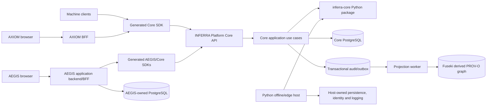

# INFERRA Core Package and Runtime Architecture

Status: accepted target architecture; P0.1, P0.2a, P0.2b and the 0.1.1
security correction complete; public facade/Platform integration is the next
gate, followed by remaining P0.2 layers and P0.3-P0.5
Accepted: 2026-07-17
Last updated: 2026-07-20
Applies to: `inferra-platform`, `inferra-axiom`, and `inferra-aegis`

## 1. Decision

INFERRA Core will have two complementary forms:

1. **`inferra-core`**, an internally distributed Python library containing the
   deterministic, infrastructure-independent rule and inference kernel.
2. **`inferra-platform`**, the official production runtime and service. It will
   import `inferra-core` and add the authoritative database, API, identity,
   transactions, jobs, audit ledger, ontology projection, and operations.

The library boundary is required before the first production release. Public
package publication is not. The package will first be built, versioned, and
tested inside the Platform repository. Publication to a public package registry
will follow only after its public API, license, provenance, and compatibility
policy are stable.

This is not a library-only architecture. A Python caller may embed the library
for offline, edge, desktop, test, or single-process use, but the official
multi-user deployment uses the Platform service as its authority.

## 2. Terminology

| Term | Meaning | Authority |
| --- | --- | --- |
| INFERRA Core | The supported deterministic product capability, independent of packaging form | Product/release concept |
| `inferra-core` | Working distribution name for the pure Python domain package; import namespace should be `inferra_core` | Computes results but owns no durable state |
| INFERRA Core runtime | The application layer that executes Core use cases using the library | Authoritative only when hosted by Platform |
| `inferra-platform` | FastAPI service, persistence and operations distribution built on `inferra-core` | Official multi-user production authority |
| Core API profile | Narrow Platform route set approved for Core production | Network contract for official clients |
| Client SDK | Generated Python or TypeScript client for a profile-specific OpenAPI document | Convenience layer, not domain logic |
| BFF | Product-specific Backend for Frontend used by AXIOM or AEGIS | Human session and UI security boundary |
| Embedded mode | A host Python process imports `inferra_core` directly | Host owns every operational responsibility |
| Service mode | A client calls `inferra-platform` over its supported API | Platform owns authoritative execution and records |

The package name is a working technical name until registry availability and
legal naming checks are complete. Documents must not imply that it is already
published.

## 3. Why both forms are required

A reusable library makes the valuable logic easy to test, embed, reuse, and
version. It also creates a hard dependency boundary around the deterministic
engine. A service is still required because importing a library does not solve:

- concurrent writes and optimistic locking;
- immutable rule-revision storage;
- authentication, scopes, tenancy, and actor identity;
- database migrations and backups;
- idempotency and transaction boundaries;
- append-only audit and ontology-publication outboxes;
- background work, retry, reconciliation, and dead-letter handling;
- cross-client compatibility and one authoritative ruleset;
- operational health, metrics, tracing, rate limits, and incident controls.

If AXIOM and AEGIS each embedded the engine for authoritative execution, INFERRA
would acquire multiple rule stores, audit ledgers, engine versions, security
policies, and potentially different answers. The apparent deployment
simplification would move Platform responsibilities into every consuming
product.

## 4. Target boundary



Dependency direction is inward:

- the library imports neither Platform nor any product extension;
- Platform imports the library through its public facade;
- AXIOM and AEGIS normally import generated clients, not the Python engine;
- Core never imports AEGIS, AXIOM, provider verification, SNOMED/MBS, or another
  product extension;
- no frontend or BFF accesses Core or AEGIS database tables directly.

## 5. `inferra-core` package contract

### 5.1 Responsibilities

The package may own pure, deterministic behavior for:

- INFERRA rule lexical analysis, parsing, syntax validation, and canonical form;
- typed rule, node, dependency, import, fact, and value models;
- graph construction and deterministic graph traversal;
- backward-chaining inference and question selection;
- iteration and quantifier semantics;
- layered working-memory behavior and fact-source transitions;
- import resolution algorithms when sources are supplied through a port;
- deterministic compile/evaluation diagnostics;
- trace and provenance model construction;
- neutral, structured audit-event creation;
- stable hashes for source, import tree, feature profile, and evaluation inputs;
- domain errors and versioned result models.

Ontology-related code belongs in the library only when it is a pure transform,
such as producing a neutral provenance graph or mapping already supplied
identifiers. Network SPARQL, graph-store administration, dataset selection,
credentials, retries, and durable publication belong to Platform adapters.

### 5.2 Prohibited responsibilities

The package must not:

- start FastAPI, Uvicorn, Express, workers, threads, or schedulers;
- read environment variables, `.env` files, secret files, or global deployment
  configuration;
- import SQLAlchemy models or open database connections;
- connect to Redis, Celery, Fuseki, an LLM, HTTP endpoints, or filesystem-owned
  application data;
- authenticate users, decode deployment tokens, or decide product roles;
- allocate authoritative IDs from process-global or database state;
- call the system clock or random generator without an explicit injected value;
- write application logs as the durable audit record;
- import AEGIS workflow/autonomy models or provider/domain extensions;
- mutate caller-owned objects invisibly or depend on import-time initialization.

The initial package may retain small deterministic dependencies when justified,
but every dependency must be reviewed for reproducibility, licensing, and
necessity. Framework and infrastructure packages are not valid Core
dependencies.

### 5.3 Public facade

Consumers must import a deliberately small facade rather than arbitrary internal
modules. The exact names will be finalized during extraction, but the stable
surface should represent concepts such as:

```python
from inferra_core import (
    CoreVersion,
    RuleSource,
    CompileRequest,
    CompileResult,
    EvaluationRequest,
    EvaluationResult,
    EvaluationContext,
    Fact,
    FactSource,
    ProvenanceTrace,
)
```

This example is a target contract, not an assertion that these exports already
exist. Internal parser, graph, cache, and traversal classes remain private unless
there is a demonstrated embedding use case.

The facade must use library-owned domain types or Python primitives. It must not
expose FastAPI requests, Pydantic HTTP schemas, SQLAlchemy rows, Redis payloads,
Celery tasks, or Fuseki-specific objects.

### 5.4 Determinism contract

An authoritative result must be a function of explicit, recordable inputs:

- canonical rule source and source hash;
- resolved import sources and import-tree hash;
- target and supplied facts;
- feature/evaluation profile;
- ontology snapshot or supplied semantic facts when enabled;
- engine, syntax, parser, compiler, and result-schema versions;
- caller-supplied evaluation ID and timestamp where those appear in output.

The same supported package version and the same canonical inputs must produce
the same decision, diagnostics, and semantic trace after excluding explicitly
non-semantic metadata such as processing duration.

Every result must expose enough identifiers for the host to record and replay
the evaluation. Performance optimizations may not alter decision semantics.

### 5.5 Audit-event behavior

The library creates structured events; it does not persist or publish them. A
result may contain events or deliver them to an explicitly supplied sink port.
Events must contain hashes and bounded metadata, not raw protected facts,
credentials, prompts, unrestricted SPARQL, or full RDF documents.

In service mode, Platform inserts the authoritative audit/outbox row in the same
transaction as the governed state change. In embedded mode, the host is
responsible for persistence and must not describe a volatile event list as a
durable or certified ledger.

## 6. Platform runtime contract

`inferra-platform` remains a deployable application. It owns:

- the Core FastAPI profile and OpenAPI artifacts;
- request validation and mapping to library types;
- human/machine identity validation, authorization, and actor context;
- PostgreSQL models, migrations, repositories, constraints, and transactions;
- immutable rule revisions and execution freezing;
- durable tenant/account/case/execution references sufficient to authorize and
  reproduce every Core decision without owning product-specific customer or
  asset profiles;
- session persistence and concurrency policy;
- idempotency, transactional outbox, retries, and reconciliation;
- Redis/Celery integration where selected by the deployment profile;
- a PostgreSQL-authoritative graph catalogue, versioned retention policy,
  Fuseki publication, and read-only provenance/audit query adapters;
- redaction-safe operational logs, metrics, tracing, health, and readiness;
- API compatibility, deprecation, rate-limit, and error-response policy;
- release manifests and evidence.

Platform application services translate between HTTP/persistence types and the
library facade. Infrastructure adapters may implement library-defined ports;
the library may not know which adapter was selected.

The Platform service must record the exact `inferra-core` version and wheel hash
in startup metadata, every governed execution record, and the release manifest.

## 7. Repository and distribution layout

The accepted target is a real, independently buildable internal distribution in
the existing Platform repository, for example:

```text
inferra-platform/
  packages/
    inferra-core/
      pyproject.toml
      src/inferra_core/
      tests/
  src/                         # Platform application/runtime during transition
    adapters/
    infrastructure/
    services/
    tasks/
  pyproject.toml               # inferra-platform distribution
  tests/
```

The final directory names may change, but the following properties may not:

1. `inferra-core` builds its own wheel and source distribution.
2. It has an explicit dependency list and can be tested without installing
   Platform runtime extras.
3. Platform declares and records an exact compatible Core version.
4. CI installs the built wheel when testing Platform; it must not pass only
   because repository root paths leak internal modules onto `PYTHONPATH`.
5. A clean environment can import `inferra_core` without importing FastAPI,
   SQLAlchemy, Celery, Redis, Fuseki, OpenAI, or AEGIS modules.
6. Package data is explicit; tests, secrets, examples, and deployment files are
   not accidentally included in the wheel.

The current distribution is `inferra-platform==2.0.0` and discovers `src*` as a
package. That is the starting state, not the target package boundary.

## 8. API clients and language boundary

AXIOM and AEGIS are TypeScript/Svelte products. They cannot directly import the
Python package. Their supported integration is:

1. Platform generates a profile-specific OpenAPI document.
2. CI generates a versioned TypeScript client and types.
3. Each BFF wraps only the operations its product allows.
4. Browser code calls same-origin BFF endpoints.
5. The BFF authenticates the human, applies CSRF and route/method allowlists,
   strips browser credentials, and calls Platform with verified identity.

Hand-maintained frontend contract files may contain presentation adapters but
must not duplicate the authoritative API schema or inference semantics.

A Python SDK should also be generated for service consumers. It is distinct
from `inferra-core`:

- the SDK calls a remote service;
- the Core package computes locally;
- the SDK follows OpenAPI/service compatibility;
- the Core package follows semantic engine compatibility.

## 9. Product-specific direction

### 9.1 AXIOM

AXIOM remains a general authoring, execution, and audit UI. Its server is a thin
BFF, not a domain engine. It may own UI preferences and, if introduced later,
collaborative drafts that are clearly non-authoritative. Approved rule revisions,
execution results, and audit records remain Platform-owned.

AXIOM must not port the Python engine to TypeScript or treat its local graph,
semantic reasoner, or syntax helpers as authoritative. It consumes the Core API
through a generated TypeScript client.

Platform must also enforce AXIOM's decision profile: deterministic in-execution
derivations from accepted inputs are permitted, but semantic auto-answer,
ontology materialization, live Fuseki results, learned facts, and hypothetical
facts cannot alter the authoritative AXIOM result. A separate semantic shadow
execution may be displayed but is not the original decision.

### 9.2 AEGIS

AEGIS needs a richer application backend because it owns workflows, proposals,
approvals, autonomy assignments, cases, operational events, and signatures. Its
backend and database are separate product boundaries. It consumes deterministic
rule execution and provenance from the Core service.

AEGIS workflow nodes may bind one or more immutable Core rule revisions. Live
ontology results must be normalized into provenance-complete `SEMANTIC` facts
and accepted only by an explicitly configured rule binding; raw SPARQL cannot
transition a workflow. Node composition, denial precedence, staleness/error
behavior, and semantic evidence eligibility are AEGIS-governed policy recorded
with the workflow version.

Before Core 1.0, the existing AEGIS backend may remain a gated Platform
extension to avoid a high-risk service rewrite. After Core contracts stabilize,
extract it when its independent security, data lifecycle, scaling, ownership, or
release cadence justifies the deployment boundary.

An extracted AEGIS backend may use `inferra-core` directly only for explicitly
non-authoritative local validation or simulation. Governed action decisions must
go through the configured authoritative Core runtime, or a combined deployment
must prove that there is still exactly one authoritative runtime and ledger.

Account/case graph topology, provenance reuse, retention, correlation, and the
product-specific semantic authority rules are controlled by
[`INFERRA_Account_Case_Ontology_and_Provenance_Architecture.md`](INFERRA_Account_Case_Ontology_and_Provenance_Architecture.md).

## 10. Supported deployment modes

| Mode | Intended use | Authority and support conditions |
| --- | --- | --- |
| Platform service | Official multi-user production, shared rules, governed audit | Supported production authority after release gates pass |
| Bundled appliance/sidecar service | Single tenant or edge site needing local network deployment | Still runs Platform service and its owned stores; same contracts and evidence required |
| Embedded Python library | Offline tool, desktop, test, batch, constrained edge process | Host owns persistence, security, migration, audit and concurrency; not automatically governance-certified |
| Browser import | None | Unsupported; Python engine and secrets never ship into browser code |
| Direct shared-database integration | None | Unsupported; consumers use APIs/events, not Platform tables |

Embedded mode must publish its limitations clearly. It may offer an optional
host adapter kit later, but Core itself must remain independent of a particular
database or web framework.

## 11. Versioning and compatibility

Use separate version identifiers for:

- `inferra-core` package;
- `inferra-platform` service;
- Core OpenAPI profile;
- rule syntax;
- compiled rule/result schema;
- rule persistence schema;
- audit event schema;
- ontology projection schema;
- session schema.

Core follows semantic versioning after its public facade is declared stable:

- patch: compatible defect or performance correction with no intentional
  semantic change;
- minor: backward-compatible facade or rule-language addition;
- major: incompatible facade, syntax, or evaluation semantic change.

Every release needs golden-vector tests across supported Core versions. A
semantic bug fix that can change an answer must be called out explicitly even
when the Python call signature is compatible. Replay and migration guidance is
required for governed records affected by a semantic change.

Platform publishes a compatibility manifest containing the exact Core version
and artifact hash plus supported AXIOM/AEGIS client ranges.

## 12. Error and cancellation policy

The library returns typed domain diagnostics and raises only documented domain
exceptions from its public facade. It does not expose transport or database
errors. Platform maps domain failures to stable API problem codes and prevents
internal details or protected inputs from leaking.

Long-running library operations must accept explicit limits or cancellation
signals where practical. Platform owns request deadlines, worker timeouts,
retryability, and idempotency. Retrying a request must not duplicate governed
state or audit events.

## 13. Extraction sequence

### P0.1 — Freeze behavior and inventory (complete 2026-07-17)

Evidence: [`INFERRA_Core_Extraction_P0_1_Baseline.md`](INFERRA_Core_Extraction_P0_1_Baseline.md).

1. [x] Define the Core capability and module inventory.
2. [x] Identify imports from pure domain modules into runtime or extensions.
3. [x] Capture golden parser, diagnostic, inference, iteration, import, hash,
   and provenance vectors.
4. [x] Record current engine/source/syntax behavior before moving modules.

The freeze classifies all 243 production Python modules, selects 70 for the
initial Core extraction, records 29 current boundary crossings, and adds
executable inventory and semantic-regression controls. No production module was
moved during P0.1.

### P0.2 — Establish the internal distribution (in progress)

1. [x] Create `packages/inferra-core` with independent build metadata.
2. [x] Move the first leaf slice: fact/value/source types, dependency
   type/group, evaluation history, all five Core-owned ABC ports, and immutable
   validation diagnostic values.
3. [x] Define the provisional `0.1.0` top-level leaf facade and package-only
   tests; advance the internal package to 0.1.1 for the security correction.
4. [x] Keep exact-class compatibility re-exports in Platform rather than in
   Core.
5. [x] Build the wheel and source distribution and prove that a clean external
   environment imports the installed wheel without repository `PYTHONPATH` or
   forbidden runtime/product imports.
6. [x] Move runnable private graph/node/token/parser and deterministic
   validation implementations. Replace Platform logging, thread-local node-ID
   state and implicit validation clocks. Keep matrix and nested-iterate
   compatibility in Platform.
7. [x] Complete the 0.1.1 security correction: replace string-to-SymPy
   expression evaluation with a bounded INFERRA AST/interpreter, fail internal
   declaration validation closed, raise typed graph-cycle errors, remove all
   third-party Core runtime dependencies, and prove adversarial behavior from
   the installed artifact.
8. [ ] Define a narrow public compile/validation facade and rewire Platform's
   already-extracted vertical slice through the installed package. No Platform
   production module may depend on `inferra_core._internal` after this gate.
9. [ ] Continue through fact store/iteration/import resolution and finally
   inference/provenance. Replace environment, thread, filesystem, registry and
   remaining global lookups with explicit inputs as each owning layer moves.

Items 1-7 completed on 2026-07-17. The supported facade remains deliberately
small; P0.2b implementation modules are private until item 8 declares the
compile/validation contract and proves a complete vertical integration slice.
Evidence and the exact canonical/re-export map are in
[`INFERRA_Core_Extraction_P0_2_Distribution.md`](INFERRA_Core_Extraction_P0_2_Distribution.md).
This establishes a real internal distribution but does not complete P0.2 or
claim that the full deterministic engine has moved.

### P0.3 — Complete Platform rewiring

1. Extend the public Core facade only as each later coherent slice is ready and
   make every affected Platform application service call that facade.
2. Keep HTTP, Pydantic transport schemas, persistence, identity and workers in
   Platform.
3. Remove Core imports of AEGIS and other extensions.
4. Add import-linter contracts for package and extension direction.
5. Build the Core wheel first and test Platform against that installed wheel.

### P0.4 — Prove equivalence and reproducibility

1. Run all existing domain and integration tests against the package-backed
   runtime.
2. Compare golden outputs, trace hashes and diagnostics.
3. Verify a clean Core-only environment has no forbidden imports.
4. Include both wheel hashes and dependency manifests in release evidence.
5. Benchmark parsing and evaluation to detect material regressions.

### P0.5 — Freeze the service contract

After the package boundary passes, implement/finalize the Core API profile,
generate its OpenAPI document and clients, and run forbidden-route tests. Package
extraction and API profiling are both P0; the package boundary is now the first
architecture task because the accepted direction changed on 2026-07-17.

### P1 — Prepare public package publication

1. Stabilize and document the facade.
2. Resolve repository and package licensing.
3. Add package README, API reference, changelog, security policy, provenance,
   SBOM, signing, and vulnerability reporting.
4. Confirm the public registry name.
5. Publish pre-release versions before declaring a stable public API.

## 14. Required CI gates

The package boundary is complete only when CI proves:

- Core wheel and source distribution build reproducibly;
- installed-wheel tests pass outside the repository source tree;
- package metadata and included files are correct;
- forbidden framework/infrastructure/product imports fail the build;
- Core unit, property, golden-vector, and determinism tests pass;
- rule source is never passed to Python, SymPy, or another general-purpose
  evaluator; validation fails closed and cyclic graphs produce typed failures;
- supported Python-version tests pass;
- dependency, license, secret, and vulnerability scans pass;
- Platform tests pass against the built Core artifact;
- Core version/hash appears in Platform runtime and release evidence;
- generated SDK and OpenAPI drift checks pass;
- a semantic result change requires an explicit golden-vector approval.

## 15. First-release exit criteria

The architecture requirement is satisfied for Core 1.0 when:

1. `inferra-core` is a real internal, independently buildable package.
2. Its dependency and public-API boundaries are enforced by CI.
3. Platform imports the installed artifact and remains the only official
   multi-user authority.
4. Golden vectors demonstrate behavioral equivalence or explicitly approved
   semantic corrections.
5. Platform persists the exact package version and hash with governed runs.
6. The Core API profile and generated clients target the package-backed runtime.
7. Documentation distinguishes embedded mode from supported service mode.
8. No document claims that the package is publicly available before publication.

## 16. Consequences

Benefits:

- embeddable deterministic logic without deploying the full stack;
- a much stronger dependency boundary and smaller test surface;
- one implementation reused by the official runtime;
- clearer extension isolation and future service extraction;
- independent semantic versioning and supply-chain evidence.

Costs and risks:

- a real pre-release extraction and compatibility effort;
- two distributions and compatibility metadata to maintain;
- possible circular imports and hidden environment dependencies to remove;
- risk of behavior drift during module movement;
- the need to explain that embedded results are not automatically durable or
  governance-certified.

The mitigation is incremental extraction with golden vectors, installed-wheel
testing, import contracts, and no simultaneous rewrite of inference semantics.

## 17. Documentation authority

This document controls the package-versus-service boundary. The broader product
and release ordering remains in
`INFERRA_Cross_Project_Technical_Direction.md`. Current implementation facts are
recorded in `IMPLEMENTATION_STATUS.md`. References must distinguish the existing
internal `0.1.1` partial distribution from the still-pending public facade,
whole-engine extraction, Platform rewiring, artifact identity, and public
publication.
