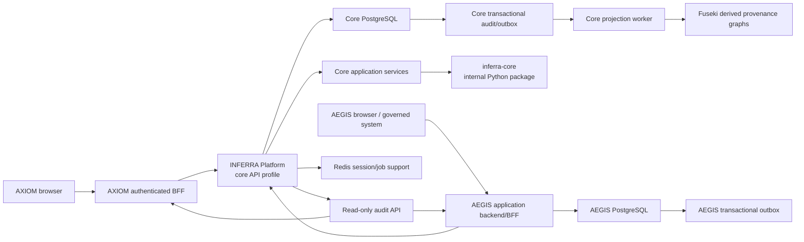

# INFERRA Cross-Project Technical Direction

Status: accepted controlling direction for the first production release; implementation incomplete
Last updated: 2026-07-20
Repositories: `inferra-platform`, `inferra-axiom`, `inferra-aegis`

## Decision

INFERRA should ship as a product family with one reusable deterministic kernel,
one official authoritative runtime, and two separately released user
experiences:

- `inferra-core` is the accepted internal Python package for deterministic,
  infrastructure-independent rule and inference logic. It computes results but
  owns no durable state, identity, network API, or operational infrastructure.
- `inferra-platform` imports that package and remains the official multi-user
  production authority, persistence boundary, API contract, provenance system,
  and extension host.
- `inferra-axiom` is the general rule-authoring, execution, and audit-inspection
  UI. It never becomes a second decision engine.
- `inferra-aegis` is the specialized autonomous-action and workflow-governance
  product. Its backend capability remains an optional Platform extension during
  the Core release, then moves to an AEGIS-owned application backend/database
  consuming Core APIs/events.

The first production release should be **INFERRA Core**, exposed through a narrow
production API profile. AXIOM can join that release only after its own P0 gates
pass. AEGIS must remain a preview or separately gated extension until its
identity, authorization, persistence, synthetic-runtime, and licensing blockers
are closed.

Continue the real, independently buildable `inferra-core` package boundary
before the first release. Version `0.1.1`, its leaf contracts, its private
executable graph/node/token/parser/validation layer, and the bounded expression
security correction now exist internally with no third-party runtime
dependencies. The public compile/validation facade and Platform integration
must be proved next; fact-store/iteration/imports, inference/provenance, and
whole-engine proof follow. Public publication stays deferred until API and
licensing are stable. This package extraction is not a microservice split. Keep Platform as a
modular-monolith service, enforce dependency direction in CI, and extract AEGIS
or another extension service only when independent ownership, security, scaling,
data lifecycle, or release cadence creates a measured need.

## Review basis

The assessment treats each uncommitted local working tree as the intended future
candidate, as requested.

| Repository | Candidate reviewed | Upstream comparison | Local state |
| --- | --- | --- | --- |
| Platform | `feature/enhancement` at `49be15d` plus the accepted documentation updates | In sync with `origin/feature/enhancement` at review time | Code tree was clean before the intentional documentation changes |
| AXIOM | `feature/inferra_axiom` at `e9ed5a4` plus the full local working tree | In sync with its upstream branch | Broad tracked and untracked candidate changes |
| AEGIS | `feature/inferra_aegis` at `dccc18e` plus the full local working tree | Behind upstream by one commit, `cbe19fa Add repository disclosure guardrails` | Broad tracked and untracked candidate changes |

The document review included 71 project-authored Markdown artifacts across the
three repositories. `.txt` files were excluded. Vendored dependency documents,
build output, and cache-generated READMEs were not treated as INFERRA-authored
documents.

## Current readiness snapshot

| Repository | Evidence | Assessment |
| --- | --- | --- |
| Platform | OpenAPI drift passes; import contracts pass; 74 feature-flag tests pass; 16 AEGIS DB guard tests pass. The full local run produced 3,436 passes, 70 skips, and 9 observability-test failures because the local environment lacks the optional FastAPI instrumentation and OTLP exporter packages installed by CI. | Strong backend candidate, but the production API surface, migrations, auth identity model, and staging evidence are not complete. |
| AXIOM | Production build and dependency audit pass. `svelte-check` reports 32 errors and 7 warnings. Unit tests report 99 passes and 2 failures. ESLint reports 183 errors. The formatting command is not usable as a reliable gate and scans generated artifacts. | Not a release candidate. A passing Vite build is currently masking type, parser, test, lint, and tooling failures. |
| AEGIS | Type-check passes; 165 unit tests pass; main and embed builds pass; dependency audit passes. ESLint reports 50 errors and Prettier reports 28 files. | Better build health than AXIOM, but not production-ready because browser identity is not authenticated, caller-supplied roles grant runtime authority, production paths can fall back to synthetic data, and licensing is unresolved. |

## Target system boundary



The arrows are ownership boundaries:

- Browsers do not call Platform directly in production.
- Frontends do not write directly to PostgreSQL, Redis, or Fuseki.
- AXIOM and AEGIS use generated service clients; their TypeScript servers do not
  import or reimplement the Python engine.
- Platform application services invoke the small public `inferra-core` facade.
- The library performs no HTTP, authentication, database, queue, secret,
  environment, or graph-store work.
- The AEGIS application backend owns AEGIS workflow/proposal/approval/autonomy
  state and consumes Core APIs/events. Before extraction, the existing Platform
  AEGIS extension is a transitional implementation behind a non-Core profile.
- Fuseki is a derived query/provenance projection, not the authoritative
  decision record.
- AEGIS may depend on published core ports and contracts. Core may not import
  AEGIS, provider-verification, SNOMED/MBS, or another product extension.

## Core package and service decision

The accepted architecture is **package plus service**, not package instead of
service. The controlling detailed design is
[`INFERRA_Core_Package_and_Runtime_Architecture.md`](INFERRA_Core_Package_and_Runtime_Architecture.md).

### Package boundary

`inferra-core` will be a real internal Python distribution with an
`inferra_core` import namespace and its own build metadata, dependency list,
tests, wheel, and source distribution. It contains pure rule parsing, graph,
fact-store, inference, import-resolution, trace/provenance construction, stable
hashing, and structured audit-event creation.

It must not depend on FastAPI, SQLAlchemy, PostgreSQL, Redis, Celery, Fuseki,
LLM providers, deployment configuration, secrets, AEGIS, AXIOM, or another
domain extension. It receives time, identifiers, feature settings, sources, and
semantic inputs explicitly so deterministic behavior can be reproduced.

### Runtime boundary

Platform remains responsible for API profiles, identity and scopes, migrations,
immutable rule revisions, transactions, idempotency, sessions, outbox/audit
persistence, workers, ontology projection, operations, and compatibility. It
must record the exact Core package version and artifact hash with governed runs
and release evidence.

### Consumer boundary

- AXIOM uses a thin authenticated BFF and a generated TypeScript Core client.
- AEGIS ultimately uses its own application backend/BFF and database, consuming
  deterministic decisions and provenance through Core APIs/events.
- Python offline, desktop, edge, test, and batch hosts may embed the package,
  but then own persistence, identity, audit, migration, concurrency, and recovery.
  Embedded execution is not automatically equivalent to a governed Platform
  record.
- A generated Python service SDK is different from the Core library: the SDK
  calls Platform remotely; the library computes locally.

The package boundary is P0 before Core 1.0. Public package publication is P1
after API stability, registry-name confirmation, licensing, SBOM/provenance,
signing, documentation, and pre-release validation.

## Product ownership matrix

| Capability | Authoritative owner | Consumers | Direction |
| --- | --- | --- | --- |
| Rule grammar and syntax version | Platform release using `inferra-core` | AXIOM, AEGIS, embedded Python hosts | Platform document and packaged parser are canonical. Remove divergent frontend copies or generate/link them. |
| Rule validation and parsing | `inferra-core`; Platform is the service authority | AXIOM, AEGIS | Frontend parsing may support display only; it must not determine validity or outcomes. |
| Deterministic execution | `inferra-core`; Platform owns governed execution | AXIOM, AEGIS, embedded Python hosts | No authoritative decision logic in either browser application. Embedded hosts must state their own authority and audit guarantees. |
| Core rule persistence | Platform core database | AXIOM | Modern `/api/v1/rules` contract only. |
| AEGIS rule/workflow persistence | Target AEGIS application backend and AEGIS database; transitional Platform extension | AEGIS | Keep physically isolated from the core rule store and migrate through explicit contracts. |
| Session state and decision provenance | Platform | AXIOM, AEGIS | Freeze rule, import, feature, ontology, and engine identifiers per run. |
| Core `CaseEnvelope` decision references | Platform | AXIOM, AEGIS | Persist tenant scope plus opaque subject, product-case, and execution identifiers on every governed Core decision; do not turn Platform into the owner of product-specific customer/asset profiles. |
| AXIOM `AssessmentCase` lifecycle | Platform Core application services until a separately justified AXIOM application backend exists | AXIOM | Platform owns the durable assessment matter/runs and graph authorization; AXIOM owns only presentation and non-authoritative drafts. |
| AEGIS `WorkflowCase`/workflow lifecycle | AEGIS application backend/database | Platform receives frozen opaque references on Core decisions | AEGIS owns missions/incidents/action requests, workflow runs/attempts, product PII, and lifecycle; Core owns its linked decision/audit record and derived graph projection. |
| Ontology projection and audit publication | Platform internal worker | AXIOM, AEGIS | PostgreSQL-authoritative, Fuseki-derived, read-only to UIs. |
| General authoring/execution/audit UX | AXIOM | Human operators | AXIOM is a client of Platform, not a policy engine. |
| Autonomous-action governance UX | AEGIS | Human operators and governed systems | AEGIS is an optional product surface, not the default Core UI. |
| Core package facade | `inferra-core` | Platform and explicit Python embedders | Small semantically versioned facade; internal engine classes are not consumer APIs. |
| OpenAPI | Platform | Generated Python, AXIOM, and AEGIS clients | One source of truth with profile-specific artifacts. |
| Human authentication | Each frontend BFF plus the selected identity provider | Platform receives verified identity/scopes | Never trust browser-supplied actor, role, API key, or bearer headers. |

## First production release contract

For an open-source project, "production release" means the repository and
artifacts are safe and supportable for distribution. It does not approve every
deployer's production environment. Each deployer still owns deployment target,
identity provider, tenancy, secret manager, retention, SLO, backup, and incident
decisions. INFERRA must nevertheless ship fail-closed production defaults and
must not transfer known product-security risks to deployers without explicit
configuration and documentation.

### Included in INFERRA Core

- Deterministic rule parsing, validation, and execution supplied by the internal
  `inferra-core` package and hosted by Platform.
- Independently buildable Core wheel/source distribution used internally by the
  Platform release; public registry publication is not required for 1.0.
- Platform-owned rule persistence, identity, transaction, and audit runtime.
- Minimum tenant/workspace scope plus opaque Account, Case, and Execution
  ownership on every governed decision; product-specific profiles/PII remain
  outside Core.
- Modern `/api/v1` rule and inference APIs.
- Layered fact provenance and reproducible decision identifiers.
- PROV-O-compatible decision trace generation.
- Internal ontology/provenance publication through a durable outbox.
- Immutable content-addressed rule and execution/case graph projections, a
  PostgreSQL graph catalogue, and indefinite-default versioned retention.
- Account/case-authorized read-only audit and provenance inspection.
- Protected health, readiness, metrics, and narrowly scoped operator
  diagnostics.
- Redis only where required for the selected multi-worker deployment profile.

### Excluded from the default production profile

- All AEGIS routes and AEGIS databases.
- LLM provider configuration and every live LLM operation.
- File conversion and document-to-rule routes.
- Abduction, induction, alternate reasoning, and experimental reasoning routes.
- Ontology chat, ontology auto-answer, ontology advisory, ontology reasoning,
  browser-triggered ontology sync, and ontology authoring.
- Legacy `/service/*`, `/inference/*`, and `/llm/*` compatibility routes.
- Private-demo routes, synthetic runtime routes, and fixture fallbacks.
- Provider verification, SNOMED/MBS application workflows, GraphRAG, and other
  domain extensions.

The excluded code may remain in the repository. It must be absent from the
production application and its OpenAPI document.

## API profile decision

Add an explicit application profile, for example
`INFERRA_API_PROFILE=core|aegis|development`.

| Profile | Intended use | Exposed surface |
| --- | --- | --- |
| `core` | Default production and open-source distribution | Modern deterministic rule/inference APIs, minimum account/case/execution ownership, durable account/case-scoped audit/provenance reads, health/metrics |
| `aegis` | Transitional/separate AEGIS deployment after its gates pass | Core requirements plus the current `/api/v1/aegis/*` extension during strangler migration; eventual AEGIS product API is independently owned |
| `development` | Local development and demonstrations | Broad current surface, clearly marked non-production |

Required implementation rules:

1. Disabled capabilities are not registered with FastAPI and are absent from
   OpenAPI. A `403` or feature-disabled response is not sufficient.
2. Split mixed routers by capability. For example, rule reads, rule writes,
   ontology reads, ontology administration, and internal projection writes
   cannot remain inseparable if profiles need different exposure.
3. Generate and commit one OpenAPI artifact per supported profile. Record its
   SHA-256 in the release manifest.
4. Generate TypeScript clients and types for AXIOM and AEGIS from the appropriate
   Platform artifact. Hand-maintained `contracts.ts` and endpoint maps should
   become small product adapters around generated contracts.
5. Add CI checks that fail if a production profile contains a forbidden route
   family.

The current committed OpenAPI has 133 paths, including 61 AEGIS paths and 15
legacy paths. That is a development surface, not the first production contract.

## Browser, BFF/application backend, and identity decision

Retain the existing static Svelte applications and Express server pattern. A
framework migration is not required. AXIOM's server remains a thin BFF; AEGIS's
server evolves into a richer application backend/BFF. Both must become real
security boundaries.

### Required production behavior

1. Authenticate the human before proxying any protected request. Use OIDC or an
   explicitly supported trusted identity-aware proxy. Store the resulting
   session in a signed, `HttpOnly`, `Secure`, `SameSite` cookie.
2. Allow only static assets, login/callback, and health endpoints anonymously.
3. Use an exact route-and-method allowlist. Do not proxy the whole `/api/v1`
   namespace.
4. Delete browser `Authorization`, `x-api-key`, CSRF, cookie, actor, and
   privilege headers before contacting Platform.
5. Inject only server-managed, least-privilege downstream credentials or a
   short-lived verified user token.
6. Propagate verified subject, tenant/workspace when applicable, client
   application, and scopes to Platform. Platform audit records must identify the
   real actor, not only `axiom-proxy` or `aegis-proxy`.
7. Enforce CSRF at the BFF session boundary for mutations.
8. Load secrets from the deployment environment or secret manager. Remove reads
   of the sibling Platform repository's `secrets/.env.prod.local`.
9. Fail startup in production when auth, session signing, downstream
   credentials, allowed origin, or TLS assumptions are missing.
10. Provide a separate loopback-only local-development mode. It must never be
    mistaken for a production configuration.
11. Validate token issuer and audience and support key rotation. Prefer
    asymmetric/JWKS-backed validation for human identity; retain static API keys
    only for explicitly scoped machine clients.
12. Treat the current in-process rate limiter as a single-process safety net.
    Enforce deployment-wide limits at the ingress/API gateway or through a
    shared limiter when multiple API workers are used.
13. Do not activate the legacy `user.password` table for product login. Retire it
    or migrate it only through a separately reviewed identity design; current
    authentication should remain external or token based.

AXIOM's current `hooks.server.ts` and signature-free JWT payload decoder do not
protect the production static server. Remove that dead security path or replace
the deployment architecture deliberately; do not leave it as apparent
protection.

### AEGIS authority rule

AEGIS currently authorizes actions by reading `actor.role` from request payloads.
A caller with the broad `aegis:write` scope can therefore claim roles such as
`override authority` or `signature authority`.

For any AEGIS production release:

- derive the actor and roles from authenticated request context;
- ignore payload roles for authorization;
- use action-specific scopes or policy checks;
- persist autonomy assignments as governed policy rather than accepting inline
  caller assignments or keeping them only in process memory;
- bind approvals, overrides, receipt sealing, and fallback actions to verified
  principals;
- reject a mismatch between claimed display metadata and authenticated
  identity; and
- test every privileged action with positive and negative authorization cases.

The current AEGIS "sealed" receipt is a SHA-256 integrity hash, not a
cryptographic signature. Either implement a real signing and verification
contract with managed signing keys and key IDs, or rename the capability so the
UI and documentation do not claim cryptographic signatures.

This is a release blocker for AEGIS, not a documentation caveat.

## Rule-related database decision

The current core store is effectively:

```text
rule -> file(blob, timestamp)
     -> history(json, timestamp)
```

The current AEGIS store duplicates that shape and adds workflow, event-ledger,
snapshot, and trigger tables. Runtime `create_all()`, ad hoc `ALTER TABLE`, and
manual `max(id) + 1` allocation are not acceptable production schema management.

### Required before INFERRA Core 1.0

1. Add versioned PostgreSQL migrations for the core and AEGIS databases. Use
   separate migration ownership/heads. Production startup must validate schema
   version and must not create or alter tables.
2. Make rule names non-null and unique under an explicit normalized naming
   policy.
3. Make each stored source an immutable revision with:
   `revision_number`, `source_hash`, `source_text` or canonical payload,
   `payload_schema_version`, parser/compiler versions, import-tree hash,
   `created_at`, and `created_by`.
4. Replace timestamp-only "latest file" semantics with an explicit monotonic
   revision. Until lifecycle approval is implemented, call these resources
   revisions rather than governed versions.
5. Use database-generated identity or UUID keys. Remove AEGIS `max(id) + 1`
   allocation.
6. Apply not-null, unique, foreign-key, deletion, and lookup indexes in the
   database. Add at least `(rule_id, revision_number)` uniqueness and an index
   for the current revision lookup.
7. Make creation of a rule revision and its publication intent one transaction.
   Insert a transactional outbox row with the revision.
8. Add optimistic concurrency to rule updates through `If-Match`, an expected
   revision, or an expected source hash.
9. Backfill existing rows deterministically, detect duplicate/case-colliding
   names, preserve an ID map, verify counts and hashes, and rehearse forward-fix
   and restore.
10. Freeze every execution to the exact rule revision, source hash, import-tree
    hash, feature snapshot, ontology snapshot when used, and engine build.

### AEGIS database direction

- Keep AEGIS in a separate database for product isolation.
- Give AEGIS its own SQLAlchemy metadata and migrations rather than sharing the
  core `Base` and one models module.
- Share domain contracts, hashing rules, and migration conventions, not ORM
  classes or tables.
- Add missing workflow-definition/version foreign keys and uniqueness such as
  `(workflow_id, version_number)`.
- Enforce the event ledger as append-only in PostgreSQL and serialize event
  sequence allocation safely under concurrency.
- Never bootstrap or merge production ownership through naming/category
  heuristics. A one-time explicit migration is acceptable; recurring discovery
  by `aegis_` prefix is not.

### After the first release

Move to the normalized model already described in the main assessment:
`rule_set`, immutable `rule_set_version`, imports, derived node/edge
projections, append-only decisions, and effective lifecycle states. Do not force
that entire redesign into the first release after the minimum migration,
revision, constraint, outbox, and reproducibility controls are in place.

## Ontology audit and provenance logging decision

Ontology logging is part of the INFERRA Platform Core production profile, but
Fuseki persistence is not part of the pure `inferra-core` package. Ontology
reasoning and browser authoring are not in the default first-release profile.

### Source of truth

- PostgreSQL stores the durable audit events and decision identifiers.
- Fuseki stores rebuildable, versioned RDF/PROV-O projections for query and
  visualization.
- Structured application logs and OpenTelemetry diagnose operations; they are
  not the legal or reproducibility record.

### Minimum durable event contract

Use a versioned `ontology_audit_event` or equivalent append-only record with:

- event ID and schema version;
- event type and bounded outcome;
- occurred time;
- correlation, trace, span, task, and idempotency IDs;
- verified actor and client application;
- product and tenant/workspace when applicable;
- rule-set and rule-revision IDs;
- source and import-tree hashes;
- inference session/run ID;
- feature and ontology snapshot hashes;
- graph URI and projection version;
- operation, attempt, duration, and bounded counts;
- redacted error code;
- payload hash and optional previous/event hash for tamper evidence.

Do not store raw patient/customer facts, prompts, full TTL, raw SPARQL, provider
credentials, or unrestricted derivation content in logs.

### Required flow

1. The authoritative rule or decision transaction inserts the audit/outbox row.
2. A worker leases the row, produces a versioned RDF projection, and verifies
   its hash/count.
3. The worker appends success, retry, failure, dead-letter, and reconciliation
   events.
4. A projection failure never silently changes the deterministic decision.
5. If the launch contract requires a completed audit projection, the decision
   may be returned with `audit_projection_pending` but cannot be certified or
   exported as complete until reconciliation succeeds.
6. Rebuilding Fuseki from PostgreSQL must be documented and tested.

### Read-only inspection API

Provide a small audited surface, for example:

- `GET /api/v1/audit/ontology/events`
- `GET /api/v1/audit/ontology/events/{event_id}`
- `GET /api/v1/audit/ontology/sessions/{session_id}`
- `GET /api/v1/audit/ontology/rules/{rule_revision_id}`
- `GET /api/v1/audit/ontology/reconciliation`

AXIOM should present the general timeline, hashes, rule/decision lineage, and
projection health. AEGIS should present the same evidence filtered to its
workflow/action run. Neither UI receives a direct SPARQL-update capability.

## Account, case, graph, and fact-authority decision

The detailed normative contract is
[`INFERRA_Account_Case_Ontology_and_Provenance_Architecture.md`](INFERRA_Account_Case_Ontology_and_Provenance_Architecture.md).
Its accepted direction is summarized here:

1. Human-approved immutable rule source is behavioral authority. A versioned
   rule RDF graph is a derived projection of one approved revision.
2. The global domain ontology is a human-governed versioned TBox. Automatic
   execution appends instance knowledge to immutable execution/case graph
   versions and an account longitudinal view; it never silently edits the
   global ontology or an approved rule graph.
3. PostgreSQL stores authoritative account/case/execution references, decisions,
   provenance, graph catalogue, outbox, reconciliation, and retention policy.
   Fuseki is critical but rebuildable and is never the only decision record.
4. Every provenance product, including `ASSERTED`, is recorded. Fact source and
   decision eligibility are separate dimensions. Historical non-asserted
   products are audit/discovery material; a future case must re-derive,
   re-query, or governably promote rather than copy them as current truth.
5. AXIOM's deterministic boundary is enforced by Platform/BFF policy. Live
   ontology results cannot auto-answer, materialize into, or otherwise alter an
   authoritative AXIOM rule decision.
6. AEGIS converts authorized ontology results into provenance-complete typed
   `SEMANTIC` facts. Approved rule bindings evaluate them; raw SPARQL never
   transitions a workflow. Multiple rule bindings require explicit composition,
   denial precedence, and fail-closed unresolved outcomes.
7. Graph retention is indefinite by default and configurable only through a
   versioned, authorized policy. Corrections append a superseding version; they
   do not rewrite history.
8. Cross-account traversal requires an explicit versioned Relationship
   Declaration, permitted scope/purpose, verified authority, effective/expiry
   times, and immutable access audit.

All associated owner decisions were accepted on 2026-07-20: Tenant/Workspace is
the authorization boundary; KnowledgeSubject/Account is the domain subject;
AXIOM `AssessmentCase` and AEGIS `WorkflowCase` share only a small
`CaseEnvelope`; both may contain multiple immutable executions/attempts; AEGIS
authoring defaults to `ALL + DENY_OVERRIDES` with explicit activation
confirmation and fail-closed unresolved outcomes; and retention follows the
accepted hierarchy and conditional tombstone policy.

## Repository-specific actions

### `inferra-platform`

#### P0 — before Core 1.0

1. Inventory the deterministic Core modules and freeze golden rule, inference,
   import, iteration, and provenance vectors.
2. Create the independently buildable internal `inferra-core` distribution and
   its deliberately small public facade.
3. Rewire Platform to the installed Core wheel; remove environment,
   infrastructure, and extension dependencies from the package and enforce the
   direction with import contracts.
4. Implement the API profile registry and split mixed routers.
5. Generate profile-specific OpenAPI, generated Python/TypeScript clients, and
   forbidden-route tests.
6. Add core and AEGIS migration baselines; remove production runtime DDL.
7. Add immutable rule revisions, constraints, optimistic concurrency, and the
   minimum transactional outbox.
8. Add durable ontology audit events and read-only inspection endpoints.
9. Persist the minimum tenant/account/case/execution ownership axis, graph
   catalogue, immutable graph-version references, and versioned retention policy
   on every governed decision in the Core profile.
10. Enforce product execution policy server-side: AXIOM cannot enable semantic
   auto-answer/materialization; AEGIS semantic input requires the explicit typed
   gate contract and may not be selected by arbitrary callers.
11. Make authenticated request identity the only authority source for AEGIS
   actions.
12. Validate JWT issuer and audience and define machine API-key versus human-token
   use explicitly.
13. Make the release script consume the separate AXIOM/AEGIS repositories only
   when those products are included in a release manifest.
14. Reconcile active docs so the separate Svelte repositories replace the old
    React/prototype recommendation.

#### P1 — after Core 1.0

- Complete normalized rule-set/version/decision persistence.
- Replace pickle-backed Redis session serialization.
- Expand the outbox into full replay/reconciliation operations.
- Move extensions into explicit packages.
- Stabilize, license, document, sign, and publish `inferra-core` only after
  internal API/semantic compatibility has been proven.
- Evaluate service extraction or infrastructure consolidation only from
  production evidence.

### `inferra-axiom`

#### P0 — before AXIOM 1.0

1. Fix all type/Svelte diagnostics, the two failing unit tests, lint failures,
   and formatting-tool scope.
2. Replace legacy `/service/rule/*` use with modern `/api/v1/rules`.
3. Remove rule-name/category heuristics for excluding AEGIS. AXIOM should receive
   only the core rule store through its contract.
4. Generate its client/types from the Core OpenAPI artifact.
5. Implement the authenticated, method-allowlisted BFF and remove sibling-secret
   reads and browser credential forwarding.
6. Remove or disable production ontology sync controls, ontology chat, LLM
   configuration, and local semantic decision logic. Read-only provenance
   visualization remains in scope.
7. Bind every governed execution to authorized account/case IDs and a
   server-selected AXIOM deterministic profile that callers cannot override.
8. Display semantic shadow analysis as a separate non-authoritative execution;
   never merge it into the original decision or relabel semantic input as
   asserted evidence.
9. Remove synthetic metrics and demo responses from production mode.
10. Fix `setApiBaseUrl()` so embed configuration changes the actual client, or
   remove the unsupported option.
11. Replace the scaffold README, package name, and `0.0.1` identity with real
   product, compatibility, configuration, security, and release documentation.
12. Add CI for frozen install, audit, check, unit tests, lint, format, build,
    generated-client drift, and end-to-end tests.
13. Add a reproducible container/server package and health/readiness behavior.

#### P1

- Consolidate duplicated presentation-only rule/graph utilities with AEGIS after
  the API contract is stable.
- Add bundle budgets and code splitting; the current build contains very large
  chunks.
- Add accessibility and browser compatibility gates.
- After account/case graph authorization is proven, add bounded read-only SPARQL
  and later natural-language query planning under the separate LLM governance
  gate.

### `inferra-aegis`

AEGIS does not block the Core release because it is excluded from the Core
profile. These items block a future AEGIS production release:

#### P0 — before AEGIS 1.0

1. Reconcile the upstream proprietary-license guardrail with the intended
   distribution model before merging or publishing.
2. Implement authenticated BFF sessions and verified actor-to-role binding.
3. Remove caller-supplied authority from Platform AEGIS runtime services.
4. Persist autonomy assignments as versioned governed policy; remove in-process
   and inline-actor assignment authority.
5. Implement verifiable receipt signatures with managed keys, or accurately
   relabel hash-only sealing as integrity hashing.
6. Consume generated Core and AEGIS clients with exact route/method allowlists;
   treat the current Platform AEGIS profile as transitional during extraction.
7. Remove synthetic backend/runtime rows and frontend fixture fallback from
   production mode. API failure must fail closed and visibly report unavailable
   state.
8. Wire workflow proposal save, validate, version, compile, and activate actions
   to persisted Platform endpoints.
9. Use AEGIS-owned migrations, database metadata, immutable rule/workflow
   versions, and append-only ledger enforcement.
10. Persist account/case ownership, one-or-more immutable rule bindings per
    workflow node, and an explicit versioned composition policy.
11. Implement ontology-assisted gates only through typed `SEMANTIC` facts with
    pinned graph/query provenance; raw SPARQL cannot transition a workflow,
    semantic evidence cannot satisfy `MANDATORY` asserted evidence by default,
    and deny/error/stale/indeterminate outcomes fail closed.
12. Keep LLM disabled by default. Enabling it requires a separate provider,
    evaluation, budget, incident, and credential decision.
13. Fix the 50 lint errors and 28 formatting failures, then make check/test/lint/
    format/build/embed/e2e required CI gates.
14. Add production packaging, readiness, rollback, backup, and recovery
    evidence.
15. Rebaseline the implementation plan and retain one canonical user manual.

#### P1

- Establish an independently deployable AEGIS application backend/BFF when
  separate ownership, threat boundary, scaling, data lifecycle, or release
  cadence justifies it. It owns AEGIS workflows and consumes Core APIs/events;
  it does not become a second authoritative inference engine.
- Replace duplicated rule/graph UI code with shared presentation packages after
  contract stabilization.

## Cross-project priority order

This is the controlling sequence.

| Order | Item | Priority | Release effect |
| ---: | --- | :---: | --- |
| 0 | Preserve the 0.1.1 rule-source security boundary: bounded interpreter only, fail-closed validation, typed cycle errors, and installed-artifact adversarial gates. | P0 invariant | Completed locally; any regression blocks every release. |
| 1 | Extract and prove the internal `inferra-core` distribution, proving a public vertical integration slice before moving another dependency layer. | P0 | First architecture item; creates the reusable kernel and enforceable product boundary. |
| 2 | Encode the accepted first-release contract as Platform API profiles and freeze the package-backed Core OpenAPI artifact. | P0 | Bounds every network client and production route. |
| 3 | Add migration baselines, minimum tenant/account/case/execution identity, immutable rule and graph revisions, constraints, transactional outbox, durable ontology audit events, graph catalogue, and retention-policy identity. | P0 | Blocks Core 1.0 because decisions and graph projections otherwise lack durable ownership and reproducibility. |
| 4 | Harden Platform identity and both BFFs; bind AEGIS authority to verified principals. | P0 conditional | Blocks any production UI and all AEGIS production use. API-only machine use may proceed with an approved scoped-key policy. |
| 5 | Generate clients, migrate AXIOM off legacy routes, remove forbidden production features, and make its quality gates pass. | P0 conditional | Blocks AXIOM 1.0; does not block API-only Core 1.0. |
| 6 | Produce intentional, clean, immutable candidates and a compatibility manifest for each product included in the release. Resolve licensing and third-party redistribution. | P0 | Blocks public distribution. |
| 7 | Complete AEGIS persisted/fail-closed runtime work, multi-rule composition, typed semantic-evidence gates, and security/quality gates. | P0 for AEGIS | Does not block Core 1.0 because AEGIS is excluded. |
| 8 | Run the selected profiles through target-like integration, migration, restore, load, chaos, and audit-reconciliation tests. | P0 | Blocks production sign-off for each included product. |
| 9 | Normalize persistence fully, publish the stable Core package, create shared presentation packages, and consider extension service extraction. | P1/P2 | Post-release architecture work. |

Order 1 is in progress: P0.1, P0.2a distribution/leaf extraction, and P0.2b
graph/node/token/parser/validation extraction plus the 0.1.1 security correction
completed on 2026-07-17. The immediate gate is the narrow public
compile/validation facade and Platform integration for that completed slice.
Remaining P0.2 fact-store/iteration/import and inference/provenance layers,
complete Platform rewiring, and whole-engine equivalence/reproducibility proof
then remain.

### What to do first

P0.1 and the first two P0.2 slices are complete. The exact module inventory, 29
current boundary crossings, source/syntax identity, and six golden semantic
vectors are recorded in
[`INFERRA_Core_Extraction_P0_1_Baseline.md`](INFERRA_Core_Extraction_P0_1_Baseline.md).
The internal 0.1.1 distribution, facade, compatibility map, and isolated-wheel
evidence are recorded in
[`INFERRA_Core_Extraction_P0_2_Distribution.md`](INFERRA_Core_Extraction_P0_2_Distribution.md).

The immediate task remains P0.2, still before either frontend work or
persistence redesign:

1. [x] Inventory the exact modules and dependencies that belong to deterministic
   Core.
2. [x] Freeze golden vectors for parsing, imports, iteration, inference,
   diagnostics, hashes, and provenance.
3. [x] Create `packages/inferra-core` as an independently buildable
   distribution.
4. [x] Move the smallest coherent pure slice and replace environment/global
   inputs with explicit values.
5. [x] Add physical-package forbidden-import and installed-wheel tests.
6. [x] Add private executable graph, node, token, parser and deterministic
   validation layers with explicit identity/clock inputs and no Platform
   matrix, logger or environment dependency.
7. [x] Replace general-purpose rule expression evaluation, fail validation
   closed, type cycle failures, remove Core runtime dependencies, and add
   adversarial installed-artifact gates.
8. [ ] Declare the narrow public compile/validation facade, remove Platform
   production imports of `inferra_core._internal`, and rewire the completed
   vertical slice to the installed artifact.
9. [ ] Move fact-store/iteration/import resolution, then inference/provenance,
   one coherent layer at a time.
10. [ ] Complete Platform application-service rewiring and
   prove behavioral equivalence.

Item 8 comes before item 9. Continuing horizontal extraction while Platform
still consumes private implementation paths would deepen coupling and defer
the first proof that the package boundary works as a supported consumer
contract. Platform's temporary exact-class re-exports, private evaluator import,
and validation host wrapper are migration adapters, not completion of
application-service rewiring.

Immediately after that boundary passes, implement the Platform API profile
skeleton, Core route/method allowlist, mixed-router split, `openapi-core.json`,
and forbidden-route tests. Together these changes make both the code dependency
boundary and the network contract enforceable.

## Compatibility and release manifest

Each release should publish:

- Platform version and commit SHA;
- exact `inferra-core` version, wheel hash, and public-facade compatibility;
- API profile and OpenAPI hash;
- rule syntax version and dictionary hash;
- rule-persistence schema version;
- ontology-audit event schema version;
- session schema version;
- supported AXIOM and AEGIS version ranges;
- container/image digests;
- feature-profile hash;
- migration and rollback identifiers; and
- evidence links for required CI and staging gates.

The Platform copy of `INFERRA_Rule_Syntax_Dictionary.md` is canonical. The AXIOM
and AEGIS copies are identical to each other but already omit the Platform's
governed-trigger section, demonstrating active documentation drift.

## Documentation direction

1. This document controls cross-project ownership and release sequencing.
2. `INFERRA_Core_Package_and_Runtime_Architecture.md` controls the detailed
   package, runtime, SDK, embedded-mode, versioning, and extraction design.
3. `INFERRA - Assessment & Recommendations.md` remains the detailed Platform
   assessment and incorporates this direction by reference.
4. Platform owns the API, rule syntax, persistence, operations, and
   cross-project compatibility documents.
5. AXIOM owns its product README, user/operator guide, deployment guide, and
   release status. `inferra-axiom/docs/ARCHITECTURE.md` records its accepted thin
   BFF/generated-client boundary.
6. AEGIS should keep `docs/AEGIS_User_Manual.md` as the canonical manual and
   archive or remove the older duplicate after review.
   `inferra-aegis/docs/ARCHITECTURE.md` records its accepted application
   backend/database/Core-consumer boundary.
7. The AXIOM commercial blueprint currently uses AXIOM as the name for both
   eligibility and autonomous certification. Reconcile it with the separate
   AEGIS product boundary; commercial prose is not an architecture source of
   truth.
8. The SNOMED/MBS guide is an extension guide, not Core release evidence. Its
   broad "production-ready" claims conflict with its own final gaps and with the
   approved first-release scope.
9. Maintain a third-party provenance and redistribution register. SNOMED-CT AU
   material cannot be redistributed merely because related files exist in the
   repository.
10. Historical Paperclip artifacts, screenshots, generated reports, and local
   run logs are evidence inputs, not active product documentation.

## Licensing direction

The repositories currently conflict:

- Platform has no license file and its README says to treat the code as
  proprietary.
- AXIOM has no license file.
- AEGIS upstream adds an explicit proprietary and confidential license notice.
- The stated product intent is open source.

Before public release, choose and apply an approved license per repository,
including third-party notices and asset provenance. If the whole suite is meant
to be open source, use one compatible OSI-approved policy across all three
repositories; Apache-2.0 is the technical recommendation where an explicit
patent grant is desired, subject to legal approval. If AEGIS remains proprietary,
separate its branding, distribution artifacts, build profile, and documentation
from the open-source Core and AXIOM releases.

## Required CI gates

### Platform

- Reproducible Core wheel/source-distribution build and installed-wheel tests.
- Core forbidden-import, public-facade, golden-vector, determinism, and package
  content/metadata checks.
- Locked dependency audit.
- Full tests and coverage with every declared release extra installed.
- Import contracts, including core-to-extension rules.
- Migration upgrade, backfill, forward-fix, and schema-version tests.
- Core and AEGIS OpenAPI drift and forbidden-route tests.
- Docker image build and reproducibility.
- Ontology audit-event contract, outbox, retry, redaction, and reconciliation
  tests.

### AXIOM and AEGIS

- Frozen Bun install and dependency audit.
- `svelte-check`.
- Unit tests.
- ESLint and Prettier over source/config only, excluding generated evidence.
- Main production build and any embed build.
- Generated-client drift.
- Browser end-to-end tests against the compatible Platform profile.
- Tests proving no production fixture fallback, sibling-secret read, browser
  credential forwarding, or forbidden route.
- Container/package build, health, readiness, and security-header checks.

## Exit criteria

INFERRA Core 1.0 is ready when:

- `inferra-core` is an independently buildable internal distribution, Platform
  runs against its installed artifact, and dependency direction is enforced;
- golden vectors prove preserved behavior or explicitly approved semantic fixes;
- the Core profile exposes only the signed route contract;
- migrations and immutable revisions replace runtime schema mutation and
  timestamp-only version selection;
- durable ontology audit publication and read-only inspection pass recovery and
  reconciliation tests;
- auth, scopes, secrets, and actor identity are explicit;
- one clean SHA reproduces the profile OpenAPI, images, schema, tests, and
  evidence, including the Core wheel hash; and
- licensing and third-party redistribution are resolved.

AXIOM and AEGIS receive their own production version only when their repository
P0 lists and compatibility evidence pass. Code presence in Platform or a passing
frontend build is not evidence that a product is released.
