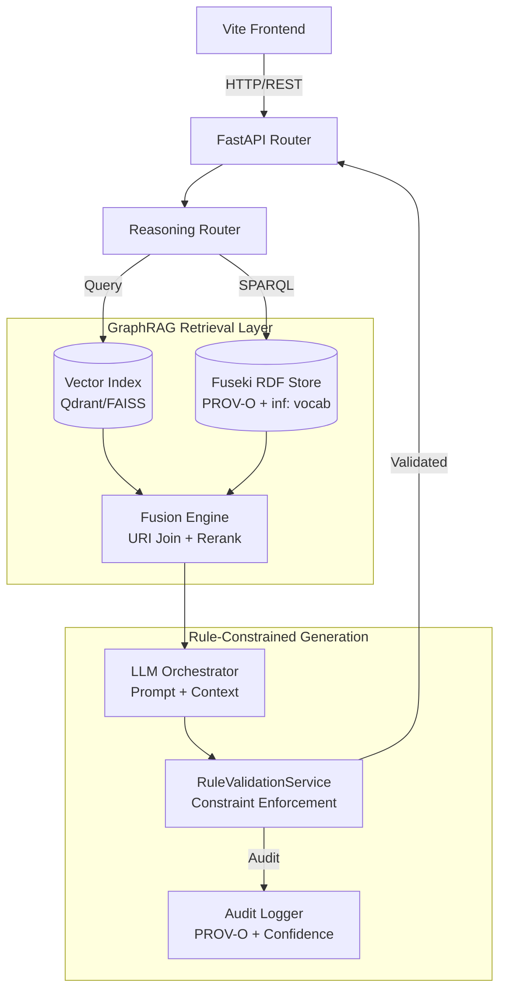

# INFERRA GraphRAG Integration Plan (Fuseki-Centric)
## Knowledge Graph-Enhanced Retrieval Augmented Generation
**Document Status:** Phase 7+ Future Extension Blueprint v1.0  
**Timeline:** Weeks 9–12 (Post-Production)  
**Dependencies:** Phases 1–6 complete, stable PROV-O traces, Fuseki RDF store, Redis/Celery infra, OpenTelemetry observability, `inf:` vocabulary established

---

## 📖 1. Executive Summary

This plan details the integration of **GraphRAG** with INFERRA using **Apache Jena Fuseki** as the primary graph store instead of Neo4j. By leveraging INFERRA's existing Fuseki infrastructure (PROV-O traces, `inf:` vocabulary, ontology reasoning), we create a **unified neuro-symbolic reasoning stack** that combines RDF graph traversal, SPARQL-based context retrieval, external vector search, and rule-constrained LLM generation. All outputs remain fully auditable, deterministic at the core, and compliant with INFERRA's architectural commitments.

### 1.1 Strategic Value Proposition
| Capability | Traditional GraphRAG (Neo4j) | INFERRA + Fuseki GraphRAG |
|------------|-----------------------------|---------------------------|
| **Infrastructure** | New graph DB deployment + sync | Reuses existing Fuseki instance |
| **Data Model** | Property graphs (Cypher) | RDF/PROV-O (SPARQL + OWL) |
| **Provenance** | Manual audit trails | Native PROV-O `prov:wasGeneratedBy` + `inf:originModule` |
| **Rule Compliance** | Post-hoc validation | Deterministic backward-chaining constraints enforced pre-generation |
| **Reasoning** | Pattern matching only | SPARQL inferencing + OWL transitive expansion |
| **Auditability** | Limited traceability | Full PROV-O session traces + `FactSource` lineage |

---

## 🏗️ 2. Architecture Overview (Fuseki-Centric)

### 2.1 Component Architecture


### 2.2 Why Fuseki Aligns Perfectly with INFERRA
- **Zero New Infrastructure**: Fuseki already hosts `inf:` ontology, PROV-O traces, and semantic projections
- **Native Provenance**: `prov:wasGeneratedBy`, `inf:originModule`, `inf:factSource` enable trace-aware retrieval
- **SPARQL Inferencing**: Jena OWL-Mini reasoner expands transitive relationships automatically
- **Consistent Data Model**: RDF triples map directly to `FactValue`, `DependencyGroup`, and `NodeOrigin`
- **Deterministic Fallback**: If GraphRAG confidence < threshold, router falls back to pure backward-chaining

---

## 🧩 3. Component Design Specifications

### 3.1 Vector Index + RDF URI Alignment
Fuseki does not natively support dense vector search. We use an external vector index (Qdrant/Weaviate/FAISS) linked to RDF URIs via a lightweight join table.

```python
# src/adapters/graphrag/vector_rdf_bridge.py
class VectorRDFFuseki:
    def __init__(self, vector_client: VectorDB, fuseki_client: FusekiAdapter):
        self.vector = vector_client
        self.fuseki = fuseki_client

    def search_with_graph_context(self, query: str, k: int = 10) -> List[RetrievalContext]:
        # 1. Semantic search → top-k URIs
        vector_results = self.vector.search(query, k=k*2)
        uris = [r.payload["rdf_uri"] for r in vector_results]
        
        # 2. SPARQL graph expansion (neighbors, provenance, rules)
        contexts = []
        for uri in uris:
            sparql = self._build_graph_context_query(uri, depth=2)
            triples = self.fuseki.query(sparql)
            contexts.append(RetrievalContext(
                uri=uri,
                vector_score=vector_results[uris.index(uri)].score,
                graph_triples=triples,
                provenance=self._extract_provenance(triples)
            ))
        
        return self._rerank_fusion(contexts)[:k]
```

### 3.2 SPARQL GraphRAG Retrieval Patterns
```sparql
# 1. Neighbor Expansion + Rule Context
PREFIX inf: <http://inferra/vocab#>
PREFIX prov: <http://www.w3.org/ns/prov#>
PREFIX xsd: <http://www.w3.org/2001/XMLSchema#>

SELECT ?subject ?predicate ?object ?ruleName ?factSource
WHERE {
  VALUES ?target { <inf:conclusion:xyz789> }
  ?target ?predicate ?object .
  OPTIONAL {
    ?target prov:wasGeneratedBy ?session .
    ?session inf:evaluatedRule ?rule .
    ?rule rdfs:label ?ruleName .
    ?target inf:factSource ?factSource .
  }
  FILTER (isLiteral(?object) || isURI(?object))
}
LIMIT 50
```

```sparql
# 2. Provenance Path Traversal (GraphRAG Context Chain)
SELECT DISTINCT ?path ?module ?timestamp
WHERE {
  VALUES ?start { <inf:conclusion:xyz789> }
  ?start prov:wasGeneratedBy/inf:importedModules* ?module .
  ?start prov:startedAtTime ?timestamp .
  BIND(CONCAT(STR(?start), " → ", STR(?module)) AS ?path)
}
```

### 3.3 Rule-Constrained LLM Prompt Template
```python
def build_graphrag_prompt(query: str, contexts: List[RetrievalContext], rules: List[RuleModule]) -> str:
    system_prompt = f"""You are an INFERRA reasoning assistant. Answer ONLY using provided context and rule constraints.
    
    RULE CONSTRAINTS:
    {chr(10).join([f"- {r.name}: {r.constraints}" for r in rules])}
    
    GRAPH CONTEXT (RDF/PROV-O):
    {chr(10).join([f"[{c.uri}] {c.provenance} → {c.vector_score:.2f}" for c in contexts])}
    
    REQUIREMENTS:
    1. Cite specific rule names and PROV-O sources
    2. If uncertain, state uncertainty explicitly
    3. Never contradict `inf:factSource` or `inf:mandatory` constraints
    """
    return f"{system_prompt}\n\nUser Query: {query}"
```

---

## 📅 4. Implementation Phases (Checklist Format)

### 🔹 Phase 7.1: Fuseki GraphRAG Foundation (Weeks 1–3)
**Goal:** Establish vector-RDF bridge, SPARQL retrieval patterns, and provenance indexing
- [ ] Deploy external vector index (Qdrant/Weaviate) alongside existing Fuseki
- [ ] Implement `VectorRDFFuseki` bridge with URI-aligned payload schema
- [ ] Create SPARQL templates for neighbor expansion, provenance paths, and rule-context joins
- [ ] Extend PROV-O schema with `graphrag:hasEmbedding`, `graphrag:relevanceScore`, `graphrag:contextualDepth`
- [ ] Build batch embedding pipeline for historical session traces & rule modules
- [ ] Add incremental embedding update on new session completion (Celery trigger)
- [ ] Validate SPARQL query performance (<200ms P95 for depth-2 expansion)

### 🔹 Phase 7.2: Rule-Constrained Generation & Fusion (Weeks 4–6)
**Goal:** Integrate LLM with GraphRAG context while preserving deterministic rule constraints
- [ ] Implement `GraphRAGOrchestrator` with fusion reranking (vector score × graph provenance × rule relevance)
- [ ] Build `RuleValidationService` LLM output gate (syntax, type, constraint compliance)
- [ ] Add correction loop for non-compliant generations (temperature 0.1, constraint prompt)
- [ ] Implement `inf:confidence` scoring for GraphRAG responses
- [ ] Add fallback routing to pure backward-chaining when confidence < 0.7
- [ ] Test LLM compliance rate (>95% against rule constraints)
- [ ] Benchmark latency impact (<1.5s overhead vs. Phase 6 baseline)

### 🔹 Phase 7.3: Advanced GraphRAG Features (Weeks 7–9)
**Goal:** Cross-session reasoning, hierarchical summarization, and explanation enhancement
- [ ] Implement SPARQL-based community detection via `inf:dependsOn` clustering + OWL class grouping
- [ ] Add hierarchical summarization pipeline (SPARQL aggregation → LLM abstract → rule validation)
- [ ] Build graph-guided question generator (identifies missing `MANDATORY` dependencies via SPARQL)
- [ ] Add multi-modal explanation output (text + PROV-O graph viz + confidence heatmap)
- [ ] Implement embedding cache + TTL eviction for repeated queries
- [ ] Optimize SPARQL with Jena query planner hints & index tuning
- [ ] Load test: 100 concurrent GraphRAG retrievals, <300ms P95

### 🔹 Phase 7.4: Production Hardening & Compliance (Weeks 10–12)
**Goal:** Observability, security, auditability, and deployment readiness
- [ ] Add OpenTelemetry spans for vector search, SPARQL query, LLM generation, rule validation
- [ ] Configure Grafana dashboards: retrieval precision, confidence distribution, rule compliance rate
- [ ] Implement PII redaction in embeddings + vector payloads (GDPR/HIPAA ready)
- [ ] Add rate limiting, prompt cache, and abuse prevention for GraphRAG endpoints
- [ ] Create compliance audit reports (PROV-O trace export, confidence logs, rule overrides)
- [ ] Final E2E validation: session → retrieval → generation → validation → audit trace
- [ ] Architecture sign-off: Core, Data, Security, Compliance leads

---

## 🌐 5. API Contract Extensions

```yaml
POST /api/v1/graphrag/retrieve
  Body: {
    query: str,
    session_id: Optional[str],
    rule_name: Optional[str],
    k: int = 10,
    include_provenance: bool = true
  }
  Returns: {
    results: [{
      uri: str,
      vector_score: float,
      graph_triples: [{s, p, o}],
      provenance: { module, fact_source, session }
    }],
    latency_ms: int
  }

POST /api/v1/graphrag/generate
  Body: {
    query: str,
    session_id: Optional[str],
    temperature: float = 0.3,
    max_tokens: int = 1024,
    enforce_rules: bool = true
  }
  Returns: {
    response: str,
    retrieved_context: List[RetrievalResult],
    rules_applied: List[str],
    compliance_validated: bool,
    confidence: float,
    latency_ms: int
  }

GET /api/v1/graphrag/explanation?session_id=&conclusion_id=
  Returns: {
    explanation: str,
    prov_trace: str,  # Turtle/JSON-LD
    rule_chain: List[str],
    confidence: float
  }
```

---

## ⚠️ 6. Risks & Mitigations

| Risk | Likelihood | Impact | Mitigation |
|------|------------|--------|------------|
| **SPARQL query complexity degrades performance** | Medium | High | Use Jena query planner, depth limits (≤2), index on `prov:wasGeneratedBy` & `inf:dependsOn` |
| **Vector-RDF misalignment** | Low | Medium | Strict URI schema validation, embedding update triggers on rule/session changes |
| **LLM hallucination despite rules** | Medium | High | Multi-stage validation, fallback to backward-chaining, `inf:confidence` threshold gating |
| **Fuseki memory pressure during retrieval** | Medium | Medium | Query timeout guards, connection pooling, read replicas for heavy SPARQL workloads |
| **Provenance trace explosion** | Low | Medium | Hierarchical summarization, TTL on GraphRAG context cache, pagination for deep paths |
| **Prompt injection via user query** | Medium | High | Input sanitization, strict JSON schema validation, role-based prompt isolation |

---

## 📊 7. Success Metrics & KPIs

| Category | Metric | Target |
|----------|--------|--------|
| **Retrieval Quality** | Precision@k, Recall@k, MRR | >90%, >85%, >0.85 |
| **LLM Performance** | Compliance rate, latency P95, token efficiency | >95%, <1.5s, <512 tokens |
| **System Performance** | Throughput, cache hit rate, SPARQL latency | >100 qps, >70%, <200ms |
| **Audit & Compliance** | PROV-O trace completeness, confidence calibration | 100%, >4.0/5.0 user rating |
| **Business Impact** | Question reduction, session completion time, support tickets | 30% fewer, 25% faster, 20% reduction |

---

## 🏁 8. Final Assessment

Integrating GraphRAG with INFERRA via **Fuseki** creates a uniquely powerful **neuro-symbolic reasoning platform**:
- ✅ **Zero infrastructure overhead**: Reuses existing Fuseki, PROV-O traces, and `inf:` vocabulary
- ✅ **Deterministic core preserved**: Rules constrain LLM outputs; fallback guarantees compliance
- ✅ **Full auditability**: Every retrieval step mapped to PROV-O entities + `FactSource` lineage
- ✅ **Scalable retrieval**: Vector index + SPARQL fusion handles millions of sessions efficiently
- ✅ **Enterprise-ready**: PII redaction, rate limiting, compliance reporting, OpenTelemetry observability

**Strategic positioning:** INFERRA becomes the only platform offering **auditable, rule-constrained, RDF-native GraphRAG reasoning** — a decisive advantage for compliance, policy automation, and regulated decision-making.

---
*Document generated for INFERRA GraphRAG integration planning. Aligns with existing Fuseki RDF store, PROV-O traces, Redis/Celery pipeline, OpenTelemetry observability, and Vite frontend. Ready for Phase 7 sprint planning and stakeholder review.*